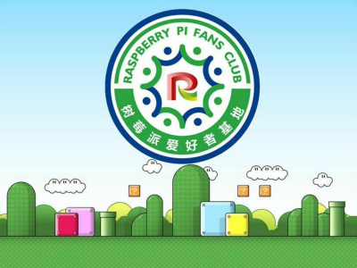

# 树莓派官方文档简体中文版 翻译项目

>**警告**
>
>**当前正在施工，具体进度请参考编辑日志。**

## 关于我们

本项目由树莓派爱好者基地 FreeBSD 子部门和 FreeBSD 中文社区联合发起。

我们是树莓派爱好者基地的子部门，如有问题请加入 QQ 群 893333927

>目前树莓派爱好者基地的所有大群都无法加入，因为群主已经将群人数降级，原因未知，联系不上。有需要的，请加上面的群。

- 微信公众号: rpicn2025 （扫码关注）

- 微信公众号: 树莓派爱好者基地 （已不再更新）

## 版本说明

当前版本指向 2024.7.10 <https://github.com/raspberrypi/documentation/commit/b68a629c7212e668fdfba94d227cc9ec32d9bfbb>

## 更新需求请看贡献指南文件

## 版权说明

[树莓派官方文档](https://raspberrypi.com/documentation)使用 [Creative Commons Attribution-ShareAlike 4.0 International](http://creativecommons.org/licenses/by-sa/4.0/)（CC BY-SA 4.0，署名-相同方式共享 4.0 国际）授权。非常抱歉，根据协议要求，本项目也只能使用 [Creative Commons Attribution-ShareAlike 4.0 International](http://creativecommons.org/licenses/by-sa/4.0/)（CC BY-SA 4.0，署名-相同方式共享 4.0 国际）及兼容的协议（兼容协议要求与该协议基本相同）进行授权。该协议要求您：

- 您必须给出适当的署名 ，提供指向本许可协议的链接，同时标明是否（对原始作品）作了修改。树莓派官方英文文档项目位于 <https://github.com/raspberrypi/documentation>。**我们特别授予所有人免于对本项目进行署名及链接的权利。但是您仍然需要遵守[树莓派文档项目](https://github.com/raspberrypi/documentation)本身的许可协议。**
- 相同方式共享 — 如果您再混合、转换或者基于本作品进行创作，您必须基于与原先许可协议相同的许可协议分发您贡献的作品。

>Raspberry Pi documentation is copyright © 2012-2024 Raspberry Pi Ltd and is licensed under a Creative Commons Attribution-ShareAlike 4.0 International (CC BY-SA) licence.
>
>Some content originates from the eLinux wiki, and is licensed under a Creative Commons Attribution-ShareAlike 3.0 Unported licence.
>
>The terms HDMI, HDMI High-Definition Multimedia Interface, HDMI trade dress and the HDMI Logos are trademarks or registered trademarks of HDMI Licensing Administrator, Inc
