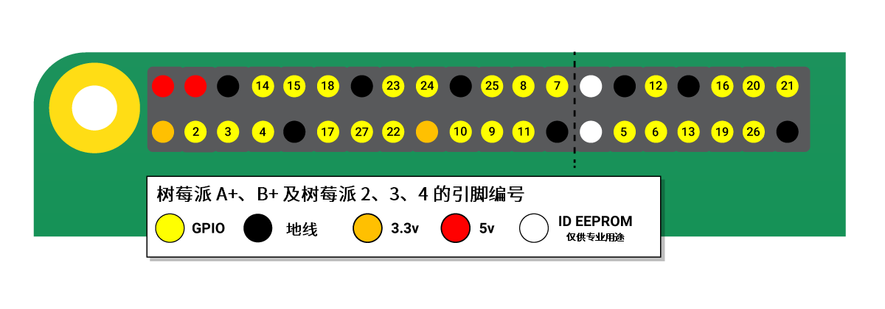

# Raspberry Pi OS


## 介绍

Raspberry Pi OS 是一款基于 Debian 的免费操作系统，针对树莓派的硬件进行了适配和优化。Raspberry Pi OS 支持超过 35,000 个 Debian 软件包。对于大多数树莓派使用需求来说，我们建议使用 Raspberry Pi OS。

因为 Raspberry Pi OS 源自 Debian，因此 Raspberry Pi OS 基于 Debian 发行周期的阶段版本。大约每 2 年发布一次。

最新版本的 Raspberry Pi OS 基于 Debian Bookworm。之前的版本基于 Debian Bullseye。

您可在 <raspberrypi.com/software/operating-systems/> 下载 Raspberry Pi OS 的镜像。

## 更新软件


请始终保持您在 Raspberry Pi OS 上运行的软件更新到了最新版本。这可以使您的设备免受漏洞的影响，并确保您能得到最新的错误修复。

### 使用 APT 管理软件包

高级软件包工具 (APT) 是在 Raspberry Pi OS 中安装、更新和卸载软件的推荐方法。您可以通过命令 apt 使用 APT。

#### 安装更新

apt 在 /etc/apt/sources.list 的文件中存储软件源列表。在安装软件之前，请运行以下命令，使用 /etc/apt/sources.list 刷新本地软件源：

```
$ sudo apt update
```

运行以下命令，将所有已安装的软件包升级至最新版本：

```
$ sudo apt full-upgrade
```

>**技巧**
>
>与 Debian 不同，Raspberry Pi OS 处于持续开发状态。因此，软件包的依赖关系有时会发生改变，因此您应始终使用 `full-upgrade` 而非标准的 `upgrade`。 

请定期运行这些命令，以确保软件是最新状态。在使用 apt 来确保 Raspberry Pi OS 是最新状态时，也会同时使您的 Linux 内核和固件保持最新状态（因为树莓派将其作为 Debian 软件包进行分发）。

在树莓派发布 Raspberry Pi OS 新的主要版本后，上述命令也不会将您的操作系统升级到该新的主要版本。要升级到新的主要版本，请按照我们的操作系统升级说明进行操作。

#### 搜索软件

要搜索软件包，请将搜索关键字传参给 `apt-cache search` ：

```
$ apt-cache search <keyword>
```

例如，设想搜索以下关键字“raspi”：

```
$ apt-cache search raspi
raspi3-firmware - Raspberry Pi 2 and 3 GPU firmware and bootloaders
libcamera-apps - libcamera-apps
libcamera-apps-lite - libcamera-apps-lite
python-picamera - Pure Python interface to the Raspberry Pi's camera module.
python-picamera-docs - Documentation for the Python interface to the RPi's camera module.
python3-picamera - Pure Python interface to the Raspberry Pi's camera module.
raspi-config - Raspberry Pi configuration tool
raspi-gpio - Dump the state of the BCM270x GPIOs
raspi-gpio-dbgsym - debug symbols for raspi-gpio
raspinfo - Dump information about the Pi
rc-gui - raspi-config GUI
raspi-copies-and-fills - ARM-accelerated versions of selected functions from string.h
raspi-copies-and-fills-dbgsym - debug symbols for raspi-copies-and-fills
```

搜索返回了多个包含关键字的名称或描述的软件包。

使用以下命令查看有关软件包的详细信息：

```
$ apt-cache show <package-name>
```

例如，设想对“raspi-config”软件包进行以下搜索：

```
$ apt-cache show raspi-config
Package: raspi-config
Version: 20210212
Architecture: all
Maintainer: Serge Schneider <serge@raspberrypi.org>
Installed-Size: 121
Depends: whiptail, parted, lua5.1, alsa-utils, psmisc, initramfs-tools
Recommends: triggerhappy, iw
Priority: optional
Section: utils
Filename: pool/main/r/raspi-config/raspi-config_20210212_all.deb
Size: 27976
SHA256: 772d4fd3c6d8c9da47ac56012b74e7828b53c8521ff1c47266bb38ec71750c10
SHA1: 08254c976a8260bde914c2df72f92ffb9317fef6
MD5sum: 80aaac13be6a9b455c822edb91cf8ea2
Description: Raspberry Pi configuration tool
 A simple configuration tool for common Raspberry Pi administrative tasks
Description-md5: 19630c04463bfe7193152448b53d85a0
```

使用此命令验证维护者、版本和大小是否满足您对软件包的要求。

#### 安装软件包

要在您的树莓派上安装软件包，请将软件包的名称传参给以下命令：

```
$ sudo apt install <package-name>
```

`apt` 将显示软件包将占用的磁盘空间量。输入 Y 并按`回车键`键确认安装软件包。您可以通过在上述命令中添加 -y 标志来跳过此确认步骤。

#### 卸载软件包

要在树莓派上卸载软件包，请将软件包的名称传参给以下命令：

```
$ sudo apt remove <package-name>
```

>**技巧**
>
>要彻底删除软件包的所有痕迹（包括配置文件），请用 purge  来代替 remove 。 

`apt` 将显示卸载软件包后将释放的磁盘空间量。输入 Y 并按`回车键`键确认安装该软件包。您可以通过在上述命令中添加 -y 参数来跳过此确认步骤（即默认确认）。

#### 管理 apt 磁盘使用情况

在运行之前，`sudo apt full-upgrade` 会显示您需要下载和存储在磁盘上以完成升级的文件大小。要查看您是否有足够的可用磁盘空间，请运行以下命令：

```
$ df -h
```

`apt` 会把下载的软件包（ .deb ）文件存储到 `/var/cache/apt/archives`。在安装过程中，`apt` 会下载这些软件包，然后把文件从软件包复制到正确的安装位置。根据您安装的软件，软件包本身可能会占用大量空间。要删除所有遗留的软件包本身，请运行以下命令：

```
$ sudo apt clean
```

### 将您的操作系统升级到新的主要版本

>**警告**
>
>在尝试升级到主要版本之前，请进行备份。 

要将操作系统更新到树莓派新的主要版本，请使用另一张 SD 卡写入新版本的镜像。使用 SD 读卡器或网络存储从当前安装中复制文件和配置到新 SD 卡。然后，将新 SD 卡插入树莓派上的插槽，并启动。

### 升级固件

>**警告**
>
>在尝试固件升级之前，请备份。

>**警告**
>
>软件的预发布版本不能保证正常工作。除非得到了树莓派工程师的推荐，否则不要在任何系统上使用 `rpi-update`。这可能导致您的系统不稳定或损坏。不要将 `rpi-update` 视为常规更新过程的一部分。 

要把您树莓派的固件更新到最新版本，请使用 `rpi-update`。

`rpi-update` 会下载最新的 Linux 内核预发布版本及与其匹配的内核模块，设备树文件及最新版本的 VideoCore 固件。然后将这些文件安装到 Raspberry Pi OS 中。

所有 rpi-update 使用的源数据均来自 rpi-firmware 存储库。该存储库包含来自官方固件存储库的数据子集。

要开始更新，请以 root 身份运行 rpi-update。更新完成后，需重启您的树莓派以使这些更改生效：

```
$ sudo rpi-update
$ sudo reboot
```

##### [更新树莓派固件](https://pip.raspberrypi.com/categories/685-whitepapers-app-notes/documents/RP-003476-WP/Updating-Pi-firmware.pdf)

更新树莓派固件

本白皮书记录了如何在 Raspberry Pi OS 中更新 VideoCore 固件。

### 将固件降级到最新稳定版本。

如果您在把固件更新到最新版本后遇到问题，请使用以下命令退回到上个稳定版固件：

```
$ sudo apt-get update
$ sudo apt install --reinstall raspi-firmware
```

```
$ sudo apt install --reinstall libraspberrypi0 libraspberrypi-{bin,dev,doc} raspberrypi-{kernel,bootloader}
```

最后，使用 `sudo reboot` 重启您的树莓派以使这些更改生效。

## 播放音频和视频


Raspberry Pi OS 预装了 VLC 媒体播放器。您可以使用 VLC 播放视频和音频文件。VLC 在 Raspberry Pi OS 中使用硬件加速，并支持多种常见的音频和视频文件格式。

### VLC 媒体播放器

#### VLC 图形界面

从树莓派桌面播放音频或视频文件，请在文件管理器中双击文件。这将自动启动 VLC 播放文件。或者，从“声音和视频”菜单中启动 VLC 媒体播放器。然后，从“媒体”菜单中选择“打开文件...”，并导航到要播放的文件。

默认情况下，Raspberry Pi OS 通过 HDMI 将音频输出到您的显示器。要将音频输出到其他接口（如耳机插孔或 USB 扬声器），请右键单击系统托盘中的扬声器图标，然后选择选项。

#### vlc 命令行界面

您还可以从命令行启动 VLC。在下面的示例中，我们使用了来自《大雄兔》（Big Buck Bunny）的短片。要从树莓派下载此片段，请运行以下命令：

```
$ wget --trust-server-names http://rptl.io/big-buck-bunny
```

要从命令行中的 VLC 播放视频，请运行以下命令：

```
$ vlc big-buck-bunny-1080p.mp4
```

为了在文件播放完成后关闭 VLC 图形界面，请添加参数 `--play-and-exit`：

```
$ vlc --play-and-exit big-buck-bunny-1080p.mp4
```

要在全屏模式下播放视频（在某些情况下可能会使播放更流畅），请添加参数 `--fullscreen`：

```
$ vlc --play-and-exit --fullscreen big-buck-bunny-1080p.mp4
```

#### 使用 cvlc 来播放没有图形界面的媒体

如果您在以上这些命令中使用 cvlc 来代替 vlc ，那么 VLC GUI 将不会显示：

```
$ cvlc --play-and-exit big-buck-bunny-1080p.mp4
```

### 在 Raspberry Pi OS Lite 上播放音频和视频

与完整版本的 Raspberry Pi OS 不同，在 Raspberry Pi OS Lite 上并未预装 VLC 。要在 Raspberry Pi OS Lite 上使用 VLC 播放视频和音频，请安装所需的用于无需桌面播放的软件包：

```
$ sudo apt install --no-install-recommends vlc-bin vlc-plugin-base
```

为了下面的示例，我们使用了一个短音频剪辑片段。要从树莓派下载此剪辑前段，请运行以下命令：

```
$ wget --trust-server-names http://rptl.io/startup-music
```

要从命令行中的 VLC 播放片段，请运行以下命令：

```
$ cvlc --play-and-exit computer-startup-music.mp3
```

### 指定音频输出设备

强制音频输出到特定设备，请将 alsa 值传递给 -A 选项以使用 ALSA 音频输出，并使用参数 `--alsa-audio-device` 指定音频输出设备：

```
$ cvlc --play-and-exit -A alsa --alsa-audio-device <alsa-device> computer-startup-music.mp3
```

用以下选项来替换 `<alsa-device>` 占位符：

| ALSA 设备 | 说明                                                              |
| ----------- | ------------------------------------------------------------------- |
| `sysdefault:CARD=Headphones`          | 耳机插孔                                                          |
| `sysdefault:CARD=vc4hdmi`          | 树莓派 Zero 上的 HDMI 输出，或 树莓派 Model 1、2 或 3 |
| `sysdefault:CARD=vc4hdmi0`          | 树莓派 4、5、400 或计算模块 4 上的 HDMI0 输出                     |
| `sysdefault:CARD=vc4hdmi1`          | 树莓派 4、5、400 或计算模块 4 上的 HDMI1 输出                     |

```
$ aplay -L | grep sysdefault
```

### 指定视频输出设备

为了强制视频输出到特定设备，请使用参数 `--drm-vout-display` 来指定视频输出设备：

```
$ cvlc --play-and-exit --drm-vout-display <drm-device> big-buck-bunny-1080p.mp4
```

用以下选项来替换文本 `<drm-device>` ：

| DRM 设备 | 说明                                                                              |
| ---------- | ------------------------------------------------------------------------------------ |
| `HDMI-A-1`         | 树莓派 Zero、树莓派 1、2 或 3 上的 HDMI 输出；或树莓派 4、5 或 400 上的 HDMI0 输出 |
| `HDMI-A-2`         | 树莓派 4、5 或 400 上的 HDMI1 输出                                                 |
| `DSI-1`         | 树莓派触摸显示屏                                                                   |

```
$ kmsprint | grep Connector
```

### 指定音频和视频输出设备

您可以组合音频和视频输出选项。例如，要将视频输出定向到触摸屏，将音频输出定向到耳机插孔，请使用上述命令的以下组合：

```
$ cvlc --play-and-exit --fullscreen --drm-vout-display DSI-1 -A alsa --alsa-audio-device sysdefault:CARD=Headphones your_video.mp4
```

### 改善流媒体播放性能

如果您有原始的 H.264 流，比如从树莓派摄像头模块捕获的流，您可以通过将流放入诸如 MP4 之类的文件格式中来提升在 VLC 上的播放性能。您可以使用 ffmpeg 将流内容转换为容器文件。例如，以下命令可把名为 video.h264 的流转换成 30fps 的 MP4 文件，命名为 video.mp4 ：

```
$ ffmpeg -r 30 -i video.h264 -c:v copy video.mp4
```

## 实用工具


Raspberry Pi OS 中预装了几个有用的命令行实用程序。

### `kmsprint`

`kmsprint` 工具可用于列出连接到树莓派的显示器支持的显示模式。使用 kmsprint 查看连接到树莓派的显示器的详细信息，使用 `kmsprint -m` 查看每个显示器支持的所有显示模式的列表。您可以在 Github 上找到 kmsprint 实用程序的源代码。

### `vclog`

vclog 显示来自运行在 Arm 上的 Linux 上的 VideoCore GPU 的日志消息。它需要以 root 权限运行。

`sudo vclog --msg` 打印出消息日志，而 sudo vclog --assert 打印出断言日志。

### `vcgencmd`

vcgencmd 工具用于输出树莓派上 VideoCore GPU 的信息。您可以在 GitHub 上找到 vcgencmd 实用程序的源代码。

要获取 vcgencmd 支持的所有命令列表，请使用 vcgencmd commands 。下面列出了一些有用的命令及其所需参数。

#### `vcos`

vcos 命令有两个有用的子命令：

* version 可显示 VideoCore 上固件的构建日期和版本。
* log status 可显示各个 VideoCore 固件区域的错误日志状态

#### `version`

显示 VideoCore 固件的构建日期和版本。

#### `get_throttled`

返回系统的节流状态。这是一个位模式。设置位表示以下含义：

| 位 | 十六进制值 | 意义              |
| ---- | ------------ | ------------------- |
| 0  | `0x1`           | 检测到欠压        |
| 1  | `0x2`           | Arm 频率被限制    |
| 2  | `0x4`           | 当前被节流        |
| 3  | `0x8`           | 软温度限制已激活  |
| 16 | `0x10000`           | 发生欠压          |
| 17 | `0x20000`           | 发生 Arm 频率限制 |
| 18 | `0x40000`           | 发生了节流        |
| 19 | `0x80000`           | 发生了软温度限制  |

#### `measure_temp`

`measure_temp` 可返回 SoC 的温度，这由其内部温度传感器测量。在树莓派 4 上， `measure_temp pmic` 可返回 PMIC 的温度。

#### `measure_clock [clock]`

它返回指定时钟的当前频率。接受以下时钟值：

| 时钟 | 说明                  |
| ------ | ------------------------ |
| `arm`     | ARM 核心               |
| `core`     | GPU 核心               |
| `h264`     | H.264 块               |
| `isp`     | 图像传感器管道         |
| `v3d`     | 3D 块                  |
| `uart`     | UART                   |
| `pwm`     | PWM 块（模拟音频输出） |
| `emmc`     | SD 卡接口              |
| `pixel`     | 像素阀                 |
| `vec`     | 模拟视频编码器         |
| `hdmi`     | HDMI                   |
| `dpi`     | 显示并行接口           |

 例如 vcgencmd measure_clock arm

#### `measure_volts [block]`

它可显示特定块使用的当前电压。接受以下块值：

| 区块 | 说明          |
| ------ | ---------------- |
| `core`     | VC4 核电压     |
| `sdram_c`     | SDRAM 核心电压 |
| `sdram_i`     | SDRAM I/O 电压 |
| `sdram_p`     | SDRAM 物理电压 |

#### `otp_dump`

它显示 SoC 内部 OTP（一次性可编程）存储器中的内容。这些是 32 位值，从 8 到 64 进行索引。有关更多详细信息，请参阅 OTP 位页面。

#### `get_config [configuration item|int|str]`

它显示指定配置设置的值：或者，指定 int （整数）或 str （字符串）以查看给定类型的所有配置项。例如，以下命令返回设备上的总内存（以兆字节为单位）：

```
$ vcgencmd get_config total_mem
```

#### `get_mem type`

`get_mem type` 可报告 Arm 和 GPU 可寻址内存的数量。要显示 Arm 可寻址内存的数量，请使用 vcgencmd get_mem arm ；要显示 GPU 可寻址内存的数量，请使用 vcgencmd get_mem gpu 。在具有超过 1GB 内存的设备上， arm 参数将始终返回 1GB 减去 gpu 内存值，因为 GPU 固件仅获取前 1GB 内存。要准确报告设备上的总内存，请参阅 total_mem 配置项和上述 get_config 部分。

##### `codec_enabled [type]`

报告指定编解码器类型是否已启用。支持的类型选项包括 AGIF、FLAC、H263、H264、MJPA、MJPB、MJPG、MPG2、MPG4、MVC0、PCM、THRA、VORB、VP6、VP8、WMV9、WVC1。请注意，由于在树莓派 4 和 400 上的 H.265 硬件块不是 VideoCore GPU 的一部分，因此其状态不能通过此命令查看。

##### `mem_oom`

显示在 VideoCore 内存空间中发生的任何 OOM（内存不足）事件的统计信息。

##### `mem_reloc_stats`

显示来自 VideoCore 上可重定位内存分配器的统计信息。

##### `read_ring_osc`

用于返回环振荡器的当前速度、电压和温度。

## 辅助功能选项

### 视觉辅助

视障用户可以在 Raspberry Pi OS 的“推荐软件”菜单中找到有用的工具。

我们提供了 Orca 屏幕阅读器来简化树莓派桌面的导航。此外，我们还提供屏幕放大器来增加用户界面和屏幕元素的可读性。

#### Orca 屏幕阅读器

您可以从主树莓派菜单的推荐软件部分安装 Orca 屏幕阅读器。或者，按 Ctrl + Alt + Space 自动安装 Orca。

在安装新系统后首次启动 Raspberry Pi OS 时，将在 30 秒后播放自动语音提醒。此提醒提供有关如何安装 Orca 的说明。

## 在树莓派上使用 Python

Raspberry Pi OS 预装了 Python 3。破坏系统安装的 Python 可能会导致操作系统故障。安装第三方 Python 库时，请始终使用正确的软件包管理工具。

在 Linux 上，您可以通过两种方式安装 python 依赖包：

* 使用 apt 来安装预配置的系统软件包
* 使用 pip 在虚拟环境中使用 Python 的依赖管理器安装库

>**重要**
>
>从 Raspberry Pi OS Bookworm 开始，您只能使用 pip 安装到 Python 虚拟环境（ venv ）。这一变化是由 Python 社区引入的，而非树莓派：有关更多信息，请参阅 PEP 668。


### 使用 apt 安装 Python 软件包

通过 apt 安装的软件包是专为 Raspberry Pi OS 打包的。这些软件包通常是预编译的，因此安装速度更快。由于 apt 管理所有软件包的依赖关系，使用此方法安装会包括运行软件包所需的所有子依赖包。而 apt 能确保您在卸载时免于破坏其他软件包
例如，要安装支持树莓派 Build 扩展板的 Python 3 库，请运行以下命令：

```
$ sudo apt install python3-build-hat
```

要查找使用 apt 分发的 Python 包，请使用 apt search 。在大多数情况下，Python 包使用前缀 python- 或 python3- ：例如，您可以在名称为 python3-numpy 下找到 numpy 包。

### 使用 pip 安装 Python 库

#### Bookworm 改为使用 pip 安装

在旧版本的 Raspberry Pi OS 中，您可以直接将库安装到系统级的 Python 中使用 pip 。自从 Raspberry Pi OS Bookworm 以来，用户无法直接将库安装到系统级的 Python。

应该把库安装到虚拟环境（ venv ）。要为所有用户在系统级别安装库，请使用 apt 安装。

尝试在系统级安装 Python 软件包会输出类似以下错误：

```
$ pip install buildhat
error: externally-managed-environment

× This environment is externally managed
╰─> To install Python packages system-wide, try apt install
  python3-xyz, where xyz is the package you are trying to
  install.

  If you wish to install a non-Debian-packaged Python package,
  create a virtual environment using python3 -m venv path/to/venv.
  Then use path/to/venv/bin/python and path/to/venv/bin/pip. Make
  sure you have python3-full installed.

  For more information visit http://rptl.io/venv

note: If you believe this is a mistake, please contact your Python installation or OS distribution provider. You can override this, at the risk of breaking your Python installation or OS, by passing --break-system-packages.
hint: See PEP 668 for the detailed specification.
```

Python 用户长期以来一直面对着处理操作系统软件包管理器（ apt ）和 Python 特定软件包管理工具（ pip ）之间的冲突。这些冲突包括 Python 级别的 API 不兼容性以及文件所有权方面的冲突。

从 Raspberry Pi OS Bookworm 开始，通过 pip 安装的软件包必须安装到 Python 虚拟环境（ venv ）中。虚拟环境是个容器，在这里您可以安全地安装第三方模块，以免干扰系统 Python。

#### 使用 pip 与虚拟环境

要使用虚拟环境，请创建容器来存储环境。根据您希望如何使用 Python，有多种方法可以做到这一点。

运行以下命令以创建一个虚拟环境配置文件夹，将 `<env-name>` 替换为您想要用于虚拟环境的名称（例如 env ）:

```
$ python -m venv <env-name>
```

>**技巧**
>
>在虚拟环境中将当前安装的所有软件包预加载到系统级 Python 安装中的文件夹时需使用参数 `--system-site-packages`。

然后，在虚拟环境配置文件夹中执行命令 bin/activate 以进入虚拟环境：

```
$ source <env-name>/bin/activate
```

然后，您应该看到类似如下提示，内容为：

```
(<env-name>) $
```

`(<env-name>)` 命令提示符前缀代表当前终端会话位于名为 `<env-name>` 的虚拟环境中。

要查看是否位于虚拟环境中，请使用 pip list 查看已安装软件包的列表：

```
(<env-name>) $ pip list
Package    Version
---------- -------
pip        23.0.1
setuptools 66.1.1
```

输出列表应该比系统 Python 中安装的软件包列表要短得多。您现在可以安全地使用 pip 安装软件包。在虚拟环境中，使用 pip 安装的任何软件包都只安装到该虚拟环境中。在虚拟环境中， python 或 python3 命令会自动使用虚拟环境的 Python 版本和已安装的软件包，而非系统 Python。

离开虚拟环境，请运行以下命令：

```
(<env-name>) $ deactivate
```

#### 为每个项目使用单独的环境

许多用户为每个 Python 项目创建单独的虚拟环境。将虚拟环境定位在每个项目的根文件夹中，通常使用类似 env 的共享名称。从每个项目的根文件夹运行以下命令以创建虚拟环境配置文件夹：

```
$ python -m venv env
```

在您开始项目工作之前，请在项目根目录下运行以下命令以开始使用虚拟环境：

```
$ source env/bin/activate
```

然后，您应该看到类似如下提示，内容为：

```
(env) $
```

当您完成项目工作后，请在任意目录运行以下命令来退出虚拟环境：

```
(env) $ deactivate
```

#### 为每个用户使用单独的环境

与为每个 Python 项目创建虚拟环境不同，您可以为您的用户帐户创建一个单独的虚拟环境。在运行任何 Python 代码之前激活该虚拟环境。这种方法对于在项目之间共享许多库的工作流可能更方便。

当为整个用户帐户跨多个项目创建虚拟环境时，请考虑将虚拟环境配置文件放在您的主目录中。将配置存储在一个以句点开头的文件夹中，以便默认情况下隐藏该文件夹，防止它在主目录中混乱。

使用以下命令在当前用户的主目录中的隐藏文件夹中创建虚拟环境：

```
$ python -m venv ~/.env
```

从任何目录运行以下命令以开始使用虚拟环境：

```
$ source ~/.env/bin/activate
```

然后您应该看到类似以下内容的提示：

```
(.env) $
```

从任何目录运行以下命令即可离开虚拟环境：

```
(.env) $ deactivate
```

### 使用 Thonny 编辑器

我们推荐使用 Thonny 来编辑树莓派上的 Python 代码。

默认情况下，Thonny 使用系统 Python。但是，您可以通过单击 Thonny 窗口右下角的解释器菜单来切换到使用 Python 虚拟环境。选择一个配置好的环境或使用 Configure interpreter… 配置一个新的虚拟环境。


## GPIO 和 40 针排针

 
树莓派的一个强大功能是主板顶部沿边的 GPIO（通用输入/输出）引脚排针。所有当前的树莓派开发板上都有一个 40 针的 GPIO 引脚排针（尽管在树莓派 Zero、树莓派 Zero W 和树莓派 Zero 2 W 上是未焊接的）。所有板子上的 GPIO 引脚排针的引脚间距都是 0.1 英寸（2.54 毫米）。


所有 GPIO 引脚都可以在软件中指定为输入或输出引脚，并用于各种用途。



>**注意**
>
>GPIO 引脚编号方案不是按照数字顺序排列的。GPIO 引脚 0 和 1 存在于板子上（物理引脚 27 和 28），但被保留用于高级用途。 

### 电压

开发板上有两个 5V 引脚和两个 3.3V 引脚，以及若干接地引脚（GND），这些引脚无法重新配置。其余引脚都是通用的 3.3V 引脚，意味着输出设置为 3.3V，输入为 3.3V 容忍（Tolerant）。

### 输出

将作为输出引脚指定的 GPIO 引脚设置为高电平（3.3V）或低电平（0V）。

### 输入

将作为输入引脚指定的 GPIO 引脚可以读取为高电平（3.3V）或低电平（0V）。使用内部上拉或下拉电阻器可以更轻松地实现这一点。GPIO2 和 GPIO3 引脚具有固定的上拉电阻器，但对于其他引脚，可以在软件中进行配置。

### 其他 GPIO 功能

除了简单的输入和输出设备外，GPIO 引脚还可以与各种替代功能一起使用。一些功能适用于所有引脚，而另一些功能适用于特定引脚：

* PWM（脉冲宽度调制）
  * 所有引脚上都可用的软件 PWM
  * GPIO12、GPIO13、GPIO18、GPIO19 上可用的硬件 PWM
* SPI
  * SPI0：MOSI（GPIO10）；MISO（GPIO9）；SCLK（GPIO11）；CE0（GPIO8），CE1（GPIO7）
  * SPI1：MOSI（GPIO20）；MISO（GPIO19）；SCLK（GPIO21）；CE0（GPIO18）；CE1（GPIO17）；CE2（GPIO16）
* I2C
  * 数据：（GPIO2）；时钟（GPIO3）
  * EEPROM 数据：（GPIO0）；EEPROM 时钟（GPIO1）
* 串行
  * TX（GPIO14）；RX（GPIO15）

### 查看您树莓派的 GPIO 引脚布局

通过打开终端窗口并运行命令 pinout ，可以访问 Raspberry Pi 上的 GPIO 参考。此工具由 GPIO Zero Python 库提供，默认情况下安装在 Raspberry Pi OS 中。

>**警告**
>
>将小组件连接到 GPIO 引脚是安全的，但要小心如何连接它们。LED 应该有电阻器来限制通过它们的电流。不要让 3.3V 组件使用 5V。不要直接把电机连接到 GPIO 引脚，而应使用 H 桥电路或电机控制板。 

### 权限

您的用户必须是 gpio 组的成员，然后才能使用 GPIO。默认用户账户默认就是其成员，但您必须使用以下命令手动添加其他用户为其组成员。

```
$ sudo usermod -a -G gpio <username>
```

### 用 Python 控制 GPIO

使用 GPIO Zero 库可以轻松控制 GPIO 设备。该库在 gpiozero.readthedocs.io 上有全面的文档。

#### LED

以下示例代码可控制连接到 GPIO17 的 LED：

```
from gpiozero import LED
from time import sleep

led = LED(17)

while True:
    led.on()
    sleep(1)
    led.off()
    sleep(1)
```

在类似 Thonny 的 IDE 中运行，LED 将不断地闪烁。

LED 方法包括 on() ， off() ， toggle() 和 blink() 。

#### 按钮

以下示例代码可读取连接到 GPIO2 的按钮的状态：

```
from gpiozero import Button
from time import sleep

button = Button(2)

while True:
    if button.is_pressed:
        print("Pressed")
    else:
        print("Released")
    sleep(1)
```

按钮功能包括属性 is_pressed 和 is_held ；回调 when_pressed ， when_released 和 when_held ；以及方法 wait_for_press() 和 wait_for_release 。

#### 按钮和 LED

以下示例代码可读取连接到 GPIO2 的按钮的状态，并在按下按钮时点亮连接到 GPIO17 的 LED：

```
from gpiozero import LED, Button

led = LED(17)
button = Button(2)

while True:
    if button.is_pressed:
        led.on()
    else:
        led.off()
```

 或者：

```
from gpiozero import LED, Button

led = LED(17)
button = Button(2)

while True:
    button.wait_for_press()
    led.on()
    button.wait_for_release()
    led.off()
```

 或者：

```
from gpiozero import LED, Button

led = LED(17)
button = Button(2)

button.when_pressed = led.on
button.when_released = led.off
```

#### 更进一步


您可以在由树莓派出版的书籍《使用 GPIO Zero 的简单电子学》中找到有关如何使用 GPIO Zero Python 库编程连接到您的树莓派的更多信息。该书籍通过 GPIO Zero 库帮助您入门，并通过构建一系列项目来指导您如何使用它。

您可以免费下载这本书的 PDF 文件，它是根据知识共享署名-非商业性使用-相同方式共享 3.0 国际许可发布的。
