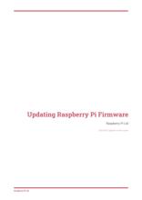
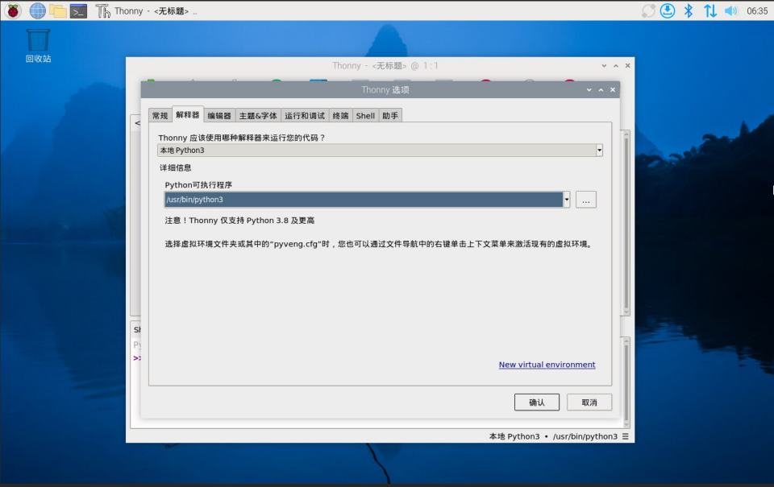

# 树莓派系统（Raspberry Pi OS）


## 简介

树莓派系统（Raspberry Pi OS）是一款免费操作系统，基于 Debian，并针对树莓派的硬件进行了适配及优化。树莓派系统拥有超过 35,000 个 Debian 软件包。对于大多数树莓派使用需求而言，我们建议使用树莓派系统。

因为树莓派系统源自 Debian，因此树莓派系统基于 Debian [发布周期](https://wiki.debian.org/DebianReleases)内的阶段发行版本。大约每 2 年发布一次。

最新版本的树莓派系统基于 [Debian Bookworm](https://www.raspberrypi.com/news/bookworm-the-new-version-of-raspberry-pi-os/)。先前版本基于 [Debian Bullseye](https://www.raspberrypi.com/news/raspberry-pi-os-debian-bullseye/)。

你可在 [raspberrypi.com/software/operating-systems/](https://raspberrypi.com/software/operating-systems/) 下载树莓派系统的镜像。

## 更新软件

请始终确保你在树莓派系统上运行的软件，其版本已更至最新。这可以使你的设备免受[漏洞](https://cve.mitre.org/index.html)的影响，并确保你能及时收到最新的补丁。

### 使用 APT 管理软件包

在树莓派系统中，我们推荐使用 [APT（Advanced Package Tool，高级软件包工具）](https://en.wikipedia.org/wiki/APT_(software)) 来安装、更新和卸载软件。你可以用命令行 `apt` 来调用 APT。

#### 安装更新

`apt` 会把软件源列表存放在文件 `/etc/apt/sources.list` 中。在安装软件之前，请运行以下命令，来 **刷新（update）** 位于 `/etc/apt/sources.list` 的本地软件源：

```
$ sudo apt update
```

运行以下命令，能把所有已安装的软件包 **更新（upgrade）** 至最新版本：

```
$ sudo apt full-upgrade
```

>**技巧**
>
>与 Debian 不同，树莓派系统始终处于开发状态。因此，软件包的依赖关系有时会发生变更，因此你应始终使用 `full-upgrade`，而不要用标准的 `upgrade`。

请定期运行这些命令，以确保软件保持最新状态。在使用 `apt` 维持树莓派系统最新状态时，也会同时把你的 Linux 内核和固件变成最新版本（因为树莓派系统把他们以 Debian 软件包的形式进行分发）。

在树莓派官方发布树莓派系统大版本更新后，执行上述命令也不会把你的操作系统更新到这个最新的大版本。要更新到最新的大版本，请按照我们的[操作系统更新说明](https://www.raspberrypi.com/documentation/computers/os.html#upgrade-your-operating-system-to-a-new-major-version)进行操作。

#### 搜索软件

要搜索软件包，请用 `apt-cache search` 搜索（search）关键字：

```
$ apt-cache search <关键字>
```

例如，下面是关键字“raspi”的搜索结果：

```
$ apt-cache search raspi
raspi3-firmware - Raspberry Pi 2 and 3 GPU firmware and bootloaders
libcamera-apps - libcamera-apps
libcamera-apps-lite - libcamera-apps-lite
python-picamera - Pure Python interface to the Raspberry Pi's camera module.
python-picamera-docs - Documentation for the Python interface to the RPi's camera module.
python3-picamera - Pure Python interface to the Raspberry Pi's camera module.
raspi-config - Raspberry Pi configuration tool
raspi-gpio - Dump the state of the BCM270x GPIOs
raspi-gpio-dbgsym - debug symbols for raspi-gpio
raspinfo - Dump information about the Pi
rc-gui - raspi-config GUI
raspi-copies-and-fills - ARM-accelerated versions of selected functions from string.h
raspi-copies-and-fills-dbgsym - debug symbols for raspi-copies-and-fills
```

搜索结果返回了多个软件包，他们的名称或简介中均涉及关键词（raspi）。

使用以下命令可查看其详细信息：

```
$ apt-cache show <软件包名>
```

例如，假设要查询“raspi-config”这个软件包，结果如下：

```
$ apt-cache show raspi-config
Package: raspi-config
Version: 20210212
Architecture: all
Maintainer: Serge Schneider <serge@raspberrypi.org>
Installed-Size: 121
Depends: whiptail, parted, lua5.1, alsa-utils, psmisc, initramfs-tools
Recommends: triggerhappy, iw
Priority: optional
Section: utils
Filename: pool/main/r/raspi-config/raspi-config_20210212_all.deb
Size: 27976
SHA256: 772d4fd3c6d8c9da47ac56012b74e7828b53c8521ff1c47266bb38ec71750c10
SHA1: 08254c976a8260bde914c2df72f92ffb9317fef6
MD5sum: 80aaac13be6a9b455c822edb91cf8ea2
Description: Raspberry Pi configuration tool
 A simple configuration tool for common Raspberry Pi administrative tasks
Description-md5: 19630c04463bfe7193152448b53d85a0
```

可使用此命令验证维护者、版本和大小是否满足你对软件包的要求。

#### 安装软件包

要在你的树莓派上安装软件包，请把软件包名传给以下命令：

```
$ sudo apt install <软件包名>
```

`apt` 将显示软件包将占用的磁盘空间量。输入 **Y** 并按 **回车键** 来确认安装。你可以在上述命令中添加参数 `-y`，跳过这个确认步骤。

#### 卸载软件包

要在树莓派上卸载软件包，请将软件包名传给以下命令：

```
$ sudo apt remove <软件包名>
```

>**技巧**
>
>要彻底删除软件包的所有痕迹（包括配置文件），请把 `remove` 换成 `purge`。

`apt` 会显示在卸载软件包后，可释放的磁盘容量。输入 **Y** 并按 **回车键** 来确认卸载。你可以在上述命令中添加参数 `-y`，跳过这个确认步骤。

#### 管理 `apt` 磁盘使用情况

在执行之前，`sudo apt full-upgrade`会显示要完成更新所需的下载和存储会占用的磁盘容量。要查看你的剩余磁盘空间是否充足，请运行以下命令：

```
$ df -h
```

`apt` 会把已下载的软件包（ `.deb` 文件）存放到 `/var/cache/apt/archives`。在安装过程中，`apt` 会下载这些软件包，然后把文件从软件包复制到对应的安装位置。视你安装的软件而定，软件包自身可能会占用大量空间。要删除所有遗留的软件包本体，请运行以下命令：

```
$ sudo apt clean
```

### 将你的操作系统更新至最新大版本（major version）

>**警告**
>
>请在尝试进行大版本更新时，先行备份。

要把树莓派系统这个操作系统更新至最新大版本，请使用另外一张 SD 卡，在它上面写入新版本的镜像。从先前安装的旧系统（使用 SD 卡读卡器或网络存储）复制文件和配置到这张新的 SD 卡。然后，将这张新的 SD 卡插进树莓派上的卡槽，再启动。

### 更新你的固件

>**警告**
>
>请在尝试固件更新时，先行备份。

>**警告**
>
>软件的预发布版本能否正常工作，是无法保证的。除非得到了树莓派工程师的建议，否则不要在任何系统上使用 `rpi-update`。这可能导致你的系统不稳定，甚至损坏。不要把 `rpi-update` 视为日常更新流程的组成部分。

要把你树莓派的固件更至最新版本，请使用 [`rpi-update`](https://github.com/raspberrypi/rpi-update)。

`rpi-update` 会下载最新的 Linux 内核预发布版本及与其匹配的内核模块、设备树文件和最新版的 VideoCore 固件。然后将这些文件安装到树莓派系统中。

`rpi-update` 使用的所有源数据均来自 [`rpi-firmware` 存储库](https://github.com/raspberrypi/rpi-firmware)。该存储库包含来自[官方固件存储库](https://github.com/raspberrypi/firmware)的数据子集。

要进行更新，请以 root 身份运行 `rpi-update`。更新完成后，需重启你的树莓派以使这些变更生效：

```
$ sudo rpi-update
$ sudo reboot
```

**[白皮书](https://pip.raspberrypi.com/categories/685-whitepapers-app-notes/documents/RP-003476-WP/Updating-Pi-firmware.pdf)**

>
>
>[树莓派固件更新白皮书](https://pip.raspberrypi.com/categories/685-whitepapers-app-notes/documents/RP-003476-WP/Updating-Pi-firmware.pdf?_gl=1*1hyn2fi*_ga*ODAwMTM3MTg4LjE3MTc1NzY1NTQ.*_ga_22FD70LWDS*MTcyMDc2MTQ4OS4yMi4xLjE3MjA3NjE2MDIuMC4wLjA.)
>
>这本白皮书记录了如何在树莓派系统中更新 VideoCore 固件。

### 把固件降级到最新稳定版本

如果你在把固件更新到最新版本后遇到问题，请使用以下命令把固件回滚到最新稳定版：

```
$ sudo apt-get update
$ sudo apt install --reinstall raspi-firmware
```

>**注意**
>
>如果你仍在使用树莓派操作系统 Bullseye，则必须用以下命令重装 `raspberrypi-kernel`：
>
>```
>$ sudo apt install --reinstall libraspberrypi0 libraspberrypi-{bin,dev,doc} raspberrypi-{kernel,bootloader}
>```
>
>最后，使用 `sudo reboot` 重启你的树莓派以使这些变更生效。

## 播放音频和视频


树莓派系统预装了 [VLC 媒体播放器](https://www.videolan.org/)。你可以它播放音视频文件。在树莓派系统上，VLC 支持硬件加速，并兼容多种常见的音视频文件格式。

### VLC 媒体播放器

#### 图形界面的 VLC 

要在树莓派桌面播放音视频文件，请在文件管理器中双击文件。这将自动触发 VLC 播放文件。或者，从“**声音和视频（Sound & Video）**”菜单中启动 **VLC 媒体播放器（VLC Media Player）**。然后，从“**媒体（Media）**”菜单中选择“**打开文件...（Open File…）**”，并找到到要播放的文件。

在默认情况下，树莓派系统会通过 HDMI 将音频输出至你的显示器。要将音频输出到其他接口（如耳机插孔、USB 扬声器），请右键单击系统托盘中的扬声器图标，然后按需选择。

#### `vlc` 命令行

你还可以用命令行启动 VLC。在以下示例中，我们使用了来自《大雄兔》（Big Buck Bunny）的片段。要在树莓派上下载该片段，请执行以下命令：

```
$ wget --trust-server-names http://rptl.io/big-buck-bunny
```

要用命令行 VLC 播放视频，请运行以下命令：

```
$ vlc big-buck-bunny-1080p.mp4
```

要在文件播放完成后关闭 VLC 的图形界面，请添加参数 `--play-and-exit`：

```
$ vlc --play-and-exit big-buck-bunny-1080p.mp4
```

要全屏播放视频（在某些情况下播放会更流畅），请添加参数 `--fullscreen`：

```
$ vlc --play-and-exit --fullscreen big-buck-bunny-1080p.mp4
```

#### 使用 `cvlc` 播放无图形界面的媒体

如果你在以上这些命令中把 `vlc` 换成 `cvlc`，那么将不会显示 VLC 的图形界面：

```
$ cvlc --play-and-exit big-buck-bunny-1080p.mp4
```

### 在精简版树莓派系统上播放音频和视频

与完整版本的树莓派系统（所有 with desktop 版本）相比，精简版树莓派系统上并未预装 VLC。要在精简版树莓派系统上使用 VLC 播放音视频，请安装用于无需桌面播放的软件包：

```
$ sudo apt install --no-install-recommends vlc-bin vlc-plugin-base
```

为了下面的示例，我们使用了一个短音频的片段剪辑。要在树莓派上下载该片段，请执行以下命令：

```
$ wget --trust-server-names http://rptl.io/startup-music
```

要在命令行让 VLC 播放片段，请运行以下命令：

```
$ cvlc --play-and-exit computer-startup-music.mp3
```

### 指定音频输出设备

要强制把音频输出到特定设备，请使用 [ALSA](https://www.alsa-project.org/wiki/Main_Page) 音频输出：把 `alsa` 值传给参数 `-A`。同时使用参数 `--alsa-audio-device` 来指定音频输出设备：

```
$ cvlc --play-and-exit -A alsa --alsa-audio-device <alsa-设备> computer-startup-music.mp3
```

用以下选项来替换占位符 `<alsa-设备>` ：

| ALSA 设备 | 说明                                                              |
| :-----------: | :-------------------------------------------------------------------: |
| `sysdefault:CARD=Headphones`          | 耳机插孔                                                          |
| `sysdefault:CARD=vc4hdmi`          | 树莓派 Zero，树莓派 1、2、3 上的 HDMI 输出              |
| `sysdefault:CARD=vc4hdmi0`          | 树莓派 4、5、400 和计算模块 4 上的 HDMI0 输出                     |
| `sysdefault:CARD=vc4hdmi1`          | 树莓派 4、5、400 和计算模块 4 上的 HDMI1 输出                     |

>**技巧**
>
>使用以下命令，可获取树莓派上所有 ALSA 设备列表：
> 
>```
>$ aplay -L | grep sysdefault
>```

### 指定视频输出设备

为了强制视频输出到特定设备，即指定视频输出设备，请使用参数 `--drm-vout-display`：

```
$ cvlc --play-and-exit --drm-vout-display <drm-设备> big-buck-bunny-1080p.mp4
```

请把其中的文本 `<drm-设备>` 改成以下某设备：

| DRM 设备 | 说明                                                                              |
| ---------- | ------------------------------------------------------------------------------------ |
| `HDMI-A-1`         | 树莓派 Zero、1、2、3 上的 HDMI 输出；树莓派 4、5、400 上的 HDMI0 输出 |
| `HDMI-A-2`         | 树莓派 4、5、400 上的 HDMI1 输出                                                 |
| `DSI-1`         | 树莓派触摸显示屏                                                                   |

>**技巧**
>
>使用以下命令，可获取树莓派上所有 DRM 设备列表：
>
>```
>$ kmsprint | grep Connector
>```

### 指定音视频输出设备

你可以对音频和视频输出选项进行组合。例如，要把视频定向输出到触摸屏，而把音频定向输出到耳机插孔，根据上述需求，应执行的命令组合为：

```
$ cvlc --play-and-exit --fullscreen --drm-vout-display DSI-1 -A alsa --alsa-audio-device sysdefault:CARD=Headphones your_video.mp4
```

### 改善流媒体播放性能

如果你有 H.264 原始码流（裸流，raw H.264 stream），比如用树莓派摄像头模块捕获的码流，你可以通过把码流封装成诸如 MP4 之类的文件格式，来提升在 VLC 上的播放性能。你可以使用 `ffmpeg` 把码流内容转成容器文件。例如，以下命令可把名为 `video.h264` 的码流，转成 MP4 文件 `video.mp4`（30fps）：

```
$ ffmpeg -r 30 -i video.h264 -c:v copy video.mp4
```

## 实用工具

树莓派系统中预装了几个有用的命令行工具。

### `kmsprint`

工具 `kmsprint` 能列出已接入树莓派的显示器所支持的分辨率。使用 `kmsprint` 可查看已接入树莓派的显示器的详细信息，使用 `kmsprint -m` 能查看显示器支持的所有分辨率列表。你可以在 [Github 上](https://github.com/tomba/kmsxx)找到实用程序 `kmsprint` 的源代码。

### `vclog`

`vclog` 能运行在基于 Arm 的 Linux 上，可输出 VideoCore GPU 的日志消息。它需要以 root 权限执行。

`sudo vclog --msg` 可打印出消息日志，而 `sudo vclog --assert` 则打印出断言日志。

### `vcgencmd`

`vcgencmd` 工具用于输出树莓派上有关 VideoCore GPU 的信息。你可以在 [GitHub 上](https://github.com/raspberrypi/utils/tree/master/vcgencmd)找到工具 `vcgencmd` 的源代码。

要获取 `vcgencmd` 支持的所有命令列表，请使用 `vcgencmd commands`。下面列出了一些实用命令及其所需参数。

#### `vcos`

命令 `vcos` 有两个有用的子命令：

* `version` 可显示 VideoCore 固件的构建日期和版本
* `log status` 可显示 VideoCore 固件所有部分的错误日志状态

#### `version`

可显示 VideoCore 固件的构建日期和版本。

#### `get_throttled`

返回系统的限流状态。这是个位模式。设置位表示以下含义：

| 位 | 十六进制（Hex）值 | 意义              |
| ---- | ------------ | ------------------- |
| 0  | `0x1`           | 已检测到欠压        |
| 1  | `0x2`           | Arm 频率已受限   |
| 2  | `0x4`           | 当前被限流        |
| 3  | `0x8`           | 已启用温度软限制  |
| 16 | `0x10000`           | 曾发生过欠压          |
| 17 | `0x20000`           | 曾发生 Arm 频率限制 |
| 18 | `0x40000`           | 曾发生限流        |
| 19 | `0x80000`           | 曾发生温度软限制  |

#### `measure_temp`

`measure_temp` 可返回 SoC 的温度，数据源于其内部温度传感器。在树莓派 4 上，`measure_temp pmic` 返回的温度来自电源管理（PMIC）。

#### `measure_clock [时钟]`

它将返回指定时钟的实时频率。可返回以下时钟值：

| 时钟 | 说明                  |
| ------ | ------------------------ |
| `arm`     | ARM 核心               |
| `core`     | GPU 核心               |
| `h264`     | H.264 区域               |
| `isp`     | 图像传感器管道         |
| `v3d`     | 3D 区域                  |
| `uart`     | UART                   |
| `pwm`     | PWM 区域（模拟音频输出） |
| `emmc`     | SD 卡接口              |
| `pixel`     | 像素阀（Pixel valves）                 |
| `vec`     | 模拟视频编码器         |
| `hdmi`     | HDMI                   |
| `dpi`     | 显示并行接口           |

 例如 `vcgencmd measure_clock arm`

#### `measure_volts [区域]`

它可显示特定区域使用的当前电压。可接受以下值：

| 区域 | 说明          |
| ------ | ---------------- |
| `core`     | VC4 核心电压     |
| `sdram_c`     | SDRAM 核心电压 |
| `sdram_i`     | SDRAM I/O 电压 |
| `sdram_p`     | SDRAM 物理电压 |

#### `otp_dump`

它将显示 SoC 内部 OTP（一次性可编程，one-time programmable）存储器中的内容。这些是 32 位值，索引范围是 8 到 64。有关更多详细信息，请参阅 [OTP 位页面](https://www.raspberrypi.com/documentation/computers/raspberry-pi.html#otp-register-and-bit-definitions)。

#### `get_config [配置项目|int|str]`

它将显示指定配置项目的值。或者如要查看给定类型的所有配置项目，可指定参数 `int`（整数）或`str`（字符串）。例如，以下命令会返回设备上的全部内存大小（单位为 Mb）：

```
$ vcgencmd get_config total_mem
```

#### `get_mem 类型`

`get_mem 类型` 会报告 Arm 和 GPU 可寻址内存的大小。要显示 Arm 可寻址内存的大小，请使用 `vcgencmd get_mem arm`；要显示 GPU 可寻址内存的数量，请使用 `vcgencmd get_mem gpu`。如果设备内存大于 1GB，`arm` 参数的返回值将始终用 1GB 减 `gpu` 显存，因为 GPU 固件仅获取前 1GB 内存。要想准确报告设备上的总内存，请参阅 `total_mem` 配置项和上述 [`get_config`](https://www.raspberrypi.com/documentation/computers/os.html#getconfig) 部分。

##### `codec_enabled [类型]`

可报告指定类型的解码器是否已启用。可支持以下类型：AGIF、FLAC、H263、H264、MJPA、MJPB、MJPG、MPG2、MPG4、MVC0、PCM、THRA、VORB、VP6、VP8、WMV9、WVC1。请注意，由于在树莓派 4、400 上的 H.265 硬件模块不属于 VideoCore GPU，因此无法用此命令查看其状态。

##### `mem_oom`

将显示在 VideoCore 内存空间中发生过的所有 OOM（Out of memory，内存溢出）事件的统计信息。

##### `mem_reloc_stats`

将显示来自 VideoCore 上可重定位内存分配器的统计信息。

##### `read_ring_osc`

用于返回环形振荡器的实时速度、电压和温度。

## 辅助功能选项

### 视觉辅助

视障用户能在树莓派系统菜单中“**推荐软件（Recommended Software）**”找到有用的工具。

我们还提供了 [Orca 屏幕阅读器](https://help.gnome.org/users/orca/stable/introduction.html.en)来简化树莓派桌面的导航。此外，我们还提供了屏幕放大器来放大用户界面，提高屏幕内容的可读性。

#### Orca 屏幕阅读器

你可以从树莓派主菜单的 **推荐软件（Recommended Software）** 处安装 Orca 屏幕阅读器。或者，按 **Ctrl** + **Alt** + **空格键** 自动安装 Orca。

在安装新系统后，首次启动树莓派系统时，将在 30 秒时播放自动语音提醒。此提醒提供了有关如何安装 Orca 的说明。

## 在树莓派上使用 Python

树莓派系统预装了 Python 3。对已安装的系统级 Python 进行破坏，可能会引发操作系统故障。安装第三方 Python 库时，请始终正确使用软件包管理工具。

在 Linux 上，你可以用两种方式来安装 `python` 依赖包：

* 使用 `apt` 来安装预配置系统软件包
* 在 **虚拟环境中**，使用 `pip`，即使用 Python 的依赖管理器安装库

>**重要**
>
>自树莓派系统 *Bookworm* 以降，若使用 `pip`，你只能将其安装至 Python 虚拟环境（`venv`）。该变更是由 Python 社区引入的，与树莓派无关：有关更多信息，请参阅 [PEP 668](https://peps.python.org/pep-0668/)。


### 使用 `apt` 安装 Python 软件包

用 `apt` 安装的软件包，是专为树莓派系统打包的。这些软件包大都是预编译的，因此安装速度更快。由于 `apt` 管理能所有软件包的依赖关系，使用此方法，会同时安装运行软件包所需的所有子依赖包。而 `apt` 能确保你在卸载时免于对其他软件包造成破坏。

例如，要安装使用树莓派 [Build 扩展板](https://www.raspberrypi.com/documentation/accessories/build-hat.html)的 Python 3 库，请运行以下命令：

```
$ sudo apt install python3-build-hat
```

要查找使用 `apt` 分发的 Python 包，请[使用 `apt search`](https://www.raspberrypi.com/documentation/computers/os.html#search-for-software)。在大多数情况下，Python 包使用前缀 `python-` 和 `python3-`：比如，你会发现，名为 `python3-numpy` 的包，它就是 `numpy`。

### 使用 `pip` 安装 Python 库

#### Bookworm 上 `pip` 安装的变更

在旧版本的树莓派系统中，你可以用 `pip` 直接把库安装到系统级 Python 中。自树莓派系统 *Bookworm* 以降，用户无法直接把库安装到系统级 Python。

应该[把库安装到虚拟环境（`venv`）](https://www.raspberrypi.com/documentation/computers/os.html#use-pip-with-virtual-environments)。要为所有用户把库安装成系统级，[请用 `apt` 来安装](https://www.raspberrypi.com/documentation/computers/os.html#install-python-packages-using-apt)。

若尝试在系统级安装 Python 软件包，将会输出类似以下报错：

```
$ pip install buildhat
error: externally-managed-environment

× This environment is externally managed
╰─> To install Python packages system-wide, try apt install
  python3-xyz, where xyz is the package you are trying to
  install.

  If you wish to install a non-Debian-packaged Python package,
  create a virtual environment using python3 -m venv path/to/venv.
  Then use path/to/venv/bin/python and path/to/venv/bin/pip. Make
  sure you have python3-full installed.

  For more information visit http://rptl.io/venv

note: If you believe this is a mistake, please contact your Python installation or OS distribution provider. You can override this, at the risk of breaking your Python installation or OS, by passing --break-system-packages.
hint: See PEP 668 for the detailed specification.
```

长期以来，Python 用户一直承受着操作系统软件包管理器（`apt`）和 Python 特定软件包管理工具（`pip`）之间的冲突。这些冲突包括 Python 的 API 不兼容性、文件所有权。

从树莓派系统 *Bookworm* 开始，用 `pip` 安装的软件包，**只能安装到 Python 虚拟环境（`venv`）里面**。虚拟环境是个容器，在这儿，你能安全地安装第三方模块，不会干扰系统级 Python。

#### 使用 pip 和虚拟环境

要使用虚拟环境，请创建容器来存储环境。根据你使用 Python 的打算，有多种方法可以做到这一点。

运行以下命令可创建一个虚拟环境配置文件夹，把 `<环境名>` 改成你想要的虚拟环境名称（如 `env`）:

```
$ python -m venv <环境名>
```

>**技巧**
>
>要在虚拟环境中，将当前已安装的系统级 Python，所有软件包所在的文件夹，预加载至虚拟环境，请使用参数 `--system-site-packages`。

然后，在虚拟环境配置文件夹中执行命令 `bin/activate` 以进入虚拟环境：

```
$ source <环境名>/bin/activate
```

然后，你应该会看到类似如下提示，其内容为：

```
(<环境名>) $
```

命令提示符前缀 `(<环境名>)` 代表当前终端会话位于名为 `<环境名>` 的虚拟环境中。

要查看当前是否位于虚拟环境，请使用 `pip list`，查看已安装软件包的列表：

```
(<环境名>) $ pip list
Package    Version
---------- -------
pip        23.0.1
setuptools 66.1.1
```

虚拟环境中已安装的输出列表应该要比系统级的 Python 要短得多。你现在可以放心地使用 `pip` 来安装软件包了。在虚拟环境中，使用 `pip` 安装的所有软件包都只会安装到这个虚拟环境中。在虚拟环境中，命令 `python` 和 `python3` 会自动调用虚拟环境中的 Python 版本和已安装的软件包，而非系统级 Python。

要退出虚拟环境，请运行以下命令：

```
(<环境名>) $ deactivate
```

#### 为每个项目使用独立的环境

许多用户会为每个 Python 项目都创建一个单独的虚拟环境。然后将虚拟环境放置在每个项目的根目录中（通常使用名称 `env`）。在每个项目的根目录下，运行以下命令可创建虚拟环境配置文件夹。

```
$ python -m venv env
```

在开始你的项目工作之前，请在项目根目录下运行以下命令，以开始使用虚拟环境：

```
$ source env/bin/activate
```

然后，你应该会看到类似提示如下，内容为：

```
(env) $
```

当你完成项目工作后，可在任意目录下运行命令，来退出虚拟环境：

```
(env) $ deactivate
```

#### 为每个用户使用独立的环境

与为每个 Python 项目都创建一个虚拟环境有所不同，你可以为你的用户账户，创建一个单独的虚拟环境。**在运行其他 Python 程序之前，先激活这个虚拟环境。** 这种方法对于在项目之间共享许多库的工作流可能更方便。

当为整个用户账户，跨多个项目创建虚拟环境时，可考虑将虚拟环境配置文件放在你的主目录下。可将其配置存储在[一个以点开头的文件夹中](https://en.wikipedia.org/wiki/Hidden_file_and_hidden_directory#Unix_and_Unix-like_environments)，以便在默认情况下，隐藏该文件夹，防止在主目录里弄混。

使用以下命令，在当前用户的主目录中，隐藏文件夹下，创建虚拟环境：

```
$ python -m venv ~/.env
```

在其他目录，运行命令，即可开始使用虚拟环境：

```
$ source ~/.env/bin/activate
```

然后你应该会看到类似如下提示信息：

```
(.env) $
```

在任意目录，运行以下命令即可退出虚拟环境：

```
(.env) $ deactivate
```

### 使用 Thonny 编辑器

我们推荐使用 [Thonny](https://thonny.org/)，来编辑树莓派上的 Python 代码。

在默认情况下，Thonny 使用系统级 Python。但是，你可以通过单击 Thonny 窗口右下角的 **解释器菜单（interpreter menu）** 来切换使用 Python 虚拟环境。可选择配置好的环境或使用 `配置解释器（Configure interpreter…）` 来配置一个新的虚拟环境。



### 用 Python 控制 GPIO

使用 [GPIO Zero](https://gpiozero.readthedocs.io/) 库能轻松地控制 GPIO 设备。该库在 [gpiozero.readthedocs.io](https://gpiozero.readthedocs.io/) 上有全面的文档。

关于 GPIO 硬件的信息，请参见 [GPIO 硬件](https://www.raspberrypi.com/documentation/computers/raspberry-pi.html#gpio)。

#### 控制 LED

以下示例代码用于控制接入到 GPIO17 的 LED：

```
from gpiozero import LED
from time import sleep

led = LED(17)

while True:
    led.on()
    sleep(1)
    led.off()
    sleep(1)
```

可在类似 Thonny 的 IDE 中运行，LED 会不停地闪烁。

LED 方法包括 `on()`、`off()`、`toggle()` 和 `blink()`。

#### 读取按钮状态

以下示例代码，可读取接入到 GPIO2 按钮的状态：

```
from gpiozero import Button
from time import sleep

button = Button(2)

while True:
    if button.is_pressed:
        print("Pressed")
    else:
        print("Released")
    sleep(1)
```

按钮函数包括属性 `is_pressed` 和 `is_held`；回调 `when_pressed`、`when_released` 和 `when_held`；以及方法 `wait_for_press()` 和 `wait_for_release`。

#### 用按钮控制 LED

以下示例代码可读取接入 GPIO2 的按钮状态，并在按下按钮时，点亮接入到 GPIO17 的 LED：

```
from gpiozero import LED, Button

led = LED(17)
button = Button(2)

while True:
    if button.is_pressed:
        led.on()
    else:
        led.off()
```

 还可这么写：

```
from gpiozero import LED, Button

led = LED(17)
button = Button(2)

while True:
    button.wait_for_press()
    led.on()
    button.wait_for_release()
    led.off()
```

 又或者这么写：

```
from gpiozero import LED, Button

led = LED(17)
button = Button(2)

button.when_pressed = led.on
button.when_released = led.off
```

#### 进一步阅读


你可以在由树莓派出版社出版的书籍[《GPIO Zero 基础电子学》（Simple Electronics with GPIO Zero）](https://github.com/raspberrypipress/released-pdfs/raw/main/simple-electronics-with-gpio-zero.pdf)中，找到有关如何使用 GPIO Zero Python 库编程，沟通你树莓派的更多信息。该书使用 GPIO Zero 库帮助你入门，并通过构建一系列项目来指导你如何使用它。

你可以免费[下载这本书](https://github.com/raspberrypipress/released-pdfs/raw/main/simple-electronics-with-gpio-zero.pdf)的 PDF 文件，它是根据[知识共享署名-非商业性使用-相同方式共享 3.0 国际许可（CC BY NC-SA）](https://creativecommons.org/licenses/by-nc-sa/3.0/)发布的。
