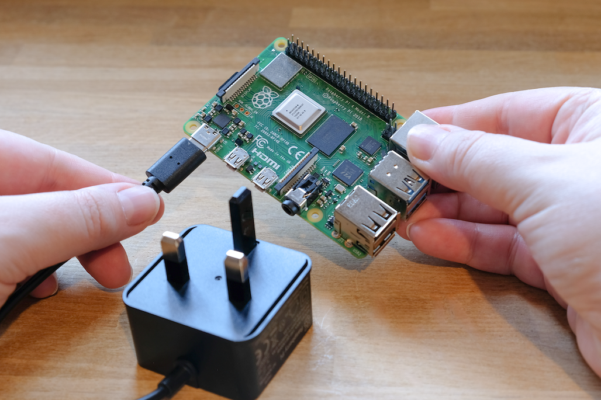
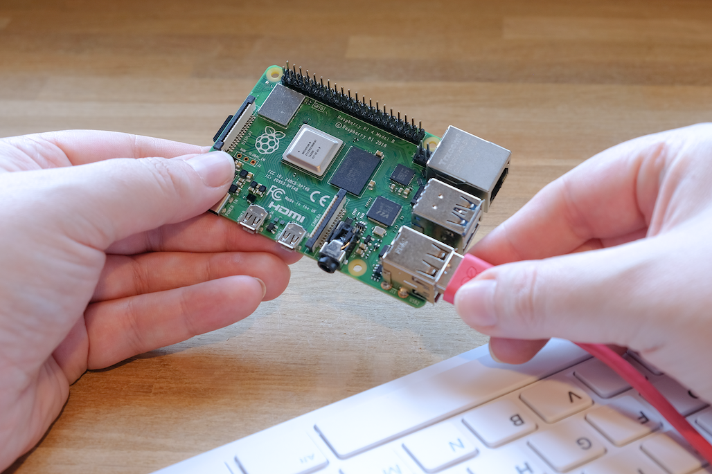
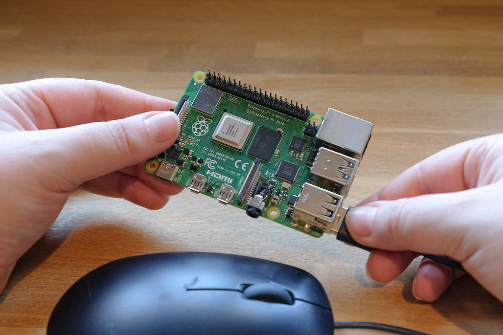
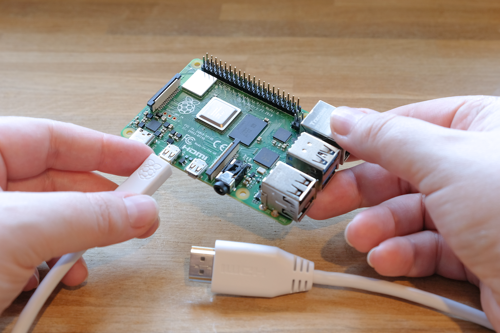
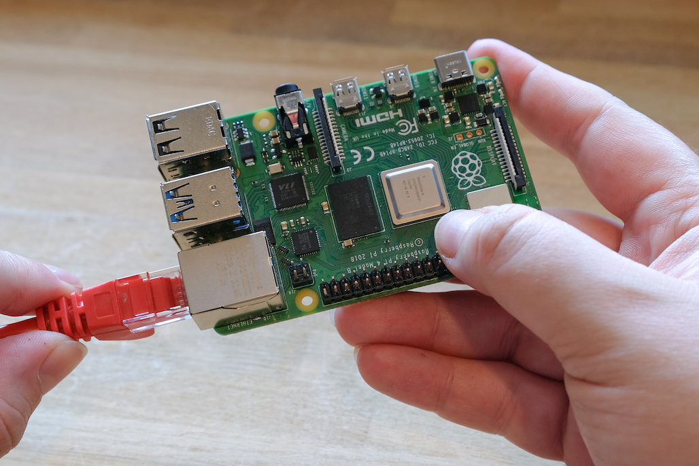
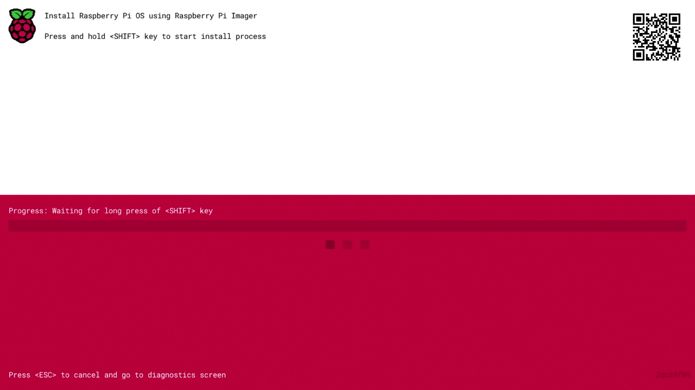
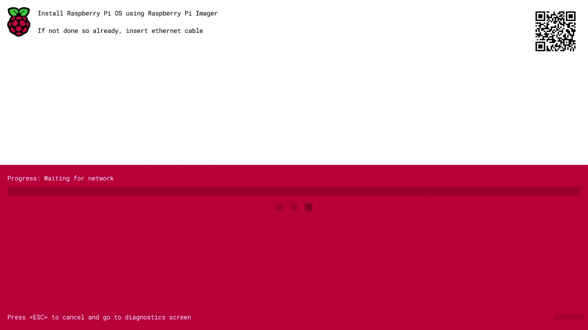
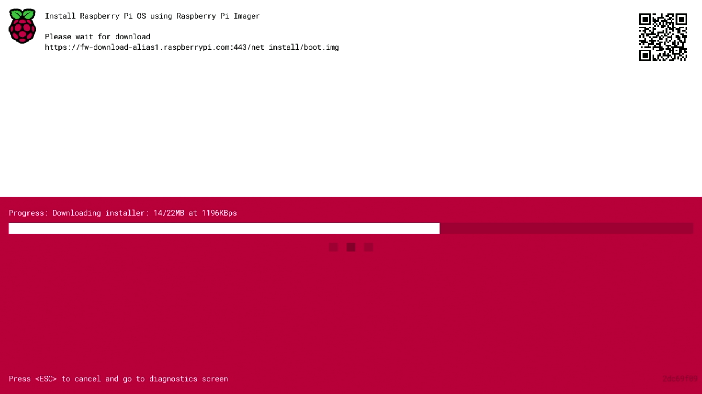
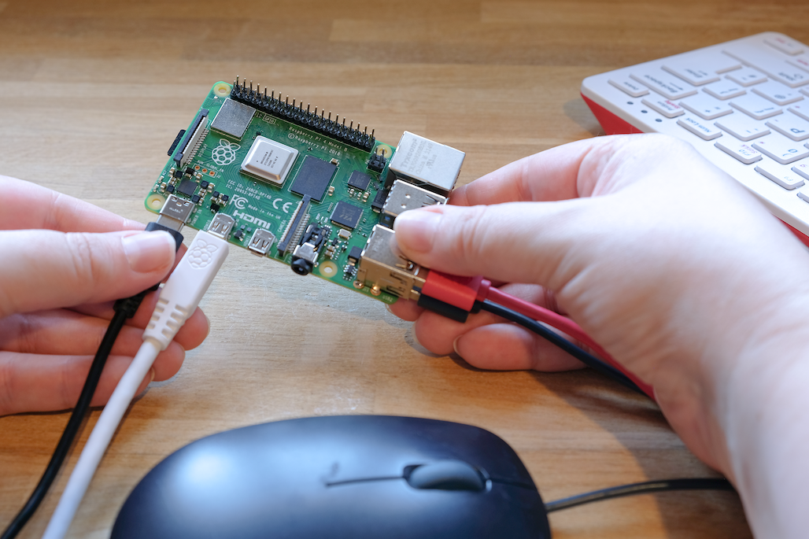
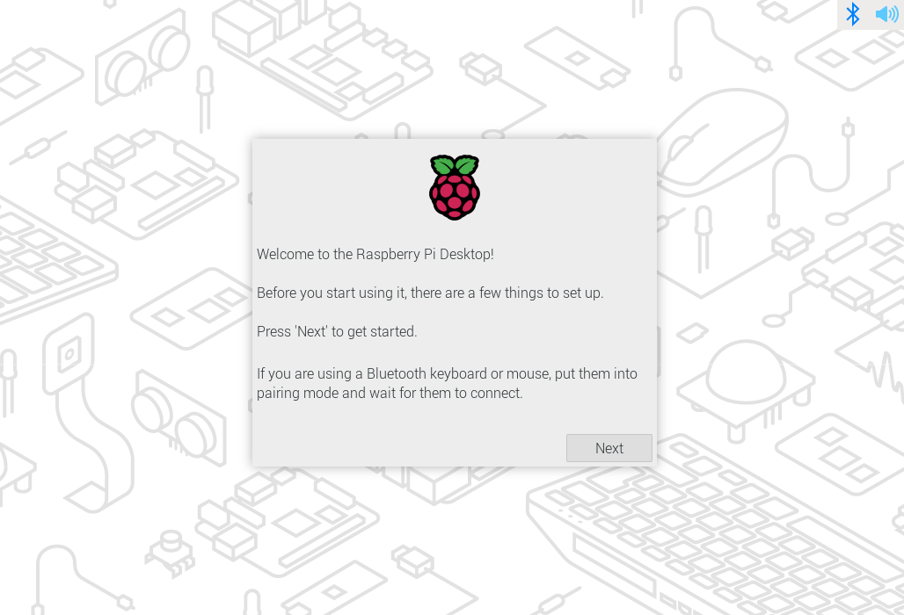

# 入门

## 开始使用你的树莓派



 
要开始使用你的树莓派，你需要满足如下条件：

* 电源供应
* 启动介质（如存储空间足够大和速度足够快的 microSD 卡）

你可以将树莓派配置为带有桌面的交互式计算机，也可以将其配置为仅通过网络访问的无头系统（headless）。你无需任何额外的外部设备即可无头设置你的树莓派：你可以在安装操作系统时预先设置主机名、用户账号、网络连接和 SSH。但如果要直接使用你的树莓派，你还需要以下额外的配件：

* 显示器
* 用于将树莓派连接到显示器的连接线
* 键盘
* 鼠标

### 电源供应

下面的表格列出了为各种型号的树莓派提供电源所需的 USB-PD 电源适配器型号。你可使用其他能提供符合电源功率要求的高品质电源适配器来代替。

| 型号                    | 推荐的电源适配器（电压/电流）     | 树莓派电源适配器 |
| :-------------------------: | :-----------------------------------: | :------------------: |
| 树莓派 5                | 5V/5A，5V/3A（将限制外部设备至 600mA） | [27W USB-C 电源适配器](https://www.raspberrypi.com/products/27w-power-supply/)                 |
| 树莓派 4 Model B        | 5V/3A                             | [15W USB-C 电源适配器](https://www.raspberrypi.com/products/type-c-power-supply/)                 |
| 树莓派 3（所有型号）    | 5V/2.5A                           | [12.5W Mirco USB 电源适配器](https://www.raspberrypi.com/products/micro-usb-power-supply/)                 |
| 树莓派 2（所有型号）    | 5V/2.5A                           | [12.5W Mirco USB 电源适配器](https://www.raspberrypi.com/products/micro-usb-power-supply/)                 |
| 树莓派 1（所有型号）    | 5V/2.5A                           | [12.5W Mirco USB 电源适配器](https://www.raspberrypi.com/products/micro-usb-power-supply/)                 |
| 树莓派 Zero（所有型号） | 5V/2.5A                           | [12.5W Mirco USB 电源适配器](https://www.raspberrypi.com/products/micro-usb-power-supply/)                 |

请将电源适配器插入标有“POWER IN”、“PWR IN”或“PWR”的接口。某些型号的树莓派（如 Zero 系列）的 USB 输出接口的规格与电源接口相同。请确保在树莓派上使用的接口是正确的！

### 启动介质

树莓派没有内置存储，因此需要你来提供启动介质。你可以通过安装在受支持的介质上的操作系统来启动你的树莓派：一般用 microSD 卡，但也可以使用 USB 存储设备、网络存储设备及通过 PCIe 扩展板转接的存储设备。然而，只有最新型号的树莓派才能支持上以上所有类型的介质。

自树莓派 1 Model A+ 以来的所有的消费者型号树莓派都配备了 microSD 卡槽。当卡槽中插入了 microSD 时，你的树莓派会自动从 microSD 启动。

#### 推荐的 SD 卡

我们建议，用于安装 Raspberry Pi OS 的 SD 卡至少要拥有 32GB 存储空间（对于 Raspberry Pi OS Lite 建议至少为 16GB）。你可以使用任何容量不大于 2TB 的 SD 卡。由于 MBR 的限制，目前不支持超过 2TB 的容量。与所有其他启动介质一样，读写速度更快的 SD 卡能提供更好的性能。

由于硬件限制，以下设备只能从 256GB（或更小）的启动分区上启动：

* 树莓派 Zero
* 树莓派 1
* 基于 BCM2836 SoC 的早期树莓派 Model 2 

其他操作系统可能有不同的需求。请查阅你使用的操作系统文档以了解容量需求。

### 键盘

你可以使用树莓派上的任意 USB 接口来连接[有线键盘](https://www.raspberrypi.com/products/raspberry-pi-keyboard-and-hub/)或 USB 蓝牙接收器。

### 鼠标

你可以使用树莓派上的任意 USB 接口来连接[有线鼠标](https://www.raspberrypi.com/products/raspberry-pi-mouse/)或 USB 蓝牙接收器。

### 显示器

树莓派具有以下显示输出功能：

| 型号                    | 显示输出                                             |
| ------------------------- | ------------------------------------------------------ |
| 树莓派 5                | micro HDMI ×2                                       |
| 树莓派 4（所有型号）    | micro HDMI ×2，可通过 3.5 mm [TRRS 插孔](http://en.wikipedia.org/wiki/Phone_connector_(audio)#TRRS_standards)实现音频和复合输出 |
| 树莓派 3（所有型号）    | HDMI，可通过 3.5 mm [TRRS 插孔](http://en.wikipedia.org/wiki/Phone_connector_(audio)#TRRS_standards)实现音频和复合输出          |
| 树莓派 2 (所有型号)     | 可通过 3.5 mm [TRRS 插孔](http://en.wikipedia.org/wiki/Phone_connector_(audio)#TRRS_standards)实现 HDMI、音频和复合输出     |
| 树莓派 1 Model B+       | 可通过 3.5 mm [TRRS 插孔](http://en.wikipedia.org/wiki/Phone_connector_(audio)#TRRS_standards)实现 HDMI、音频和复合输出     |
| 树莓派 1 型 A+          | 可通过 3.5 mm [TRRS 插孔](http://en.wikipedia.org/wiki/Phone_connector_(audio)#TRRS_standards)实现 HDMI、音频和复合输出     |
| 树莓派 Zero（所有型号） | mini HDMI                                            |

>**注意**
>
>所有型号的树莓派都不支持 USB-C 视频传输（DisplayPort alt mode）。 

如果你的树莓派有多个 HDMI 接口，请将主显示器插入标有 `HDMI0` 的那个接口。

常见的显示器不支持 micro HDMI 和 mini HDMI。但是，你可以使用 [micro-HDMI-to-HDMI 转换线](https://www.raspberrypi.com/products/micro-hdmi-to-standard-hdmi-a-cable/) 和 [mini-HDMI-to-HDMI 转换线](https://www.raspberrypi.com/products/standard-hdmi-a-male-to-mini-hdmi-c-male-cable/)来将树莓派上的这些接口转接到 HDMI 显示器。如果显示器不支持 HDMI，请考虑用转换器将 HDMI 输出转换为该设备所支持的类型。

### 音频

所有型号的树莓派都支持通过 HDMI、micro HDMI 或 mini HDMI 进行音频输出，且都支持通过 USB 进行音频输出。所有配备了蓝牙的树莓派都支持蓝牙音频。所有基于树莓派 1、2、3 和 4 的型号都有一个 3.5 mm 的 [TRRS](http://en.wikipedia.org/wiki/Phone_connector_(audio)#TRRS_standards) AUX 耳机插孔，但可能需要用放大器才能获得足够的输出音量。

### 网络

如下型号的树莓派配备了 Wi-Fi 和蓝牙连接功能：

* 树莓派 5
* 树莓派 4
* 树莓派 3B+
* 树莓派 3
* 树莓派 Zero W
* 树莓派 Zero 2 W

后缀“Model B”代表带以太网接口的版本；“Model A”代表无以太网接口。如果你的树莓派没有以太网接口，你还可以使用 USB 转以太网转换器来连接有线互联网。

## 安装操作系统

要使用你的树莓派，你需要操作系统。在默认情况下，树莓派会在 SD 卡槽中的 SD 卡内查找是否有操作系统。

取决于你的树莓派型号，你还可以通过其他存储设备启动操作系统，包括 USB 设备、网络存储和通过扩展板连接的存储设备。

要在用于树莓派的存储设备上安装操作系统，你需要：

* 可以用来把镜像写入到该存储设备的计算机
* 将你的存储设备连接到该计算机的手段

大多数树莓派用户选择用 microSD 卡作为他们的启动设备。

我们建议用 Raspberry Pi Imager 来安装操作系统。

Raspberry Pi Imager 是一个帮助你在 macOS、Windows 和 Linux 上下载和写入镜像的工具。Raspberry Pi Imager 包含了许多流行的树莓派操作系统镜像。Raspberry Pi Imager 还支持加载直接从[树莓派](https://ubuntu.com/download/raspberry-pi)或第三方供应商（如 [Ubuntu](https://ubuntu.com/download/raspberry-pi)）下载的镜像。你可以使用 Raspberry Pi Imager 预配置树莓派的凭据和远程访问设置。

Raspberry Pi Imager 也支持打包为 `.img` 格式的镜像，以及像 `.zip` 这样的压缩格式。

如果你没有能把镜像写入到存储设备的计算机，你可以通过互联网直接在你的树莓派上安装操作系统。

### 使用 Raspberry Pi Imager 安装

你可以通过以下方式安装 Raspberry Pi Imager：

* 从树莓派官网 [raspberrypi.com/software](https://www.raspberrypi.com/software/) 下载最新版本并运行安装程序。
* 通过终端使用包管理器安装，如 `sudo apt install rpi-imager`。

安装 Raspberry Pi Imager 后，通过单击 Raspberry Pi Imager 图标或执行 `rpi-imager` 启动应用程序。

单击“**选择设备（Choose device）**”，然后从列表中选择你的树莓派型号。

接下来，单击“**选择操作系统（Choose OS）**”，然后选择要安装的操作系统。Raspberry Pi Imager 将始终在列表最上面显示适用于你的型号，推荐版本的 Raspberry Pi OS。

将首选存储设备连接到计算机。例如，使用外部或内置 SD 卡读卡器插入 microSD 卡。然后，单击“**选择存储设备（Choose storage）**”，选择你的存储设备。

>**警告**
>
>如果你的计算机连接了多个存储设备，*请务必选择正确的设备！* 通常可以通过大小来识别存储设备。如不确定，请断开其他设备，直到确定要刻录镜像的设备。 

 接下来，点击“**下一步（Next）**。

在弹出窗口中，Imager 将要求你应用操作系统设置。我们强烈建议通过操作系统定制设置配置你的树莓派。单击“编辑设置（Edit Settings）”按钮打开操作系统定制（ OS customisation）。

如果你没有通过操作系统定制设置配置你的树莓派，Raspberry Pi OS 将在首次启动期间的配置向导中要求你提供相同的信息。你可以单击选项“否（No）”来跳过操作系统自定义。

#### 操作系统定制

操作系统定制菜单允许你在首次启动之前设置你的树莓派。你可以预先配置：

* 用户名和密码
* Wi-Fi 凭据
* 设备主机名
* 时区
* 键盘布局
* 远程连接

当你首次打开系统自定义菜单时，你可能会看到一个提示，询问是否允许从主机计算机加载 Wi-Fi 凭据。如果你回答“是”，Imager 将从你当前连接的网络预填 Wi-Fi 凭据。如果你回答“否”，你可以手动输入 Wi-Fi 凭据。

主机名选项定义了你的树莓派使用 mDNS 在网络上广播的主机名。当你将树莓派连接到网络时，网络上的其他设备可以使用 `<hostname>.local` 或 `<hostname>.lan` 与你的计算机通信。

用户名和密码选项定义了树莓派上管理员用户帐户的用户名和密码。

无线局域网选项允许你输入无线网络的 SSID（名称）和密码。如果你的网络不公开广播 SSID，则应启用“隐藏 SSID”设置。默认情况下，Imager 使用你当前所在的国家作为“无线局域网国家”。此设置控制树莓派使用的 Wi-Fi 广播频率。如果你计划运行无头树莓派，请为无线局域网选项输入凭据。

区域设置选项允许你为你的树莓派定义时区和默认键盘布局。

服务选项卡包括帮助你远程连接到树莓派的设置。

如果你计划通过网络远程使用你的树莓派，请勾选“启用 SSH”旁边的复选框。如果你计划运行无显示器的树莓派，你应该启用此选项。

* 选择密码验证选项，使用你在 OS 定制的常规选项卡中提供的用户名和密码通过网络 SSH 到你的树莓派。
* 选择仅允许公钥验证，为你的树莓派预配置无密码公钥 SSH 验证，使用你当前使用的计算机上的私钥。如果你的 SSH 配置中已经有 RSA 密钥，Imager 将使用该公钥。如果没有，你可以单击“运行 SSH-keygen”生成公/私钥对。Imager 将使用新生成的公钥。

系统定制还包括“选项”菜单，允许你在写入过程中配置 Imager 的行为。这些选项允许你在 Imager 完成验证图像时播放声音，自动在验证后卸载存储介质，并禁用遥测。

#### 写入

当你完成输入系统定制设置后，请单击“保存”以保存你的定制。

然后，在将镜像写入存储设备时，单击“是”应用系统自定义设置。

最后，回答“你确定要继续吗？”弹出窗口中的“是”，开始向存储设备写入数据。

如果看到要求管理员权限以读取和写入存储介质的提示，请授予 Imager 权限以继续。

去喝杯咖啡或散散步。这可能需要几分钟。

如果你想要冒险一下，可以点击取消验证来跳过验证过程。

当你看到“写入成功”弹出窗口时，表示镜像已完全写入和验证。现在你可以从存储设备启动树莓派了！

接下来，继续进行首次启动配置说明，让你的树莓派运行起来。

### 通过网络安装

网络安装使树莓派能够使用通过网络下载的树莓派 Imager 版本在存储设备上安装操作系统。通过网络安装，你可以在树莓派上安装操作系统，从而无需单独的 SD 卡读卡器及除树莓派之外的计算机。你可以在任何兼容的存储设备上运行网络安装，包括 SD 卡和 USB 存储设备。

网络安装仅适用于树莓派 4、400 和 5。如果你的树莓派使用较旧的引导加载程序，你可能需要更新引导加载程序以使用网络安装。

网络安装需要以下条件：

* 受支持的树莓派型号且安装了支持网络安装的固件
* 显示器
* 键盘
* 有线网络连接

要启动网络安装，请在以下配置的基础上，按住 *SHIFT* 键并打开你的树莓派电源：

* 存储设备没有被写入镜像
* 连接键盘
* 连接兼容的存储设备，如 SD 卡或 USB 存储设备

如果你尚未将树莓派连接到互联网，请使用网线进行连接。

连接到互联网后，你的树莓派将下载树莓派安装程序。如果下载失败，你可以重复该过程再试一次。

在完成下载树莓派安装程序后，你的树莓派将自动启动树莓派镜像工具。有关运行树莓派镜像工具的更多信息，请参阅安装操作系统。

有关网络安装配置的更多信息，请参阅 HTTP 引导。

## 设置你的树莓派

安装操作系统镜像后，将存储设备连接到你的树莓派。

首先，拔掉树莓派的电源适配器，确保在连接外围设备时树莓派已关机。如果你在 microSD 卡上安装了操作系统，现在可以将其插入树莓派的卡槽。如果你在其他存储设备上安装了操作系统，现在可以将其连接到树莓派。

然后，插入所需的其他外围设备，如鼠标、键盘和显示器。

最后，将电源连接到你的树莓派。当你的树莓派开机时，你应该看到 LED 状态亮起。如果你的树莓派接入了显示器，你应该在几分钟内看到启动屏幕。

## 首次启动配置

如果你在 Imager 中使用了系统自定义来预配置你的树莓派，恭喜！你的设备已经准备就绪。继续下一步，了解如何充分利用你的树莓派。

如果你的树莓派在 5 分钟内无法启动，请检查 LED 状态灯。如果 LED 在闪烁，请查看 LED 警告闪烁代码以获取更多信息。如果你的树莓派拒绝启动，请尝试以下缓解措施：

* 如果你使用的是除 SD 卡以外的启动设备，请尝试从 SD 卡启动
* 重新为你的 SD 卡写入镜像; 确保在 Imager 中完成了完整的校验步骤
* 更新你的树莓派上的引导加载程序，然后重新为你的 SD 卡重新写入镜像

如果你选择在 Imager 中跳过系统定制，则你的树莓派将在首次启动时运行配置向导。你需要一个显示器和键盘来浏览向导（如果没有鼠标也可以进行）。

### 蓝牙

如果你正在使用蓝牙键盘或鼠标，此步骤将引导你完成设备配对。你的树莓派将扫描可配对的设备，并连接到找到的第一个设备。

此过程适用于内置或外部 USB 蓝牙适配器。如果你使用 USB 适配器，请在启动树莓派之前插入。

### 语言环境

此页面可帮助你配置国家、语言、时区和键盘布局。

### 用户

此页面可帮助你配置默认用户帐户的用户名和密码。

在默认情况下，旧版的 Raspberry Pi OS 将用户名设置为"pi"。如果你使用用户名"pi"，请避免使用旧的默认密码"raspberry"，以保持你的树莓派安全。

### 无线网络

这个页面可以帮助你连接到 Wi-Fi 网络。从列表中选择你喜欢的网络。

如果你的网络需要密码，你可以在这里输入。

### 浏览器

此页面允许你选择将 Firefox 或 Chromium 作为默认的互联网浏览器。你可以选择卸载你未设置为默认的浏览器。

### 软件更新

在你的树莓派连接到互联网后，此页面将帮助你将操作系统和软件更新到最新版本。在软件更新过程中，向导将删除非默认浏览器（如果你选择在浏览器选择步骤中卸载它）。更新可能需要几分钟时间。

当你看到弹出窗口指示系统已经更新，请点击“确定”继续下一步。

### 完成

在配置向导结束时，点击“重新启动”来重启你的树莓派。你的树莓派将应用你的配置并启动到桌面。

## 下一步
 

树莓派已设置并准备就绪，接下来做什么？

### 推荐软件

树莓派操作系统预装许多基本应用程序，因此你可以立即开始使用它们。如果你想利用我们认为有用的其他应用程序，请单击屏幕左上角的树莓图标。选择首选项 > 推荐软件，你将找到软件包管理器。你可以在此免费安装各种推荐软件。

例如，如果你计划将树莓派用作家用电脑，你可能会发现 LibreOffice 用于编写和编辑文档和电子表格非常有用。你还可以通过诸如屏幕放大器和 Orca 屏幕阅读器之类的应用程序使树莓派更易于访问，这些应用程序位于通用访问下。

### 教程

我们的教程展示了你可以如何使用你的新计算机的各种方式。你可以通过跟随激发你兴趣的教程来学习编码、控制外部设备，并构建令人兴奋的新项目。

### 支持

对于官方树莓派产品的支持，或者与其他树莓派用户联系，请访问树莓派论坛。

### 进一步阅读

你可以在 Gareth Halfacree 的最新版《官方树莓派初学者指南》中找到有关如何开始使用树莓派的更多信息。

 学习如何：

* 配置你的树莓派，为其安装操作系统，并开始使用这台功能齐全的计算机。
* 使用 Scratch 3、Python 和 MicroPython 编程语言，通过逐步指南开始编码项目。
* 尝试连接电子元件，并乐在其中创造令人惊叹的项目。

第五版的新内容：

* 针对最新的树莓派计算机进行更新：树莓派 5 和树莓派 Zero 2 W。
* 覆盖最新的 Raspberry Pi OS。
* 包含关于树莓派 Pico 的新章节！

你可以在树莓派出版社的网站上购买这本书。
