# 入门

## 开始你的树莓派之旅



 
要开始你的树莓派之旅，请先准备以下配件：

* [电源适配器](https://www.raspberrypi.com/documentation/computers/raspberry-pi.html#power-supply)
* 启动介质（如[大容量高速存储卡](https://www.raspberrypi.com/documentation/computers/getting-started.html#recommended-sd-cards)）

你可以把树莓派配置成带桌面的交互式计算机，也可以将其配置为仅通过网络访问的无头设备（headless）。无需其他外部设备，你就能无头设置树莓派：你可以[在安装操作系统](https://www.raspberrypi.com/documentation/computers/getting-started.html#installing-the-operating-system)时预先配置主机名、用户账户、网络连接和 SSH。但如果你要直接使用树莓派，还需以下若干配件：

* 显示器
* 用于把树莓派接入显示器的线缆
* 键盘
* 鼠标

### 电源适配器

下表列出了用于各种款式的树莓派供电所需的 USB-PD 电源适配器。你可以使用其他能提供符合供电功率要求的高品质电源适配器来代替。

| 型号                    | 供电建议（电压/电流）     | 树莓派官方电源适配器 |
| :-------------------------: | :-----------------------------------: | :------------------: |
| 树莓派 5                | 5V/5A、5V/3A（外部设备会被限制到 600mA） | [27W USB Type-C 电源适配器](https://www.raspberrypi.com/products/27w-power-supply/)                 |
| 树莓派 4B        | 5V/3A                             | [15W USB Type-C 电源适配器](https://www.raspberrypi.com/products/type-c-power-supply/)                 |
| 树莓派 3（所有系列）    | 5V/2.5A                           | [12.5W Mirco USB 电源适配器](https://www.raspberrypi.com/products/micro-usb-power-supply/)                 |
| 树莓派 2（所有系列）    | 5V/2.5A                           | [12.5W Mirco USB 电源适配器](https://www.raspberrypi.com/products/micro-usb-power-supply/)                 |
| 树莓派 1（所有系列）    | 5V/2.5A                           | [12.5W Mirco USB 电源适配器](https://www.raspberrypi.com/products/micro-usb-power-supply/)                 |
| 树莓派 Zero（所有系列） | 5V/2.5A                           | [12.5W Mirco USB 电源适配器](https://www.raspberrypi.com/products/micro-usb-power-supply/)                 |

请把电源适配器接入树莓派（接口标有“POWER IN”、“PWR IN”或“PWR”）。某些型号的树莓派（如 Zero 系列），其 USB 输出接口的规格与电源接口相同。请确保你在树莓派上使用的那个接口是正确的！

### 启动介质

树莓派未搭载内置存储，因此需要你来提供启动介质。你可以用安装在受支持的介质上的操作系统，来启动你的树莓派：一般用存储卡，亦可用 USB 存储设备、网络存储设备和通过 PCIe 扩展板转接的存储设备。但是，仅有最新款的树莓派才能支持上述全部类型。

自树莓派 1A+ 以降，所有消费者型号的树莓派都搭载了存储卡槽。把存储卡插入卡槽后，你的树莓派就能自动从存储卡启动。

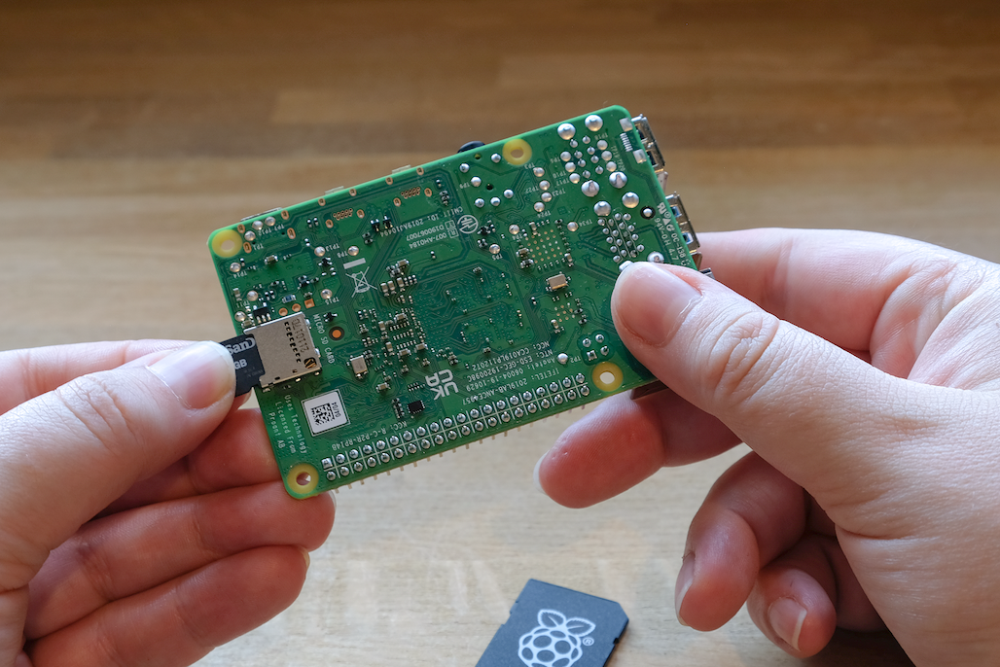

#### 推荐的存储卡

我们建议，用于安装树莓派系统（Raspberry Pi OS）的存储卡，存储容量至少为 32GB［对于精简版树莓派系统（Raspberry Pi OS Lite），建议至少为 16GB］。你可以使用任意容量不大于 2TB 的存储卡。由于 MBR 的限制，目前不支持容量大于 2TB 的存储卡。同所有其他启动介质一样，读写速度更快的存储卡性能也更佳。

受硬件限制，以下设备仅可从 256GB（及更小）的启动分区上启动：

* 树莓派 Zero
* 树莓派 1
* 基于 BCM2836 SoC 的早期树莓派 2 

其他操作系统需求可能各异。请查阅你使用的操作系统文档来了解容量需求。

### 键盘

你可以使用树莓派上的任一 USB 接口来连接[有线键盘](https://www.raspberrypi.com/products/raspberry-pi-keyboard-and-hub/)和 USB 蓝牙接收器。

### 鼠标

你可以使用树莓派上的任一 USB 接口来连接[有线鼠标](https://www.raspberrypi.com/products/raspberry-pi-mouse/)和 USB 蓝牙接收器。

### 显示器

树莓派支持以下显示输出功能：

| 型号                    | 显示输出                                             |
| :-------------------------: | :------------------------------------------------------: |
| 树莓派 5                | micro HDMI ×2                                       |
| 树莓派 4（所有系列）    | micro HDMI ×2，可使用 3.5 mm [TRRS 插孔](http://en.wikipedia.org/wiki/Phone_connector_(audio)#TRRS_standards)进行音频和复合视频输出 |
| 树莓派 3（所有系列）    | HDMI，可使用 3.5 mm [TRRS 插孔](http://en.wikipedia.org/wiki/Phone_connector_(audio)#TRRS_standards)进行音频和复合视频输出          |
| 树莓派 2 (所有系列)     | 可使用 3.5 mm [TRRS 插孔](http://en.wikipedia.org/wiki/Phone_connector_(audio)#TRRS_standards)进行 HDMI、音频和复合视频输出     |
| 树莓派 1B+       | 可使用 3.5 mm [TRRS 插孔](http://en.wikipedia.org/wiki/Phone_connector_(audio)#TRRS_standards)进行 HDMI、音频和复合视频输出     |
| 树莓派 1A+          | 可使用 3.5 mm [TRRS 插孔](http://en.wikipedia.org/wiki/Phone_connector_(audio)#TRRS_standards)进行 HDMI、音频和复合视频输出     |
| 树莓派 Zero（所有系列） | mini HDMI                                            |

>**注意**
>
>所有型号的树莓派均不支持 Type-C 视频传输（DisplayPort alt mode）。

如果你的树莓派有多个 HDMI 端口，请把主显示器插入到标有 `HDMI0` 的那个口。

常见的显示器都不支持 micro HDMI，亦不支持 mini HDMI。但是，你可以用 [micro-HDMI-to-HDMI 转换线](https://www.raspberrypi.com/products/micro-hdmi-to-standard-hdmi-a-cable/) 和 [mini-HDMI-to-HDMI 转换线](https://www.raspberrypi.com/products/standard-hdmi-a-male-to-mini-hdmi-c-male-cable/)来把树莓派上的这些接口转接至 HDMI 显示器。如果显示器不支持 HDMI，请考虑用转换器把 HDMI 输出转为该设备所支持的类型。

### 音频

所有型号的树莓派都能通过 HDMI、micro HDMI 或 mini HDMI 进行音频输出，且都支持通过 USB 进行音频输出。所有搭载了蓝牙的树莓派都支持蓝牙音频。所有基于树莓派 1、2、3 和 4 的型号都有一个 3.5 mm 的 [TRRS](http://en.wikipedia.org/wiki/Phone_connector_(audio)#TRRS_standards) AUX 耳机插孔，但可能需要用放大器才能得到足够大的音量输出。

### 网络

如下型号的树莓派配备了 WiFi 和蓝牙连接功能：

* 树莓派 5
* 树莓派 4
* 树莓派 3B+
* 树莓派 3
* 树莓派 Zero W
* 树莓派 Zero 2 W

后缀“B”代表带以太网接口的款式，“A”代表不带以太网接口。如果你的树莓派没有以太网接口，你还可以用 USB 转以太网转换器来连接有线互联网。

## 安装操作系统

如果你要使用树莓派，还需要操作系统。在默认情况下，树莓派会在卡槽里的存储卡中查找操作系统。

视你的树莓派型号而定，也许你还能用别的存储设备来启动操作系统，比如 USB 设备、网络存储和同扩展板接入的存储设备。

要让存储设备提供树莓派操作系统，你需要：

* 能把镜像写入到该存储设备的计算机
* 把你的存储设备接入该计算机的方法

大多数树莓派用户会选择使用存储卡作为他们的启动设备。

我们建议用树莓派启动盘制作工具来安装操作系统。

树莓派启动盘制作工具是一款能帮助你在 macOS、Windows 和 Linux 上下载和写入镜像的软件。启动盘制作工具包含了许多常见的树莓派操作系统镜像。它还能直接加载已下载的镜像，比如[树莓派](https://ubuntu.com/download/raspberry-pi)和第三方供应商（如 [Ubuntu](https://ubuntu.com/download/raspberry-pi)）。你可以用它预配置树莓派的凭据，设定远程访问。

启动盘制作工具亦兼容打包成 `.img` 格式的镜像，以及像 `.zip` 这样的压缩文件。

如果你没有能把镜像写入到存储设备的计算机，你可以通过互联网直接在你的树莓派上安装操作系统。

### 树莓派启动盘制作工具的使用方法

你可以通过如下方式安装树莓派启动盘制作工具：

* 在树莓派官网 [raspberrypi.com/software](https://www.raspberrypi.com/software/) 上下载运行最新版本的安装程序。
* 在终端里用包管理器安装，如 `sudo apt install rpi-imager`。

在树莓派启动盘制作工具安装完成后，单击启动盘制作工具的图标（或执行 `rpi-imager`）即可启动应用程序。

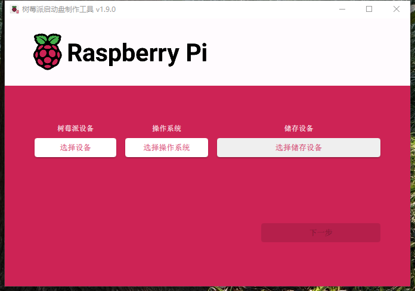

单击“**选择设备（Choose device）**”，然后从列表中选定你的树莓派型号。

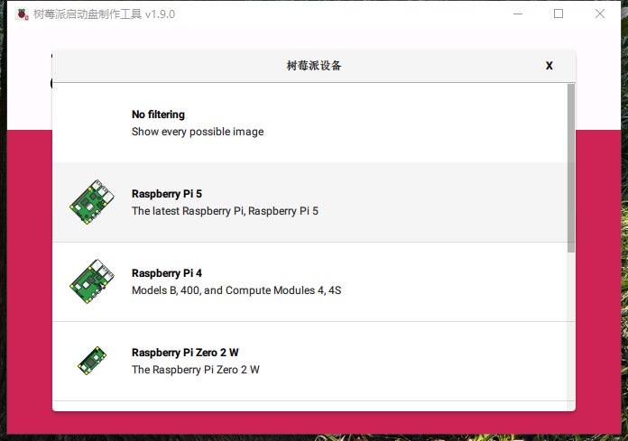

接下来，单击“**选择操作系统（Choose OS）**”，然后选定要安装的操作系统。树莓派启动盘制作工具将始终在列表顶部显示树莓派系统（Raspberry Pi OS），且是适用于你树莓派型号的推荐版本。

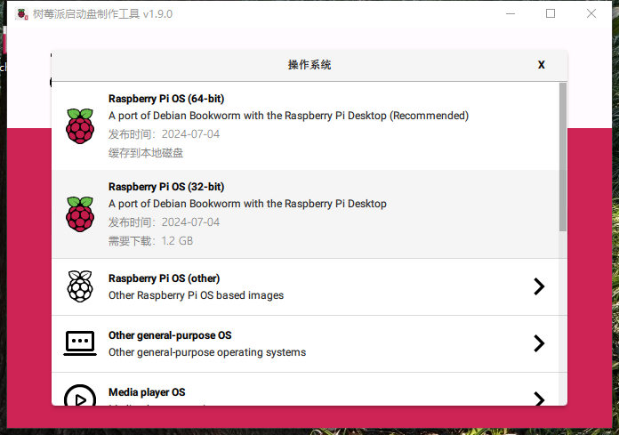

将所选存储设备接入计算机。若使用外部/内置存储卡读卡器，请先插入存储卡。然后，单击“**选择存储设备（Choose storage）**”，选择你的存储设备。

>**警告**
>
>如果你的计算机接入了多款存储设备，**请务必选择正确的那款设备！** 通常可以用大小来识别存储设备。如不确定，请断开其他设备，直到能确定要写入镜像的存储设备。

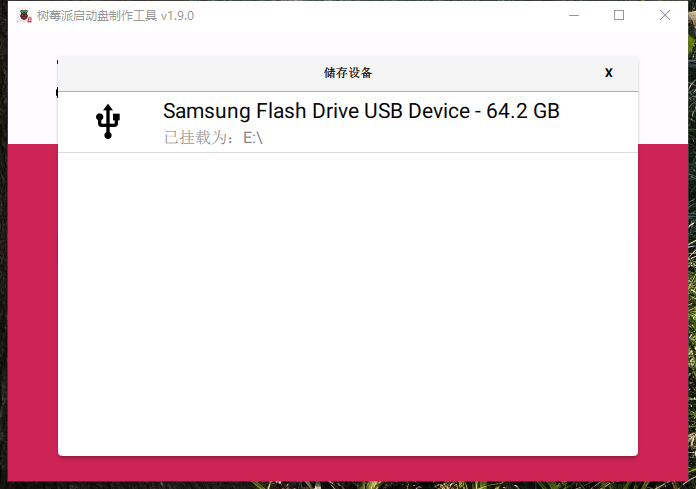

接下来，点击“**下一步（Next）**。

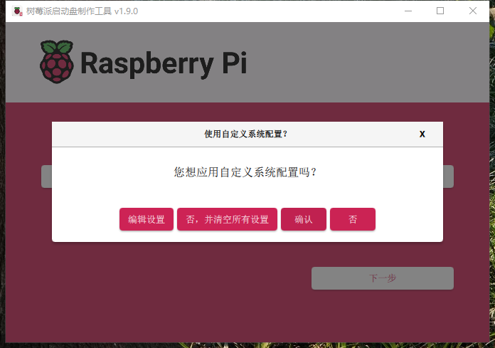

在弹出窗口中，树莓派启动盘制作工具会要求你应用操作系统设置。我们强烈建议使用自定义系统配置来设定你的树莓派。单击“编辑设置（Edit Settings）”按钮可打开自定义系统配置（ OS customisation）。

如果你没有用自定义系统配置这个功能来设定你的树莓派，在首次启动时，树莓派系统会在配置向导中，要求你再次提供相同内容。你可以单击选项“否（No）”来跳过自定义系统配置。

#### 操作系统定制

操作系统定制菜单能让你在首次开机之前，设定你的树莓派。你可以预先配置：

* 用户名和密码
* WiFi 凭据
* 设备主机名
* 时区
* 键盘布局
* 远程连接

在你首次打开菜单自定义系统配置时，你也许会看到一个提示，询问你是否允许从计算机加载 WiFi 凭据。如果你回答“确认”，启动盘制作工具将从你当前连接的网络预填 Wi-Fi 凭据。如果你回答“否”，你可手动输入 WiFi 凭据。

选项 **主机名（hostname）** 设定了你的树莓派在网络上广播的主机名（使用 [mDNS](https://en.wikipedia.org/wiki/Multicast_DNS)）。当你把树莓派接入网络后，网络上的其他设备就可以使用 `<你的主机名>.local` 或 `<你的主机名>.lan` 与你的树莓派进行通信。

选项 **用户名（username）和密码（password）** 设定了树莓派上管理员用户账户的用户名和密码。

选项 **无线局域网（wireless LAN）** 能让你输入无线网络的 SSID（网络名称）和密码。如果你的网络未公开广播 SSID，则应启用“隐藏 SSID”设置。在默认情况下，制作工具会使用你当前所在的地区作为“无线局域网地区”。该设置控制着树莓派使用的 WiFi 广播频率。如果你打算运行无头树莓派，请为无线局域网这个参数输入凭据。

选项 **本地化设置（ locale settings）** 能为你的树莓派设定时区和默认键盘布局。

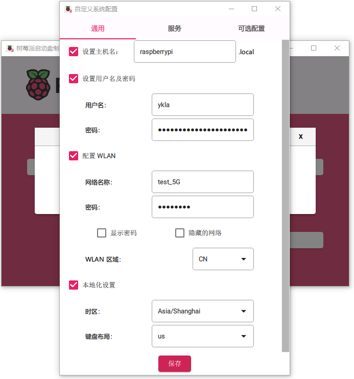

菜单 **服务（Services）** 涉及了帮助你远程连接到树莓派的配置。

如果你打算用网络远程使用你的树莓派，请勾选“启用 SSH（Enable SSH）”旁边的方框。或者说，如果你想要不靠显示器直接运行树莓派，请启用该功能。

* 选择选项 **密码验证（password authentication）** ，可使用你在自定义系统配置的通用选项卡中提供的用户名和密码通过网络 SSH 连接到你的树莓派。
* 选择 **仅允许公钥验证（Allow public-key authentication only ）**，可为你的树莓派预配置无密码，仅公钥的 SSH 验证，默认会使用你当前计算机上的私钥。如果你的 SSH 配置中已经有 RSA 密钥，制作工具将使用该公钥。如果没有，你可单击“**运行 SSH-keygen（Run SSH-keygen）**”来生成公私钥对。制作工具会使用新生成的公钥。

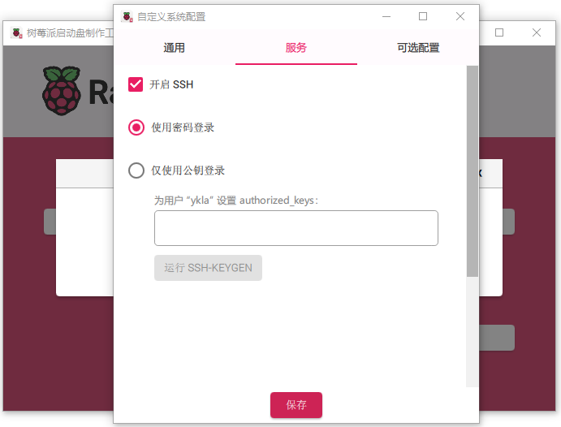

自定义系统配置还有“**可选配置（Options）**”这个菜单，能让你在写入过程中配置制作工具的操作。这些参数能让你在制作工具完成镜像校验时播放声音、在校验后自动卸载存储介质和禁用遥测。

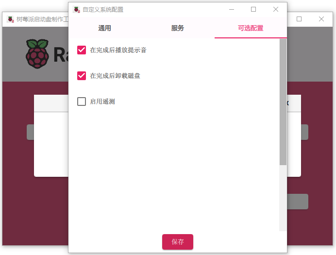

#### 写入

当你完成输入系统定制设置后，可单击“**保存（Save）**”来保存你的定制选项。

然后，在将镜像写入存储设备时，可单击“**确认（Yes）**”应用自定义系统配置。

最后，回答弹出窗口“你确定要继续吗？（`Are you sure you want to continue?`）”中的“**确认（Yes）**”，开始向存储设备写入数据。

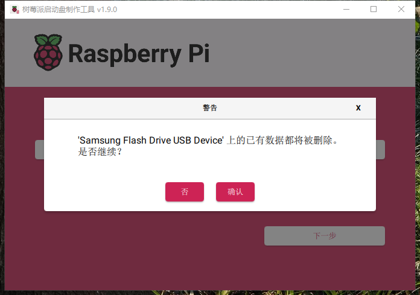

如果看到要求管理员权限以读取和写入存储介质的提示，要继续，请授予制作工具权限。

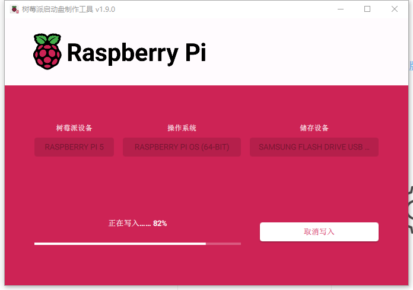

>这可能需要几分钟。去喝杯咖啡，散散步吧。

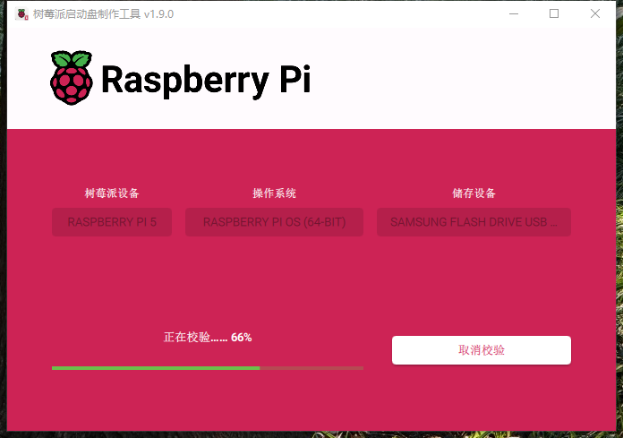

>如果你想要找刺激，可以点击 **取消校验（cancel verify）** 来跳过校验这个过程。

当你看到弹出窗口“写入成功”时，表示镜像已完全写入和验证。现在你可以从存储设备启动树莓派了！

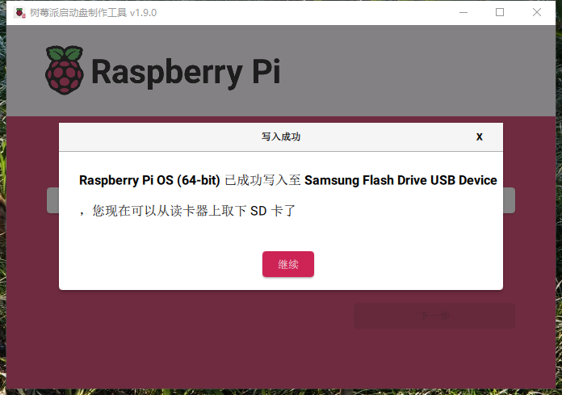

接下来，继续进行[首次启动配置说明](https://www.raspberrypi.com/documentation/computers/getting-started.html#configuration-on-first-boot)，让你的树莓派跑起来。

### 网络安装

网络安装能让树莓派使用制作工具通过网络下载的镜像（存储在设备上）进行操作系统的安装。使用网络安装，你可以在树莓派上安装操作系统，而无需存储卡读卡器，也不需要除树莓派之外的计算机。你可以在所有受支持的存储设备上运行网络安装——如存储卡和 USB 存储设备。

网络安装仅适用于树莓派 4、400、5。如果你的树莓派的引导加载程序比较旧，你可能需要[更新引导加载程序](https://www.raspberrypi.com/documentation/computers/raspberry-pi.html#bootloader_update_stable)才能使用网络安装。

网络安装须满足以下条件：

* 树莓派型号受支持且固件支持网络安装
* 显示器
* 键盘
* 有线网络连接

要启动网络安装，请在以下配置的基础上，按住 ***SHIFT 键盘***，同时接通你的树莓派电源：

* 存储设备未写入镜像
* 已接入键盘
* 已接入兼容的存储设备，如存储卡、USB 存储设备

如果你尚未将树莓派连接到互联网，请使用网线进行连接。

连接到互联网后，你的树莓派会下载树莓派的安装程序。若下载失败，你可以重复该过程，再试一次。

在树莓派启动盘制作工具下载完成后，你的树莓派会自动运行启动盘制作工具。有关运行启动盘制作工具的更多信息，请参阅[安装操作系统](https://www.raspberrypi.com/documentation/computers/getting-started.html#installing-the-operating-system)。

有关网络安装配置的更多信息，请参阅 [HTTP 引导](https://www.raspberrypi.com/documentation/computers/raspberry-pi.html#http-boot)。

## 设置你的树莓派

在操作系统镜像写入完成后，把存储设备接入你的树莓派。

首先，拔掉树莓派的电源适配器插头，确保在连接外部设备时，树莓派已关机。如果你在存储卡上安装了操作系统，现在就可以把存储卡插入树莓派的卡槽。如果你在其他存储设备上安装了操作系统，现在就可以将它接入树莓派了。

然后，插入所需的其他外部设备，如鼠标、键盘和显示器。

最后，把电源接入你的树莓派。当你的树莓派开机时，你将看到 LED 状态灯亮起。如果你的树莓派接入了显示器，你在几分钟后就能看到启动屏幕。

## 首次启动配置

如果你在启动盘制作工具中使用了系统自定义来预配置你的树莓派，**恭喜你！** 你的设备已经准备就绪。可继续[下一步](https://www.raspberrypi.com/documentation/computers/getting-started.html#next-steps)，了解如何充分发挥你的树莓派。

若你的树莓派在 5 分钟后仍无法启动，请检查 LED 状态灯。如果 LED 灯闪烁，请查看 [LED 警告指示灯](https://www.raspberrypi.com/documentation/computers/configuration.html#led-warning-flash-codes)以获取更多信息。如果你的树莓派无法启动，可尝试以下解决方案：

* 如果你的启动设备不是存储卡，请先试试用存储卡启动
* [为你的存储卡重新写入镜像](https://www.raspberrypi.com/documentation/computers/getting-started.html#installing-the-operating-system); 确保在启动盘制作工具中完成了完整的校验步骤
* [更新你树莓派上的引导加载程序](https://www.raspberrypi.com/documentation/computers/raspberry-pi.html#bootloader_update_stable)，然后[再次为你的存储卡再次镜像](https://www.raspberrypi.com/documentation/computers/getting-started.html#installing-the-operating-system)

如果你在启动盘制作工具中选择跳过了系统定制，则你的树莓派会在首次启动时运行配置向导。你需要显示器和键盘（没有鼠标也能完成）来设置向导。

### 蓝牙

如果你正在使用蓝牙键盘、蓝牙鼠标，此步骤将指引你完成设备配对。你的树莓派将扫描可配对的设备，然后连接至第一个扫描到的设备。

此过程适用于内置/外置 USB 蓝牙适配器。如果你使用 USB 适配器，请在启动树莓派前插入。

### 语言环境

此页面可帮助你配置区域、语言、时区和键盘布局。

### 用户

此页面可帮助你配置默认用户账户的用户名和密码。

在默认情况下，旧版树莓派系统会把用户名设置成“pi”。如果你使用的用户名是“pi”，请不要使用旧系统中的默认密码——“raspberry”，来确保你树莓派的安全性。

### 无线网络

该页面能帮助你连接到 WiFi 网络。从列表中选择你需要的网络。

如果你的网络需要密码验证，你可以在这里输入。

### 浏览器

此页面能让你选择：把默认的互联网浏览器设定为 Firefox（火狐浏览器）或者 Chromium（开源的 Chrome）。对于那个你未设置成默认的浏览器，你可以选择卸载。

### 软件更新

当你的树莓派接入互联网后，此页面能帮你把操作系统和软件更新到最新版本。在软件更新过程中，向导会删除非默认浏览器（如果你在默认浏览器这一步选择卸载它）。可能需要几分钟时间才能完成更新。

当你看到弹出窗口指示系统已经更新，请点击“**确定（OK）**”继续下一步。

### 完成

在配置向导结束后，点击“**重启（Restart）**”来重启你的树莓派。你的树莓派将应用个性化并启动至桌面。

## 下一步
 

树莓派已经设定且准备就绪，接下来做什么？

### 软件推荐

树莓派操作系统预装了许多基本应用程序，因此可开箱即用。如果你想使用那些我们认为有用的软件，请单击屏幕左上角的树莓派图标。选择 **首选项（Preferences）** > **推荐软件（Recommended Software）**，你将找到软件包管理器。你可以在那免费安装各种推荐软件。

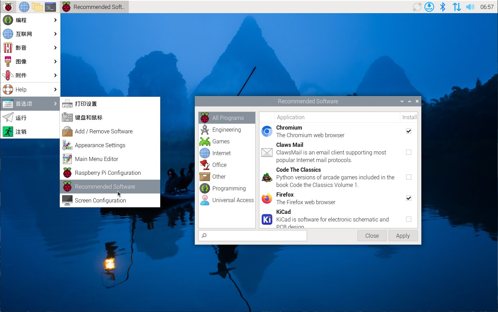

具体来说，如果你打算把树莓派当家用电脑用，你可能会需要 LibreOffice，它对于撰写和编辑文档和电子表格极有用。你还可以使用诸如屏幕放大器和 Orca 屏幕阅读器之类的工具，来让树莓派更易于使用，这些应用程序在通用访问里。

### 教程

[我们的教程](https://www.raspberrypi.com/tutorials/)向你介绍了各种有关你新树莓派使用的方法。你可以跟随那些让你感兴趣的教程，来学习编程、控制外部设备，创建令人激动的新项目。

### 支持

对于树莓派官方产品的支持，与其他树莓派用户交流，请访问[树莓派论坛](https://forums.raspberrypi.com/?_gl=1*j1etrl*_ga*ODAwMTM3MTg4LjE3MTc1NzY1NTQ.*_ga_22FD70LWDS*MTcyMDY5NTU5OC4xOC4wLjE3MjA2OTU1OTguMC4wLjA.)。

### 进一步阅读

你可以在由 Gareth Halfacree 撰写的最新版《[树莓派官方初学者指南](https://store.rpipress.cc/collections/latest-releases/products/the-official-raspberry-pi-beginners-guide-5th-edition)》中找到有关树莓派入门使用的更多信息。

可学习如何：

* 配置你的树莓派，为其安装操作系统，并开始使用这台功能齐全的计算机。
* 使用编程语言 Scratch 3、Python 和 MicroPython，通过逐步指南开始编程项目。
* 尝试连接电子元件，乐在其中，创造令人惊叹的项目。

第五版的新增内容：

* 针对最新的树莓派计算机进行更新：树莓派 5 和树莓派 Zero 2 W。
* 涉及最新的树莓派系统。
* 涉及树莓派 Pico 的新章节！

你可以在树莓派出版社的网站上[购买这本书](https://store.rpipress.cc/products/the-official-raspberry-pi-beginners-guide-5th-edition)。
