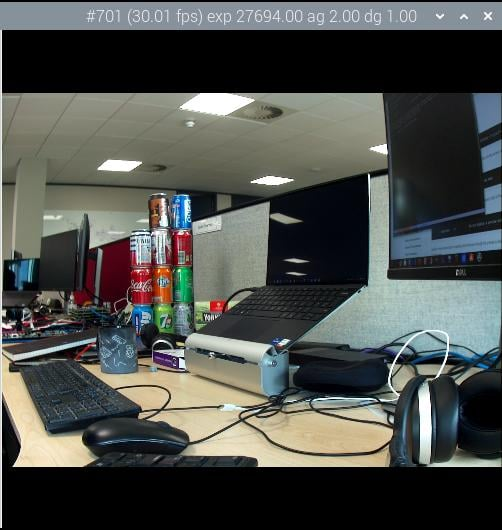
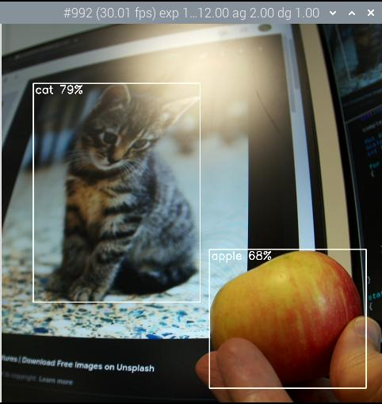
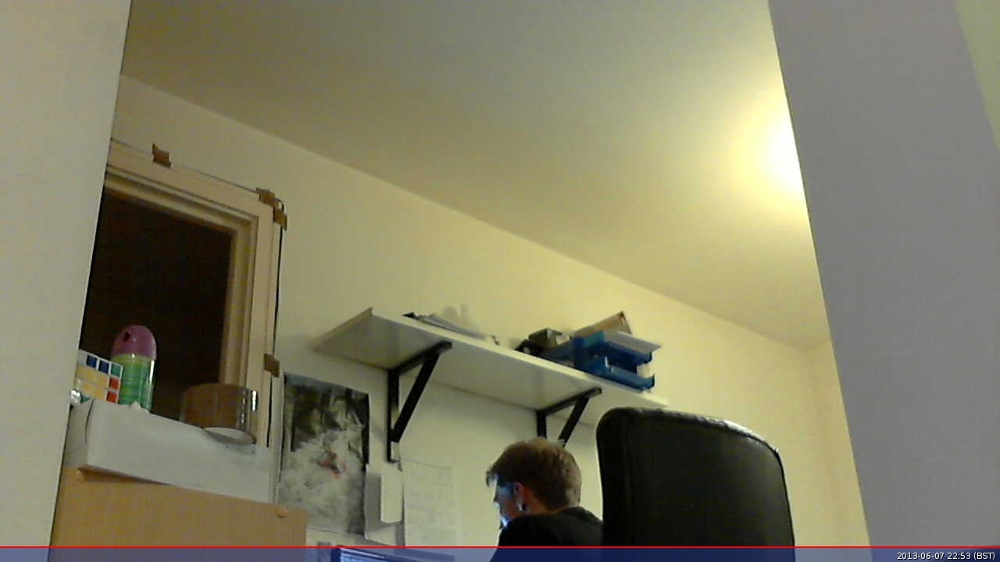

# 摄像头软件

本文档说明了如何使用我们的软件工具与支持的摄像头模块。所有树莓派摄像头都可以使用我们的软件工具录制高分辨率照片和全高清 1080p 视频（或更高）。

树莓派生产了几款官方摄像头模块，包括：

* 最早的 500 万像素摄像头模块 1（已停产）
* 配备 8 百万像素相机模块 2，带或不带红外滤光片
* 配备 12 百万像素相机模块 3，带标准和广角镜头，带或不带红外滤光片
* 配备 12 百万像素高质量相机，CS 和 M12 安装变种，可用于外部镜头
* 用于快速运动摄影的 160 万像素全局快门相机

有关摄像头硬件的更多信息，请参阅摄像头硬件文档。

首先安装您的摄像头模块。然后，按照本部分的指南使用您的摄像头模块。

## `rpicam-apps`

>**注意**
>
>Raspberry Pi OS Bookworm 将相机捕获应用程序从 `libcamera-*` 重命名为 `rpicam-*` 。符号链接允许用户暂时使用旧名称。请尽快采用新的应用程序名称。之前旧版的 Raspberry Pi OS 仍然使用 `libcamera-*` 这个名称。 

树莓派提供了一小组示例 rpicam-apps 。这些 CLI 应用程序是建立在 libcamera 之上的，从相机捕获图像和视频。这些应用程序包括：

* rpicam-hello ：相机的“hello world”版本，启动相机预览流并在屏幕上显示它。
* rpicam-jpeg ：运行预览窗口，然后捕获高分辨率静止图像。
* rpicam-still ：模拟原始 raspistill 应用程序的许多功能。
* rpicam-vid ：捕获视频。
* rpicam-raw ：直接从传感器捕获原始（未经处理的 Bayer）帧。
* rpicam-detect ：默认情况下未构建，但如果用户在其树莓派上安装了 TensorFlow Lite，则可以构建它。当检测到特定对象时捕获 JPEG 图像。

Raspberry Pi OS 的最新版本包括五种基本 rpicam-apps ，因此即使在全新的 Raspberry Pi OS 安装上，您也可以使用摄像头记录图像和视频。

用户可以创建自己的基于 rpicam 的应用程序，具有定制功能，以满足自己的需求。该 rpicam-apps 源代码在 BSD-2-Clause 许可下免费提供。

### `libcamera`

libcamera 是一个开源软件库，旨在直接从 Arm 处理器上的 Linux 操作系统支持相机系统。在 Broadcom GPU 上运行的专有代码被最小化。有关 libcamera 的更多信息，请参阅 libcamera 网站。

libcamera 提供了一个 C++ API，用于配置相机，然后允许应用程序请求图像帧。这些图像缓冲区驻留在系统内存中，并可以直接传递给静态图像编码器（如 JPEG）或视频编码器（如 H.264）。 libcamera 不会对图像进行编码或显示：要使用该功能，请使用 rpicam-apps 。

您可以在官方 libcamera 存储库中找到源代码。Raspberry Pi OS 发行版使用分支控制更新。

在 libcamera 核心下，我们提供了一个自定义的流水线处理程序。 libcamera 使用这一层来驱动树莓派上的传感器和图像信号处理器（ISP）。 libcamera 包含了一系列图像处理算法（IPAs），包括自动曝光/增益控制（AEC/AGC）、自动白平衡（AWB）和自动镜头阴影校正（ALSC）。

树莓派的 libcamera 实现支持以下摄像头：

* 官方摄像头:
  * OV5647 (V1)
  * IMX219 (V2)
  * IMX477（HQ）
  * IMX296（GS）
  * IMX708（V3）
* 第三方传感器:
  * IMX290
  * IMX327
  * IMX378
  * OV9281

要增加对新传感器的支持，请贡献至 libcamera 。

### `rpicam-hello`

rpicam-hello 简要显示包含来自连接摄像头的视频源的预览窗口。要使用 rpicam-hello 在终端中显示五秒钟的预览窗口，请运行以下命令：

```
$ rpicam-hello
```

您可以使用 timeout 选项传递可选的持续时间（以毫秒为单位）。值为 0 会无限期运行预览：

```
$ rpicam-hello --timeout 0
```

在终端中使用 Ctrl+C 或在预览窗口上使用关闭按钮停止 rpicam-hello 。

#### 显示图像传感器预览

大多数 rpicam-apps 在窗口中显示预览图像。如果没有活动的桌面环境，则预览直接使用 Linux Direct Rendering Manager (DRM)绘制到显示器。否则， rpicam-apps 尝试使用桌面环境。这两种路径都使用零拷贝 GPU 缓冲区共享：结果是不支持 X 转发。

如果您运行 X 窗口服务器并希望使用 X 转发，请传递 qt-preview 标志以在 Qt 窗口中渲染预览窗口。Qt 预览窗口比其他替代方案使用更多资源。

>**注意**
>
>使用 Gtk2 的旧版系统在与 OpenCV 链接时，可能会产生 Glib-GObject 错误，并且无法显示 Qt 预览窗口。在这种情况下，请以 root 身份编辑文件 /etc/xdg/qt5ct/qt5ct.conf ，并将包含 style=gtk2 的行替换为 style=gtk3 。 
要完全禁止预览窗口，请使用 nopreview 参数：

```
$ rpicam-hello -n
```

info-text 选项使用 `%` 指令在窗口标题栏上显示图像信息。例如，以下命令显示当前的红色和蓝色增益值：

```
$ rpicam-hello --info-text "red gain %rg, blue gain %bg"
```

要查看指令的完整列表，请参阅 info-text 参考。

### `rpicam-jpeg`

rpicam-jpeg 帮助您在树莓派设备上捕获图像。

要捕获全分辨率 JPEG 图像并将其保存为名为 test.jpg 的文件，请运行以下命令：

```
$ rpicam-jpeg --output test.jpg
```

您应该在五秒钟内看到预览窗口。然后， rpicam-jpeg 捕获全分辨率 JPEG 图像并保存。

使用 timeout 选项来更改预览窗口的显示时间。 width 和 height 选项更改保存图像的分辨率。例如，以下命令显示预览窗口 2 秒，然后捕获并保存分辨率为 640×480 像素的图像：

```
$ rpicam-jpeg --output test.jpg --timeout 2000 --width 640 --height 480
```

### `rpicam-still`

rpicam-still ，就像 rpicam-jpeg 一样，帮助您在树莓派设备上捕获图像。与 rpicam-jpeg 不同， rpicam-still 支持旧版应用程序中提供的许多选项。

要捕获全分辨率的 JPEG 图像并将其保存到名为 test.jpg 的文件中，请运行以下命令：

```
$ rpicam-still --output test.jpg
```

#### 编码器

rpicam-still 可以以多种格式保存图像，包括 png ， bmp ，以及 RGB 和 YUV 二进制像素转储。要读取这些二进制转储，任何读取文件的应用程序都必须了解像素排列。

使用 encoding 选项指定输出格式。传递给 output 的文件名不会影响输出文件类型。

要捕获全分辨率的 PNG 图像并将其保存到名为 test.png 的文件中，请运行以下命令：

```
$ rpicam-still --encoding png --output test.png
```

要了解有关指定图像格式的更多信息，请参阅 encoding 选项参考。

#### 捕获原始图像

原始图像是由图像传感器直接产生的图像，在图像信号处理器（ISP）或 CPU 对其进行任何处理之前。彩色图像传感器通常使用 Bayer 格式。使用 raw 选项来捕获原始图像。

要捕获图像，将其保存到名为 test.jpg 的文件中，并将图像的原始版本保存到名为 test.dng 的文件中，请运行以下命令：

```
$ rpicam-still --raw --output test.jpg
```

rpicam-still 以 DNG（Adobe 数字负片）格式保存原始图像。要确定原始图像的文件名， rpicam-still 使用与输出文件相同的名称，将扩展名更改为 .dng 。要处理 DNG 图像，请使用类似 Dcraw 或 RawTherapee 的应用程序。

DNG 文件包含有关图像捕获的元数据，包括黑电平、白平衡信息以及 ISP 用于生成 JPEG 的色彩矩阵。使用 ExifTool 查看 DNG 元数据。以下输出显示了通过使用 HQ 相机捕获的原始图像中存储的典型元数据：

```
File Name                       : test.dng
Directory                       : .
File Size                       : 24 MB
File Modification Date/Time     : 2021:08:17 16:36:18+01:00
File Access Date/Time           : 2021:08:17 16:36:18+01:00
File Inode Change Date/Time     : 2021:08:17 16:36:18+01:00
File Permissions                : rw-r--r--
File Type                       : DNG
File Type Extension             : dng
MIME Type                       : image/x-adobe-dng
Exif Byte Order                 : Little-endian (Intel, II)
Make                            : Raspberry Pi
Camera Model Name               : /base/soc/i2c0mux/i2c@1/imx477@1a
Orientation                     : Horizontal (normal)
Software                        : rpicam-still
Subfile Type                    : Full-resolution Image
Image Width                     : 4056
Image Height                    : 3040
Bits Per Sample                 : 16
Compression                     : Uncompressed
Photometric Interpretation      : Color Filter Array
Samples Per Pixel               : 1
Planar Configuration            : Chunky
CFA Repeat Pattern Dim          : 2 2
CFA Pattern 2                   : 2 1 1 0
Black Level Repeat Dim          : 2 2
Black Level                     : 256 256 256 256
White Level                     : 4095
DNG Version                     : 1.1.0.0
DNG Backward Version            : 1.0.0.0
Unique Camera Model             : /base/soc/i2c0mux/i2c@1/imx477@1a
Color Matrix 1                  : 0.8545269369 -0.2382823821 -0.09044229197 -0.1890484985 1.063961506 0.1062747385 -0.01334283455 0.1440163847 0.2593136724
As Shot Neutral                 : 0.4754476844 1 0.413686484
Calibration Illuminant 1        : D65
Strip Offsets                   : 0
Strip Byte Counts               : 0
Exposure Time                   : 1/20
ISO                             : 400
CFA Pattern                     : [Blue,Green][Green,Red]
Image Size                      : 4056x3040
Megapixels                      : 12.3
Shutter Speed                   : 1/20
```

要找到模拟增益，请将 ISO 数除以 100。自动白平衡（AWB）算法确定一个始终标记为 D65 的单个校准光源。

#### 拍摄长曝光照片

要拍摄非常长时间的曝光照片，请禁用自动曝光/增益控制（AEC/AGC）和自动白平衡（AWB）。否则，这些算法会强制用户等待一定数量的帧数，直到它们收敛。

要禁用这些算法，请为增益和 AWB 提供明确的值。因为长时间曝光本身就需要很多时间，通常最好完全跳过预览阶段，使用 immediate 选项。

运行以下命令执行 100 秒曝光捕捉：

```
$ rpicam-still -o long_exposure.jpg --shutter 100000000 --gain 1 --awbgains 1,1 --immediate
```

要查找官方树莓派相机的最大曝光时间，请参阅相机硬件规格。

#### 创建延时摄影视频

创建延时摄影视频，定期拍摄静止图像，例如每分钟一次，然后使用应用程序将图片拼接成视频。

##### 通过 rpicam-still 延时模式

要使用 rpicam-still 的内置延时模式，请使用 timelapse 选项。此选项接受一个值，表示您希望树莓派在捕获之间等待的时间间隔，单位为毫秒。

首先，创建一个目录，用于存储您的延时摄影照片：

```
$ mkdir timelapse
```

运行以下命令，创建一个 30 秒的延时摄影，每两秒记录一张照片，将输出保存到 image0001.jpg 至 image0014.jpg ：

```
$ rpicam-still --timeout 30000 --timelapse 2000 -o timelapse/image%04d.jpg
```

##### 通过 cron

您还可以使用 cron 自动化延时摄影。首先，创建脚本，命名为 timelapse.sh 包含以下命令。将 `<username>` 占位符替换为您的树莓派上的用户账户名称：

```
#!/bin/bash
DATE=$(date +"%Y-%m-%d_%H%M")
rpicam-still -o /home/<username>/timelapse/$DATE.jpg
```

然后，使脚本可执行：

```
$ chmod +x timelapse.sh
```

创建 timelapse 目录，您将在其中保存延时摄影图片：

```
$ mkdir timelapse
```

打开您的 crontab 进行编辑：

```
$ crontab -e
```

请您在编辑器中打开文件后，添加以下行以安排每分钟捕获图像，将 `<username>` 占位符替换为您的主用户账户的用户名：

```
* * * * * /home/<username>/timelapse.sh 2>&1
```

保存并退出，您应该看到此消息：

```
crontab: installing new crontab
```

>**技巧**
>
>停止录制图像以进行延时摄影，请再次运行 crontab -e 并从您的 crontab 中删除上述行。 

##### 拼接图像

如果您拥有一系列延时摄影照片，您可能希望将它们合并成视频。在树莓派上使用 ffmpeg 来完成这个操作。

 首先，安装 ffmpeg ：

```
$ sudo apt install ffmpeg
```

从包含 timelapse 目录的目录中运行以下命令，将您的 JPEG 文件转换为 mp4 视频：

```
$ ffmpeg -r 10 -f image2 -pattern_type glob -i 'timelapse/*.jpg' -s 1280x720 -vcodec libx264 timelapse.mp4
```

上述命令使用以下参数：

* -r 10 ：将帧率（Hz 值）设置为每秒十帧的输出视频
* -f image2 ：设置 ffmpeg 以从由模式指定的图像文件列表中读取
* -pattern_type glob ：使用通配符模式（globbing）来解释带有 -i 的文件名输入
* -i 'timelapse/*.jpg' ：指定要匹配 timelapse 目录中的 JPG 文件的输入文件
* -s 1280x720 ：缩放至 720p
* -vcodec libx264 使用软件 x264 编码器
* timelapse.mp4 输出视频文件的名称。

要了解有关 ffmpeg 选项的更多信息，请在终端中运行 ffmpeg --help 。

### `rpicam-vid`

rpicam-vid 帮助您在树莓派设备上捕获视频。 rpicam-vid 显示一个预览窗口并将编码比特流写入指定的输出。这会产生一个未打包的视频比特流，不包含任何容器（如 mp4 文件）格式。

>**注意**
>
>在可用时， rpicam-vid 使用硬件 H.264 编码。 

例如，以下命令将十秒钟的视频写入名为 test.h264 的文件：

```
$ rpicam-vid -t 10s -o test.h264
```

您可以使用 VLC 和其他视频播放器播放生成的文件：

```
$ vlc test.h264
```

在树莓派 5 上，您可以通过为输出文件指定 mp4 文件扩展名，直接输出到 MP4 容器格式：

```
$ rpicam-vid  -t 10s -o test.mp4
```

#### 编码器

rpicam-vid 支持运动 JPEG 以及未压缩和未格式化的 YUV420：

```
$ rpicam-vid -t 10000 --codec mjpeg -o test.mjpeg
```

```
$ rpicam-vid -t 10000 --codec yuv420 -o test.data
```

codec 选项决定输出格式，而不是输出文件的扩展名。

segment 选项将输出文件分成以毫秒为单位的段。这对于通过指定非常短的（1 毫秒）段来将运动 JPEG 流分解为单独的 JPEG 文件非常方便。例如，以下命令将 1 毫秒的段与输出文件名中的计数器结合起来，为每个段生成一个新的文件名：

```
$ rpicam-vid -t 10000 --codec mjpeg --segment 1 -o test%05d.jpeg
```

#### 捕获高帧率视频

为了减少高帧率（> 60fps）视频的帧丢失，请尝试以下配置调整：

* 使用 --level 4.2 将 H.264 目标级别设置为 4.2 。
* 通过将 denoise 选项设置为 cdn_off 来禁用软件颜色去噪处理。
* 使用 nopreview 禁用显示窗口，以释放一些额外的 CPU 循环。
* 在 /boot/firmware/config.txt 中设置 force_turbo=1 以确保在视频捕获过程中 CPU 时钟不会降频。有关更多信息，请参阅 force_turbo 文档。
* 使用 --width 1280 --height 720 或更低的分辨率调整 ISP 输出，以实现您的帧率目标。
* 在树莓派 4 上，您可以通过在 /boot/firmware/config.txt 中添加 gpu_freq=550 或更高的值来超频 GPU 以提高性能。有关更多详细信息，请参阅超频文档。

以下命令演示了如何实现 1280×720 120fps 视频：

```
$ rpicam-vid --level 4.2 --framerate 120 --width 1280 --height 720 --save-pts timestamp.pts -o video.264 -t 10000 --denoise cdn_off -n
```

#### rpicam-vid 与 libav 的集成

rpicam-vid 可以使用 ffmpeg / libav 编解码后端来对音频和视频流进行编码。您可以将这些流保存到文件，也可以通过网络进行流传输。当存在时， libav 使用硬件 H.264 视频编码。

要启用 libav 后端，请将 libav 传递给 codec 选项：

```
$ rpicam-vid --codec libav --libav-format avi --libav-audio --output example.avi
```

### `rpicam-raw`

rpicam-raw 直接从传感器以原始 Bayer 帧记录视频。它不显示预览窗口。要将两秒的原始剪辑记录到名为 test.raw 的文件中，请运行以下命令：

```
$ rpicam-raw -t 2000 -o test.raw
```

rpicam-raw 以原始帧的形式输出，没有任何格式信息，直接一个接一个。应用程序会在终端窗口打印像素格式和图像尺寸，以帮助用户解释像素数据。

默认情况下， rpicam-raw 将原始帧输出到单个、可能非常大的文件中。使用 segment 选项将每个原始帧定向到单独的文件，使用 %05d 指令使每个帧文件名唯一：

```
$ rpicam-raw -t 2000 --segment 1 -o test%05d.raw
```

使用快速存储设备， rpicam-raw 可以以 10fps 的速度将 18MB 1200 万像素 HQ 相机帧写入磁盘。 rpicam-raw 无法将输出帧格式化为 DNG 文件；要使用该功能，请使用 rpicam-still 。使用低于 10 的级别下的 framerate 选项以避免丢帧：

```
$ rpicam-raw -t 5000 --width 4056 --height 3040 -o test.raw --framerate 8
```

有关原始格式的更多信息，请参阅 mode 文档。

### `rpicam-detect`

>**注意**
>
>Raspberry Pi OS 不包括 rpicam-detect 。但是，如果您已安装了 TensorFlow Lite，可以编译 rpicam-detect 。有关更多信息，请参阅 rpicam-apps 编译说明。运行 cmake 时，请不要忘记参数 -DENABLE_TFLITE=1 。

rpicam-detect 显示一个预览窗口，并使用经过训练的 Google MobileNet v1 SSD（Single Shot Detector）神经网络监视内容，以识别大约 80 种对象类别，使用 Coco 数据集。 rpicam-detect 可以识别人、汽车、猫和许多其他对象。

每当 rpicam-detect 检测到目标物体时，它会拍摄全分辨率的 JPEG。然后返回监视预览模式。

查看 TensorFlow Lite 对象检测器部分，了解有关模型使用的一般信息。例如，您可以在离开时秘密监视您的猫。

```
$ rpicam-detect -t 0 -o cat%04d.jpg --lores-width 400 --lores-height 300 --post-process-file object_detect_tf.json --object cat
```

### 配置

大多数用例无需更改摄像头配置就可以自动工作。但是，一些常见用例确实需要进行配置调整，包括：

* 第三方摄像头（制造商的说明应解释必要的配置更改，如果有的话）
* 使用官方树莓派摄像头的非标准驱动程序或叠加物

Raspberry Pi OS 在 /boot/firmware/config.txt 中识别以下叠加层。

| Camera Module          | 在 /boot/firmware/config.txt                                                                                                                                        |
| ------------------------ | --------------------------------------------------------------------------------------------------------------------------------------------------------------------- |
| V1 相机 (OV5647)       | `dtoverlay=ov5647`                                                                                                                                                                    |
| V2 相机 (IMX219)       | `dtoverlay=imx219`                                                                                                                                                                    |
| HQ 相机 (IMX477)       | `dtoverlay=imx477`                                                                                                                                                                    |
| GS 相机（IMX296）      | `dtoverlay=imx296`                                                                                                                                                                    |
| 摄像头模块 3（IMX708） | `dtoverlay=imx708`                                                                                                                                                                    |
| IMX290 和 IMX327       | dtoverlay=imx290,clock-frequency=74250000 或 dtoverlay=imx290,clock-frequency=37125000 （两个模块共享 imx290 内核驱动程序；请参考模块供应商的说明以获取正确的频率） |
| IMX378                 | `dtoverlay=imx378`                                                                                                                                                                    |
| OV9281                 | `dtoverlay=ov9281`                                                                                                                                                                    |

要使用这些叠加层之一，您必须禁用自动摄像头检测。要禁用自动检测，请在 /boot/firmware/config.txt 中设置 camera_auto_detect=0 。如果 config.txt 已包含分配 camera_auto_detect 值的行，请将该值更改为 0 。使用 sudo reboot 重新启动您的树莓派以加载更改。

#### 使用调整文件调整摄像头行为

树莓派的 libcamera 实现包括每个摄像头的调整文件。该文件控制算法和硬件以产生最佳图像质量。 libcamera 只能确定正在使用的传感器，而不能确定模块。因此，一些模块需要调整文件覆盖。使用 tuning-file 选项指定覆盖。您还可以复制和修改现有的调整文件以定制摄像头行为。

例如，传感器的无红外滤光片（NoIR）版本使用与标准版本不同的自动白平衡（AWB）设置。在树莓派 5 或更高版本上，您可以使用以下命令为 IMX219 传感器指定 NoIR 调整文件：

```
$ rpicam-hello --tuning-file /usr/share/libcamera/ipa/rpi/pisp/imx219_noir.json
```

>**注意**
>
>旧版树莓派型号使用不同的调整文件。在这些设备上，请改用 /usr/share/libcamera/ipa/rpi/vc4/ 中存储的文件。 

libcamera 维护着多种摄像头的调整文件，包括第三方型号。例如，您可以在 se327m12.json 找到 Soho Enterprises SE327M12 的调整文件。

### 使用多个摄像头

rpicam-apps 对多个摄像头有基本支持。您可以通过以下方式将多个摄像头连接到树莓派：

* 对于树莓派计算模块，您可以直接连接两个摄像头到树莓派计算模块 I/O 板。有关详细信息，请参阅 Compute 模块文档。使用此方法，您可以同时使用两个摄像头。
* 对于树莓派 5，您可以使用双 MIPI 连接器直接将两个摄像头连接到板上。
* 对于带有摄像头端口的其他树莓派设备，您可以使用 Video Mux 板连接两个或更多摄像头，例如这种第三方产品。由于两个摄像头连接到单个 Unicam 端口，因此一次只能使用一个摄像头。

要列出平台上所有可用的摄像头，请使用 list-cameras 选项。要选择要使用的摄像头，请将摄像头索引传递给 camera 选项。

>**注意**
>
>libcamera 尚不支持立体摄像头。当同时运行两个摄像头时，它们必须在单独的进程中运行。这意味着它们之间没有同步传感器帧或 3A 操作的方法。作为解决方法，您可以通过外部同步信号同步摄像头，对于 HQ（IMX477）摄像头，如果需要，将 3A 切换到手动模式。 

### 安装 libcamera 和 rpicam-apps

树莓派提供两个 rpicam-apps 包：

* rpicam-apps 包含完整的应用程序，支持使用桌面环境进行预览。此软件包已预装在 Raspberry Pi OS 中。
* rpicam-apps-lite 不支持桌面环境，仅提供 DRM 预览。此软件包已预装在 Raspberry Pi OS Lite 中。

#### 依赖关系

rpicam-apps 依赖于名为 `library-name<n>` 的库包，其中 `<n>` 是 ABI 版本。您的软件包管理器应自动安装这些。

#### 开发包

您可以重新构建 rpicam-apps 而无需从头开始构建 libcamera 和 libepoxy 。有关更多信息，请参阅在不重新构建 libcamera 的情况下构建 rpicam-apps 。

## 使用 rpicam-apps 在网络上进行视频流传输

本节描述了从 rpicam-vid 进行本地流传输。您还可以使用 libav 后端进行网络流传输。

### UDP

使用以下命令在树莓派作为服务器上通过 UDP 流式传输视频，替换 `<ip-addr>` 占位符为客户端的 IP 地址或组播地址，并替换 `<port>` 占位符为您想要用于流式传输的端口：

```
$ rpicam-vid -t 0 --inline -o udp://<ip-addr>:<port>
```

使用以下命令在树莓派作为客户端上查看通过 UDP 流式传输的视频，替换 `<port>` 占位符为您想要从中流式传输的端口：

```
$ vlc udp://@:<port> :demux=h264
```

或者，在客户端上使用以下命令来使用 ffplay 进行流媒体传输：

```
$ ffplay udp://<ip-addr-of-server>:<port> -fflags nobuffer -flags low_delay -framedrop
```

### TCP

您还可以通过 TCP 进行视频流传输。要将树莓派用作服务器：

```
$ rpicam-vid -t 0 --inline --listen -o tcp://0.0.0.0:<port>
```

使用以下命令在树莓派作为客户端查看通过 TCP 流式传输的视频：

```
$ vlc tcp/h264://<ip-addr-of-server>:<port>
```

或者，在客户端使用以下命令以 30 帧每秒使用 ffplay 进行流式传输：

```
$ ffplay tcp://<ip-addr-of-server>:<port> -vf "setpts=N/30" -fflags nobuffer -flags low_delay -framedrop
```

### RTSP

使用以下命令将 VLC 用作服务器通过 RTSP 流式传输视频时，请使用树莓派：

```
$ rpicam-vid -t 0 --inline -o - | cvlc stream:///dev/stdin --sout '#rtp{sdp=rtsp://:8554/stream1}' :demux=h264
```

使用以下命令将 VLC 用作客户端查看通过 RTSP 流式传输的视频时，请使用树莓派：

```
$ ffplay rtsp://<ip-addr-of-server>:8554/stream1 -vf "setpts=N/30" -fflags nobuffer -flags low_delay -framedrop
```

或者，使用以下命令在客户端上使用 VLC 进行流式传输：

```
$ vlc rtsp://<ip-addr-of-server>:8554/stream1
```

在服务器上禁止预览窗口，请使用 nopreview 。

使用 inline 标志强制将流头信息注入每个帧内，这有助于客户端了解流，即使它们错过了开头。

### `libav`

您可以将 libav 后端用作音频/视频的网络流源。要使用树莓派作为服务器通过 TCP 流式传输视频，请使用以下命令，将 `<ip-addr>` 占位符替换为客户端的 IP 地址或组播地址，并将 `<port>` 占位符替换为要用于流式传输的端口：

```
$ rpicam-vid -t 0 --codec libav --libav-format mpegts --libav-audio -o "tcp://<ip-addr>:<port>?listen=1"
```

您可以使用类似的命令通过 UDP 进行流式传输：

```
$ rpicam-vid -t 0 --codec libav --libav-format mpegts --libav-audio  -o "udp://<ip-addr>:<port>"
```

### GStreamer

GStreamer 是用于读取、处理和播放多媒体文件的 Linux 框架。本节展示了如何使用 rpicam-vid 来通过网络进行视频流传输。

此设置使用 rpicam-vid 将编码的 h.264 比特流输出到标准输出。然后，我们使用 GStreamer fdsrc 元素接收比特流，并使用额外的 GStreamer 元素将其发送到网络上。在服务器上，运行以下命令以启动流，将 `<ip-addr>` 占位符替换为客户端的 IP 地址或组播地址，并将 `<port>` 占位符替换为用于流式传输的端口：

```
$ rpicam-vid -t 0 -n --inline -o - | gst-launch-1.0 fdsrc fd=0 ! udpsink host=<ip-addr> port=<port>
```

在客户端上，运行以下命令以接收流，将 <ip-addr> 占位符替换为客户端的 IP 地址或组播地址，并将 <port> 占位符替换为用于流式传输的端口：

```
$ gst-launch-1.0 udpsrc address=<ip-addr> port=<port> ! h264parse ! v4l2h264dec ! autovideosink
```

>**技巧**
>
>要测试此配置，请在同一设备的不同终端上运行服务器和客户端命令，使用 localhost 作为地址。 

#### RTP

要使用 RTP 进行流媒体传输，请在服务器上运行以下命令，将 `<ip-addr>` 占位符替换为客户端的 IP 地址或组播地址，并将 `<port>` 占位符替换为要用于流媒体传输的端口：

```
$ rpicam-vid -t 0 -n --inline -o - | gst-launch-1.0 fdsrc fd=0 ! h264parse ! rtph264pay ! udpsink host=<ip-addr> port=<port>
```

要接收 RTP，请在客户端上运行以下命令，将 `<ip-addr>` 占位符替换为客户端的 IP 地址或组播地址，并将 `<port>` 占位符替换为要用于流媒体传输的端口：

```
$ gst-launch-1.0 udpsrc address=<ip-addr> port=<port> caps=application/x-rtp ! rtph264depay ! h264parse ! v4l2h264dec ! autovideosink
```

如果客户端不是树莓派，则可能有不同的 GStreamer 元素可用。在运行 Linux 的 x86 设备上，您可能会运行以下命令：

```
$ gst-launch-1.0 udpsrc address=<ip-addr> port=<port> caps=application/x-rtp ! rtph264depay ! h264parse ! avdec_h264 ! autovideosink
```

#### libcamerasrc GStreamer 元素

libcamera 提供一个 libcamerasrc GStreamer 元素，可以直接替代 rpicam-vid 。要使用此元素，请在服务器上运行以下命令，将 `<ip-addr>` 占位符替换为客户端的 IP 地址或多播地址，并将 `<port>` 占位符替换为您希望用于流式传输的端口：

```
$ gst-launch-1.0 libcamerasrc ! capsfilter caps=video/x-raw,width=1280,height=720,format=NV12 ! v4l2convert ! v4l2h264enc extra-controls="controls,repeat_sequence_header=1" ! 'video/x-h264,level=(string)4.1' ! h264parse ! rtph264pay ! udpsink host=<ip-addr> port=<port>
```

在客户端上，我们使用与以前相同的播放管道。

## rpicam-apps 选项参考

### 常见选项

适用于所有具有相似或相同语义的 rpicam-apps 的以下选项，除非另有说明。

要将以下选项之一传递给应用程序，请在选项名称前加上 -- 。如果选项需要一个值，请在选项名称后立即传递该值，用单个空格分隔。如果值包含空格，请用引号括起来。

一些选项具有速记别名，例如 -h 可代替 --help 。使用这些速记别名代替完整的选项名称，以节省空间和时间，但牺牲可读性。

#### `help`

 别名： -h

打印完整的选项集，以及每个选项的简要概述。不接受值。

#### `version`

打印出 libcamera 和 rpicam-apps 的版本字符串。不接受值。

 示例输出：

```
rpicam-apps build: ca559f46a97a 27-09-2021 (14:10:24)
libcamera build: v0.0.0+3058-c29143f7
```

#### `list-cameras`

列出连接到您的树莓派的检测到的摄像头及其可用的传感器模式。不接受值。

传感器模式标识符具有以下形式： S<Bayer order><Bit-depth>_<Optional packing> : <Resolution list>

在传感器阵列中，即使在像素合并模式下，裁剪也以本机传感器像素指定为`(<x>, <y>)/<Width>×<Height>` 。`(x, y)` 指定了传感器阵列中尺寸为 width × height 的裁剪窗口的位置。

例如，以下输出显示有关索引为 0 处的 IMX219 传感器和索引为 1 处的 IMX477 传感器的信息：

```
Available cameras
-----------------
0 : imx219 [3280x2464] (/base/soc/i2c0mux/i2c@1/imx219@10)
    Modes: 'SRGGB10_CSI2P' : 640x480 [206.65 fps - (1000, 752)/1280x960 crop]
                             1640x1232 [41.85 fps - (0, 0)/3280x2464 crop]
                             1920x1080 [47.57 fps - (680, 692)/1920x1080 crop]
                             3280x2464 [21.19 fps - (0, 0)/3280x2464 crop]
           'SRGGB8' : 640x480 [206.65 fps - (1000, 752)/1280x960 crop]
                      1640x1232 [41.85 fps - (0, 0)/3280x2464 crop]
                      1920x1080 [47.57 fps - (680, 692)/1920x1080 crop]
                      3280x2464 [21.19 fps - (0, 0)/3280x2464 crop]
1 : imx477 [4056x3040] (/base/soc/i2c0mux/i2c@1/imx477@1a)
    Modes: 'SRGGB10_CSI2P' : 1332x990 [120.05 fps - (696, 528)/2664x1980 crop]
           'SRGGB12_CSI2P' : 2028x1080 [50.03 fps - (0, 440)/4056x2160 crop]
                             2028x1520 [40.01 fps - (0, 0)/4056x3040 crop]
                             4056x3040 [10.00 fps - (0, 0)/4056x3040 crop]
```

对于上述示例中的 IMX219 传感器：

* 所有模式都具有 RGGB Bayer 排序
* 所有模式在所列分辨率上提供 8 位或 10 位 CSI2 打包读出

#### `camera`

选择要使用的摄像头。指定从可用摄像头列表中的索引。

#### `config`

 别名： -c

指定包含 CLI 选项和值的文件。考虑一个名为 example_configuration.txt 的文件，其中包含以下文本，将选项和值指定为键值对，每行一个选项，只使用长（非别名）选项名称：

```
timeout=99000
verbose=
```

>**技巧**
>
>省略通常在命令行上传递的 `--` 开头。对于缺少值的标志，例如上面示例中的 verbose ，必须包含尾随 = 。 

然后，您可以运行以下命令来指定超时时间为 99000 毫秒并输出详细信息：

```
$ rpicam-hello --config example_configuration.txt
```

#### `timeout`

 别名： -t

默认值：5000 毫秒（5 秒）

指定应用程序在关闭之前运行的时间长度。这适用于视频录制和预览窗口。在捕获静态图像时，应用程序在捕获输出图像之前显示预览窗口 timeout 毫秒。

要无限期运行应用程序，请指定值 0 。

#### `preview`

 别名： -p

设置桌面或 DRM 预览窗口的位置（x，y 坐标）和大小（w，h 尺寸）。不影响从摄像头请求的图像的分辨率或宽高比。将图像大小缩放并将图像宽高比裁剪或填充以适应预览窗口。

以以下逗号分隔的形式传递预览窗口尺寸： `x,y,w,h`

 示例： rpicam-hello --preview 100,100,500,500



#### `fullscreen`

 别名： -f

强制预览窗口使用整个屏幕，无边框或标题栏。调整图像大小并在整个屏幕内按比例缩放图像纵横比以适应。不接受值。

#### `qt-preview`

使用 Qt 预览窗口，消耗的资源比其他选项多，但支持 X 窗口转发。与 fullscreen 标志不兼容。不接受值。

#### `nopreview`

 别名： -n

导致应用程序根本不显示预览窗口。不接受值。

#### `info-text`

 默认值： "`#%frame (%fps fps) exp %exp ag %ag dg %dg`"

将提供的字符串设置为在桌面环境中运行时预览窗口的标题。支持以下图像元数据替换：

| 指令 | 替换                                                          |
| ------ | --------------------------------------------------------------- |
| `%frame`     | 帧的序列号。                                                  |
| `%fps`     | 瞬时帧速率。                                                  |
| `%exp`     | 用于捕捉图像的快门速度，单位为微秒。                          |
| `%ag`     | 在传感器中应用的模拟增益。                                    |
| `%dg`     | 由 ISP 应用于图像的数字增益。                                 |
| `%rg`     | 应用于每个像素的红色分量的增益。                              |
| `%bg`     | 每个像素的蓝色分量增益。                                      |
| `%focus`     | 图像的焦点度量，较大的值表示图像更清晰。                      |
| `%lp`     | 以屈光度表示的当前镜头位置（1 / 米数）。                      |
| `%afstate`     | 自动对焦算法状态（ idle ， scanning ， focused 或 failed ）。 |


#### width 和 height

每个都接受一个定义为像素的捕获图像尺寸的单个数字。

对于 rpicam-still ， rpicam-jpeg 和 rpicam-vid ，指定输出分辨率。

对于 rpicam-raw ，指定原始帧分辨率。对于具有 2×2 倍频读出模式的相机，指定分辨率等于或小于倍频模式的捕获 2×2 倍频原始帧。

对于 rpicam-hello ，没有影响。

 示例：

* rpicam-vid -o test.h264 --width 1920 --height 1080 拍摄 1080p 视频。
* rpicam-still -r -o test.jpg --width 2028 --height 1520 拍摄 2028×1520 分辨率的 JPEG。如果与 HQ 相机一起使用，则使用 2×2 二次取样模式，因此原始文件（ test.dng ）包含 2028×1520 的原始 Bayer 图像。

#### viewfinder-width 和 viewfinder-height

每个都接受一个定义图像在预览窗口中显示的尺寸（以像素为单位）的单个数字。不影响预览窗口尺寸，因为图像会被调整大小以适应。不影响捕获的静止图像或视频。

#### `rawfull`

强制传感器以完整分辨率模式捕获图像，而不考虑请求的输出分辨率。因为较大的分辨率需要更多资源，这可能会对帧率产生负面影响。当与 HQ 相机一起使用时，每帧可能需要高达 18MB 的空间（与 2×2 合并模式中的 5MB 相比）。不接受值。

对于 rpicam-hello ，没有效果。

#### `mode`

允许您以以下以冒号分隔的格式指定相机模式： `<width>:<height>:<bit-depth>:<packing>` 。如果提供的值没有完全匹配项，系统将选择最接近的可用选项以用于传感器。您可以使用打包（ P ）或未打包（ U ）的打包格式。影响存储的视频和静止图像的格式，但不影响传递到预览窗口的帧的格式。

位深度和打包是可选的。位深度默认为 12。打包默认为 P （打包）。

有关传感器可用的位深度、分辨率和打包选项的信息，请参阅 list-cameras 。

 例子：

* 4056:3040:12:P - 4056×3040 分辨率，每像素 12 位，打包。
* 1632:1224:10 - 1632×1224 分辨率，每像素 10 位。
* 2592:1944:10:U - 2592×1944 分辨率，每像素 10 位，未压缩。
* 3264:2448 - 3264×2448 分辨率。

##### 打包格式详细信息

打包格式使用更少的存储空间来存储像素数据。

在树莓派 4 和早期设备上，打包格式使用 MIPI CSI-2 标准来打包像素。这意味着：

* 10 位相机模式将 4 个像素打包成 5 个字节。前 4 个字节包含每个像素的 8 个最高有效位（MSB），最后一个字节包含 4 对最低有效位（LSB）。
* 12 位相机模式将 2 个像素打包成 3 个字节。前 2 个字节包含每个像素的 8 个最高有效位（MSB），最后一个字节包含两个像素的 4 个最低有效位（LSB）。

在树莓派 5 及更高版本设备上，打包格式使用视觉无损压缩方案将像素值压缩为每像素 8 位（1 字节）。

##### 未打包格式详细信息

未打包格式提供的像素值更容易手动操作，但会以使用更多存储空间来存储像素数据为代价。

在所有设备上，未打包格式每像素使用 2 字节。

在树莓派 4 和早期设备上，应用程序在最高有效端应用零填充。在未打包格式中，来自 10 位相机模式的像素不能超过值 1023。

在树莓派 5 和更新设备上，应用程序在最低有效端应用零填充，因此图像使用传感器提供的像素深度的完整 16 位动态范围。

#### `viewfinder-mode`

与 mode 选项相同，但它适用于传递到预览窗口的数据。有关更多信息，请参阅 mode 文档。

#### lores-width 和 lores-height

从摄像头传送第二个、分辨率较低的图像流，缩小到指定的尺寸。

每个都接受一个定义较低分辨率流的像素尺寸的数字。

可用于预览和视频模式。不适用于静态捕获。如果您指定与正常分辨率流不同的宽高比，则会生成非方形像素。

对于 rpicam-vid ，禁用额外的色彩去噪处理。

与图像后处理结合使用时，用于图像分析。

#### `hflip`

水平翻转图像。不接受值。

#### `vflip`

垂直翻转图像。不接受值。

#### `rotation`

旋转从传感器提取的图像。仅接受值 0 或 180。

#### `roi`

从传感器的整个场景中裁剪图像。接受四个小数值，范围为 0 到 1，格式如下： `<x>,<y>,<w>,<h>`。这些值中的每一个代表可用宽度和高度的百分比，介于 0 和 1 之间的小数。

这些值定义了以下比例：

* `<x>` ：提取图像前要跳过的 X 坐标
* `<y>` ：提取图像前要跳过的 Y 坐标
* `<w>` ：要提取的图像宽度
* `<h>` ：要提取的图像高度

默认为 0,0,1,1 （从第一个 X 坐标和第一个 Y 坐标开始，使用图像宽度的 100％，使用图像高度的 100％）。

 示例：

* rpicam-hello --roi 0.25,0.25,0.5,0.5 从图像中心裁剪出总像素数量的一半（跳过 X 坐标的前 25％，跳过 Y 坐标的前 25％，使用总图像宽度的 50％，使用总图像高度的 50％）。
* rpicam-hello --roi 0,0,0.25,0.25 选择从图像左上角裁剪的像素总数的四分之一（跳过 X 坐标的前 0％，跳过 Y 坐标的前 0％，使用图像宽度的 25％，使用图像高度的 25％）。

#### `hdr`

 默认值： off

以 HDR 模式运行相机。如果未传递值，则假定 auto 。接受以下值之一：

* off - 禁用 HDR。
* auto - 在支持的设备上启用 HDR。如果可用，使用传感器的内置 HDR 模式。如果传感器缺乏内置 HDR 模式，则使用板载 HDR 模式（如果可用）。
* single-exp - 使用板载 HDR 模式（如果可用），即使传感器具有内置 HDR 模式。如果板载 HDR 模式不可用，则禁用 HDR。

树莓派 5 及更高版本设备具有内置的 HDR 模式。

要检查传感器中的内置 HDR 模式，请在 list-cameras 中添加此选项。

### 摄像头控制选项

控制图像处理和影响相机图像质量的算法的选项。

#### `sharpness`

设置图像锐度。接受以下光谱范围内的数值：

* 0.0 不应用锐化。
* 大于 0.0 的值，但小于 1.0 的值应用比默认锐化量少的值
* 1.0 应用默认锐化量
* 大于 1.0 的值应用额外的锐化

#### `contrast`

指定图像对比度。接受沿以下光谱的数值。

* 0.0 应用最小对比度
* 大于 0.0 但小于 1.0 的值应用少于默认对比度量。
* 1.0 应用默认对比度量
* 大于 1.0 的值会应用额外对比度

#### `brightness`

指定图像亮度，作为输出图像中所有像素的偏移量。接受以下光谱范围内的数值。

* -1.0 应用最低亮度（黑色）
* 0.0 应用标准亮度
* 1.0 应用最大亮度（白色）

对于许多用例，更喜欢 ev 。

#### `saturation`

指定图像的颜色饱和度。接受沿以下光谱的数值：

* 0.0 应用最小饱和度（灰度）
* 大于 0.0 但小于 1.0 的值应用比默认饱和度少的量
* 1.0 应用默认饱和度
* 大于 1.0 的值应用额外饱和度

#### `ev`

指定图像的曝光值（EV）补偿，以光圈为单位。接受一个数值，控制传递给自动曝光/增益控制（AEC/AGC）处理算法的目标值，沿以下光谱：

* -10.0 应用最小目标值
* 0.0 应用标准目标值
* 10.0 应用最大目标值

#### `shutter`

使用快门指定曝光时间（以微秒为单位）。在使用此选项时，增益仍可能变化。如果相机以太快的帧速率运行，不允许指定的曝光时间（例如，帧速率为 1fps，曝光时间为 10000 微秒），则传感器将使用帧速率允许的最大曝光时间。

有关官方相机的最小和最大快门时间列表，请参阅相机硬件文档。超过最大值的数值会导致未定义行为。

#### `gain`

 别名： --analoggain

设置组合模拟和数字增益。当传感器驱动程序可以提供请求的增益时，仅使用模拟增益。当模拟增益达到最大值时，ISP 应用数字增益。接受数值。

对于官方摄像头的模拟增益限制列表，请参阅摄像头硬件文档。

有时，数字增益可以超过 1.0，即使模拟增益限制没有超过。这可能发生在以下情况下：

* 任一颜色增益低于 1.0，这将导致数字增益稳定为 1.0/min(red_gain,blue_gain)。这可以保持应用于任何颜色通道的总数字增益高于 1.0，以避免出现变色伪影。
* 在自动曝光/增益控制（AEC/AGC）变化期间出现轻微差异。

#### `metering`

 默认值: centre

设置自动曝光/增益控制（AEC/AGC）算法的测光模式。接受以下数值:

* centre - 中央加权测光
* spot - 点测光
* average - 平均或整体测光
* custom - 相机调校文件中定义的自定义测光模式

有关在树莓派相机和 libcamera 的调整指南中定义自定义测光模式和调整区域权重的更多信息。

#### `exposure`

设置曝光配置文件。更改曝光配置文件不应影响图像曝光。相反，不同模式会调整增益设置以实现相同的净结果。接受以下值：

* sport ：短曝光，更大增益
* normal ：正常曝光，正常增益
* long ：长曝光，较小增益

您可以使用调整文件编辑曝光配置文件。有关更多信息，请参阅树莓派相机和 libcamera 的调整指南。

#### `awb`

设置自动白平衡（AWB）模式。接受以下数值：

| 模式名称 | 色温范围                       |
| ---------- | -------------------------------- |
| `auto`         | 2500K 到 8000K                 |
| `incandescent`         | 2500K 到 3000K                 |
| `tungsten`         | 3000K 到 3500K                 |
| `fluorescent`         | 4000K 到 4700K                 |
| `indoor`         | 3000K 到 5000K                 |
| `daylight`         | 5500K 到 6500K                 |
| `cloudy`         | 从 7000K 到 8500K              |
| `custom`         | 在调整文件中自定义的范围。 |

这些值仅为近似值：根据相机调整，值可能会有所变化。

未设置模式会完全禁用 AWB。相反，您可以使用 awbgains 来固定颜色增益。

有关 AWB 模式的更多信息，包括如何定义自定义模式，请参阅树莓派摄像头和 libcamera 的调整指南。

#### `awbgains`

设置固定的红色和蓝色增益值，以替代自动白平衡（AWB）算法。设置非零值以禁用 AWB。接受以逗号分隔的数字输入，格式如下： <red_gain>,<blue_gain>

#### `denoise`

 默认值： auto

设置去噪模式。接受以下数值：

* auto ：启用标准空间去噪。视频使用超快速色彩去噪，图像使用高质量色彩去噪。在预览窗口中不启用额外的色彩去噪。
* off ：禁用空间和颜色去噪。
* cdn_off ：禁用颜色去噪。
* cdn_fast ：使用快速颜色去噪。
* cdn_hq ：使用高质量的彩色降噪。由于吞吐量降低，不适合视频/取景器。

即使快速彩色降噪也会降低帧率。高质量的彩色降噪会显著降低帧率。

#### `tuning-file`

指定相机调整文件。调整文件允许您控制图像处理的许多方面，包括自动曝光/增益控制（AEC/AGC）、自动白平衡（AWB）、颜色阴影校正、颜色处理、降噪等。接受调整文件路径作为输入。

有关调整文件的更多信息，请参阅调整文件。

#### `autofocus-mode`

 默认值： default

指定自动对焦模式。接受以下值：

* default ：除非 lens-position 或 autofocus-on-capture 覆盖手动模式，否则将相机置于连续自动对焦模式
* manual ：除非使用 lens-position 手动配置，否则根本不移动镜头
* auto ：仅当相机启动时或在捕获之前使用 autofocus-on-capture 时，镜头才会进行自动对焦扫描
* continuous ：随着场景变化自动调整镜头位置

该选项仅适用于某些摄像头模块。

#### `autofocus-range`

 默认值： normal

指定自动对焦范围。接受以下数值：

* normal ：从相当近的地方对焦到无限远
* macro ：仅对近距离物体进行对焦，包括相机支持的最近对焦距离
* full ：专注于整个范围，从最接近的物体到无限远

该选项仅适用于某些摄像头模块。

#### `autofocus-speed`

 默认值： normal

指定自动对焦速度。接受以下值：

* normal ：以正常速度改变镜头位置
* fast ：快速改变镜头位置

该选项仅适用于某些摄像头模块。

#### `autofocus-range`

指定传感器全视场内的自动对焦窗口。接受四个小数值，范围为 0 到 1，格式如下： `<x>,<y>,<w>,<h>`。每个值代表可用宽度和高度的百分比，为 0 到 1 之间的小数。

这些值定义了以下比例：

* `<x>` ：应用自动对焦前要跳过的 X 坐标
* `<y>` ：应用自动对焦前要跳过的 Y 坐标
* `<w>` ：自动对焦区域宽度
* `<h>` ：自动对焦区域高度

默认值在两个维度上使用输出图像的中间三分之一（总图像面积的 1/9）。

 例子：

* rpicam-hello --autofocus-window 0.25,0.25,0.5,0.5 选择从图像中心裁剪的像素总数的一半（跳过 X 坐标的前 25%，跳过 Y 坐标的前 25%，使用总图像宽度的 50%，使用总图像高度的 50%）。
* rpicam-hello --autofocus-window 0,0,0.25,0.25 选择从图像左上角裁剪的像素总数的四分之一（跳过 X 坐标的前 0%，跳过 Y 坐标的前 0%，使用图像宽度的 25%，使用图像高度的 25%）。

该选项仅适用于某些摄像头模块。

#### `lens-position`

 默认值： default

将镜头移动到固定的焦距，通常以屈光度（米的倒数单位）表示。接受以下数值范围：

* 0.0 ：将镜头移动到“无穷远”位置
* 任何其他 number ：将镜头移动到 1/ number 位置。例如，数值 2.0 将对焦在大约 0.5m 处
* default ：将镜头移动到与镜头的超焦点位置相对应的默认位置

镜头校准不完美，因此同一型号的不同相机模块可能会有所不同。

#### `verbose`

 别名： -v

 默认值： 1

设置详细级别。接受以下值：

* 0 ：无输出
* 1 ：正常输出
* 2 ：详细输出

### 输出文件选项

#### `output`

 别名: -o

设置用于记录图像或视频的文件的名称。除了纯文本文件名外，还接受以下特殊值：

*  

  * ：写入标准输出。
* `udp://` （前缀）：用于 UDP 流媒体的网络地址。
* `tcp://` （前缀）：用于 TCP 流媒体的网络地址。
* 在文件名中包含 %d 指令，以将指令替换为递增的计数，每打开一个文件计数递增。该指令支持标准 C 格式指令修饰符。

 例子：

* rpicam-vid -t 100000 --segment 10000 -o chunk%04d.h264 记录一个 100 秒的文件，每 10 秒划分一个段，每个文件包含一个递增的四位数计数器，前面补零：例如 chunk0001.h264 ， chunk0002.h264 等。
* rpicam-vid -t 0 --inline -o udp://192.168.1.13:5000 使用 UDP 在端口 5000 上将 H.264 视频流传输到网络地址 192.168.1.13。

#### `wrap`

为 output %d 指令使用的计数器设置最大值。计数器在达到此值后将重置为零。接受数值。

#### `flush`

在帧完成写入后立即将输出文件刷新到磁盘，而不是等待系统处理。不接受数值。

#### `post-process-file`

指定配置图像管道应用的后处理的 JSON 文件。这适用于相机图像在到达应用程序之前。这类似于旧版 raspicam "图像效果"。接受文件名路径作为输入。

后处理是一个广泛的主题，允许使用第三方软件如 OpenCV 和 TensorFlowLite 来分析和操作图像。有关更多信息，请参阅后处理。

### 图像选项

本节中指定的命令行选项仅适用于静态图像输出。

要将以下选项之一传递给应用程序，请在选项名称前加上 -- 。如果选项需要一个值，请在选项名称后立即传递该值，用单个空格分隔。如果值包含空格，请用引号括起来。

一些选项具有速记别名，例如 -h 而不是 --help 。使用这些速记别名而不是完整的选项名称，以节省空间和时间，但牺牲可读性。

#### `quality`

 别名： -q

 默认值： 93

设置 JPEG 质量。接受介于 1 和 100 之间的值。

#### `exif`

在 JPEG 输出文件中保存额外的 EXIF 标签。仅适用于 JPEG 输出。由于 libexif 库的限制，许多标签当前（错误地）格式化为 ASCII 并在终端中打印警告。

此选项是添加与相机设置相关的某些 EXIF 标签所必需的。您可以在使用 ExifTool 录制后将与相机设置无关的标签添加到输出 JPEG 中。

 示例： rpicam-still -o test.jpg --exif IDO0.Artist=Someone

#### `timelapse`

按指定间隔记录图像。接受以毫秒为单位的间隔。将此设置与 timeout 结合使用，以随时间捕获重复图像。

您可以使用字符串格式设置为每个输出文件指定单独的文件名，例如 --output test%d.jpg 。

示例： rpicam-still -t 100000 -o test%d.jpg --timelapse 10000 每隔 10 秒捕获一次图像，持续 100 秒。

#### `framestart`

配置输出文件名中作为 %d 访问的帧计数的起始值。接受整数起始值。

#### `datetime`

在输出文件名中使用当前日期和时间，格式为 MMDDhhmmss.jpg ：

* MM = 2 位数字月份编号
* DD = 2 位数字的日期
* hh = 2 位数字的 24 小时小时数
* mm = 2 位数字的分钟数
* ss = 2 位数的第二个数字

不接受值。

#### `timestamp`

使用当前系统 Unix 时间作为输出文件名。不接受值。

#### `restart`

 默认值： 0

配置 JPEG 输出的重启标记间隔。JPEG 重启标记有助于限制对 JPEG 图像的损坏影响，并且还可以启用多线程 JPEG 编码和解码。接受整数值。

#### `immediate`

当应用程序运行时立即捕获图像。

#### `keypress`

 当 -k 过期或按 Enter 键时捕获图像。按 {{1}} 键，然后按 Enter 退出而不捕获。不接受值。

当 timeout 过期或接收到 x 时捕获图像。使用 {{2}} 退出而不捕获。不接受值。

#### `signal`

当 timeout 过期或按 Enter 键时捕获图像。按 SIGUSR1 键，然后按 Enter 退出而不捕获。不接受值。

#### `thumb`

 默认值: 320:240:70

使用以下格式配置缩略图的尺寸和质量: <w:h:q> (或 none ，省略缩略图)。

#### `encoding`

 别名: -e

 默认值： jpg

设置要用于图像输出的编码器。接受以下值：

* `jpg` - JPEG
* `png` - PNG
* `bmp` - BMP
* rgb - 未压缩的 RGB 像素的二进制转储
* yuv420 - 未压缩 YUV420 像素的二进制转储

此选项始终确定编码，覆盖传递给 output 的扩展名。

在使用 datetime 和 timestamp 选项时，此选项确定输出文件扩展名。

#### `raw`

 别名： -r

除了输出图像外，还以 DNG 格式保存原始 Bayer 文件。将输出文件名扩展名替换为 .dng 。您可以使用 dcraw 或 RawTherapee 等工具处理这些标准 DNG 文件。不接受值。

原始文件中的图像数据完全是从传感器输出的，没有经过 ISP 或其他任何处理。文件中保存的 EXIF 数据包括：

* 曝光时间
* 模拟增益（ISO 标记是模拟增益的 100 倍）
* 白平衡增益（它们是“拍摄中性”值的倒数）
* ISP 使用的颜色矩阵

#### `latest`

创建指向最近保存文件的符号链接。接受符号链接名称作为输入。

#### `autofocus-on-capture`

如果设置，会在捕获图像之前运行自动对焦循环。与以下 autofocus_mode 值交互：

* default 或 manual ：仅运行捕获时自动对焦循环。
* auto ：在预览窗口加载时运行额外的自动对焦循环。
* continuous ：忽略此选项，而是在整个预览过程中持续对焦。

不需要值，但您可以传递 1 以启用，传递 0 以禁用。不传递值相当于传递 1 。

仅受某些摄像头模块支持（例如树莓派摄像头模块 3）。

### 视频选项

本节中指定的命令行选项仅适用于视频输出。

要将以下选项之一传递给应用程序，请在选项名称前加上 -- 。如果选项需要值，请在选项名称后立即传递值，用单个空格分隔。如果值包含空格，请用引号括起来。

一些选项具有速记别名，例如 -h 而不是 --help 。使用这些速记别名而不是完整的选项名称，以节省空间和时间，但牺牲可读性。

#### `quality`

 别名： -q

 默认值： 50

接受介于 1 和 100 之间的 MJPEG 质量级别。仅适用于以 MJPEG 格式编码的视频。

#### `bitrate`

 别名： -b

控制 H.264 编码器使用的目标比特率，单位为每秒比特数。仅适用于以 H.264 格式编码的视频。影响输出视频的大小。

 例子： `rpicam-vid -b 10000000 --width 1920 --height 1080 -o test.h264`

#### `intra`

 别名： -g

 默认值： 60

设置 H.264 比特流中 I 帧（intra frames）的频率。接受帧数。仅适用于以 H.264 格式编码的视频。

#### `profile`

设置 H.264 配置文件。接受以下数值：

* `baseline`
* `main`
* `high`

仅适用于以 H.264 格式编码的视频。

#### `level`

设置 H.264 级别。接受以下数值：

* `4`
* `4.1`
* `4.2`

仅适用于以 H.264 格式编码的视频。

#### `codec`

设置用于视频输出的编码器。接受以下值：

* h264 - 使用 H.264 编码器（默认值）
* mjpeg - 使用 MJPEG 编码器
* yuv420 - 输出未压缩的 YUV420 帧。
* libav - 使用 libav 后端来编码音频和视频（有关更多信息，请参见 libav ）

#### `save-pts`

>**警告**
>
>树莓派 5 不支持 save-pts 选项。请改用 libav 自动生成时间戳以替代。 

启用帧时间戳输出，允许您使用类似 mkvmerge 的工具将比特流转换为容器格式。接受时间戳输出文件的纯文本文件名。

 示例： rpicam-vid -o test.h264 --save-pts timestamps.txt

您可以使用以下命令从比特流和时间戳文件生成一个 MKV 容器文件：

```
$ mkvmerge -o test.mkv --timecodes 0:timestamps.txt test.h264
```

#### `keypress`

 别名： -k

允许 CLI 使用回车键启用和禁用视频输出。始终以录制状态启动，除非使用 initial 另行指定。键入 x 键并按 Enter 键退出。不接受值。

#### `signal`

 别名： -s

允许 CLI 使用 SIGUSR1 启用和禁用视频输出。使用 SIGUSR2 退出。除非使用 initial 指定，始终以录制状态启动。不接受值。

#### `initial`

 默认值： record

指定是否启动应用程序时启用或禁用视频输出。接受以下值：

* record ：启用视频输出启动。
* pause ：禁用视频输出启动。

使用此选项与 keypress 或 signal 一起，以在两种状态之间切换。

#### `split`

当使用 keypress 或 signal 切换录制时，将来自单独录制会话的视频输出写入单独的文件中。不接受值。除非与 output 结合使用以为每个文件指定唯一名称，否则每次写入文件时都会覆盖。

#### `segment`

将视频输出剪切成传递持续时间的多个文件。接受以毫秒为单位的持续时间。如果传递一个非常小的持续时间（例如， 1 ），则将每帧记录到单独的输出文件中以模拟突发捕获。

您可以使用字符串格式化为每个文件指定单独的文件名，例如 --output test%04d.h264 。

#### `circular`

 默认值： 4

将视频录制写入内存中的循环缓冲区。当应用程序退出时，将循环缓冲区记录到磁盘。可接受以兆字节为单位的可选大小。

#### `inline`

在每个 I 帧（帧内）中写入序列头。这可以帮助客户端从视频的任何点解码视频序列，而不仅仅是从开头。建议与 segment ， split ， circular 和流媒体选项一起使用。

仅适用于以 H.264 格式编码的视频。不接受值。

#### `listen`

在对视频进行编码之前等待传入的客户端连接。用于通过 TCP/IP 进行网络流式传输。不接受值。

#### `frames`

记录完全指定数量的帧。任何非零值都会覆盖 timeout 。接受非零整数。

#### `framerate`

记录完全指定的帧速率。接受非零整数。

### libav 选项

本节中指定的命令行选项仅适用于 libav 视频后端。

要启用 libav 后端，请传递 codec 选项值为 libav 。

要将以下选项之一传递给应用程序，请在选项名称前加上 -- 。如果选项需要值，请在选项名称后立即传递值，用单个空格分隔。如果值包含空格，请用引号括起来。

一些选项具有速记别名，例如 -h 而不是 --help 。使用这些速记别名而不是完整的选项名称，以节省空间和时间，但牺牲可读性。

#### `libav-format`

设置 libav 输出格式。接受以下值：

* mkv 编码
* mp4 编码
* avi 编码
* h264 流式传输
* mpegts 流式传输

如果您未提供此选项，则传递给 output 选项的文件扩展名将确定文件格式。

#### `libav-audio`

启用音频录制。启用后，您还必须指定 audio-codec 。不接受值。

#### `audio-codec`

 默认值： aac

选择用于输出的音频编解码器。要查看可用编解码器的列表，请运行 ffmpeg -codec 。

#### `audio-bitrate`

设置音频编码的比特率，单位为每秒比特数。接受数字输入。

示例： rpicam-vid --codec libav -o test.mp4 --audio_codec mp2 --audio-bitrate 16384 （以 mp2 编解码器以 16 千位/秒记录音频）

#### `audio-samplerate`

 默认值： 0

设置音频采样率（单位 Hz）。接受数字输入。 0 使用输入采样率。

#### `audio-device`

为音频录制选择一个 ALSA 输入设备。要查看可用设备的列表，请运行以下命令：

```
$ pactl list | grep -A2 'Source #' | grep 'Name: '
```

您应该看到类似以下内容的输出：

```
Name: alsa_output.platform-bcm2835_audio.analog-stereo.monitor
Name: alsa_output.platform-fef00700.hdmi.hdmi-stereo.monitor
Name: alsa_output.usb-GN_Netcom_A_S_Jabra_EVOLVE_LINK_000736B1214E0A-00.analog-stereo.monitor
Name: alsa_input.usb-GN_Netcom_A_S_Jabra_EVOLVE_LINK_000736B1214E0A-00.mono-fallback
```

#### `av-sync`

将音频样本时间戳按微秒值移动。接受正数和负数数值。

### 检测选项

本节中指定的命令行选项仅适用于使用 rpicam-detect 进行目标检测。

要将以下选项之一传递给 rpicam-detect ，请在选项名称前加上 -- 。如果选项需要一个值，请在选项名称后立即传递该值，用单个空格分隔。如果值包含空格，请用引号括起来。

一些选项具有速记别名，例如 -h 而不是 --help 。请使用这些速记别名，以节省空间和时间，但牺牲可读性。

#### `object`

从模型的标签文件中检测具有给定名称的对象。接受纯文本文件名作为输入。

#### `gap`

在捕获之间至少等待这么多帧。接受数值。

## 使用 rpicam-apps 进行后处理

rpicam-apps 共享一个通用的后处理框架。这使它们能够通过一系列自定义图像处理和图像分析例程传递从相机系统接收到的图像。每个这样的例程被称为一个阶段。要运行后处理阶段，请提供一个 JSON 文件，指示应用程序应用哪些阶段和选项。您可以在 rpicam-apps 存储库的 assets 文件夹中找到使用内置后处理阶段的示例 JSON 文件。

例如，否定阶段将亮像素变暗，暗像素变亮。由于否定阶段是基本的，不需要配置， negate.json 只是命名该阶段：

```
{
    "negate": {}
}
```

要将否定阶段应用于图像，请将 negate.json 传递给 post-process-file 选项：

```
$ rpicam-hello --post-process-file negate.json
```

要运行多个后处理阶段，请创建一个包含多个阶段作为顶级键的 JSON 文件。例如，以下配置运行 Sobel 阶段，然后是否定阶段：

```
{
    "sobel_cv":
    {
        "ksize": 5
    },
    "negate": {}
}
```

Sobel 阶段使用 OpenCV，因此具有 cv 后缀。它具有一个可由用户配置的参数， ksize ，指定要使用的滤波器的内核大小。在这种情况下，Sobel 滤波器在黑色背景上产生明亮边缘，否定阶段将其转换为白色背景上的暗边缘。


一个否定的 Sobel 滤波器。

一些阶段，如 negate ，以某种方式改变图像。其他阶段分析图像以生成元数据。后处理阶段可以将此元数据传递给其他阶段甚至应用程序。

为了提高性能，图像分析通常使用降低的分辨率。 rpicam-apps 直接从 ISP 提供专用的低分辨率馈送。

>**注意**
>
>使用 Raspberry Pi OS 附带的 rpicam-apps 不包括 OpenCV 和 TensorFlow Lite。因此，依赖于它们的某些后处理阶段被禁用。要使用这些阶段，请重新编译 rpicam-apps 。在运行 32 位内核的树莓派 3 或 4 上，使用 -DENABLE_COMPILE_FLAGS_FOR_TARGET=armv8-neon 标志进行编译以加快某些阶段的速度。 
### 内置阶段

#### negate 阶段

此阶段将亮像素变暗，暗像素变亮。

negate 阶段没有用户可配置的参数。

 默认 negate.json 文件：

```
{
    "negate" : {}
}
```

运行以下命令以在 rpicam-hello 中使用此阶段文件：

```
$ rpicam-hello --post-process-file negate.json
```

 示例输出：


 一个否定的图像。

#### hdr 阶段

本阶段强调使用高动态范围（HDR）和动态范围压缩（DRC）来突出图像中的细节。DRC 使用单个图像，而 HDR 结合多个图像以获得类似的结果。

参数分为三组：LP 滤波器、全局色调映射和局部对比度。

该阶段对完全处理过的输入图像应用平滑滤波器，生成低通（LP）图像。然后从原始图像和 LP 图像的差异中生成高通（HP）图像。然后，对 LP 图像应用全局色调映射，并将其添加回 HP 图像。该过程有助于保留局部对比度。

您可以使用以下参数配置此阶段：

| `num_frames` | 累积帧数；对于 DRC，请使用 1；对于 HDR，请尝试 8                                                                                                                                                                                                          |
| -- | ----------------------------------------------------------------------------------------------------------------------------------------------------------------------------------------------------------------------------------------------------------- |
| `lp_filter_strength` | 低通 IIR 滤波器的系数。                                                                                                                                                                                                                                   |
| `lp_filter_threshold` | 将像素级别与有意义细节的阈值相关联的分段线性函数。                                                                                                                                                                                                        |
| `global_tonemap_points` | 输入图像直方图中的点映射到输出范围中的目标，我们希望将它们移动到那里。使用以下子配置：<br /> 一个在 q 和 width 之间的分位均值，作为完整输出范围的一部分（ target ），最大（ max_up ）和最小（ max_down ）增益，用于移动测量的分位均值，以防止图像变化过于剧烈 |
| `global_tonemap_strength` | 全局色调映射应用强度                                                                                                                                                                                                                                      |
| `local_pos_strength` | 一个分段线性函数，定义了添加回色调映射 LP 图像时应用于局部对比度的增益，用于正（亮）细节                                                                                                                                                                  |
| `local_neg_strength` | 定义将应用于局部对比度的增益的分段线性函数，当添加回色调映射的 LP 图像时，用于负（暗）细节                                                                                                                                                                |
| `local_tonemap_strength` | 应用于所有局部对比度的整体增益，然后添加回去                                                                                                                                                                                                              |
| `local_colour_scale` | 一个因子，允许输出颜色受到更强烈或更弱的影响                                                                                                                                                                                                              |

控制处理强度，更改 global_tonemap_strength 和 local_tonemap_strength 参数。

在树莓派 4 上，处理单个图像需要 2 到 3 秒的时间。在累积多个帧时，此阶段仅将处理后的图像发送到应用程序。

DRC 的默认 drc.json 文件：

```
{
    "hdr" : {
		"num_frames" : 1,
		"lp_filter_strength" : 0.2,
		"lp_filter_threshold" : [ 0, 10.0 , 2048, 205.0, 4095, 205.0 ],
		"global_tonemap_points" :
			[
			    { "q": 0.1, "width": 0.05, "target": 0.15, "max_up": 1.5, "max_down": 0.7 },
			    { "q": 0.5, "width": 0.05, "target": 0.5, "max_up": 1.5, "max_down": 0.7 },
			    { "q": 0.8, "width": 0.05, "target": 0.8, "max_up": 1.5, "max_down": 0.7 }
			],
		"global_tonemap_strength" : 1.0,
		"local_pos_strength" : [ 0, 6.0, 1024, 2.0, 4095, 2.0 ],
		"local_neg_strength" : [ 0, 4.0, 1024, 1.5, 4095, 1.5 ],
		"local_tonemap_strength" : 1.0,
		"local_colour_scale" : 0.9
    }
}
```

 示例：


没有 DRC 处理的图像

运行以下命令以在 rpicam-still 中使用此阶段文件

```
$ rpicam-still -o test.jpg --post-process-file drc.json
```


具有 DRC 处理的图像

HDR 的默认 hdr.json 文件：

```
{
    "hdr" : {
		"num_frames" : 8,
		"lp_filter_strength" : 0.2,
		"lp_filter_threshold" : [ 0, 10.0 , 2048, 205.0, 4095, 205.0 ],
		"global_tonemap_points" :
			[
			    { "q": 0.1, "width": 0.05, "target": 0.15, "max_up": 5.0, "max_down": 0.5 },
			    { "q": 0.5, "width": 0.05, "target": 0.45, "max_up": 5.0, "max_down": 0.5 },
			    { "q": 0.8, "width": 0.05, "target": 0.7, "max_up": 5.0, "max_down": 0.5 }
			],
		"global_tonemap_strength" : 1.0,
		"local_pos_strength" : [ 0, 6.0, 1024, 2.0, 4095, 2.0 ],
		"local_neg_strength" : [ 0, 4.0, 1024, 1.5, 4095, 1.5 ],
		"local_tonemap_strength" : 1.0,
		"local_colour_scale" : 0.8
    }
}
```

 例子:


没有 HDR 处理的图像

运行以下命令以在 rpicam-still 中使用此阶段文件：

```
$ rpicam-still -o test.jpg --ev -2 --denoise cdn_off --post-process-file hdr.json
```


带有 HDR 处理的图像

#### motion_detect 阶段

motion_detect 阶段分析来自低分辨率图像流的帧。您必须配置低分辨率流以使用此阶段。该阶段通过比较帧中感兴趣区域（ROI）与先前帧中相应部分来检测运动。如果帧之间的像素变化足够多，此阶段将在元数据下的 motion_detect.result 键中指示运动。

此阶段不依赖第三方库。

您可以使用以下参数配置此阶段，将尺寸传递为低分辨率图像尺寸的比例，介于 0 和 1 之间：

| `roi_x` | 感兴趣区域的 x 偏移量用于比较（比例介于 0 和 1 之间）                                 |
| -- | --------------------------------------------------------------------------------------- |
| `roi_y` | 感兴趣区域的 y 偏移量用于比较（比例介于 0 和 1 之间）                                 |
| `roi_width` | 用于比较的感兴趣区域的宽度（比例介于 0 和 1 之间）                                    |
| `roi_height` | 用于比较的感兴趣区域的高度（比例介于 0 和 1 之间）                                    |
| `difference_m` | 用于构建像素差异阈值的线性系数                                                        |
| `difference_c` | 用于根据 threshold = difference_m * pixel_value + difference_c 构建像素阈值的恒定系数 |
| `frame_period` | 运行此数量帧的运动检测器                                                              |
| `hskip` | 像素水平下采样的数量                                                                  |
| `vksip` | 垂直方向按此比例进行像素子采样                                                        |
| `region_threshold` | 必须将多少比例的像素（区域）归类为不同，才能算作运动                                  |
| `verbose` | 将消息打印到控制台，包括运动状态发生变化时                                            |

默认 motion_detect.json 配置文件：

```
{
    "motion_detect" : {
		"roi_x" : 0.1,
		"roi_y" : 0.1,
		"roi_width" : 0.8,
		"roi_height" : 0.8,
		"difference_m" : 0.1,
		"difference_c" : 10,
		"region_threshold" : 0.005,
		"frame_period" : 5,
		"hskip" : 2,
		"vskip" : 2,
		"verbose" : 0
    }
}
```

调整差异和阈值，使算法更加敏感或不那么敏感。为了提高性能，请使用 hskip 和 vskip 参数。

运行以下命令以使用此阶段文件与 rpicam-hello ：

```
$ rpicam-hello --lores-width 128 --lores-height 96 --post-process-file motion_detect.json
```

### 使用 OpenCV 进行后期处理

>**注意**
>
>这些阶段需要安装 OpenCV。您可能需要重新构建带有 OpenCV 支持的 rpicam-apps 。 

#### sobel_cv 阶段

该阶段将 Sobel 滤波器应用于图像，以突出边缘。

您可以使用以下参数配置此阶段：

| `ksize` | Sobel 滤波器的内核大小 |
| -- | ------------------------ |

 默认 sobel_cv.json 文件：

```
{
    "sobel_cv" : {
        "ksize": 5
    }
}
```

 例子：


使用 Sobel 滤波器来强调边缘。

#### face_detect_cv 阶段

此阶段使用 OpenCV Haar 分类器来检测图像中的人脸。它返回人脸位置元数据，键为 face_detect.results ，并可选择在图像上绘制位置。

您可以使用以下参数配置此阶段：

| `cascade_name` | 可找到 Haar 级联的文件名               |
| -- | ---------------------------------------- |
| `scaling_factor` | 确定搜索人脸图像的比例范围             |
| `min_neighbors` | 需要重叠邻居的最小数量才能算作人脸     |
| `min_size` | 最小人脸尺寸                           |
| `max_size` | 最大人脸尺寸                           |
| `refresh_rate` | 在尝试重新运行人脸检测器之前等待多少帧 |
| `draw_features` | 是否在返回的图像上绘制面部位置         |

face_detect_cv 阶段仅在预览和视频捕获期间运行。它会忽略静态图像捕获。它在分辨率为 320×240 和 640×480 像素之间的低分辨率流上运行。

 默认 face_detect_cv.json 文件:

```
{
    "face_detect_cv" : {
        "cascade_name" : "/usr/local/share/OpenCV/haarcascades/haarcascade_frontalface_alt.xml",
        "scaling_factor" : 1.1,
        "min_neighbors" : 2,
        "min_size" : 32,
        "max_size" : 256,
        "refresh_rate" : 1,
        "draw_features" : 1
    }
}
```

 示例：


在图像上检测到的面部绘制。

#### annotate_cv 阶段

该阶段使用与 info-text 选项相同的 % 替换，将文本写入图像的右上角。

首先解释 info-text 指令，然后将剩余的标记传递给 strftime 。

例如，要在视频上实现日期时间戳，请传递 %F %T %z ：

* %F 显示 ISO-8601 日期 (2023-03-07)
* %T 显示 24 小时本地时间 (例如 "09:57:12")
* %z 显示相对于 UTC 的时区 (例如 "-0800")

此阶段不输出任何元数据，但会将在 JSON 配置文件中找到的元数据写入 annotate.text 的位置。这样，其他后处理阶段就可以将文本写入图像。

您可以使用以下参数配置此阶段：

| `text` | 要写入的文本字符串            |
| -- | ------------------------------- |
| `fg` | 前景颜色                      |
| `bg` | 背景颜色                      |
| `scale` | 与文本大小成比例的数字        |
| `thickness` | 决定文本厚度的数字            |
| `alpha` | 覆盖背景像素时应用的 alpha 量 |

 默认 annotate_cv.json 文件:

```
{
    "annotate_cv" : {
        "text" : "Frame %frame exp %exp ag %ag dg %dg",
        "fg" : 255,
        "bg" : 0,
        "scale" : 1.0,
        "thickness" : 2,
        "alpha" : 0.3
    }
}
```

 示例：


使用注释将相机和日期信息写入图像。

### 使用 TensorFlow Lite 进行后处理。

#### 先决条件

这些阶段需要导出 C++ API 的 TensorFlow Lite（TFLite）库。TFLite 不以这种形式分发库，但您可以从 lindevs.com 下载并安装一个导出 API 的版本。

安装后，您必须重新编译 rpicam-apps 以支持 TensorFlow Lite。

#### object_classify_tf 阶段

下载：<https://storage.googleapis.com/download.tensorflow.org/models/mobilenet_v1_2018_08_02/mobilenet_v1_1.0_224_quant.tgz>

object_classify_tf 使用 Google MobileNet v1 模型对摄像头图像中的对象进行分类。此阶段需要一个 labels.txt 文件。

您可以使用以下参数配置此阶段：

| `top_n_results` | 要显示的结果数量                                                             |
| -- | ------------------------------------------------------------------------------ |
| `refresh_rate` | 模型运行之间必须经过的帧数                                                   |
| `threshold_high` | 对象被视为存在的置信度阈值（介于 0 和 1 之间）                               |
| `threshold_low` | 对象必须下降到以下阈值以下才能被丢弃为匹配项                                 |
| `model_file` | TFLite 模型文件的文件路径                                                    |
| `labels_file` | 包含对象标签的文件路径                                                       |
| `display_labels` | 是否在图像上显示对象标签；为 annotate_cv 阶段插入 annotate.text 元数据以渲染 |
| `verbose` | 在控制台输出更多信息                                                         |

 示例 object_classify_tf.json 文件：

```
{
    "object_classify_tf" : {
        "top_n_results" : 2,
        "refresh_rate" : 30,
        "threshold_high" : 0.6,
        "threshold_low" : 0.4,
        "model_file" : "/home/<username>/models/mobilenet_v1_1.0_224_quant.tflite",
        "labels_file" : "/home/<username>/models/labels.txt",
        "display_labels" : 1
    },
    "annotate_cv" : {
        "text" : "",
        "fg" : 255,
        "bg" : 0,
        "scale" : 1.0,
        "thickness" : 2,
        "alpha" : 0.3
    }
}
```

舞台使用尺寸为 224×224 的低分辨率流图像。运行以下命令以使用此舞台文件与 rpicam-hello ：

```
$ rpicam-hello --post-process-file object_classify_tf.json --lores-width 224 --lores-height 224
```


桌面电脑和显示器的对象分类。

#### pose_estimation_tf 阶段

下载：<https://github.com/Qengineering/TensorFlow_Lite_Pose_RPi_32-bits>

pose_estimation_tf 使用 Google MobileNet v1 模型来检测姿势信息。

您可以使用以下参数配置此阶段：

| `refresh_rate` | 模型运行之间必须经过的帧数 |
| -- | ---------------------------- |
| `model_file` | TFLite 模型文件的文件路径  |
| `verbose` | 将额外信息输出到控制台     |

使用单独的 plot_pose_cv 阶段将检测到的姿势绘制到主图像上。

您可以使用以下参数配置 plot_pose_cv 阶段：

| `confidence_threshold` | 确定绘制程度的置信阈值；可以小于零 |
| -- | ------------------------------------ |

 示例 pose_estimation_tf.json 文件：

```
{
    "pose_estimation_tf" : {
        "refresh_rate" : 5,
        "model_file" : "posenet_mobilenet_v1_100_257x257_multi_kpt_stripped.tflite"
    },
    "plot_pose_cv" : {
       "confidence_threshold" : -0.5
    }
}
```

该阶段在尺寸为 257×257 的低分辨率流图像上运行。因为 YUV420 图像必须具有偶数尺寸，所以对于 YUV420 图像，将尺寸四舍五入为 258×258。

运行以下命令以在 rpicam-hello 中使用此阶段文件：

```
$ rpicam-hello --post-process-file pose_estimation_tf.json --lores-width 258 --lores-height 258
```


成年男性人体姿势估计。

#### object_detect_tf 阶段

下载: <https://storage.googleapis.com/download.tensorflow.org/models/tflite/coco_ssd_mobilenet_v1_1.0_quant_2018_06_29.zip>

object_detect_tf 使用 Google MobileNet v1 SSD（Single Shot Detector）模型来检测和标记对象。

您可以使用以下参数配置此阶段：

| `refresh_rate` | 必须在模型运行之间经过的帧数                   |
| -- | ------------------------------------------------ |
| `model_file` | TFLite 模型文件的文件路径                      |
| `labels_file` | 包含标签列表的文件的文件路径                   |
| `confidence_threshold` | 在接受匹配之前的置信阈值                       |
| `overlap_threshold` | 确定匹配之间重叠的量，以便将它们合并为单个匹配 |
| `verbose` | 将额外信息输出到控制台                         |

使用单独的 object_detect_draw_cv 阶段将检测到的对象绘制到主图像上。

您可以使用以下参数配置 object_detect_draw_cv 阶段：

| `line_thickness` | 边界框线条的粗细   |
| -- | -------------------- |
| `font_size` | 用于标签的字体大小 |

 示例 object_detect_tf.json 文件：

```
{
    "object_detect_tf" : {
        "number_of_threads" : 2,
        "refresh_rate" : 10,
        "confidence_threshold" : 0.5,
        "overlap_threshold" : 0.5,
        "model_file" : "/home/<username>/models/coco_ssd_mobilenet_v1_1.0_quant_2018_06_29/detect.tflite",
        "labels_file" : "/home/<username>/models/coco_ssd_mobilenet_v1_1.0_quant_2018_06_29/labelmap.txt",
        "verbose" : 1
    },
    "object_detect_draw_cv" : {
       "line_thickness" : 2
    }
}
```

舞台在尺寸为 300×300 的低分辨率流图像上运行。运行以下命令，从尺寸为 400×300 的低分辨率图像中心传递一个 300×300 的裁剪到检测器，以使用此舞台文件与 rpicam-hello ：

```
$ rpicam-hello --post-process-file object_detect_tf.json --lores-width 400 --lores-height 300
```



检测苹果和猫对象。

#### segmentation_tf 阶段

下载：https://tfhub.dev/tensorflow/lite-model/deeplabv3/1/metadata/2?lite-format=tflite

segmentation_tf 使用 Google MobileNet v1 模型。此阶段需要一个标签文件，在 assets/segmentation_labels.txt 处找到。

此阶段在尺寸为 257×257 的图像上运行。因为 YUV420 图像必须具有偶数尺寸，所以低分辨率图像的宽度和高度至少应为 258 像素。该阶段向图像元数据添加一个包含 257×257 个值的向量，其中每个值表示像素所属的类别。您可以选择在图像的右下角绘制分割的表示。

您可以使用以下参数配置此阶段：

| `refresh_rate` | 必须在模型运行之间经过的帧数                       |
| -- | ---------------------------------------------------- |
| `model_file` | TFLite 模型文件的文件路径                          |
| `labels_file` | 包含标签列表的文件的文件路径                       |
| `threshold` | 当设置为详细时，打印当任何标签的像素数超过此数字时 |
| `draw` | 将分割地图绘制到图像的右下角                       |
| `verbose` | 将额外信息输出到控制台                             |

 示例 segmentation_tf.json 文件：

```
{
    "segmentation_tf" : {
        "number_of_threads" : 2,
        "refresh_rate" : 10,
        "model_file" : "/home/<username>/models/lite-model_deeplabv3_1_metadata_2.tflite",
        "labels_file" : "/home/<username>/models/segmentation_labels.txt",
        "draw" : 1,
        "verbose" : 1
    }
}
```

此示例将摄像头图像缩小至 258×258 像素。即使压缩非方形图像而无需裁剪，此阶段也能正常工作。此示例在右下角启用分割地图。

运行以下命令以使用此阶段文件与 rpicam-hello ：

```
$ rpicam-hello --post-process-file segmentation_tf.json --lores-width 258 --lores-height 258 --viewfinder-width 1024 --viewfinder-height 1024
```


在地图的右下角运行分割并显示结果。

### 编写自己的后处理阶段

使用 rpicam-apps 后处理框架，用户可以创建自己的自定义后处理阶段。甚至可以包括来自 OpenCV 和 TensorFlow Lite 的算法和例程。

#### 基本的后处理阶段

要创建自己的后处理阶段，请从 PostProcessingStage 类派生一个新类。所有后处理阶段必须实现以下成员函数：

char const *Name() const 返回阶段的名称。与 JSON 后处理配置文件中列出的阶段进行匹配。

void Read(boost::property_tree::ptree const &params) 从提供的 JSON 文件中读取阶段的配置参数。

void AdjustConfig(std::string const &use_case, StreamConfiguration *config) 为阶段提供影响相机配置的机会。对于不需要配置相机的阶段，通常为空。

void Configure() 在相机配置完成后调用，以分配资源并检查阶段是否可以访问必要的流。

void Start() 当摄像头启动时调用。对于不需要配置摄像头的阶段通常为空。

bool Process(CompletedRequest &completed_request) 展示已完成的摄像头请求以供后期处理。这是您将实现像素操作和图像分析的地方。如果后期处理框架不应将此请求传递给应用程序，则返回 true 。

void Stop() 当摄像头停止时调用。用于关闭异步线程上的任何活动处理。

当相机配置被销毁时调用 void Teardown() 。将其用作析构函数，在其中可以释放在 Configure 方法中设置的资源。

在任何阶段实现中，调用 RegisterStage 来向系统注册您的阶段。

不要忘记将您的阶段也添加到后处理文件夹的 CMakeLists.txt 中！

写自己的阶段时，请记住以下提示：

* Process 方法会阻塞成像管道。如果花费的时间太长，管道会出现卡顿。始终将耗时算法委托给异步线程。
* 将工作委托给另一个线程时，必须复制图像缓冲区。对于像图像分析这样不需要全分辨率的应用程序，尝试使用低分辨率图像流。
* 后处理框架使用并行处理每一帧。这提高了吞吐量。然而，一些 OpenCV 和 TensorFlow Lite 函数在每一帧内引入了另一层并行性。考虑在每一帧内序列化调用，因为后处理已经利用了多个线程。
* 大多数流，包括低分辨率流，使用 YUV420 格式。您可能需要将其转换为另一种格式以供某些 OpenCV 或 TFLite 函数使用。
* 为获得最佳性能，请始终就地修改图像。

对于一个基本示例，请参见 negate_stage.cpp 。这个阶段通过将亮像素变暗和暗像素变亮来否定图像。这个阶段主要是派生类样板，仅用几行代码实现否定逻辑。

对于另一个示例，请参见 sobel_cv_stage.cpp ，它仅使用几行 OpenCV 函数实现了 Sobel 滤波器。

#### TensorFlow Lite 阶段

对于使用 TensorFlow Lite (TFLite) 的阶段，请从 TfStage 类派生一个新类。该类将模型执行委托给单独的线程，以防止相机出现卡顿。

TfStage 类实现了所有后处理阶段通常必须实现的成员函数，除了 Name 。所有派生自 TfStage 的阶段必须实现 Name 函数，并应实现以下一个或多个虚拟成员函数：

void readExtras() 基类读取命名模型和诸如 refresh_rate 之类的某些其他参数。使用此函数读取派生阶段的额外参数，并检查加载的模型是否正确（例如，具有正确的输入和输出维度）。

void checkConfiguration() 基类获取 TFLite 操作的低分辨率流和派生阶段需要的完整分辨率流。使用此函数检查您的阶段所需的流。如果您的阶段无法访问所需的流之一，则可能会跳过处理或引发错误。

void interpretOutputs() 使用此函数读取和解释模型输出。在模型完成时与模型在同一线程中运行。

void applyResults() 使用此函数将模型的结果（可能是几帧旧的）应用于当前帧。通常涉及附加元数据或绘图。在交付帧之前在主线程中运行。

有关示例实现，请参见 object_classify_tf_stage.cpp 和 pose_estimation_tf_stage.cpp 。

## 高级 rpicam-apps

### 构建 libcamera 和 rpicam-apps

为自己构建 libcamera 和 rpicam-apps 以获得以下好处：

* 您可以获取最新的增强功能和特性。
* rpicam-apps 可以针对运行 32 位操作系统的树莓派 3 和树莓派 4 设备进行额外优化编译。
* 您可以包括可选的 OpenCV 和/或 TFLite 后处理阶段，或添加您自己的内容。
* 您可以定制或添加从 rpicam-apps 派生的应用程序。

#### 构建 rpicam-apps 而不构建 libcamera 。

要构建 rpicam-apps 而不必先重新构建 libcamera 和 libepoxy ，请使用 apt 安装 libcamera 、 libepoxy 及其依赖项：

```
$ sudo apt install -y libcamera-dev libepoxy-dev libjpeg-dev libtiff5-dev libpng-dev
```

>**技巧**
>
>如果您不需要支持 GLES/EGL 预览窗口，请省略 libepoxy-dev 。

要使用 Qt 预览窗口，请安装以下附加依赖项：

```
$ sudo apt install -y qtbase5-dev libqt5core5a libqt5gui5 libqt5widgets5
```

为了在 Raspberry Pi OS 中支持 libav ，请安装以下附加依赖项：

```
$ sudo apt install libavcodec-dev libavdevice-dev libavformat-dev libswresample-dev
```

如果您使用 Raspberry Pi OS Lite，请安装 git ：

```
$ sudo apt install -y git
```

接下来，构建 rpicam-apps 。

#### 构建 libcamera

>**注意**
>
>只有在您需要定制行为或最新功能尚未到达 apt 存储库时，才从头开始构建 libcamera 。

```
$ sudo apt install -y python3-pip git python3-jinja2
```

首先，安装以下 libcamera 依赖项：

```
$ sudo apt install -y libboost-dev
$ sudo apt install -y libgnutls28-dev openssl libtiff5-dev pybind11-dev
$ sudo apt install -y qtbase5-dev libqt5core5a libqt5gui5 libqt5widgets5
$ sudo apt install -y meson cmake
$ sudo apt install -y python3-yaml python3-ply
$ sudo apt install -y libglib2.0-dev libgstreamer-plugins-base1.0-dev
```

现在我们准备构建 libcamera 本身。

从 GitHub 下载树莓派的 libcamera 本地副本：

```
$ git clone https://github.com/raspberrypi/libcamera.git
```

导航到存储库的根目录：

```
$ cd libcamera
```

接下来，运行 meson 来配置构建环境：

```
$ meson setup build --buildtype=release -Dpipelines=rpi/vc4,rpi/pisp -Dipas=rpi/vc4,rpi/pisp -Dv4l2=true -Dgstreamer=enabled -Dtest=false -Dlc-compliance=disabled -Dcam=disabled -Dqcam=disabled -Ddocumentation=disabled -Dpycamera=enabled
```

>**注意**
>
>在 meson 构建配置期间，您可以通过将 -Dgstreamer=enabled 替换为 -Dgstreamer=disabled 来禁用 gstreamer 插件。如果禁用 gstreamer ，则无需安装 libglib2.0-dev 和 libgstreamer-plugins-base1.0-dev 依赖项。

现在，您可以使用 ninja 构建 libcamera ：

```
$ ninja -C build
```

最后，运行以下命令安装您刚构建的 libcamera 二进制文件：

```
$ sudo ninja -C build install
```

>**技巧**
>
>在内存小于 1GB 的设备上，构建过程可能超出可用内存。在 ninja 命令中添加 -j 1 标志以将构建限制为单个进程。这应该可以防止在树莓派 Zero 和树莓派 3 等设备上超出可用内存。

libcamera 尚未具有稳定的二进制接口。始终在构建 libcamera 之后构建 rpicam-apps 。

#### 构建 rpicam-apps

首先获取 rpicam-apps 的必要依赖项。

```
$ sudo apt install -y cmake libboost-program-options-dev libdrm-dev libexif-dev
$ sudo apt install -y meson ninja-build
```

下载树莓派的 rpicam-apps GitHub 存储库的本地副本：

```
$ git clone https://github.com/raspberrypi/rpicam-apps.git
```

导航到存储库的根目录：

```
$ cd rpicam-apps
```

对于像 Raspberry Pi OS 这样的基于桌面的操作系统，使用以下 meson 命令配置 rpicam-apps 构建：

```
$ meson setup build -Denable_libav=enabled -Denable_drm=enabled -Denable_egl=enabled -Denable_qt=enabled -Denable_opencv=disabled -Denable_tflite=disabled
```

对于像 Raspberry Pi OS Lite 这样的无头操作系统，使用以下 meson 命令配置 rpicam-apps 构建：

```
$ meson setup build -Denable_libav=disabled -Denable_drm=enabled -Denable_egl=disabled -Denable_qt=disabled -Denable_opencv=disabled -Denable_tflite=disabled
```

>**技巧**
>
>使用 -Dneon_flags=armv8-neon 来启用树莓派 3 或树莓派 4 上 32 位操作系统的优化。如果已安装 OpenCV 并希望使用基于 OpenCV 的后处理阶段，请使用 -Denable_opencv=enabled 。如果已安装 TensorFlow Lite 并希望在后处理阶段中使用它，请使用 -Denable_tflite=enabled 。

现在可以使用以下命令构建 rpicam-apps ：

```
$ meson compile -C build
```

>**技巧**
>
>在内存为 1GB 或更小的设备上，编译可能会超出可用内存。在 meson 命令中附加 -j 1 标志以将构建限制为单个进程。这应该可以防止在设备上如树莓派 Zero 和树莓派 3 上超出可用内存。 
最后，运行以下命令安装您新构建的 rpicam-apps 二进制文件：

```
$ sudo meson install -C build
```

安装后打开一个新的终端窗口，以确保您使用新的二进制文件。

最后，在“配置”部分遵循 dtoverlay 和显示驱动程序说明。

#### rpicam-apps 墨森标志参考

meson 构建配置支持以下标志：

-Dneon_flags=armv8-neon 在运行 32 位操作系统的树莓派 3 或树莓派 4 设备上加快某些后处理功能。

-Denable_libav=enabled 启用或禁用 libav 编码器集成。

-Denable_drm=enabled 启用或禁用 DRM/KMS 预览渲染，这是在没有桌面环境的情况下使用的预览窗口。

-Denable_egl=enabled 启用或禁用非 Qt 桌面环境的预览。如果您的系统缺少桌面环境，请禁用。

-Denable_qt=enabled 启用或禁用对预览窗口的基于 Qt 的实现的支持。如果未安装桌面环境或者不打算使用基于 Qt 的预览窗口，则禁用它。通常不推荐使用基于 Qt 的预览，因为它在计算上非常昂贵，但它可以与 X 显示转发一起使用。

-Denable_opencv=enabled 强制 OpenCV 基于的后处理阶段链接或不链接。需要启用 OpenCV。默认为 disabled 。

-Denable_tflite=enabled 启用或禁用 TensorFlow Lite 后处理阶段。默认情况下禁用。需要启用 Tensorflow Lite。根据您构建和/或安装 TFLite 的方式，您可能需要调整 post_processing_stages 目录中的 meson.build 文件。

以上选项中的每个选项（ neon_flags 除外）支持以下值：

* enabled ：启用该选项，如果依赖项不可用，则构建失败
* disabled ：禁用该选项
* auto ：如果有依赖项可用，则启用该选项

#### 正在构建 libepoxy

通常情况下不应重新构建 libepoxy ，因为此库很少更改。但是，如果确实要从头构建它，请按照以下说明操作。

从安装必要的依赖项开始。

```
$ sudo apt install -y libegl1-mesa-dev
```

接下来，从 GitHub 下载 libepoxy 存储库的本地副本：

```
$ git clone https://github.com/anholt/libepoxy.git
```

导航到存储库的根目录：

```
$ cd libepoxy
```

在存储库的根目录创建一个构建目录，然后进入该目录：

```
$ mkdir _build
$ cd _build
```

接下来，运行 meson 以配置构建环境：

```
$ meson
```

现在，您可以使用 ninja 构建 libexpoxy ：

```
$ ninja
```

最后，运行以下命令安装您新构建的 libepoxy 二进制文件：

```
$ sudo ninja install
```

### 编写您自己的 rpicam 应用程序

rpicam-apps 并未提供所有摄像头相关功能，任何人都可能需要。相反，这些应用程序体积小巧灵活。需要不同行为的用户可以自行实现。

所有的 rpicam-apps 使用一个事件循环，当从摄像头系统接收到一组新的帧时会收到消息。这组帧被称为 CompletedRequest 。这个 CompletedRequest 包含：* 所有从单个摄像头帧派生的图像：通常是低分辨率图像和全尺寸输出 * 来自摄像头和后处理系统的元数据

#### `rpicam-hello`

rpicam-hello 是最小的应用程序，也是理解 rpicam-apps 设计的最佳起点。它从消息中提取 CompletedRequestPtr ，一个指向 CompletedRequest 的共享指针，并将其转发到预览窗口：

```
CompletedRequestPtr &completed_request = std::get<CompletedRequestPtr>(msg.payload);
app.ShowPreview(completed_request, app.ViewfinderStream());
```

每个 CompletedRequest 必须被回收到摄像头系统，以便缓冲区可以被重用。否则，摄像头会因为没有新的摄像头帧的缓冲区而耗尽。当不再有引用使用 C++ 的共享指针和自定义删除器机制时，这个回收过程会自动发生。

因此， rpicam-hello 必须完成以下操作以回收缓冲区空间：

* 事件循环必须完成一个周期，以便消息（代码中的 msg ），其中保存对 CompletedRequest 的引用，可以被下一条消息替换。这会丢弃对上一条消息的引用。
* 当事件线程调用 ShowPreview 时，它会向预览线程传递对 CompletedRequest 的引用。每次调用 ShowPreview 时，预览线程都会丢弃上一个 CompletedRequest 实例。

#### `rpicam-vid`

rpicam-vid 类似于 rpicam-hello ，在事件循环中添加了编码。在事件循环开始之前， rpicam-vid 会使用回调函数配置编码器。回调函数处理包含编码图像数据的缓冲区。在下面的代码中，我们将缓冲区发送到 Output 对象。 Output 可以根据指定的选项将其写入文件或流式传输。

```
app.SetEncodeOutputReadyCallback(std::bind(&Output::OutputReady, output.get(), _1, _2, _3, _4));
```

因为此代码向编码器传递了对 CompletedRequest 的引用，所以 rpicam-vid 直到事件循环、预览窗口和编码器都丢弃它们的引用之前，无法回收缓冲区数据。

#### `rpicam-raw`

rpicam-raw 类似于 rpicam-vid 。它也在事件循环中进行编码。然而， rpicam-raw 使用了一个名为 NullEncoder 的虚拟编码器。它将输入图像用作输出缓冲区，而不是使用编解码器对其进行编码。 NullEncoder 仅在输出回调完成后丢弃对缓冲区的引用。这确保在回调处理图像之前不会回收缓冲区。

rpicam-raw 不会将任何内容转发到预览窗口。

NullEncoder 在 rpicam-raw 可能过度。我们可能直接将图像发送到 Output 对象，而不是。但是， rpicam-apps 需要限制事件循环中的工作。 NullEncoder 演示了如何在其他线程中处理大多数进程（甚至保持引用）。

#### `rpicam-jpeg`

rpicam-jpeg 以通常方式启动预览模式中的相机。计时器完成时，它会停止预览并切换到静态捕获：

```
app.StopCamera();
app.Teardown();
app.ConfigureStill();
app.StartCamera();
```

事件循环从静态模式返回的第一帧并将其保存为 JPEG。

### 使用 libcamera 与 Qt

Qt 是一种流行的应用程序框架和 GUI 工具包。 rpicam-apps 包括一个选项，可以在相机预览窗口中使用 Qt。

不幸的是，Qt 在全局命名空间中将某些符号（如 slot 和 emit ）定义为宏。这会导致包含 libcamera 文件时出错。这个问题在所有同时使用 Qt 和 libcamera 的平台上都很常见。尝试以下解决方法以避免这些错误：

* 尽可能在任何情况下在 Qt 头文件之前列出 libcamera 包含文件，或包含 libcamera 文件的文件（如 rpicam-apps 文件）。
* 如果确实需要将 Qt 应用程序文件与 libcamera 包含混合在一起，请用 Q_SIGNALS: 替换 signals: ，用 Q_SLOTS: 替换 slots: ，用 Q_EMIT 替换 emit ，用 Q_FOREACH 替换 foreach 。
* 在任何 libcamera 包含文件的顶部添加以下内容：

  ```
  #undef signals
  #undef slots
  #undef emit
  #undef foreach
  ```
* 如果您的项目使用 qmake ，请将 CONFIG += no_keywords 添加到项目文件中。
* 如果您的项目使用 cmake ，请添加 SET(QT_NO_KEYWORDS ON) 。

### 使用 Python 与 Picamera2 一起使用 libcamera

Picamera2 库是基于 rpicam 的替代品，用于取代 Picamera，后者是 Python 接口，用于树莓派的旧版摄像头堆栈。Picamera2 提供了易于使用的 Python API。

有关 Picamera2 的文档可在 GitHub 和 Picamera2 手册中找到。

#### 安装

最近的 Raspberry Pi OS 映像包含了 Picamera2 以及所有 GUI（Qt 和 OpenGL）依赖项。最近的 Raspberry Pi OS Lite 映像包含了 Picamera2 但不包含 GUI 依赖项，尽管可以使用 DRM/KMS 来显示预览图像。

如果您的映像不包含 Picamera2，请运行以下命令安装包含所有 GUI 依赖项的 Picamera2：

```
$ sudo apt install -y python3-picamera2
```

如果您不想要 GUI 依赖项，可以运行以下命令安装 Picamera2 而不安装 GUI 依赖项：

```
$ sudo apt install -y python3-picamera2 --no-install-recommends
```

>**注意**
>
>如果您之前使用 pip 安装了 Picamera2，请使用以下命令卸载： pip3 uninstall picamera2 。

## 使用 USB 摄像头

大多数树莓派设备都有专用端口用于摄像头模块。摄像头模块是高质量、高度可配置的摄像头，深受树莓派用户喜爱。

然而，对于许多用途，USB 网络摄像头具备您从树莓派记录图片和视频所需的一切。本节将解释如何在树莓派上使用 USB 网络摄像头。

### 安装依赖项

首先，安装 fswebcam 软件包：

```
$ sudo apt install fswebcam
```

接下来，将您的用户名添加到 video 组，否则您可能会看到“权限被拒绝”错误：

```
$ sudo usermod -a -G video <username>
```

要检查用户是否已正确添加到组中，请使用 groups 命令。

### 拍照

运行以下命令使用网络摄像头拍照并将图像保存到名为 image.jpg 的文件中：

```
$ fswebcam image.jpg
```

您应该看到类似以下内容的输出：

```
--- Opening /dev/video0...
Trying source module v4l2...
/dev/video0 opened.
No input was specified, using the first.
Adjusting resolution from 384x288 to 352x288.
--- Capturing frame...
Corrupt JPEG data: 2 extraneous bytes before marker 0xd4
Captured frame in 0.00 seconds.
--- Processing captured image...
Writing JPEG image to 'image.jpg'.
```


默认情况下， fswebcam 使用低分辨率，并添加显示时间戳的横幅。

要为捕获的图像指定不同的分辨率，请使用参数 -r，传递宽度和高度作为两个由 x 分隔的数字：

```
$ fswebcam -r 1280x720 image2.jpg
```

您应该看到类似以下输出：

```
--- Opening /dev/video0...
Trying source module v4l2...
/dev/video0 opened.
No input was specified, using the first.
--- Capturing frame...
Corrupt JPEG data: 1 extraneous bytes before marker 0xd5
Captured frame in 0.00 seconds.
--- Processing captured image...
Writing JPEG image to 'image2.jpg'.
```



指定分辨率以捕获更高质量的图像。

#### 删除横幅

要从捕获的图像中删除横幅，请使用参数 --no-banner：

```
$ fswebcam --no-banner image3.jpg
```

您应该看到类似以下内容的输出：

```
--- Opening /dev/video0...
Trying source module v4l2...
/dev/video0 opened.
No input was specified, using the first.
--- Capturing frame...
Corrupt JPEG data: 2 extraneous bytes before marker 0xd6
Captured frame in 0.00 seconds.
--- Processing captured image...
Disabling banner.
Writing JPEG image to 'image3.jpg'.
```


指定 --no-banner 以保存图像而不带有时间戳横幅。

### 自动化图像捕获

与 rpicam-apps 不同， fswebcam 没有任何内置功能来替换输出图像名称中的时间戳和数字。在捕获多个图像时，手动编辑文件名可能会很繁琐。相反，使用 Bash 脚本来实现这个功能。

在您的主文件夹中创建一个名为 webcam.sh 的新文件。添加以下示例代码，该代码使用 bash 编程语言将图像保存到文件中，文件名包含年、月、日、小时、分钟和秒：

```
#!/bin/bash

DATE=$(date +"%Y-%m-%d_%H-%M-%S")

fswebcam -r 1280x720 --no-banner $DATE.jpg
```

然后，通过运行以下命令使 bash 脚本可执行：

```
$ chmod +x webcam.sh
```

使用以下命令运行脚本，捕获图像并将其保存到带有时间戳名称的文件中，类似于 2024-05-10_12-06-33.jpg :

```
$ ./webcam.sh
```

您应该看到类似以下内容的输出:

```
--- Opening /dev/video0...
Trying source module v4l2...
/dev/video0 opened.
No input was specified, using the first.
--- Capturing frame...
Corrupt JPEG data: 2 extraneous bytes before marker 0xd6
Captured frame in 0.00 seconds.
--- Processing captured image...
Disabling banner.
Writing JPEG image to '2024-05-10_12-06-33.jpg'.
```

### 捕获时间间隔

使用 cron 来安排照片捕捉以给定间隔。通过正确的间隔，比如每分钟一次，你可以捕捉一个延时摄影。

首先，打开用于编辑的 cron 表：

```
$ crontab -e
```

请你在编辑器中打开文件，添加以下行到计划中，每分钟拍照一次，用你的用户名替换 `<username>` ：

```
* * * * * /home/<username>/webcam.sh 2>&1
```

保存并退出，然后您应该看到以下消息：

```
crontab: installing new crontab
```

## V4L2 驱动程序

V4L2 驱动程序为访问摄像头和编解码器功能提供了标准的 Linux 接口。通常，Linux 在启动时会自动加载驱动程序。但在某些情况下，您可能需要显式加载摄像头驱动程序。

### 使用 libcamera 时的设备节点

| /dev/videoX | 默认操作                                                                              |
| ------------- | --------------------------------------------------------------------------------------- |
| `video0`            | 第一个 CSI-2 接收器的 Unicam 驱动程序                                                 |
| `video1`            | 第二个 CSI-2 接收器的 Unicam 驱动程序                                                 |
| `video10`            | 视频解码                                                                              |
| `video11`            | 视频编码                                                                              |
| `video12`            | 简单的 ISP，除了 Bayer 到 RGB/YUV 转换外，还可以在 RGB/YUV 格式之间执行转换和调整大小 |
| `video13`            | 输入到完全可编程的 ISP                                                                |
| `video14`            | 来自完全可编程 ISP 的高分辨率输出                                                     |
| `video15`            | 完全可编程 ISP 的低结果输出                                                           |
| `video16`            | 完全可编程 ISP 的图像统计                                                             |
| `video19`            | HEVC 解码                                                                             |

### 使用 V4L2 驱动程序

有关如何使用 V4L2 驱动程序的更多信息，请参阅 V4L2 文档。

## Unicam

树莓派 SoC 都有两个相机接口，支持 CSI-2 D-PHY 1.1 或紧凑相机端口 2（CCP2）源。该接口以代号 Unicam 而闻名。第一个 Unicam 实例支持两个 CSI-2 数据通道，而第二个支持四个。每个通道最高可运行速度为 1Gbit/s（DDR，因此最大链路频率为 500MHz）。

计算模块和树莓派 5 都将两个外设的所有通道路由出去。在树莓派 5 之前的其他型号只暴露第二个实例，只将两个数据通道路由到相机连接器。

### 软件接口

V4L2 软件接口是与 Unicam 外围设备通信的唯一方式。曾经还有固件和 MMAL rawcam 组件接口，但这些已不再受支持。

#### V4L2

>**注意**
>
>仅在使用 libcamera 时，Unicam 的 V4L2 接口可用。

为 Unicam 块提供了一个完全开源的内核驱动程序；这个内核模块，称为 bcm2835-unicam ，与 V4L2 子设备驱动程序进行交互，传递原始帧。这个 bcm2835-unicam 驱动程序控制传感器并配置摄像头串行接口 2（CSI-2）接收器。外围设备将原始帧（经过 Debayer 处理）写入 SDRAM，以便 V4L2 传递给应用程序。在摄像头传感器捕获图像和 bcm2835-unicam 驱动程序将图像数据放入 SDRAM 之间，除了 Bayer 解包到 16 位/像素之外，没有图像处理。

```
|------------------------|
|     bcm2835-unicam     |
|------------------------|
     ^             |
     |      |-------------|
 img |      |  Subdevice  |
     |      |-------------|
     v   -SW/HW-   |
|---------|   |-----------|
| Unicam  |   | I2C or SPI|
|---------|   |-----------|
csi2/ ^             |
ccp2  |             |
    |-----------------|
    |     sensor      |
    |-----------------|
```

主线 Linux 包含一系列现有驱动程序。树莓派内核树具有一些额外的驱动程序和设备树叠加，用于配置它们：

| 设备               | 类型                    | 笔记                          |
| -------------------- | ------------------------- | ------------------------------- |
| Omnivision OV5647  | 500 万像素摄像头        | 原装树莓派摄像头              |
| 索尼 IMX219        | 800 万像素相机          | 旧版树莓派相机        |
| 索尼 IMX477        | 1200 万像素相机         | 树莓派 HQ 相机          |
| 索尼 IMX708        | 1200 万像素相机         | 树莓派相机模块 3       |
| 索尼 IMX296        | 160 万像素相机          | 树莓派全局快门相机模块 |
| Toshiba TC358743   | HDMI 到 CSI-2 桥接器    |                               |
| 模拟设备 ADV728x-M | 模拟视频到 CSI-2 桥接器 | 不支持隔行扫描                |
| Infineon IRS1125   | 飞行时间深度传感器      | 由第三方支持                  |

由于子设备驱动程序也是具有标准化 API 的内核驱动程序，第三方可以自由地为他们选择的任何来源编写自己的驱动程序。

### 编写第三方驱动程序

这是通过 Unicam 进行接口的推荐方法。

当为打算与 bcm2835-unicam 模块一起使用的新设备开发驱动程序时，您需要驱动程序和相应的设备树叠加。理想情况下，应将驱动程序提交给 linux-media 邮件列表进行代码审查和合并到主线，然后移至内核树；但也可以对直接将驱动程序进行审查和合并到树莓派内核做出例外。

>**注意**
>
>所有内核驱动程序均在 GPLv2 许可下授权，因此必须提供源代码。仅提供二进制模块的行为会违反 Linux 内核所授权的 GPLv2 许可。


旧版 bcm2835-unicam 模块已经编写，以尝试适应当前在主线 Linux 内核中找到的所有类型的 CSI-2 源驱动程序。这些可以大致分为相机传感器和桥接芯片。桥接芯片允许在某些其他格式和 CSI-2 之间进行转换。

#### 相机传感器

相机传感器的传感器驱动程序负责设备的所有配置，通常通过 I2C 或 SPI。与从头开始编写驱动程序不同，通常更容易以现有驱动程序为基础并根据需要进行修改。

IMX219 驱动程序是一个很好的起点。该驱动程序支持 8 位和 10 位 Bayer 读出，因此枚举帧格式和帧大小稍微复杂一些。

传感器通常支持 V4L2 用户控件。并非所有这些控件都需要在驱动程序中实现。IMX219 驱动程序仅实现了一个小子集，如下所列，其实现由 imx219_set_ctrl 函数处理。

* V4L2_CID_PIXEL_RATE / V4L2_CID_VBLANK / V4L2_CID_HBLANK ：允许应用程序设置帧速率
* V4L2_CID_EXPOSURE ：设置曝光时间（以行为单位）；应用程序需要使用 V4L2_CID_PIXEL_RATE 、 V4L2_CID_HBLANK 和帧宽度来计算行时间
* V4L2_CID_ANALOGUE_GAIN ：传感器特定单位中的模拟增益
* V4L2_CID_DIGITAL_GAIN ：传感器特定单位中的可选数字增益
* V4L2_CID_HFLIP / V4L2_CID_VFLIP ：将图像水平或垂直翻转；此操作可能会改变帧中数据的 Bayer 顺序，就像在 IMX219 上的情况一样。
* V4L2_CID_TEST_PATTERN / `V4L2_CID_TEST_PATTERN_*` ：启用从传感器输出各种测试图案；用于调试

在 IMX219 的情况下，许多这些控件直接映射到对传感器本身的寄存器写入。

进一步的指导可在 libcamera 传感器驱动要求和树莓派摄像头调整指南第 3 章中找到。

##### 设备树

设备树用于选择传感器驱动程序并配置参数，如 CSI-2 通道数量、连续时钟通道操作和链路频率（通常仅支持一个）。

6.1 内核的 IMX219 设备树叠加层可在 GitHub 上获得。

#### 桥接芯片

这些是将传入的视频流（例如 HDMI 或复合视频）转换为可以被树莓派 CSI-2 接收器接受的 CSI-2 流的设备。

处理桥接芯片更加复杂。与摄像头传感器不同，它们必须响应传入信号并将其报告给应用程序。

处理桥接芯片的机制可以分为两类：模拟或数字。

在下面的部分中使用 ioctls 时，名称中的 **S** 表示它是一个设置函数，而 **G** 是一个获取函数， **ENUM** 列举了一组允许的值。

##### 模拟视频源

模拟视频源使用标准 ioctls 来检测和设置视频标准。 VIDIOC_G_STD ， VIDIOC_S_STD ， VIDIOC_ENUMSTD ，和 VIDIOC_QUERYSTD 可用。

选择错误的标准通常会导致图像损坏。设置标准通常也会在 V4L2 捕获队列上设置分辨率。无法通过 VIDIOC_S_FMT 设置。通常，在流媒体之前通过 VIDIOC_QUERYSTD 请求检测到的标准，然后用 VIDIOC_S_STD 设置是个好主意。

##### 数字视频源

对于数字视频源，如 HDMI，有一组备用调用，允许指定所有数字定时参数： VIDIOC_G_DV_TIMINGS ， VIDIOC_S_DV_TIMINGS ， VIDIOC_ENUM_DV_TIMINGS ，和 VIDIOC_QUERY_DV_TIMINGS 。

与模拟桥一样，定时通常固定 V4L2 捕获队列分辨率，并在流之前使用 VIDIOC_QUERY_DV_TIMINGS 的结果调用 VIDIOC_S_DV_TIMINGS 应确保格式正确。

根据桥接芯片和驱动程序的不同，可能通过 VIDIOC_SUBSCRIBE_EVENT 和 V4L2_EVENT_SOURCE_CHANGE 向应用程序报告输入源的更改。

##### 目前支持的设备

树莓派的 Linux 内核目前支持两种桥接芯片：用于模拟视频源的 Analog Devices ADV728x-M 和用于 HDMI 源的 Toshiba TC358743。

Analog Devices ADV728x(A)-M 模拟视频到 CSI2 桥接芯片将复合 S 视频(Y/C)或分量(YPrPb)视频转换为单通道 CSI-2 接口，并受 ADV7180 内核驱动程序支持。

有关该芯片各个版本的产品详细信息，请访问 Analog Devices 网站：ADV7280A，ADV7281A 和 ADV7282A。

由于当前核心 V4L2 实现中存在一些缺失的代码，选择源失败，因此树莓派内核版本添加了一个内核模块参数 dbg_input 到 ADV7180 内核驱动程序，每次调用 VIDIOC_S_STD 时设置输入源。在某个时候，主流将修复底层问题（内核 API 调用 s_routing 和用户空间调用 VIDIOC_S_INPUT 之间的不一致），并将删除此修改。

不支持接收隔行视频，因此 ADV7281(A)-M 版本的芯片的用途有限，因为它没有必要的 I2P 去隔行块。在选择设备时，请确保指定-M 选项。如果没有，您将获得一个无法与树莓派接口的并行输出总线。

目前没有已知商用板使用这些芯片，但此驱动程序已通过模拟器件 EVAL-ADV7282-M 评估板进行了测试。

如果您使用的是 ADV7282-M 芯片变体，则可以使用 config.txt dtoverlay adv7282m 加载此驱动程序；或者如果您使用其他变体，则可以使用参数 adv7280m=1 、 adv7281m=1 或 adv7281ma=1 加载。

```
dtoverlay=adv728x-m,adv7280m=1
```

Toshiba TC358743 是一款 HDMI 到 CSI-2 桥接芯片，能够将视频数据转换为高达 1080p60。

可在 Toshiba 网站上找到有关此桥接芯片的信息。

TC358743 将 HDMI 接口转换为 CSI-2 和 I2S 输出。它受 TC358743 内核模块支持。

芯片支持将传入的 HDMI 信号作为 RGB888、YUV444 或 YUV422，最高支持 1080p60。它可以转发 RGB888，或将其转换为 YUV444 或 YUV422，并在 YUV444 和 YUV422 之间双向转换。仅已测试 RGB888 和 YUV422 支持。当使用两个 CSI-2 通道时，支持的最大速率为 1080p30 作为 RGB888，或 1080p50 作为 YUV422。在计算模块上使用四个通道时，1080p60 可以以任一格式接收。

HDMI 通过接收设备广告 EDID 来协商分辨率，其中包含其支持的所有模式。内核驱动程序不了解您希望接收的分辨率、帧率或格式，因此用户需要通过 VIDIOC_S_EDID ioctl 提供一个合适的文件，或者更容易地使用 v4l2-ctl --fix-edid-checksums --set-edid=file=filename.txt （添加--fix-edid-checksums 选项意味着您不必在源文件中正确获取校验和值）。生成所需的 EDID 文件（二进制 EDID 文件的文本十六进制转储）并不太繁琐，有可用工具可用于生成它们，但这超出了本页面的范围。

如上所述，使用 DV_TIMINGS ioctl 配置驱动程序以匹配传入视频。这样做的最简单方法是使用命令 v4l2-ctl --set-dv-bt-timings query 。驱动程序确实支持生成 SOURCE_CHANGED 事件，如果您希望编写一个处理变化源的应用程序。通过设置输出像素格式来实现更改像素格式，但只有像素格式字段将被更新，因为分辨率是由 DV 定时配置的。

有几块商用板可以将该芯片连接到树莓派。Auvidea B101 和 B102 是最常见的，但也有其他等效的板可用。

使用 config.txt dtoverlay tc358743 加载此驱动程序。

该芯片还支持通过 I2S 捕获立体声 HDMI 音频。Auvidea 板将相关信号引出到一个标头，可连接到树莓派的 40 引脚标头。所需的接线是：

| 信号     | B101 头 | 40 针头 | BCM GPIO |
| ---------- | --------- | --------- | ---------- |
| LRCK/WFS | 7       | 35      | 19       |
| BCK/SCK  | 6       | 12      | 18       |
| 数据/SD  | 5       | 38      | 20       |
| GND      | 8       | 39      | 不适用   |

除了 tc358743 叠加层外，还需要 tc358743-audio 叠加层。这应该为 HDMI 音频创建一个 ALSA 录音设备。

音频不进行重新采样。音频的存在反映在 V4L2 控制 TC358743_CID_AUDIO_PRESENT (音频存在) 中，传入音频的采样率反映在 V4L2 控制 TC358743_CID_AUDIO_SAMPLING_RATE (音频采样频率) 中。当没有音频存在或者采样率与报告的不同时录制会发出警告。

### rpicam 和 raspicam 之间的差异

rpicam-apps 模拟旧版 raspicam 应用程序的大多数功能。然而，用户可能会注意到以下差异：

* Boost program_options 不允许选项的多字符短版本，因此这些选项不得不被删除。长格式选项以相同的方式命名，并保留任何单字符短格式。
* rpicam-still 和 rpicam-jpeg 在预览窗口中不显示捕获的图像。
* rpicam-apps 移除了以下 raspicam 功能：

  * 不透明度 ( --opacity )
  * 图像效果 ( --imxfx )
  * 色彩效果 ( --colfx )
  * 注释（ --annotate ， --annotateex ）
  * 动态范围压缩，或 DRC（ --drc ）
  * 立体声（ --stereo ， --decimate 和 --3dswap ）
  * 图像稳定 ( --vstab )
  * 演示模式 ( --demo ) 后期处理替换了许多这些功能。
* rpicam-apps 移除了 rotation 选项支持 90° 和 270° 旋转。
* raspicam 混淆了计量和曝光； rpicam-apps 将这些选项分开。
* 要在 rpicam-apps 中禁用自动白平衡（AWB），请使用一对色彩增益设置 awbgains （例如 1.0,1.0 ）。
* rpicam-apps 无法将 NoIR 相机模块的自动白平衡（AWB）设置为灰世界模式。相反，将 tuning-file 选项传递给一个 NoIR 特定的调整文件，如 imx219_noir.json 。
* rpicam-apps 不提供对数字增益的显式控制。相反， gain 选项隐式设置它。
* rpicam-apps 移除了 `--ISO` 选项。相反，计算所需 ISO 值对应的增益。供应商可以提供增益到 ISO 的映射。
* rpicam-apps 不支持设置闪烁周期。
* rpicam-still 不支持连拍。相反，考虑在 MJPEG 模式下使用 rpicam-vid ，并使用 `--segment 1` 强制将每帧保存为单独的文件。
* rpicam-apps 使用开源驱动程序来驱动所有图像传感器，因此启用或禁用传感器上的瑕疵像素校正（DPC）的机制是不同的。树莓派 HQ 摄像头上的 imx477 驱动程序默认启用传感器上的 DPC。要在 HQ 摄像头上禁用传感器上的 DPC，请运行以下命令：

  ```
  $ sudo echo 0 > /sys/module/imx477/parameters/dpc_enable
  ```

## 故障排除

如果您的摄像头模块不像您期望的那样工作，请尝试以下一些修复方法：

* 在树莓派 3 及更老版本的设备上运行 Raspberry Pi OS Bullseye 或更老的版本：
  * 要启用硬件加速的摄像头预览，请启用 Glamor。要启用 Glamor，请在终端中输入 `sudo raspi-config` ，选择 Advanced Options > Glamor > Yes 。然后使用 `sudo reboot` 重新启动您的树莓派。
  * 如果您看到与显示驱动程序相关的错误，请将 `dtoverlay=vc4-fkms-v3d` 或 `dtoverlay=vc4-kms-v3d` 添加到 `/boot/config.txt` 。然后使用 `sudo reboot` 重启您的树莓派。
* 在旧版树莓派 3 及更早版本上，图形硬件只能支持最大尺寸为 2048×2048 像素的图像，这限制了可以调整大小以适应预览窗口的相机图像。因此，对大于 2048 像素宽的图像进行视频编码会产生损坏或缺失的预览图像。
* 在树莓派 4 上，图形硬件只能支持最大尺寸为 4096×4096 像素的图像，这限制了可以调整大小以适应预览窗口的相机图像。因此，对大于 4096 像素宽的图像进行视频编码会产生损坏或缺失的预览图像。
* 预览窗口可能在桌面环境中显示屏幕撕裂。这是一个已知的，无法修复的问题。
* 检查 FFC（平面柔性电缆）是否牢固插入，完全插入，并且接触面朝向正确方向。FFC 应该均匀插入，不应倾斜。
* 如果您在相机和您的树莓派之间使用连接器，请检查连接器上的端口是否牢固插入，完全插入，并且接触面朝向正确方向。
* 检查确保 FFC（平面柔性电缆）连接到 CSI（摄像头串行接口），而不是 DSI（显示串行接口）。连接器适配到任一端口，但只有 CSI 端口可以为摄像头供电和控制。在靠近端口的板上查找打印的 CSI 标签。
* [更新到最新软件。](https://www.raspberrypi.com/documentation/computers/os.html#update-software)
* 尝试不同的电源适配器。摄像头模块会给您的树莓派的电源需求增加约 200-250mA。如果您的电源适配器质量不高，您的树莓派可能无法为摄像头模块供电。
* 如果您已经检查了上述所有问题，但摄像头模块仍然无法按照您的期望工作，请尝试在我们的论坛上发帖以获取更多帮助。

## 获取帮助

要获取有关 libcamera 和 rpicam-apps 的进一步帮助，请查看树莓派摄像头论坛。在发帖之前：

* 记下您的操作系统版本（ `uname -a` ）。
* 记下您 libcamera 和 rpicam-apps 的版本（ `rpicam-hello --version` ）。
* 报告您正在使用的摄像头模块的制造商和型号。
* 报告您正在尝试使用的软件。我们不支持第三方摄像头模块供应商的软件。
* 报告您的树莓派型号，包括内存大小。
* 包括应用程序控制台输出中的任何相关摘录。

如果相机软件中存在特定问题（例如崩溃），请考虑在 GitHub 存储库中创建一个问题，包括上面列出的相同细节。
