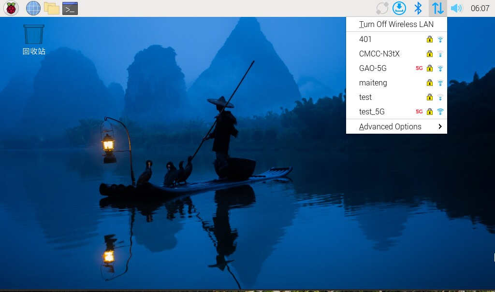
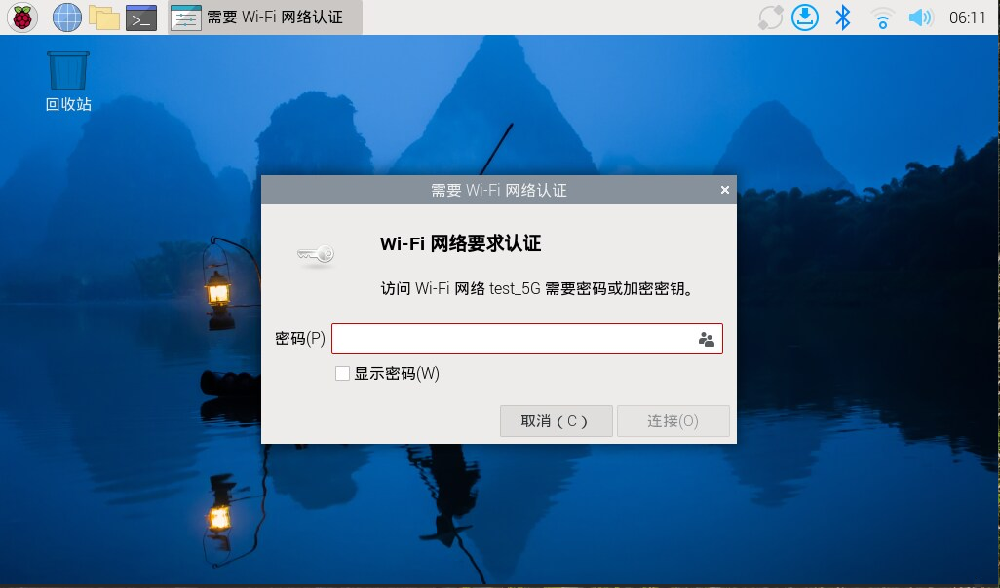
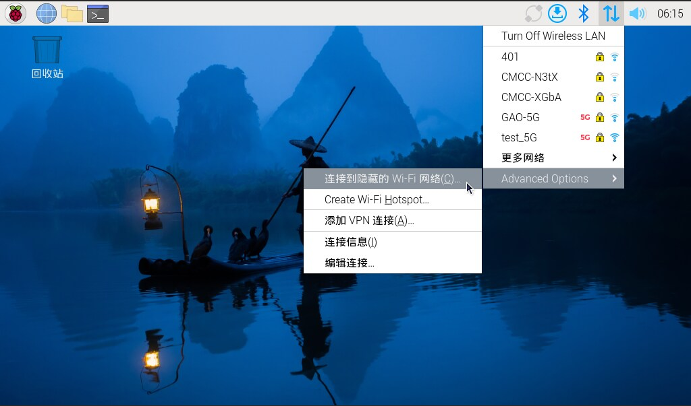
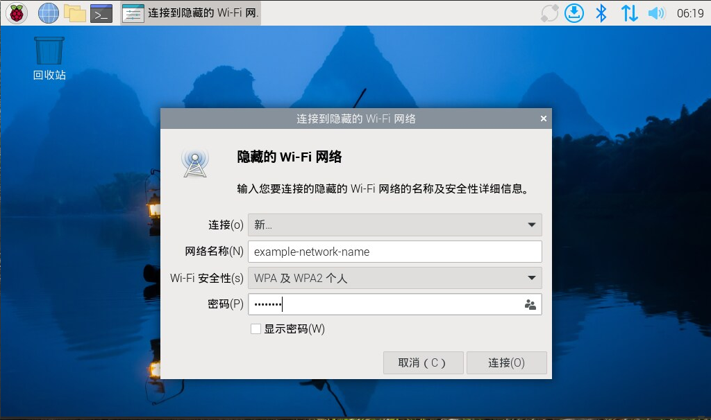

# 系统配置

## `raspi-config`

>**技巧**
>
>桌面版树莓派用户可以使用图形化版本的 `raspi-config`，位于“**首选项（Preferences）**”->“**树莓派配置（Raspberry Pi Configuration）**”。但是，某些高级配置仅存在于 `raspi-config`。

`raspi-config` 能帮你对树莓派进行配置。对于不同的树莓派型号，可配置的选项也不尽相同。若要打开这个配置工具，请执行以下命令：

```bash
$ sudo raspi-config
```

你会在灰色窗口中，看到一个蓝色背景的界面，上面有各种选项：


你用 **上箭头（↑）**、**下箭头（↓）** 就能在可选条目间自由切换，并对当前所选高亮显示。

按 **右箭头（→）**、**Tab 键** 可选择按钮 `<Select>` 和 `<Finish>`。按 **左箭头（←）**、**Tab 键** 可返回上级菜单。

`raspi-config` 会自动修改 [`/boot/firmware/config.txt`](https://www.raspberrypi.com/documentation/computers/config_txt.html#what-is-config-txt) 及相关 Linux 配置文件。个别选项可能需要重启才能生效：如果你修改了他们当中任何一个，在退出时，`raspi-config` 会要求你重启。

>**技巧**
>
>在选项值所提供的长长的列表中（如时区城市列表），输入单个字母即可跳转到列表中的对应部分。例如，输入 `L` 会跳转至 Lisbon（里斯本）。

### System options——系统选项

系统选项（System options）子菜单：能让你对启动、登录和网络过程的相关部分进行配置修改，以及其他系统级的修改。


#### Wireless LAN——无线局域网（WLAN）

可配置 WiFi 网络名称（SSID）和密码。

#### Audio——音频

指定音频输出位置。

#### Password——密码

修改你的密码。

获取更多信息，请参阅[修改用户密码](https://www.raspberrypi.com/documentation/computers/configuration.html#change-user-password)。

#### Hostname——主机名

在网络上为树莓派设置可见的 [mDNS](https://www.raspberrypi.com/documentation/computers/remote-access.html#resolve-raspberrypi-local-with-mdns) 域名。

#### Boot/auto login——启动/自动登录

选择启动到控制台，还是桌面。以及在接通电源时，是否自动登录到当前用户账户。

#### Network at boot——启动时联网

在启动前等待网络连接。

#### Splash screen——启动画面

启用或禁用：开机时显示的启动画面。

#### Power LED——电源灯

如果你的树莓派型号支持，可以修改电源灯的行为。

#### Browser——浏览器

修改默认的网络浏览器。

### Display options——显示选项


#### Underscan——欠扫描

>**注意**
>
>在 Wayland 下不可用。

如果屏幕上显示的文本开端消失在屏幕边缘，可启用 overscan（过扫描）调整边框。在某些显示器（特别是监控器）上，禁用过扫描会使画面填充到整个屏幕，且去除黑边。

#### Screen blanking——屏幕节能（无操作时关闭信号输出）

启用或禁用：Screen blanking——屏幕节能（无操作时关闭信号输出）。

#### VNC resolution——VNC 分辨率

用于[无头](https://www.raspberrypi.com/documentation/computers/configuration.html#setting-up-a-headless-raspberry-pi)设置所用的显示分辨率。

#### Composite——复合视频

启用或禁用复合视频（composite video）。

#### 4Kp60 HDMI

启用或禁用：HDMI 的 4K 60p 分辨率输出。

### Interface options——接口选项

启用和禁用各种物理接口、虚拟接口。


#### SSH

启用或禁用：树莓派终端 SSH 远程访问。

你可以在另一台计算机上，使用 SSH 远程访问树莓派的命令行。在默认情况下，SSH 处于禁用状态。在 [SSH 文档页](https://www.raspberrypi.com/documentation/computers/remote-access.html#ssh)上能阅读更多关于 SSH 的使用信息。如果你将树莓派直接接入到了公共网络，请不要启用 SSH，除非你为所有用户都设置了安全的密码。

#### VNC

启用或禁用：WayVNC、RealVNC 虚拟网络计算服务（virtual network computing，VNC）。

#### SPI

启用或禁用：SPI 接口，是否自动加载 SPI 内核模块。

#### I2C——I²C

启用或禁用：I²C 接口，是否自动加载 I²C 内核模块。

#### Serial port——串口

启用或禁用：串口上的 shell 及内核信息输出。

#### 1-Wire——单总线

启用或禁用：单总线（Dallas 1-wire）接口，通常用于 DS18B20 温度传感器。

#### Remote GPIO——GPIO 远程访问

启用或禁用：GPIO 引脚的远程访问。

### Performance options——性能选项


#### Overclock——超频

如果你的树莓派型号支持，就能对 CPU 超频。超频能力因树莓派设备个体体质而异，即使是相同型号也会有所不同。超频过高可能会导致不稳定。

>**警告**
>
>**超频可能会缩短你树莓派的使用寿命。** 如果因某个特定级别的超频导致系统不稳定，可以试试较为保守的超频。在启动过程中按住 **Shift** 键可临时禁用超频。

#### GPU memory——GPU 显存

修改向 GPU 提供的内存大小。

#### Overlay file system——堆叠文件系统（OverlayFS）

启用或禁用：只读文件系统。

#### Fan——风扇

可自定义接入 GPIO 的风扇行为（[树莓派 4 外壳](https://www.raspberrypi.com/products/raspberry-pi-4-case-fan/)自带）。对[树莓派 5 外壳自带风扇](https://www.raspberrypi.com/products/raspberry-pi-5-case/)、[树莓派 5 主动散热器](https://www.raspberrypi.com/products/active-cooler/)（使用特殊四针风扇头）无效。

### Localisation options——本地化选项

配置位置、国家/地区相关选项。


#### Locale——语言环境

可选择语言环境，如 `en_GB.UTF-8 UTF-8`（英语）（**译者注：中文为`zh_CN.UTF-8 UTF-8`**）。

#### Time zone——时区

设置你的本地时区，从地区（**译者注：Asia，亚洲**）开始，然后选择城市（**译者注：北京时间为 Shanghai**），例如"Asia/Shanghai"（**译者注：IANA 规范**）。键入单个字母可跳转到列表中的该字母。

#### Keyboard——键盘

将打开菜单，你可以在其中选择你的键盘布局（译者注：目前中国使用标准美式键盘布局）。通常修改会立即生效，但可能需要重启。键入单个字母会跳转到列表中的该字母。

#### WLAN country——无线局域网区域

为你的无线网络设置区域码。

### Advanced options——高级选项


#### Expand filesystem——扩大文件系统

扩大你的操作系统分区，以便利用整个存储设备，从而带来更大的文件存储空间。要完成此操作，你需重启树莓派。通常，在首次启开机时，树莓派系统会执行此操作。如果你把你的操作系统克隆到了容量大于旧设备的其他存储设备上，该功能可能会极其有用。

>**警告**
>
>没有再确认的步骤。选择该选项将立即开始分区扩展操作。

#### Network interface names——网络接口名称

启用或禁用：可预测的网络接口名称。

#### Network proxy settings——设置网络代理

配置网络代理。

#### Boot order——启动顺序

在树莓派 4 及后续新款设备上，设定如下：在未插入 SD 卡的情况下，是否使用 USB 启动、网络启动。有关更多信息，请参阅[启动加载程序配置](https://www.raspberrypi.com/documentation/computers/raspberry-pi.html#raspberry-pi-bootloader-configuration)。

#### Bootloader version——引导加载程序版本

在树莓派 4 及后续新款设备上，更新到最新的 ROM 引导软件。或者，倘若最新版本引发了故障，你可以在此恢复出厂默认设置。

#### Wayland

在 X11 后端和 Wayland 后端间进行切换。在树莓派 4 及后续新款设备上，默认使用 Wayland。其他型号的树莓派默认使用 X11。

>**注意**
>
>要在树莓派 4 先前的型号上使用 Wayland，你还必须把 `wayland=on` 添加至 `/boot/firmware/cmdline.txt`。

#### Audio config——音频配置

在 Bookworm 以前，树莓派系统使用的是 PulseAudio。现在则可以在音频后端 PulseAudio 和 PipeWire 之间进行切换。

### Update——更新

把 `raspi-config` 更新到最新版本。

### About raspi-config——关于 raspi-config

`raspi-config` 相关说明。

### Finish——完成

退出 `raspi-config`。如果你进行的修改需要重启，`raspi-config` 会提示你重启。首次进行修改时，最好重启。如果选择了调整 SD 卡大小，重启可能会花比平时更久的时间。

## 非交互式 `raspi-config`

工具 `raspi-config` 还支持非交互式选项及参数，无需可视化组件，就可以用命令行修改所有选项。可用选项可能因树莓派型号而异。

```bash
$ sudo raspi-config nonint <命令> <参数> [可选参数]
```

>**注意**
>
> 对于不同选项，`0` 和 `1` 的含义也不尽相同。在将值赋给参数之前，请始终参照文档。

### System options——系统选项

#### Wireless LAN——无线局域网（WLAN）

配置 WiFi 网络名称（SSID）和密码。

```bash
$ sudo raspi-config nonint do_wifi_ssid_passphrase <网络名称> <密码> [隐藏的网络] [明文]
```

填入无线网络名称（SSID）和密码（如需要）。以下是可选参数：

参数 `<隐藏的网络>` 代表网络名称可见性。如果网络名称开放广播，请使用 `0` 或省略该参数。如果你的网络名称是隐藏的，请填 `1`。默认为 `0`。

参数 `<明文>` 代表你是否打算明文传输密码。如果你的密码包含空格、特殊字符（如 `!`)，则必须使用 `0`，并在密码两头加上英文双引号 `"`。如无以上情形，你可以使用 `1` 或省略该参数。默认为 `1`。但若要使用该参数，你必须同时赋值给 `<隐藏的网络>`。

例如，通过执行以下命令，可以连接至：

* 未隐藏的网络 `myssid`，密码为 `mypassphrase`：

  ```bash
  $ sudo raspi-config nonint do_wifi_ssid_passphrase myssid mypassphrase
  ```
* 隐藏的网络 `myssid`，密码为 `mypassphrase`：

  ```bash
  $ sudo raspi-config nonint do_wifi_ssid_passphrase myssid mypassphrase 1
  ```
* 未隐藏的网络 `myssid`，密码为 `my passphrase`：

  ```bash
  $ sudo raspi-config nonint do_wifi_ssid_passphrase myssid "my passphrase" 0 0
  ```

#### Audio——音频

指定音频输出位置。

```bash
$ sudo raspi-config nonint do_audio <数字>
```

在树莓派 4B 上，你可使用以下参数：

* `0`：bcm2835 headphone jack（耳机插孔）
* `1`：vc4-hdmi-0
* `2`：vc4-hdmi-1

要查看参数 `<数字>` 的所有可用值列表，请参阅交互版 `raspi-config` 中所使用的缩写。

#### Password——密码

修改你的密码。

有关修改用户密码的更多信息，请参阅[修改用户密码](https://www.raspberrypi.com/documentation/computers/configuration.html#change-user-password)。

```bash
$ sudo raspi-config nonint do_change_pass
```

>**注意**
>
>此功能会使用全屏界面进行交互，即使在命令行执行参数亦如此。

#### Hostname——主机名

在网络上为此树莓派设置可见的 [mDNS](https://www.raspberrypi.com/documentation/computers/remote-access.html#resolve-raspberrypi-local-with-mdns) 域名。

```
$ sudo raspi-config nonint do_hostname <主机名>
```

#### Boot/auto login——启动/自动登录

选择：启动到控制台，还是桌面；在接通电源时，是否自动登录到当前用户账户。

```bash
$ sudo raspi-config nonint do_boot_behaviour <B1/B2/B3/B4>
```

* `B1`：启动到控制台，需要登录
* `B2`：启动到控制台，自动登录
* `B3`：启动到桌面，需要登录
* `B4`：启动到桌面，自动登录

#### Network at boot——启动时联网

是否在启动前等待网络连接。

```bash
$ sudo raspi-config nonint do_boot_wait <0/1>
```

* `0`：启动前不等待网络连接
* `1`：启动前等待网络连接

#### Splash screen——启动画面

启用或禁用：启动时显示的启动画面。

```bash
$ sudo raspi-config nonint do_boot_splash <0/1>
```

* `0`：启用启动画面
* `1`：禁用启动画面

#### Power LED——LED 电源灯

如果你的树莓派型号支持，可以改变 LED 电源灯的行为。

```bash
$ sudo raspi-config nonint do_leds <0/1>
```

* `0`：用闪烁代表磁盘活动状态
* `1`：LED 电源灯常亮


#### Browser——浏览器

修改默认的网络浏览器。如所选网络浏览器，在当前并未安装，将不生效。

```bash
$ sudo raspi-config nonint do_browser <chromium-browser/firefox>
```

### Display options——显示选项

#### Underscan——欠扫描

>**注意**
>
>在 Wayland 下不可用。

如果屏幕上显示的文本开端在屏幕边缘消失，可启用 overscan（过扫描）调整边框。在某些显示器上，特别是监控器上，禁用过扫描会把镜像填充到整个屏幕，且不带黑边。

```bash
$ sudo raspi-config nonint do_overscan_kms <device> <enabled>
```

设备:

* `1`: HDMI-1
* `2`: HDMI-2

使用：

* `0`：启用过扫描
* `1`：禁用过扫描

#### Screen blanking——屏幕节能

启用或禁用：屏幕节能（无操作时关闭屏幕信号）。

```bash
$ sudo raspi-config nonint do_blanking <0/1>
```

* `0`：启用屏幕节能（无操作时关闭屏幕信号）
* `1`：禁用屏幕节能（无操作时不会关闭屏幕信号）

#### VNC resolution——VNC 分辨率

用于[无头](https://www.raspberrypi.com/documentation/computers/configuration.html#setting-up-a-headless-raspberry-pi)设置所使用的显示分辨率。

```bash
$ sudo raspi-config nonint do_vnc_resolution <宽>x<高>
```

#### Composite——复合视频

启用或禁用复合视频（composite video）输出。

在树莓派 4 上：

```bash
$ sudo raspi-config nonint do_pi4video <V1或V2或V3>
```

* `V1`：启用 HDMI 4K 60p 输出
* `V2`：启用复合视频输出
* `V3`：禁用 4K 60p 和复合输出

对于其他型号：

```bash
$ sudo raspi-config nonint do_composite <0或1>
```

* `0`：启用复合视频
* `1`：禁用复合视频

### Interface options——接口选项

#### SSH

启用或禁用：树莓派终端 SSH 远程访问。

SSH 能让你在另一台计算机远程访问树莓派的命令行。有关 SSH 的更多信息，请参阅 [SSH 文档](https://www.raspberrypi.com/documentation/computers/remote-access.html#ssh)。

```bash
$ sudo raspi-config nonint do_ssh <0或1>
```

* `0`：启用 SSH
* `1`：禁用 SSH

#### VNC

启用或禁用：虚拟网络计算服务（virtual network computing，VNC）。有关 VNC 的更多信息，请参阅 [VNC 文档](https://www.raspberrypi.com/documentation/computers/remote-access.html#vnc)。

```bash
$ sudo raspi-config nonint do_vnc <0或1>
```

* `0`：启用 VNC
* `1`：禁用 VNC

#### SPI

启用或禁用：SPI 接口，是否自动加载 SPI 内核模块。

```bash
$ sudo raspi-config nonint do_spi <0或1>
```

* `0`：启用 SPI
* `1`：禁用 SPI

#### I2C——I²C

启用或禁用：I²C 接口，是否自动加载 I²C 内核模块。

```bash
$ sudo raspi-config nonint do_i2c <0或1>
```

* `0`：启用 I²C
* `1`：禁用 I²C

#### Serial port——串口

启用或禁用：串口硬件。

```bash
$ sudo raspi-config nonint do_serial_hw <0或1或2>
```

* `0`：启用串口
* `1`：禁用串口

#### Serial console——串口控制台

启用或禁用： shell 及内核信息的串口输出。

```bash
$ sudo raspi-config nonint do_serial_cons <0或1或2>
```

* `0`：启用串口控制台
* `1`：禁用串口控制台

#### 1-wire——单总线

启用或禁用：Dallas 1-wire（单总线）接口，通常用于 DS18B20 温度传感器。

```bash
$ sudo raspi-config nonint do_onewire <0或1>
```

* `0`：启用 1-wire
* `1`：禁用 1-wire

#### Remote GPIO——GPIO 远程访问

启用或禁用：GPIO 引脚的远程访问。

```bash
$ sudo raspi-config nonint do_rgpio <0或1>
```

* `0`：启用 GPIO 远程访问
* `1`：禁用 GPIO 远程访问

### Performance options——性能选项

#### Overclock——超频

如果你的树莓派型号支持，就能对 CPU 超频。超频潜力因树莓派设备个体体质而异，即使是相同型号也会有所不同。超频过高可能会导致不稳定。


>**警告**
>
>**超频可能会缩短你树莓派的使用寿命。** 如因某个特定级别的超频造成系统不稳定，可尝试更为保守的超频。在启动过程中按住 **Shift** 键可暂时禁用超频。

```bash
$ sudo raspi-config nonint do_overclock <设置>
```

此命令接受以下 `<设置>` 值：

* `None`：不超频（默认）
* `Modest`：超频至最大值 50%
* `Medium`：超频至最大值 75%
* `High`：超频至最大值 100%
* `Turbo`：超频至最大值 125%

#### GPU memory——GPU 显存

修改向 GPU 提供的内存量。

```bash
$ sudo raspi-config nonint do_memory_split <megabytes>
```

#### Overlay file system——堆叠文件系统（OverlayFS）

启用或禁用：只读文件系统。

```bash
$ sudo raspi-config nonint do_overlayfs <0或1>
```

* `0`：启用堆叠文件系统（OverlayFS）
* `1`：禁用堆叠文件系统（OverlayFS）

#### Fan——风扇

可自定义接入 GPIO 的风扇行为（[树莓派 4 外壳](https://www.raspberrypi.com/products/raspberry-pi-4-case-fan/)自带）。对[树莓派 5 外壳自带风扇](https://www.raspberrypi.com/products/raspberry-pi-5-case/)、[树莓派 5 主动散热器](https://www.raspberrypi.com/products/active-cooler/)（使用特殊四针风扇接头接入）无效。

```bash
$ sudo raspi-config nonint do_fan <0/1> [gpio] [onTemp]
```

* `0`：启用风扇
* `1`：禁用风扇

默认 `gpio` 为 14。

`onTemp` 默认为 80 °C。

### Localisation options——本地化选项

#### Locale——语言环境

选择语言环境，如 `en_GB.UTF-8 UTF-8`（英语）（译者注：中文为 `zh_CN.UTF-8 UTF-8`）。

```bash
$ sudo raspi-config nonint do_change_locale <语言环境>
```

要查看参数 `<语言环境>` 的所有可用值列表，请参阅交互版 `raspi-config` 中所使用的缩写。

#### Time zone——时区

设置你的本地时区，从地区开始，然后选择城市，如"Asia/Shanghai"。

```bash
$ sudo raspi-config nonint do_change_timezone <时区>
```

要查看参数 `<时区>` 的所有缩写值列表，请参见交互版 `raspi-config`。

#### Keyboard——键盘

设置键盘布局。一般来说，修改会立即生效，但也可能需重启才能生效。

```bash
$ sudo raspi-config nonint do_configure_keyboard <键盘布局>
```

要查看参数 `<键盘布局>` 的所有可用值列表，请参阅交互版 `raspi-config` 中所使用的缩写。

#### WLAN country——无线局域网区域

设置无线网络的区域码。

```bash
$ sudo raspi-config nonint do_wifi_country <区域码>
```

要查看此参数 `<区域码>` 的所有可用值列表，请参阅交互版 `raspi-config` 中所使用的缩写。

### Advanced options——高级选项

#### Expand filesystem——扩展文件系统

将你的操作系统分区进行扩展，以利用整个存储设备，能为你带来更大的文件存储空间。需要需重启你的树莓派才能完成该。通常，树莓派系统会在首次开机时执行此操作。如果你将你的操作系统克隆到了容量大于旧设备的其他存储设备上，该功能可能会极其有用。

>**警告**
>
>没有再确认的步骤。选择该选项将立即执行分区扩展操作。

```bash
$ sudo raspi-config nonint do_expand_rootfs
```

#### Network interface names——网络接口名称

启用或禁用：可预测的网络接口名称。

```bash
$ sudo raspi-config nonint do_net_names <0或1>
```

* `0`：启用可预测的网络接口名称
* `1`：禁用可预测的网络接口名称

#### Network proxy settings——设置网络代理

配置网络代理。


```bash
$ sudo raspi-config nonint do_proxy <代理服务器的协议类型> <代理服务器的地址>
```

#### Boot order——启动顺序

对于树莓派 4 及后续新款设备，在未插入存储卡的情况下，指定：是否进行 USB 启动和网络启动。有关更多信息，请参阅[引导加载程序配置](https://www.raspberrypi.com/documentation/computers/raspberry-pi.html#raspberry-pi-bootloader-configuration)。


```bash
$ sudo raspi-config nonint do_boot_order <B1或B2或B3>
```

视你的设备而定，你可以在以下选项中进行选择：

* B1 ：存储卡启动：如果存储卡可用，则优先从存储卡启动；如存储卡不可用，再从 NVMe 启动；如果存储卡、NVMe 均不可用，那么则从 USB 启动
* B2 ：NVMe/USB 启动：如果 NVMe 可用，则优先从 NVMe 启动；如果 NVMe 不可用，再从 USB 启动；如果 NVMe、USB 均不可用，那么则从存储卡启动
* B3 ：网络启动：**如果存储卡可用**，则优先从存储卡启动；如果存储卡不可用，则从网络启动

#### Bootloader version——引导加载程序版本

对于树莓派 4 及后续新款设备，要更新到最新版的 ROM 引导软件。或者，倘若最新版本引发了故障，你也可以在此恢复出厂默认设置。

```bash
$ sudo raspi-config nonint do_boot_rom <E1或E2>
```

* `E1`：使用最新的引导 ROM
* `E2`：使用出厂默认设置

#### Wayland

在 X11 后端和 Wayland 后端间进行切换。对于树莓派 4 及后续新款设备，默认使用 Wayland。其他型号的树莓派默认为 X11。

```bash
$ sudo raspi-config nonint do_wayland <W1或W2>
```

* `W1`：使用 X11 后端
* `W2`：使用 Wayland 后端

>**注意**
>
>要在树莓派 4 先前的型号上使用 Wayland，你还必须把 `wayland=on` 添加到 `/boot/firmware/cmdline.txt`。

#### Audio config——音频配置

使用此参数在 PulseAudio 和 PipeWire 音频后端间进行切换。在树莓派系统 Bookworm 之前，树莓派系统使用 PulseAudio。

```bash
$ sudo raspi-config nonint do_audioconf <1或2>
```

* `1`：使用 PulseAudio 后端
* `2`：使用 PipeWire 后端

### Update——更新

将 `raspi-config` 更新至最新版本。

```bash
$ sudo raspi-config nonint do_update
```

## 显示

要配置你的树莓派，使用非默认显示模式，请手动设置分辨率和方向。

### HDMI 显示器支持

对于大多数 HDMI 显示器，树莓派系统都能使其达到最高分辨率和刷新率。

树莓派 Zero、Zero W 和 Zero 2 W 均搭载了 mini HDMI 接口，因此你需要 mini HDMI 转全尺寸 HDMI 转接线（转接头）。

树莓派 4、5 和 400 均搭载了两个 micro HDMI 端口，因此你需要为每台你想使用的显示器，都准备一份 micro HDMI 转标准 HDMI 转接线（转接头）。请在树莓派开机之前接入上述适配器。

树莓派 4 和 400 可以同时输出到两个显示器，高达 1080p 分辨率、60Hz 刷新率；或输出至两台 4K 30Hz 刷新率的显示器。如果你把显示器接入了 `HDMI0` 口，并在 [`/boot/firmware/config.txt`](https://www.raspberrypi.com/documentation/computers/config_txt.html#what-is-config-txt) 设置了参数 `hdmi_enable_4kp60=1`，还可以用 60Hz 刷新率输出单台 4K 显示器。

无需任何专门配置，树莓派 5 就可以 4K 分辨率、60Hz 刷新率，输出至两台显示器。

### 设置分辨率和方向

#### 通过桌面设置分辨率和方向

在树莓派桌面上，打开菜单“**首选项（Preferences）**”，然后选择工具“**屏幕配置（Screen Configuration）**”。你应该会看到当前树莓派已接入的显示器（用图标表示）。右键单击要修改的显示器，然后选择一个选项。单击“**应用（Apply）**”并退出“**屏幕配置（Screen Configuration）**”以保存修改。

#### 通过命令行设置分辨率和方向

使用以下命令能打开 **屏幕配置（Screen Configuration）** 工具：

```bash
$ arandr
```

你应该会看到当前树莓派已接入的显示器（用图标表示）。右键单击要修改的显示器，然后选择一个选项。单击“**应用(Apply)**”并退出 **屏幕配置（Screen Configuration）** 以保存修改。

### 手动设置分辨率和屏幕方向

#### 确定显示设备名称

要手动配置分辨率和方向，你得知道显示设备的名称。要确定设备名称，请运行以下命令，来显示已接入设备的信息：

```bash
$ kmsprint | grep Connector
```

#### 设置自定义分辨率

如果你使用着 Wayland 桌面混成器，你可以通过编辑你主目录中的文件来，设置自定义显示分辨率：`.config/wayfire.ini`。可编辑现有的 `[output:<device>]` 部分。倘若没有，则添加新部分 `[output:<device>]`，以适配你的显示设备。要修改显示分辨率，请添加 `mode` 这行。例如，对于以下示例，配置为：设备名称是 `HDMI-A-1`、分辨率是 1080p 60Hz：

```bash
[output:HDMI-A-1]
mode = 1920x1080@60
```

有关可支持的分辨率和 `mode` 语法的信息，请参阅 [Wayfire 文档](https://github.com/WayfireWM/wayfire-wiki/blob/master/Configuration.md#output-configuration)。

将相同的配置段落添加到 `/usr/share/greeter.ini`，可以配置登录屏幕分辨率。

#### 设定自定义屏幕方向

如果你正在运行 Wayland 桌面混成器，可以通过设置 `wlr-randr` 自定义屏幕显示方向。以下命令分别将屏幕方向配置为 0°、90°、180° 和 270°：

```bash
$ wlr-randr --output HDMI-A-1 --transform normal
$ wlr-randr --output HDMI-A-1 --transform 90
$ wlr-randr --output HDMI-A-1 --transform 180
$ wlr-randr --output HDMI-A-1 --transform 270
```

参数 `--output` 可指定要修改屏幕方向的设备。

>**注意**
>
>如要通过 SSH 运行此命令，请添加如下前缀： `WAYLAND_DISPLAY=wayland-1`。比如 `WAYLAND_DISPLAY=wayland-1 wlr-randr --output HDMI-A-1 --transform 90`。


你还可以使用以下某个 `--transform` 参数，在镜像屏幕的同时改变显示方向：`flipped`、`flipped-90`、`flipped-180`、`flipped-270`。

当然，你还可以通过编辑你主目录（home）中的文件，来旋转屏幕方向：`.config/wayfire.ini`。请编辑现有的 `[output:<device>]` 部分。倘若没有，则添加新的 `[output:<device>]` 部分以适配你的[显示设备](https://www.raspberrypi.com/documentation/computers/configuration.html#determine-display-device-name)。要旋转屏幕方向，需添加 `transform` 这行。以下示例配置：设备名称是 `HDMI-A-1`、分辨率是 1080p 60Hz，旋转角度是 270°：


```bash
[output:HDMI-A-1]
mode = 1920x1080@60
transform = 270
```

Wayland 支持以下 `transform` 参数：

* `normal`
* `90`
* `180`
* `270`

将相同的配置内容添加到 `/usr/share/greeter.ini`，来改变登录界面的屏幕方向。

### Console resolution and rotation——控制台分辨率和屏幕方向

要修改树莓派控制台模式下的分辨率和方向，请使用 KMS 设置。有关更多信息，请参阅[配置内核命令行](https://www.raspberrypi.com/documentation/computers/configuration.html#kernel-command-line-cmdline-txt)。

>**注意**
>
>
>若将控制台模式同时输出至多个显示器，那么所有接入的显示器将使用相同的屏幕方向。

## Audio——音频

树莓派系统支持多种音频输出模式：HDMI 1、耳机插孔（如果你的设备有）和 USB 音频。

在默认情况下，树莓派系统将音频输出到 HDMI 1。如果 HDMI 输出不可用，树莓派系统会将音频输出到耳机插孔、已接入的 USB 音频设备。

### 修改音频输出

本节介绍了在树莓派系统中，多种配置音频输出的方法。

#### 通过桌面音量控制

单击系统托盘上的音量图标，打开音频输出选择器。该界面可让你选择音频输出设备。单击音频输出设备，能切换音频输出到该设备。

##### 专业音频配置文件

在 **音频输出选择器（audio output selector）** 中查看音频设备时，你大概会看到一个叫专业音频（Pro Audio）的设备配置文件。该配置文件在每个音频设备上暴露了最大数量的通道，使你能够更好地控制信号的路由。除非你要对音频输出进行细粒度调整控制，否则请使用其他设备配置文件。

更多有关专业音频配置文件的内容，请访问 [PipeWire 常见问题解答](https://gitlab.freedesktop.org/pipewire/pipewire/-/wikis/FAQ#what-is-the-pro-audio-profile)。

#### 使用 `raspi-config`

要修改音频输出，请使用 [`raspi-config`](https://www.raspberrypi.com/documentation/computers/configuration.html#raspi-config)，运行以下命令：

```bash
$ sudo raspi-config
```

你将看到配置界面。完成以下步骤，可修改你的音频输出：

1. 选择 `System options` 并按  **回车键**。
2. 选择 `Audio options` 并按  **回车键**。
3. 选择所需模式，然后按 **回车键** 选定该模式。
4. 按 **右、方向键** 退出选项列表。选择 `Finish` 退出配置工具。

## 网络

可以用图形化用户界面（GUI）对树莓派系统上的无线连接进行配置。精简版树莓派系统和无头机器的用户可以用 [`nmcli`](https://networkmanager.dev/docs/api/latest/nmcli.html)，在命令行设置无线网络连接。

>**注意**
>
>自树莓派系统 *Bookworm* 以降，默认的网络配置工具变成了 Network Manager。旧款树莓派系统使用 `dhcpd` 和别的工具进行网络配置。

### 连接到无线网络

#### 通过桌面连接到无线网络

点击菜单栏右侧的网络图标打开网络管理器。如果你使用的树莓派搭载了内置无线连接功能（或插入了无线适配器），则单击此图标即可显示可用无线网络列表。如果看到信息“未找到 AP——正在扫描……（No APs found - scanning…​）”，请等待几秒，网络管理器应该就能搜到你的网络。

>**注意**
>
>搭载双频无线的树莓派设备（树莓派 3B+、4、计算模块 4、树莓派 400、5）会自动禁用网络，直到你分配无线局域网区域。要设置无线局域网区域，请在“首选项（Preferences）”菜单里打开工具树莓派配置（Raspberry Pi Configuration），选择 **本地化（Localisation）**，然后从菜单中选择你的区域。



右侧的图标会提示网络是否加密，并指示了信号强度。单击要连接的网络。如果是加密网络，对话框将让你输入网络密钥：



输入密钥，然后单击“**确定（OK）**”，再等待几秒钟。网络图标会闪烁一下，表示正在建立连接。连接成功后，图标将停止闪烁并显示信号强度。

##### 连接到隐藏的网络

要使用隐藏的网络，请在网络菜单中导航到 **高级选项（Advanced options）** -> **连接到隐藏的 WiFi 网络（Connect to a hidden Wi-Fi network）**：



然后，输入隐藏网络的网络名称（SSID）。询问你的网络管理员：你所用的网络使用了哪种加密方式。目前，大多数家用网络使用的是 WPA 和 WPA2 个人加密，公共网络有时使用 WPA 和 WPA2 企业加密。选择你网络的加密方式，并输入你的凭据：



单击“**连接（Connect）**”按钮可启动网络连接。

#### 通过命令行连接到无线网络

本指南将帮你：在不使用图形化工具（且无需附加软件）的情况下，在树莓派上配置使用无线连接。

>**注意**
>
>本指南适用于 WEP、WPA、WPA2 和 WPA3 网络，但可能不适用于企业网络。

##### 启用无线网络

在全新安装时，你必须指定你设备的使用位置。这样可以使你的设备选择正确的 5GHz 网络频段。在你指定无线局域网区域后，你就可以使用树莓派内置的无线网络模块了。

要做到这一点，请使用命令行工具 `raspi-config`，设置你的无线局域网区域。运行以下命令：

```bash
$ sudo raspi-config
```

使用 **方向键** 选择菜单项“**本地化选项（Localisation options）**”。选择选项 **WLAN 区域（WLAN country）**。使用 **方向键** 从下拉菜单中选择你的区域。按 **回车键** 确认选择。

现在，你应该已经可以访问无线网络了。运行以下命令来查看你的 WiFi 无线电是否已启用：

```bash
$ nmcli radio wifi
```

如果此命令返回文本“enabled（已启用）”，则可以继续准备配置连接。若此命令返回“disabled（已禁用）”，请尝试使用以下命令启用 WiFi：

```bash
$ nmcli radio wifi on
```

##### 搜索网络

要扫描无线网络，请运行以下命令：

```bash
$ nmcli dev wifi list
```

你应看到类似输出如下：

```sh
IN-USE  BSSID              SSID            MODE   CHAN  RATE        SIGNAL  BARS  SECURITY
        90:72:40:1B:42:05  myNetwork       Infra  132   405 Mbit/s  89      ****  WPA2
        90:72:42:1B:78:04  myNetwork5G     Infra  11    195 Mbit/s  79      ***   WPA2
        9C:AB:F8:88:EB:0D  Pi Towers       Infra  1     260 Mbit/s  75      ***   WPA2 802.1X
        B4:2A:0E:64:BD:BE  Example         Infra  6     195 Mbit/s  37      **    WPA1 WPA2
```

在“SSID”这一列，查找要连接的网络名称。使用网络名称（SSID）和密码连接到网络。

##### 连接到网络

运行以下命令来配置网络连接，将占位符 `<网络名称>` 替换为你要配置的网络名称：

```bash
$ sudo nmcli --ask dev wifi connect <网络名称>
```

在有提示时输入你的网络密码。

在你输入密码后，你的树莓派应该会自动接入网络。

如果你看到错误输出，提示你“需要密码，但未提供密码”，则意味着你输入的密码错误。请再次运行上述命令，仔细检查你输入的密码。

要检查是否已接入网络，请运行以下命令：

```bash
$ nmcli dev wifi list
```

应该看到类似输出如下：

```sh
IN-USE  BSSID              SSID            MODE   CHAN  RATE        SIGNAL  BARS  SECURITY
*       90:72:40:1B:42:05  myNetwork       Infra  132   405 Mbit/s  89      ****  WPA2
        90:72:42:1B:78:04  myNetwork5G     Infra  11    195 Mbit/s  79      ***   WPA2
        9C:AB:F8:88:EB:0D  Pi Towers       Infra  1     260 Mbit/s  75      ***   WPA2 802.1X
        B4:2A:0E:64:BD:BE  Example         Infra  6     195 Mbit/s  37      **    WPA1 WPA2
```

在“IN-USE”列中查找星号(`*`)；它应该出现在你打算接入网络的网络名称（SSID）所在的同一行。

>**注意**
>
>你也可以手动编辑你的连接，配置文件位于目录 `/etc/NetworkManager/system-connections/` 下。

##### 连接到未加密的网络

如果你要连接的网络未使用密码，请运行以下命令：

```bash
$ sudo nmcli dev wifi connect <网络名称>
```

>**警告**
>
>未加密的无线网络可能会将你的个人信息暴露在风险之中。应尽可能请使用安全的无线网络（或 VPN）。

##### 连接到隐藏的网络

如果你正在使用着隐藏的网络，请在运行 `nmcli` 时指定参数 “hidden”，并赋值为“yes”。

```bash
$ sudo nmcli --ask dev wifi connect <网络名称> hidden yes
```

##### 设置网络优先级

如果你的设备同时检测到了多个已知网络，它可能会随机接入到任意某个被检测到的已知网络。可使用优先级参数，强制让你的树莓派优先连接到某些网络。在范围内，你的设备将连接到具有最高优先级的网络。运行以下命令，查看已知网络的优先级：

```bash
$ nmcli --fields autoconnect-priority,name connection
```

你应该看到类似输出如下：

```sh
AUTOCONNECT-PRIORITY  NAME
0                     myNetwork
0                     lo
0                     Pi Towers
0                     Example
-999                  Wired connection 1
```

使用命令 `nmcli connection modify` 可设置网络的优先级。以下示例命令：把叫做 "Pi Towers" 的网络的优先级设置为 `10`：

```bash
$ nmcli connection modify "Pi Towers" connection.autoconnect-priority 10
```

在范围内，你的设备将始终尝试连接到具有最高非负优先级值的网络。你还可以为网络分配负优先级；只有在范围内，没有其他已知网络时，你的设备才会尝试连接到负优先级网络。例如，现在有三个网络：

```sh
AUTOCONNECT-PRIORITY  NAME
-1                    snake
0                     rabbit
1                     cat
1000                  dog
```

* 在范围内，如果所有这些网络都存在，你的设备将首先尝试连接到网络“dog”。
* 如果网络“dog”连接失败，你的设备将尝试连接到网络“cat”。
* 如果网络“cat”连接失败，你的设备将尝试连接到网络“rabbit”。
* 如果网络“rabbit”连接失败，并且你的设备未检测到其他已知网络，你的设备将尝试连接到网络“snake”。

### 配置 DHCP

在默认情况下，树莓派系统会尝试用 DHCP 自动配置所有网络接口。如果 DHCP 失败，则回滚至自动私有地址，范围是 `169.254.0.0/16`。

### 分配静态 IP 地址

如果要给你的树莓派分配静态 IP 地址，请在路由器上为其设置一个保留地址。你的树莓派仍将通过 DHCP 分配其地址，但每次都会收到相同的地址。可以在 DHCP 服务器中，将树莓派的 MAC 地址绑定到静态 IP 地址，来实现“静态”地址的分配。

## Screen Blanking 屏幕节能（无操作时关闭屏幕信号）

你可以配置你的树莓派使用 **屏幕节能（Screen Blanking）**：在一段时间内无操作后，关闭屏幕信号。在默认情况下，在启用屏幕节能后，树莓派系统将在无操作十分钟后关闭屏幕。

### 通过桌面配置屏幕节能

你可以使用树莓派配置（Raspberry Pi Configuration）菜单中的屏幕节能选项来控制屏幕节能（无操作时关闭屏幕）。

#### 通过树莓派配置设置屏幕节能

单击菜单栏中的树莓派按钮。导航到 **首选项（Preferences）** -> **树莓派配置（Raspberry Pi Configuration）**。


选择选项卡显示（**Display**）。将选项按钮切换到屏幕节能（**Screen Blanking**）。按下 **完成（OK）**，确认你的选择。


#### 通过命令行配置屏幕节能

你可以使用命令行工具 `raspi-config`，来启用和禁用屏幕节能。运行以下命令打开该工具：

```bash
$ sudo raspi-config
```

使用 **方向键** 导航，使用 **回车键** 选择。选择 `Display Options` > 。使用  **方向键**：选择 `yes` 启用屏幕节能；选择 `no` 禁用屏幕节能。

你还可以编辑添加以下行到 `~/.config/wayfire.ini`：

```bash
[idle]
dpms_timeout=600
```

变量 `dpms_timeout` 控制了在树莓派系统在屏幕关闭之前所需的无操作时间（秒）。如，值若为 `600`，则意味着会在 600 秒（十分钟）后关闭屏幕。将值置 `0`，屏幕将永不熄灭。

### 通过控制台配置屏幕节能

树莓派配置使用的屏幕节能配置 `dpms_timeout` 仅涉及桌面会话。在 **控制台模式** 下，即当你的树莓派仅接入至带有终端输入的监控器和键盘时，请在内核命令行下，使用设置 `consoleblank`。

#### 设置控制台模式下的屏幕节能（screen blanking）

要修改控制台模式下的屏幕节能配置，请以管理员身份，在文本编辑器中打开 `/boot/firmware/cmdline.txt`：

```bash
$ sudo nano /boot/firmware/cmdline.txt
```

你可以在这儿调整树莓派系统，在关闭屏幕之前，所等待控制台的秒数。例如，添加 `consoleblank=600` 可在其无操作 600 秒后关闭显示信号输出。将值置 `0`，屏幕将永不熄灭。

修改 `cmdline.txt` 后，只有在重启后才会生效。使用以下命令重启你的树莓派：

```bash
$ sudo reboot
```

#### 查看当前屏幕节能设置

你可以使用以下命令，显示当前控制台屏幕关闭时间（以秒为单位）：

```bash
$ cat /sys/module/kernel/parameters/consoleblank
```

## 用户

### 修改用户密码

你可以用工具 `raspi-config`，在命令行来修改当前用户账户的密码：

```bash
$ sudo raspi-config
```

选择 option 2，并按照说明修改密码。

还可以使用工具 `passwd`：

```bash
$ passwd
```

### 添加用户

要添加新用户，请输入以下命令：把占位符 `<用户名>` 换成新用户的用户名：

```bash
$ sudo adduser <用户名>
```

在出现提示时，为新用户输入密码。

新用户的主目录位于 `/home/<用户名>/`。

为了授予新用户必要的权限，比如 `sudo`，运行以下命令将该用户添加到相关用户组，请把占位符 `<用户名>` 换成新用户的用户名：

```bash
$ sudo usermod -a -G adm,dialout,cdrom,sudo,audio,video,plugdev,games,users,input,netdev,gpio,i2c,spi <用户名>
```

要检查权限是否成功授予，请运行以下命令，请将占位符 `<用户名>` 换成新用户的用户名：

```bash
$ sudo su - <用户名>
```

如果上述命令成功运行，则已成功为该用户配置了权限。

### 删除用户

要删除用户，请运行以下命令，请将占位符 `<用户名>` 换成要删除的用户名：

```bash
$ sudo deluser -remove-home <用户名>
```

此命令将删除用户及其主目录。如果你想保留该用户的主目录，请在执行命令时，把参数 `-remove-home` 去掉。

### 修改默认用户

要修改在启动时自动登录到你树莓派的用户，请运行以下命令：

```bash
$ sudo raspi-config
```

选择 option `1`, `Boot/Auto login`。重启以使修改生效。

## 外置存储

你可以将外置硬盘、固态硬盘和 USB 存储设备接入树莓派上的任意 USB 口，然后挂载文件系统，访问里面存储的数据。

在默认情况下，对于常见的文件系统（FAT、NTFS 和 HFS+），你的树莓派会自动挂载，挂载位置是 `/media/pi/<HARD-DRIVE-LABEL>`。

>**注意**
>
>精简版树莓派系统（Raspberry Pi OS Lite）未实现自动挂载功能。

要设置存储设备，必须手动挂载，把它挂载到你选择的特定位置。

### 挂载存储设备

你可以将存储设备挂载到特定文件夹位置。通常挂载到文件夹 `/mnt` 下，例如 `/mnt/mydisk`。请注意，文件夹必须为空。

将存储设备插入树莓派上的 USB 口，并使用以下命令列出树莓派上的所有磁盘分区：

```bash
$ sudo lsblk -o UUID,NAME,FSTYPE,SIZE,MOUNTPOINT,LABEL,MODEL
```

树莓派自身使用了挂载点 `/` 和 `/boot/firmware/`。你的存储设备将与其他已连接的存储设备一同显示在此列表中。

使用 SIZE、LABEL 和 MODEL 这几列来辨别指向存储设备的磁盘分区的名称（如 `sda1`）。FSTYPE 这列包含了文件系统类型。如果你的存储设备使用的是 exFAT 文件系统，请安装 exFAT 驱动程序：

```bash
$ sudo apt update
$ sudo apt install exfat-fuse
```

如果你的存储设备使用 NTFS 文件系统，你将只能以只读方式使用它。如果你想要对设备进行写操作，可以安装驱动程序 ntfs-3g：

```bash
$ sudo apt update
$ sudo apt install ntfs-3g
```

运行以下命令以获取磁盘分区的位置：

```bash
$ sudo blkid
```

比如，`/dev/sda1`。

创建一个目标文件夹，用作存储设备的挂载点。在这种情况下，使用的挂载点名称是 `mydisk`。你可以指定成自己想要的名称：

```bash
$ sudo mkdir /mnt/mydisk
```

将存储设备挂载到你创建的挂载点上：

```bash
$ sudo mount /dev/sda1 /mnt/mydisk
```

要检查存储设备是否挂载成功，可通过列出内容来确认：

```bash
$ ls /mnt/mydisk
```

### 自动挂载存储设备

你可以修改 `fstab` 文件，设定树莓派在启动时，存储设备自动挂载的位置。在 `fstab` 文件中，磁盘分区由全局唯一标识符（UUID）标记。

获取磁盘分区的 UUID：

```bash
$ sudo blkid
```

从列表中找到磁盘分区并标记 UUID。（如 `5C24-1453`）使用诸如 nano 之类的命令行编辑器打开 fstab 文件：

```bash
$ sudo nano /etc/fstab
```

在 `fstab` 文件中添加以下几行：

```bash
UUID=5C24-1453 /mnt/mydisk fstype defaults,auto,users,rw,nofail 0 0
```

用你在上述步骤中找到的文件系统类型（如 `ntfs`）替换 `fstyp`。

如果文件系统类型为 FAT 和 NTFS，请在紧跟 `nofail` 之后，添加 `,umask=000`。这将让所有用户完全读写存储设备上的任意文件。

现在你已在 `fstab` 中设置了一个条目。在启动树莓派时，该存储设备是否接入均可开机。在拔下存储设备之前，你必须先将树莓派关机，或者手动卸载该存储设备。

>**注意**
>
>在树莓派启动时，如未接入存储设备，启动时将再多等 90 秒。你可以通过在紧跟 `nofail` 之后，添加 `,x-systemd.device-timeout=30` 来缩短时间。这将把超时时间修改为 30 秒，这意味着系统只会等待 30 秒，然后放弃磁盘挂载。

要获取有关每个 Linux 命令的更多信息，请使用 `man` 命令查阅特定的手册页。例如，`man fstab`。

### 卸载存储设备

当树莓派关机时，系统会负责卸载存储设备，以便安全拔出。如果你想手动卸载设备，可以使用以下命令：

```bash
$ sudo umount /mnt/mydisk
```

如果收到报错“device is busy”，意味着存储设备未被卸载。如果没有显示错误，现在可以安全地拔出设备。

#### 解决“device is busy”

“device is busy”这个报错意味在着存储设备上，有文件被程序占用。要关闭这些文件，请执行如下步骤。

关闭所有打开了存储设备上的文件的软件。如果你打开了一个终端，请确保你未处于存储设备所挂载的文件夹（及其子文件夹）下。

如果你仍然无法卸载存储设备，你可以使用工具 `lsof` 检查是哪个程序，在设备上打开了文件。首先你要用 `apt` 安装 `lsof`：

```bash
$ sudo apt update
$ sudo apt install lsof
```

 使用 lsof 命令：

```bash
$ lsof /mnt/mydisk
```

## 内核命令行（`cmdline.txt`）

在启动时，Linux 内核可接受一组命令行参数。对于树莓派，可在启动分区中的文件 `cmdline.txt` 里定义该命令行。你可使用任意文本编辑器编辑该文本文件。

```bash
$ sudo nano /boot/firmware/cmdline.txt
```

>**重要**
>
>请把所有参数放在 `cmdline.txt` 中的一行里。**不要** 用换行符。


要查看在启动时传递给内核的命令行，请运行以下命令：

```bash
$ cat /proc/cmdline
```

因为树莓派固件会在启动内核之前对命令行进行修改，所以此命令行的输出与 `cmdline.txt` 的内容并不会完全吻合。

### 命令行参数

内核命令行参数有很多，其中某些由内核本身定义。其他的可能由内核正在使用的代码定义，如 Plymouth 闪屏系统。

#### 标准条目

`console`

　　定义了串口控制台。通常有两个条目：

* `console=serial0,115200`
* `console=tty1`

`root` 

　　定义了根文件系统的位置。例如，`root=/dev/mmcblk0p2` 表示多媒体卡区块 0 分区 2。

`rootfstype`

　　定义了根文件系统使用的文件系统类型，例如 `rootfstype=ext4`。

`quiet` 

　　将默认的内核日志级别设置为 `KERN_WARNING`，在启动过程中将屏蔽除非常严重级别外的内核信息。

#### 设置 KMS 显示模式

旧版树莓派系统中所使用的传统固件和 FKMS 显示模式，已不再支持。作为代替，最新版本的操作系统使用 KMS（内核模式设置）。

如果在 `cmdline.txt` 中没有 `video` 这个条目，树莓派操作系统将根据接入 HDMI 显示器的 [EDID](https://en.wikipedia.org/wiki/Extended_Display_Identification_Data)，自动选定（基于 Linux 内核信息）显示器能支持的最佳分辨率。在精简版树莓派系统（Raspberry Pi OS Lite）、控制台模式中，你必须自己手动修改 `video` 这个条目，才能调整分辨率和屏幕方向。

```bash
video=HDMI-A-1:1920x1080M@60
```

还可以添加屏幕旋转和翻转（屏幕镜像）参数，请参考 [Linux 帧缓冲文档](https://github.com/raspberrypi/linux/blob/rpi-6.1.y/Documentation/fb/modedb.rst) 标准。以下示例定义了一台显示器：名为 `HDMI-A-`、分辨率为 1080p、刷新率为 60Hz、屏幕旋转 90 度、并在 X 轴上翻转屏幕（屏幕镜像）：

```bash
video=HDMI-A-1:1920x1080M@60,rotate=90,reflect_x
```

要指定屏幕旋转方向和翻转参数，必须同时显式声明分辨率。

显示类型的支持选项——`video=` 条目 `=` 后的部分，支持：

| 视频选项 | 显示                                                                   |
| :------:|:-----------------------------------: |
| `HDMI-A-1`         | HDMI 1（树莓派 4B 主板上标为 HDMI 0；单个 HDMI 主板上标为 HDMI） |
| `HDMI-A-2`         | HDMI 2（树莓派 4B 主板上标为 HDMI 1）                          |
| `DSI-1`         | DSI 或 DPI                                                             |
| `Composite-1`         | 复合视频                                                                   |

#### 其他条目

此部分是可以在内核命令行中使用的其他条目。此列表不是完整无遗的。

`splash`

  启动时使用 Plymouth 模块显示启动画面。

`plymouth.ignore-serial-consoles` 

  如启用 Plymouth 模块，它通常会屏蔽掉出现在串口控制台上的所有启动信息。此参数能让 Plymouth 忽略所有串口控制台，重现启动消息，如同没有运行 Plymouth 一样。

`dwc_otg.lpm_enable=0` 

  禁用驱动程序 `dwc_otg` 中设置的链接状态电源管理（Link Power Management，LPM）。该驱动程序驱动着 USB 控制器（嵌入在树莓派计算机的处理器中）。在树莓派 4 上，此控制器默认已禁用，且它仅连接至 USB Type C 电源输入接口。树莓派 4 上的 USB-A 接口由别的，与此设置无关的 USB 控制器驱动。

`dwc_otg.speed` 

  可设置树莓派计算机 USB 控制器的速率（处理器内置）。设置 `dwc_otg.speed=1` 则为全速（USB 1.0），但低于高速（USB 2.0）。除非要排除 USB 设备故障，否则不应设置此参数。

`smsc95xx.turbo_mode` 

  启用或禁用：有线网络驱动程序超频。`smsc95xx.turbo_mode=N` 则关闭超频模式。

`usbhid.mousepoll` 

  指定鼠标轮询间隔。如果你遇到了无线鼠标移动缓慢、不稳定等故障，将其置 `0`（`usbhid.mousepoll=0`）也许有用。

`drm.edid_firmware=HDMI-A-1:edid/your_edid.bin`

  使用它能覆盖你显示器内置 EDID（`/usr/lib/firmware/edid/your_edid.bin`）信息。

## 本地化你的树莓派

你可以使用工具 [`raspi-config`](https://www.raspberrypi.com/documentation/computers/configuration.html#raspi-config) 配置树莓派系统的界面语言、键盘布局和时区。

## 保护你的树莓派

在这儿，我们介绍了一些常见方法，能提高你树莓派的安全性。

### 让 `sudo` 命令要求密码

以 `sudo` 开头运行的命令，将会以超级用户执行。在默认情况下，不需要密码。但是你可以要求，所有以 `sudo` 运行的命令，均需输入密码，来改善你树莓派的安全性。

要强制 `sudo` 需要密码，请编辑你用户账户的 sudoers 文件中的 `nopasswd`，并将文件名中的占位符 `<用户名>` 换成你的用户名：

```bash
$ sudo visudo /etc/sudoers.d/010_<用户名>-nopasswd
```

将 `<用户名>` 这个条目修改为如下内容，并把 `<用户名>` 换成你的用户名：

```bash
<用户名> ALL=(ALL) PASSWD: ALL
```

保存文件。你的设置会立即生效。

### 更新树莓派系统

只有最新版本的操作系统包含了所有最新的安全补丁。请始终将你设备中的树莓派系统[更新](https://www.raspberrypi.com/documentation/computers/os.html#update-software)至最新版本。

### 自动更新你的 SSH 服务器

如果你通过 SSH 连接至树莓派，通过添加 `cron` 作业，专门更新 SSH 服务器可能是值得的。可把以下命令，作为每日 `cron` 作业运行，确保你能及时收到最新的 SSH 安全修复程序。它独立于你的正常更新流程。

```bash
$ apt install openssh-server
```

### 改善 SSH 安全性

SSH 是远程访问树莓派的常用方式。在默认情况下，SSH 要求用户名和密码。为了改善 SSH 的安全性，请[使用基于密钥的身份验证](https://www.raspberrypi.com/documentation/computers/remote-access.html#configure-ssh-without-a-password)。

#### 启用和禁用 SSH 用户

你还可以通过修改 `sshd` 配置，**允许（allow）** 或 **拒绝（deny）** 特定用户。

```bash
$ sudo nano /etc/ssh/sshd_config
```

将以下行添加、编辑或添加到文件末尾，其中涉及了你想要允许登录的用户名：

```bash
AllowUsers alice bob
```

你还可以使用 `DenyUsers` 来明确禁止某些用户名登录：

```bash
DenyUsers jane john
```

修改后，请使用以下命令重启 `sshd` 服务，以使修改生效：

```bash
$ sudo systemctl restart ssh
```

### 使用防火墙

Linux 上有许多防火墙解决方案可用。大多数通过底层的 [iptables](http://www.netfilter.org/projects/iptables/index.html) 项目来进行数据包过滤。该项目基于 Linux netfiltering 系统。在默认情况下，树莓派系统上预装了 `iptables`，但未设置。设置它可能是一件非常麻烦的事情。[Uncomplicated Firewall (UFW)](https://www.linux.com/learn/introduction-uncomplicated-firewall-ufw) 项目提供了比 `iptables` 更为易用的界面。UFW 是 Ubuntu 中默认的防火墙工具，也可以安装到你的树莓派上：

```bash
$ sudo apt install ufw
```

`ufw` 是款命令行工具，然而也有图形界面可用。请注意，`ufw` 须以 root 权限运行，因此所有命令都以 `sudo` 开头。还可以使用参数 `--dry-run` 执行所有 `ufw` 命令，这表示仅输出命令的执行结果，而不进行任何实质性修改。

启用防火墙，同时设定防火墙开机自启：

```bash
$ sudo ufw enable
```

要禁用防火墙，同时禁用防火墙开机自启，请使用：

```bash
$ sudo ufw disable
```

允许特定端口访问（我们在示例中使用了 22 端口）：

```bash
$ sudo ufw allow 22
```

拒绝访问端口也非常简单（我们再次以 22 端口为例）：

```bash
$ sudo ufw deny 22
```

你还可以指定在端口上允许和拒绝哪种服务。在此示例中，我们拒绝了 22 端口上的 TCP：

```bash
$ sudo ufw deny 22/tcp
```

如果你不知道服务会使用哪个端口，那么可以指定服务。此示例允许 ssh 服务通过防火墙访问：

```bash
$ sudo ufw allow ssh
```

命令 `status` 可列出当前防火墙的所有配置：

```bash
$ sudo ufw status
```

规则可能十分复杂：允许阻止特定 IP 地址、指定允许流量的方向、限制连接尝试的次数（有助于缓解 DDoS 攻击）。你还可以指定要应用规则的设备（如 eth0、wlan0）。请参阅 `ufw` 手册页（`man ufw`）以获取除下面命令之外的完整详细信息。

在 ssh 端口上（TCP）限制登录尝试。如果 IP 地址在过往 30 秒内有过六次及更多次连接尝试，则拒绝连接：

```bash
$ sudo ufw limit ssh/tcp
```

拒绝从 IP 地址 192.168.2.1 访问端口 30

```bash
$ sudo ufw deny from 192.168.2.1 port 30
```

### 使用 `fail2ban` 阻挡可疑活动

在树莓派作为服务器时，你必须在防火墙中创建有意的漏洞以允许服务器流量通过。[Fail2ban](http://www.fail2ban.org/) 可以帮助保护你的服务器。Fail2ban 会检查日志文件中的检查可疑活动，如多次暴力登录尝试。它可以帮助你避免：手动检查入侵尝试的日志文件，然后再通过 `iptables` 更新防火墙来阻止它们。

运行以下命令安装 `fail2ban`：

```bash
$ sudo apt install fail2ban
```

在安装过程中，Fail2ban 会创建 `/etc/fail2ban/jail.conf`。要启用 Fail2ban，请把 `jail.conf` 复制到 `jail.local`：

```bash
$ sudo cp /etc/fail2ban/jail.conf /etc/fail2ban/jail.local
```

在此配置文件中包含了一组默认选项，以及用于检查特定服务异常的选项。要查看用于 `ssh` 的规则，请用编辑器打开 `jail.local`：

```bash
$ sudo nano /etc/fail2ban/jail.local
```

如果没有 `[ssh]` 这个部分，则需要手动创建：向里面添加以下几行：

```
[ssh]
enabled  = true
port     = ssh
filter   = sshd
backend  = systemd
maxretry = 6
```

这将启用对可疑 `ssh` 活动的 Fail2ban 检查，包括检查系统日志，并在阻止活动之前给予进行六次重试机会。

在同一文件中，此 `[default]` 部分定义了默认的封禁操作 `iptables-multiport`，当达到检测阈值时，执行文件 `/etc/fail2ban/action.d/iptables-multiport.conf` ：

```bash
# 默认禁止操作（例如：iptables、iptables-new、
# iptables-multiport、shorewall 等）。用于定义
# 变量 action_*，可以全局覆盖或部分覆盖
# 文件 jail.local 
banaction = iptables-multiport
```

multiport（多端口）会禁止全部端口上的一切访问。`action.d` 文件夹包含许多可用于自定义服务器响应可疑活动的替代操作配置文件。

例如，如果要在三次失败尝试后永久拉黑 IP 地址，请将 `[ssh]` 部分中的 `maxretry` 值修改为 `3`，并将 `bantime` 设置为负数：

```bash
[ssh]
enabled  = true
port     = ssh
filter   = sshd
backend  = systemd
maxretry = 3
bantime  = -1
```

## 设置无头树莓派

无头（**headless**）是指在没有显示器、键盘、鼠标的情况下运行树莓派。要运行无头树莓派，你需要一种在其他计算机上访问它的方法。要远程访问你的树莓派，你需要将树莓派接入网络，并找到一种使用该网络访问树莓派的方法。

要把树莓派连接到网络，你可以通过以太网，把设备进行有线连接，或者配置无线网络。

要通过该网络访问树莓派，请使用 SSH。通过 SSH 连接，你就可以使用 `raspi-config` 来[启用 VNC](https://www.raspberrypi.com/documentation/computers/remote-access.html#vnc)（如果你更喜欢图形化桌面环境）。

如果你从头开始设置你的树莓派，请在[启动盘制作过程中](https://www.raspberrypi.com/documentation/computers/getting-started.html#installing-the-operating-system)设置无线网络和 SSH。如果你已经设置好了树莓派，你可以使用 `raspi-config` 配置 SSH。

>**警告**
>
>取决于你使用的树莓派、SD 卡的型号，在首次开机时，你的树莓派，可能需要长达五分钟的时间才能启动并接入无线网络。

### 连接到有线网络

若要在首次启动时就连接到有线网络，请把你的树莓派接入以太网。如果说你的树莓派没有以太网接口，则需使用以太网转换器。你的树莓派将自动连接到网络。

### 连接到无线网络

要在无头树莓派首次启动时配置无线网络访问，请使用树莓派启动盘制作工具中的高级设置菜单。输入你首选无线网络的网络名称（SSID）和密码。你的树莓派在首次启动时，将用这些凭据接入网络。某些无线适配器和某些树莓派开发板并不支持 5GHz 网络；请查阅你的无线模块文档，以确保与你首选网络的兼容性。

>**注意**
>
>旧的树莓派系统会使用一个叫 `wpa_supplicant.conf` 的文件，把该文件放入 boot 文件夹就可以配置无线网络设置。从树莓派系统 Bookworm 开始，此功能已弃用。

### 远程访问

如果没有键盘和显示器，你需要某种方法来[远程控制](https://www.raspberrypi.com/documentation/computers/remote-access.html)你的无头树莓派。在首次启动时，唯一的办法是 SSH。要在全新安装的树莓派系统上启用 SSH，请选择以下某种方法：

* 在树莓派启动盘制作工具的操作系统自定义菜单中启用 SSH，然后输入用户名和密码
* 在 SD 卡的根目录下创建一个文件 `ssh`，然后按照下面部分的说明手动配置用户 `userconf.txt`

欲了解更多信息，请参阅[设置 SSH 服务器](https://www.raspberrypi.com/documentation/computers/remote-access.html#ssh)。通过 SSH 连接，你就可以使用 `raspi-config` 来启[用 VNC](https://www.raspberrypi.com/documentation/computers/remote-access.html#vnc)，如果你更喜欢图形桌面环境。

#### 手动配置用户

在你的存储卡根目录下，创建一个文件 `userconf.txt`。

该文件应包含一行文本，由 `<用户明>:<密码>` 构成：你想要使用的用户名，紧接着是一个英文冒号，然后是你想要用的密码的 **加密** 形式。

>**注意**
>
>`<用户名>` 仅支持小写英语字母，数字和 `-`。且必须以字母开头。长度不大于 31 个字符。

要生成加密密码，请在其他计算机上使用 [OpenSSL](https://www.openssl.org/)。打开终端并输入以下内容：

```bash
$ openssl passwd -6
```

在提示后输入密码进行验证。然后，该命令将输出该密码的加密形式。

## 从你的树莓派发射无线网络

你的树莓派可以用无线模块发射自己的无线网络。如果你通过以太网口（或其他无线模块）把你的树莓派接入互联网，那么接入此无线网络的其他设备就可以通过你的树莓派来上网。

假如使用的有线网络 IP 段是 `10.x.x.x`。你可将你的树莓派连接到该网络，并在使用另一个 IP 段（如 `192.168.x.x`）的独立网络上，为无线客户端提供服务。

请注意：在以下拓扑中，笔记本电脑与路由器和有线客户端的 IP 段是分离的：


在这种网络配置下，无线客户端可以通过树莓派路由器彼此通信。但是，无线网络上的客户端不能直接与有线网络上的客户端进行通信（除了树莓派）。无线客户端位于私有网络中，与为有线客户端提供服务的网络相分离。

>**注意**
>
>树莓派 5、4、3，树莓派 Zero W、2 W 可使用内置的无线模块发射无线网络。未搭载内置无线网卡的树莓派型号可使用外置无线模块来实现此功能。

### 启用热点

要在命令行上创建发射无线网络，请运行以下命令，把占位符 `<网络名称>` 和 `<密码>` 改成你自己的值：

```bash
$ sudo nmcli device wifi hotspot ssid <网络名称> password <密码>
```

使用其他的无线客户端（如笔记本电脑和智能手机）连接至网络。查找与网络名称（SSID）与 `<网络名称>` 一致的网络。输入你的网络密码，你应成功连接至网络。如果你的树莓派通过以太网连接或者别的无线适配器接入互联网，你应该也能上网。

### 禁用热点

要禁用热点网络，并将你的树莓派还原成无线客户端，请运行以下命令：

```bash
$ sudo nmcli device disconnect wlan0
```

在禁用热点后，运行以下命令，可重新连接到其他 WiFi 网络：

```bash
$ sudo nmcli device up wlan0
```

>**技巧**
>
>有关连接到无线网络的更多信息，请参阅[配置网络](https://www.raspberrypi.com/documentation/computers/configuration.html#networking)。

### 将你的树莓派用作网桥

在默认情况下，你用树莓派发射的无线网络与已接入以太网的父网络相分离。在这种拓扑下，连接到父网络的设备无法直接与接入树莓派发射的无线网络的设备进行通信。如果你希望连接的无线设备能够与父网络上的设备通信，你可以将你的树莓派配置成[网桥](https://en.wikipedia.org/wiki/Network_bridge)。有了网桥，所有接入树莓派托管的无线网络的设备都会被分配一个父网络中的 IP 地址。

在以下拓扑中，笔记本电脑、路由器和有线客户端位于相同的 IP 段：


以下步骤记录了如何在你的树莓派上设置网桥，以实现无线客户端和父网络之间的通信。

首先，创建一个网桥接口：

```bash
$ sudo nmcli connection add type bridge con-name 'Bridge' ifname bridge0
```

接下来，把你设备的以太网连接添加到父网桥：

```bash
$ sudo nmcli connection add type ethernet slave-type bridge \
    con-name 'Ethernet' ifname eth0 master bridge0
```

最后，把你的无线热点连接添加到桥接中。你可以添加现有的热点接口，亦可创建新的：

* 如果你已经按照上述说明创建了无线热点连接，请使用以下命令将现有接口添加至桥接：

  ```bash
  $ sudo nmcli connection modify 'Hotspot' master bridge0
  ```
* 如果你尚未创建无线热点连接，请使用单个命令（所有内容是一个命令）来创建新接口并将其添加到桥接中，把占位符 `<热点密码>` 改成你选定的密码：

  ```bash
  $ sudo nmcli connection add con-name 'Hotspot' \
      ifname wlan0 type wifi slave-type bridge master bridge0 \
      wifi.mode ap wifi.ssid Hotspot wifi-sec.key-mgmt wpa-psk \
      wifi-sec.proto rsn wifi-sec.pairwise ccmp \
      wifi-sec.psk <热点密码>
  ```

现在你已配置好了桥接，是时候激活它了。运行以下命令以激活桥接：

```bash
$ sudo nmcli connection up Bridge
```

运行以下命令，开始托管你的无线网络：

```bash
$ sudo nmcli connection up Hotspot
```

你可以使用命令 `nmcli device` 来验证桥接、以太网接口和无线热点接口是否均处于活动状态。

>**技巧**
>
>可使用诸如 [arp-scan](https://github.com/royhills/arp-scan) 之类的工具，检查在接入热点后，是否能访问父网络上的设备。

## 使用代理服务器

代理服务器是客户端设备和互联网之间的中介。要将你的树莓派配置为代理服务器客户端，请按照本节中的说明操作。

 你将需要：

* 代理服务器的 IP 地址/主机名、端口
* 如果需要，为你的代理设置用户名和密码

### 配置你的树莓派

你需要设置三个环境变量（`http_proxy`、`https_proxy`、`no_proxy`），以便你的树莓派知道如何访问代理服务器。

打开终端，并使用 nano 打开文件 `/etc/environment`：

```bash
$ sudo nano /etc/environment
```

将以下内容添加到文件 `/etc/environment`，以创建变量 `http_proxy`：

```bash
export http_proxy="http://<代理IP地址>:<代理端口>"
```

用代理的 IP 地址和端口分别替换占位符 `<代理IP地址>` 和 `<代理端口>`。

>**注意**
>
>如果你使用的代理需要用户名和密码，请使用以下格式：
>
>```bash
>export http_proxy="http://<用户名>:<密码>@代理IP地址:代理端口"
>```
>
>把你用于验证代理的用户名和密码分别替换占位符 `<用户名>` 和 `<密码>`。


为环境变量 `https_proxy` 输入相同的信息：

```bash
export https_proxy="http://<用户名>:<密码>@代理IP地址:代理端口"
```

创建环境变量 `no_proxy`，这是一个由逗号分隔的地址列表，你的树莓派不应该使用代理。

```bash
export no_proxy="localhost, 127.0.0.1"
```

你的 `/etc/environment` 文件现在应该如下所示：

```bash
export http_proxy="http://<用户名>:<密码>@代理IP地址:代理端口"
export https_proxy="http://<用户名>:<密码>@代理IP地址:代理端口"
export no_proxy="localhost, 127.0.0.1"
```

按 **Ctrl** + **X** 保存并退出。

### 更新 `sudoers` 文件

要在下载和安装软件等以 `sudo` 方式运行的操作中，使用代理环境变量，请更新 `sudoers`。

使用以下命令打开 `sudoers`：

```bash
$ sudo visudo
```

将以下行添加到文件中，这样 `sudo` 将使用你刚刚创建的环境变量：

```bash
Defaults	env_keep+="http_proxy https_proxy no_proxy"
```

按 **Ctrl** + **X** 保存并退出。

### 重启你的树莓派

重启你的树莓派以使修改生效。现在你应该能够通过代理服务器访问互联网了。

## 文件夹 `boot` 的内容

树莓派系统把引导文件放在存储卡上的第一个分区中，该分区使用 FAT 文件系统。

所有型号的树莓派在启动时，都会先从启动分区加载文件，来启动所有的处理器核心，继而再加载 Linux 内核。

在启动时，Linux 会把启动分区挂载到 `/boot/firmware/`。

>**注意**
>
>在 *Bookworm* 之前的树莓派系统将启动分区放在 `/boot/`。自 Bookworm 以降，启动分区位于 `/boot/firmware/`。

### `bootcode.bin`

在启动时，SoC 会加载引导加载程序（bootloader）。引导加载程序会执行一些最基本的设置，继而加载某个 `start*.elf` 文件。

树莓派 4、5 不使用 `bootcode.bin`。它们使用的引导代码位于[板载 EEPROM](https://www.raspberrypi.com/documentation/computers/raspberry-pi.html#raspberry-pi-boot-eeprom) 中。

### `start*.elf`

在二进制固件模块（`start*.elf`）被加载到 VideoCore GPU（Soc 中）后，引导过程将由这些固件模块接管。

`start.elf`

　　基本固件

`start_x.elf` 

　　含附加编解码器

`start_db.elf`

　　用于调试

`start_cd.elf`
　　
　　精简版固件，移除了对硬件模块（如编解码器和 3D）以及对调试日志支持的支持；它还施加了对初始帧缓冲区限制。当在 `config.txt` 中指定 `gpu_mem=16` 时，将自动调用精简固件。

`start4.elf`、`start4x.elf`、`start4db.elf` 和 `start4cd.elf` 是树莓派 4 系列（树莓派 4B、400，计算模块 4、4S）的专用固件文件。

要了解如何使用这些文件的详细信息，请参阅 [config.txt 文档](https://www.raspberrypi.com/documentation/computers/config_txt.html#boot-options)。

树莓派 5 不再使用这些 `elf` 文件。固件直接嵌入到了引导加载程序（EEPROM 中的 bootloader）。

### `fixup*.dat`

与上节所列的 `start*.elf` 文件相对应的链接器文件。

### `cmdline.txt`

[内核命令行](https://www.raspberrypi.com/documentation/computers/configuration.html#kernel-command-line-cmdline-txt)，将传给引导时的内核。

### `config.txt`

涉及许多用于设置树莓派的配置参数。有关更多信息，请参阅 [config.txt 文档](https://www.raspberrypi.com/documentation/computers/config_txt.html)。

>**重要**
>
>树莓派 5 要求：在启动分区中，应有一个非空的 `config.txt` 文件。

### `issue.txt`

文本格式的维护信息，包含发行版日期和 Git 提交 ID。

### `initramfs*`

即初始内存盘。在挂载真实的根文件系统之前，先把临时根文件系统加载到内存上。

自 Bookworm 以降，树莓派系统默认内置了一个 `initramfs` 文件。要启用初始内存盘，请在 [`config.txt`](https://www.raspberrypi.com/documentation/computers/config_txt.html) 中使用关键字 [`auto_initramfs`](https://www.raspberrypi.com/documentation/computers/config_txt.html#auto_initramfs) 进行配置。

### `ssh`（`ssh.txt`）

若存在此文件，在启动时会开启 SSH。在默认情况下，没有该文件，因此会禁用 SSH。该文件内容随意，即使是空的也会启用 SSH。

### DTB 文件（`*.dtb`）

DTB 文件涉及各种树莓派型号的硬件定义。这些文件将根据[检测到的树莓派型号](https://www.raspberrypi.com/documentation/computers/configuration.html#part3.1)，在启动时设置内核。

### 内核文件（`*.img`）

适用于各种树莓派型号的[内核](https://www.raspberrypi.com/documentation/computers/linux_kernel.html#kernel)镜像文件：

| 文件名 | 处理器                    | 树莓派型号                                                                     | 注解                                           |
| :--------: | :---------------------------: | -------------------------------------------------------------------------------- | -------------------------------------------------- |
| `kernel.img`       | BCM2835                   | 树莓派 Zero，树莓派 1                                                                  |                                                  |
| `kernel7.img`       | BCM2836、BCM2837          | 树莓派 Zero 2 W，树莓派 2、3                                            | 基于 BCM2837 的新款树莓派 2                     |
| `kernel7l.img`       | BCM2711                   | 树莓派 4、400，CM4，CM4S                                                        | 大物理地址扩展（LPAE）                           |
| `kernel8.img`       | BCM2837、BCM2711、BCM2712 | 树莓派 Zero 2 W，树莓派 2、3、4、400，CM4、CM4S、树莓派 5 | [64 位内核](https://www.raspberrypi.com/documentation/computers/config_txt.html#boot-options)。基于 BCM2836 的树莓派 2 不支持 64 位内核。|
| `kernel_2712.img`       | BCM2712                   | 树莓派 5                                                                       | 针对树莓派 5 优化的 [64 位内核](https://www.raspberrypi.com/documentation/computers/config_txt.html#boot-options)。                |

>**注意**
>
>在使用 32 位内核的系统上，`lscpu` 会把 CPU 架构报告成 `armv7l`；在使用 64 位内核的系统上，lscpu 会把 CPU 架构报告成 `aarch64`。对于 `armv7l`，`l` 指的是小端 CPU 架构（如 `kernel7l.img` 文件名所示），而非指 `LPAE`。

### `overlays` 文件夹

包含设备树叠加层。用于配置各种硬件设备（如第三方声卡）。可使用 `config.txt` 中的条目对这些叠加层进行选择。更多有关信息，请参阅[设备树、叠加层和参数](https://www.raspberrypi.com/documentation/computers/configuration.html#part2)。

## LED 警告指示灯

在大多数情况下，如果由于某种原因树莓派无法启动（或必须关机），LED 灯将闪烁特定次数以传达状态信息。LED 将发出特定次数（0 或更多）的长闪烁，然后发出短闪烁，以传达确切状态。在大多数情况下，重复间隔为两秒。

| 长闪烁 | 短闪烁 | 状态                               |
| :--------: | :--------: | :------------------------------------: |
| 0      | 3      | 无法启动的一般故障                 |
| 0      | 4      | 未找到 start*.elf                  |
| 0      | 7      | 未找到内核镜像                     |
| 0      | 8      | 内存（SDRAM）故障                         |
| 0      | 9      | 内存（SDRAM）容量不足                         |
| 0      | 10     | 处于 HALT 状态                     |
| 2      | 1      | 分区不是 FAT                       |
| 2      | 2      | 无法读取分区                 |
| 2      | 3      | 扩展分区不是 FAT                   |
| 2      | 4      | 文件签名/哈希值不匹配（树莓派 4、5） |
| 3      | 1      | SPI EEPROM 错误（树莓派 4、5）     |
| 3      | 2      | SPI EEPROM 写保护（树莓派 4、5） |
| 3      | 3      | I²C 错误（树莓派 4、5）            |
| 3      | 4      | 安全启动配置无效                   |
| 4      | 3      | 未找到 RP1                         |
| 4      | 4      | 主板类型不受支持                     |
| 4      | 5      | 致命性固件错误                       |
| 4      | 6      | A 类电源故障                    |
| 4      | 7      | B 类电源故障                   |

## 配置串口

在树莓派上有两种串口可用——[PL011](http://infocenter.arm.com/help/index.jsp?topic=/com.arm.doc.ddi0183g/index.html) 和 mini 串口。PL011 是一款功能强大、符合 16550 标准的串口，而 mini 串口则功能有所欠缺。

树莓派上的所有串口均仅支持 3.3V（接入 5V 会损坏）。可使用适配器转接到 5V 设备。此外，也可以使用各种第三方的廉价 USB 转 3.3V 串口转换器。

### 树莓派 Zero，树莓派 1、2、3

如下所示，树莓派 Zero，树莓派 1、2、3 均搭载了两个串口：

| 名称  | 类型      |
| :-------: | :-----------: |
| UART0 | PL011     |
| UART1 | mini 串口 |

### 树莓派 4、400

树莓派 4B、400 搭载了另外四个 PL011，在默认情况下，它们已被禁用：

| 名称  | 类型      |
| :---: | :-------: |
| UART0 | PL011     |
| UART1 | mini 串口 |
| UART2 | PL011     |
| UART3 | PL011     |
| UART4 | PL011     |
| UART5 | PL011     |

### 树莓派 5

树莓派 5 搭载了另外四个 PL011，这些在默认情况下也是被禁用的：

| 名称  | 类型  |
| :-------: | :-----: |
| UART0 | PL011 |
| UART1 | PL011 |
| UART2 | PL011 |
| UART3 | PL011 |
| UART4 | PL011 |

树莓派 5 没有 mini 串口。

### CM1、CM3、CM3+ 和 CM4

计算模块 1、3、3+ 均搭载了两个串口，而计算模块 4 则有六个串口（如上所述）。

所有型号的计算模块，在默认情况下均禁用了串口，但可以通过使用设备树叠加层来显式启用。你还可以指定要使用的 GPIO 引脚，例如：

```bash
dtoverlay=uart1,txd1_pin=32,rxd1_pin=33
```

### 主串口

在树莓派上，使用 GPIO 14（TX）和 15（RX）的串口——就是主串口。在默认情况下，大概率也会同时把 Linux 控制台输出到该串口。请注意，在 GPIO 排针上，GPIO 14 是引脚 8，而 GPIO 15 是引脚 10。

在树莓派 5 上，调试接口就是主串口。

### 副串口

副串口通常并未接入 GPIO 连接器。在默认情况下，副串口连接至无线局域网/蓝牙控制器（复合）的蓝牙侧（如果该型号搭载了此控制器）。

### 主串口和副串口

以下表格总结了各种树莓派设备上串口的分配情况：

| 型号                            | 主串口/控制台 | 副串口/蓝牙 |
| :---------------------------------: | :-----------: | :-----------: |
| 树莓派 Zero                     | UART0     | UART1     |
| 树莓派 Zero W、Zero 2 W          | UART1     | UART0     |
| 树莓派 1                        | UART0     | UART1     |
| 树莓派 2                        | UART0     | UART1     |
| 树莓派 3                        | UART1     | UART0     |
|计算模块 3、3+                 | UART0     | UART1     |
| 树莓派 4                        | UART1     | UART0     |
| 树莓派 5                        | UART10    |    \<专用串口\>       |

树莓派系统上的 Linux 设备：

| Linux 设备 | 说明                  |
| :------------: | :-----------------------: |
| `/dev/ttyS0`           | mini 串口            |
| `/dev/ttyAMA0`           | 第一个 PL011（UART0） |
| `/dev/serial0`           | 主串口               |
| `/dev/serial1`           | 副串口              |
| `/dev/ttyAMA10`           | 树莓派 5 的调试串口    |

`/dev/serial0` 和 `/dev/serial1` 都是符号链接，各指向 `/dev/ttyS0`、`/dev/ttyAMA0` 其中之一。

在树莓派 5 上，`/dev/serial0` 是指向 `/dev/ttyAMA10` 的符号链接。

由于 Bookworm 的变更，在默认情况没有 `/dev/serial1`。你可以在 `config.txt` 中，设置以下参数再次启用 `serial1`：

```bash
dtparam=krnbt=off
```

>**技巧**
>
>该参数可能不会兼容将来的所有型号。应仅在你的用例无其他替代方案时，才使用该选项。

### mini 串口和 CPU 主频

>**注意**
>
> mini 串口默认已禁用。要启用，必须禁用蓝牙或者把 mini 串口设置成主串口。

为了使用 mini 串口，你需要配置树莓派，把 VPU 核心时钟设置为固定频率。这是因为 mini 串口时钟与 VPU 主频相关联，因此当主频发生变化时，串口的波特率也会同时改变。要修改 mini 串口的行为，可以将 `enable_uart` 和 `core_freq` 这些设置添加到 `config.txt`。以下表格总结了可能的情况：

| mini 串口被设置为 | 主频                    | 结果                                                                                 |
| :------------------: | :-------------------------------: | -------------------------------------------------------------------------------------- |
| 主串口          | 可变                          | mini 串口已禁用                                                                     |
| 主串口         | 可设置 `enable_uart=1` 固定主频  | 启用 mini 串口，主频被固定为 250MHz；如设置 `force_turbo=1`，则使用 VPU 超频频率 |
| 副串口        | 可变                          | mini 串口已禁用                                                                     |
| 副串口       | 可设置 `core_freq=250` 固定主频 | mini 串口已启用                                                                     |

参数 `enable_uart` 的默认状态取决于谁是主串口：

| 主串口              |   参数 `enable_uart` 的默认状态 |
| :-----------------------: | :--------------------------: |
| mini 串口           | 0                        |
| 第一个 PL011（UART0） | 1                        |

### 禁用 Linux 串口控制台

在默认情况下，主串口被分配给 Linux 控制台。如果你希望将主串口用于其他目的，你必须重新配置树莓派系统。可以使用 [`raspi-config`](https://www.raspberrypi.com/documentation/computers/configuration.html#raspi-config) 来做到这一点：

* 启动 raspi-config：`sudo raspi-config`
* 选择 option 3 - Interface Options
* 选择 option P6 - Serial Port
* 在提示信息 `Would you like a login shell to be accessible over serial?（您是否想要通过串口访问登录 shell？）`处，回答“No”
* 在提示信息 `Would you like the serial port hardware to be enabled?（您是否想要启用串口硬件接口？）` 处，回答“Yes”
* 退出 `raspi-config` 并重启树莓派，以使修改生效

### 启用 Linux 早期控制台（early console）

尽管在 Linux 内核启动过程中，相对较早地开启了串口，但仍比一些关键基础设备的配置要晚得多。如果无法得到这些早期阶段的内核日志信息，可能很难对那个时间段出现的故障进行诊断。要为其中某个串口启用 `earlycon` 支持，请根据所选的主串口，向 `cmdline.txt` 中添加以下选项：

对于树莓派 5，`earlycon` 仅能通过以下设置输出至调试接口（3 针）：

```bash
earlycon=pl011,0x107d001000,115200n8
```

对于树莓派 4、400 和计算模块 4：

```bash
earlycon=uart8250,mmio32,0xfe215040
earlycon=pl011,mmio32,0xfe201000
```

对于树莓派 2、3 和计算模块 3：

```bash
earlycon=uart8250,mmio32,0x3f215040
earlycon=pl011,mmio32,0x3f201000
```

对于树莓派 1，树莓派 Zero 和计算模块 1：

```bash
earlycon=uart8250,mmio32,0x20215040
earlycon=pl011,mmio32,0x20201000
```

默认波特率为 115200bps。

>**注意**
>
>如果早期控制台配置错误，可能会有碍树莓派启动。

### 串口和设备树

在[内核 GitHub](https://github.com/raspberrypi/linux) 中，可以找到各种串口设备树叠加层定义。最有用的两个叠加层是 [`disable-bt`](https://github.com/raspberrypi/linux/blob/rpi-6.1.y/arch/arm/boot/dts/overlays/disable-bt-overlay.dts) 和 [`miniuart-bt`](https://github.com/raspberrypi/linux/blob/rpi-6.1.y/arch/arm/boot/dts/overlays/miniuart-bt-overlay.dts)。

`disable-bt` 将禁用蓝牙设备，并把第一个 PL011（UART0）设置成主串口。你还必须禁用初始化调制解调器的系统服务，以防它连接到串口：可使用 `sudo systemctl disable hciuart`。

`miniuart-bt` 将蓝牙功能切换到 mini 串口，并将第一个 PL011（UART0）设置成主串口。请注意，这可能会降低最大可用波特率（请参阅下文有关 mini 串口限制的内容）。你还必须使用 `force_turbo=1` 或 `core_freq=250` 将 VPU 核心时钟设置为固定频率。

叠加层 `uart2`、`uart3`、`uart4` 和 `uart5` 用于在树莓派 4 上启用另外四个串口。在文件夹中还有其他特定于串口的叠加层。有关设备树叠加层的详细信息，请参考 `/boot/firmware/overlays/README`，或运行 `dtoverlay -h overlay-name` 查看描述和使用信息。

向 `config.txt` 文件添加一行以应用[设备树叠加层](https://www.raspberrypi.com/documentation/computers/configuration.html#device-trees-overlays-and-parameters)。请注意，请去掉文件名中的 `-overlay.dts` 部分。例如：

```c
dtoverlay=disable-bt
```

### PL011 和 mini 串口

PL011 串口和 mini 串口有些不同。

mini 串口的 FIFO 存储比较小。再加上缺乏流量控制，导致在较高的波特率下更易丢失字符。它的功能也一般弱于 PL011，主要是因为其波特率与 VPU 时钟速度相关联。

与 PL011 相比，mini 串口的不足有：

* 没有中断检测
* 没有帧错误检测
* 没有奇偶校验位
* 没有接收超时中断

mini 串口和基于 BCM2835 的 PL011 实现均不支持 DCD、DSR、DTR 和 RI 信号。

可在 [SoC 外设文档](https://datasheets.raspberrypi.com/bcm2835/bcm2835-peripherals.pdf?_gl=1*oiqbws*_ga*ODAwMTM3MTg4LjE3MTc1NzY1NTQ.*_ga_22FD70LWDS*MTcyMDk3MjM3Ni4zNi4wLjE3MjA5NzIzNzYuMC4wLjA.)中找到详细的 mini 串口文档。

## 设备树、叠加层和参数

树莓派内核和固件使用设备树（DT）来描述硬件。这些设备树可能涉及用于控制板载功能的 DT 参数。DT 叠加层能描述和配置可选的外部硬件，可支持更多控制参数。

固件加载程序（`start.elf` 及其衍生）负责加载 DTB（设备树模块——一种机器可读的 DT 文件）。它根据主板的修订版本选择要加载的 DTB，并进行修改以进一步定制。这种运行时定制满足了许多仅细微差异的 DTB 需求。

在 `config.txt` 识别用户设定的参数，以及所有叠加层及相关参数，然后应用。比如，加载程序会根据结果来设定要用于控制台的所有串口。最后，再启动内核，传递指向合并 DTB 的指针。

### 设备树

设备树（DT）是对设备硬件的描述。它应涉及基本 CPU 的名称、其内存配置以及所有外部和内部的外围设备。DT 不应用于描述软件，尽管通过枚举硬件模块，通常会触发驱动程序模块的加载。

>**注意**
>
>切记，DT 应与操作系统无关，因此任何 Linux 的特定内容都不应出现在里面。

设备树代表硬件配置，以节点层次结构的形式呈现。每个节点可以包含属性和子节点。属性是由字节构成的命名数组，可包含字符串、数字（大端序，Big-Endian）、任意字节序列以及二者的任意组合。就好比在文件系统中，节点是目录，属性是文件。目录中节点和属性的位置可以用路径表示，并使用斜杠作为分隔符，单个斜杠(`/`)表示根分区。

#### DTS 基础语法

设备树通常以一种被称为设备树源代码（DTS）的文本形式编写，并存储在后缀为 `.dts` 的文件中。DTS 的语法和 C 语言类似：使用大括号进行分组，每行以英文分号结尾。请注意，DTS 需在右大括号后添加英文分号，可将其视为 C 语言中的 `struct`（结构体），不要将其视作函数。编译后的二进制文件格式为 `.dtb`，被称为扁平化设备树（Flattened Device Tree，FDT）或 DTB（Device Tree Blob）。

下面是个简单的树，文件格式是 `.dts`：

```c
/dts-v1/;
/include/ "common.dtsi";

/ {
    node1 {
        a-string-property = "A string";
        a-string-list-property = "first string", "second string";
        a-byte-data-property = [0x01 0x23 0x34 0x56];
        cousin: child-node1 {
            first-child-property;
            second-child-property = <1>;
            a-string-property = "Hello, world";
        };
        child-node2 {
        };
    };
    node2 {
        an-empty-property;
        a-cell-property = <1 2 3 4>; /* 每个数字（cell）都是 uint32。*/
        child-node1 {
            my-cousin = <&cousin>;
        };
    };
};

/node2 {
    another-property-for-node2;
};
```

 此树包含：

* 必要的设备树头： `/dts-v1/`
* 对其他 DTS 文件的引用，在传统上命名为 `*.dtsi`，类似于 C 语言中的头文件 `.h` 
* 单个根节点： `/`
* 一对子节点：`node1` 和 `node2`
* node1 的子节点：`child-node1` 和 `child-node2`
* 一个标签（`cousin`）及对该标签的引用(`&cousin`)
* 散布在树中的几个属性
* 一个重复的节点 (`/node2`)

属性是简单的键值对，其值可为空，也可包含任意字节流。虽然在数据结构中没有规定数据类型，但在设备树源代码文件中，有一些代表基本数据的表示方式。

文本字符串（以 NUL 结尾）用英文双引号表示：

```c
string-property = "a string";
```

cell 是由尖括号分隔的 32 位无符号整数：

```c
cell-property = <0xbeef 123 0xabcd1234>;
```

所有字节数据用方括号分隔，并以十六进制输入：

```
binary-property = [01 23 45 67 89 ab cd ef];
```

可以使用逗号把不同表示形式的数字连接起来：

```c
mixed-property = "a string", [01 23 45 67], <0x12345678>;
```

逗号也用于创建字符串列表：

```c
string-list = "red fish", "blue fish";
```

#### 关于 `/include/` 的补充说明

`/include/` 指令实现了简单的文本引用，类似于 C 语言的 `#include` 指令，但是设备树编译器的特性造成了不同的使用方式。鉴于节点是被命名的，可能带有绝对路径，因此在 DTS 文件（及其引用文件）中相同的节点可能会出现两次。当发生这种情况时，节点和属性将被合并，属性根据需要进行替换和覆盖（后续值会覆盖先前的值）。

在以上示例中，第二次出现的 `/node2` 会把新属性添加到原始属性中：

```c
/node2 {
    an-empty-property;
    a-cell-property = <1 2 3 4>; /* 每个数字（cell）都是 uint32 */
    another-property-for-node2;
    child-node1 {
        my-cousin = <&cousin>;
    };
};
```

因此，一个 `.dtsi` 可以覆盖树中的多个位置，也可为树中的多个位置提供默认值。

#### 标签和引用

树中的一部分经常需要引用另一部分，有四种方法可以做到这一点：

**Path strings**

　　类似于文件系统路径，如在 BCM2835、BCM2836 中，I²S 设备的完整路径是 `/soc/i2s@7e203000`。标准 API 不会创建到属性的路径（如 `/soc/i2s@7e203000/status`）。所以，你应先找到一个节点，然后选择该节点的属性。

**Phandles**

　　`phandle` 属性是分配给节点的，唯一 32 位整数。由于历史原因，你可能还会看到一个多余的匹配 `linux,phandle`。Phandles 按顺序编号，从 1 开始（0 不是有效的 phandle）。它们通常由 DT 编译器分配，当它在整数上下文中遇到对节点的引用时，通常以标签的形式。使用 phandles 引用节点的引用仅被编码为相应的整数（单元）值；没有标记表明它们应被解释为 phandles，因为这是应用程序定义的。

**Labels**

　　就像 C 语言中的标签是为代码中的位置命名一样，DT 标签给层次结构中的节点分配名称。编译器获取标签的引用，并在字符串上下文(`&node`)中将其转换为路径，在整数上下文(`<&node>`)中将其转换为 phandle；原始标签不会出现在编译输出中。请注意，标签不包含结构；它们只是一个扁平的全局命名空间中的标记。

**Aliases**

　　与标签类似。不同之处在于，它们以索引形式出现在 FDT 输出。它们作为 `/aliases` 节点的属性进行存储，每个属性将别名名称映射到路径字符串。尽管别名节点出现在源中，但路径字符串通常显示为对标签的引用(`&node`)，而不是完全写出。解析路径字符串为节点的 DT API 通常查看路径的首字符，将不以斜杠开头的路径视为必须首先使用 `/aliases` 表转换为路径的别名。

#### 设备树语义

如何构建设备树，以及如何最大程度地利用它来捕获一些硬件的配置，是一个庞大而复杂的主题。有许多可用资源，其中一部分列在下面，但有几点需要强调：

* `compatible` 属性是硬件描述和驱动程序之间的中介。当操作系统遇到带有 compatible 属性的节点时，它会在其设备驱动程序数据库中查找最佳匹配项。在 Linux 中，通常会触发驱动程序模块的自动加载，前提是它已经被适当标记且未被列入黑名单。
  
* `status` 属性指示启用还是禁用设备。如果 status 是 ok，okay 或空，则设备已启用。除此之外，status 应是 disabled，即禁用设备。将设备放置在某个 .dtsi 文件中，并将状态设置为 disabled 可能很有用。然后，派生配置可以引用该 .dtsi，并把所需设备的状态设置为 okay。

### 设备树叠加层

现代片上系统（System on a Chip，SoC）是非常复杂的设备；完整的设备树可能长达数百行。再进一步，将 SoC 放置在带有其他组件的主板上，只会让情况变得更加复杂。为了保持可管理性（特别是如果有共享组件的相关设备），将共用元素放入 `.dtsi` 文件，以便从可能的多个 `.dts` 文件中引用，这是有道理的。

像树莓派这种设备，如果还支持了可选的插件配件（如扩展板），问题就会变得更加复杂。最后，每种可能的配置都需要一个设备树来描述它，但假如考虑到所有不同的基本型号和大量可用的配件，组合的数量开始迅速增加。

需要一种方法来描述这些可选组件：使用部分设备树，然后通过采用基本的 DT，并添加了一些可选元素来构建完整的树。如果这样做，这些可选元素就被称为"叠加层"。

除非你想要学习如何为树莓派编写叠加层，否则你可能更喜欢跳转到[使用设备树](https://www.raspberrypi.com/documentation/computers/configuration.html#part3)。

#### 片段

DT 叠加层包含多个片段，每个片段都针对一个节点及其子节点。尽管概念听起来十分简单，但刚开始的语法似乎非常奇怪：

```c
// 开启 i2s 接口
/dts-v1/;
/plugin/;

/ {
    compatible = "brcm,bcm2835";

    fragment@0 {
        target = <&i2s>;
        __overlay__ {
            status = "okay";
            test_ref = <&test_label>;
            test_label: test_subnode {
                dummy;
            };
        };
    };
};
```

字符串 `compatible` 标识是为 BCM2835 设计的，这是树莓派 SoC 的基本架构；如果叠加层使用了树莓派 4 的功能，则正确的值为 `brcm,bcm2711`。除此外，`brcm,bcm2835` 可用于所有树莓派叠加层。然后是第一个（在这种情况下是唯一的）片段。片段应从零开始编号。不遵守这点可能导致某些片断或全部片段被忽视。

每个片段都由两部分组成：一个 `target` 属性，用于标识要应用叠加层的节点；以及 `__overlay__` 本身，其主体将添加到目标节点。如果它是这样编写的，上面的示例可以解释为：

```c
/dts-v1/;
/plugin/;

/ {
    compatible = "brcm,bcm2835";
};

&i2s {
    status = "okay";
    test_ref = <&test_label>;
    test_label: test_subnode {
        dummy;
    };
};
```

如使用 `dtc` 版本够新，你可以按照上述示例编写并获得相同的输出，但某些自制工具尚不兼容这种格式。目前，应以旧格式编写所有你想将其包含在标准树莓派系统内核的叠加层。

将该叠加层与标准树莓派基础设备树（如 `bcm2708-rpi-b-plus.dtb`）合并的效果，前提是叠加层在之后加载，将启用 I²S 接口，将其状态修改为 `okay`。但是，如果尝试使用以下方式编译此叠加层：

```bash
$ dtc -I dts -O dtb -o 2nd.dtbo 2nd-overlay.dts
```

……你将收到错误消息：

```bash
Label or path i2s not found
```

这并不怎么意外，因为没有提及基础 `.dtb`、`.dts` 文件，编译器找不到标签 `i2s`。

再试一次，这次使用原始示例并添加选项 `-@` 以允许未解决的引用（和 `-Hepapr` 以解决一些麻烦）：

```bash
$ dtc -@ -Hepapr -I dts -O dtb -o 1st.dtbo 1st-overlay.dts
```

如果 `dtc` 返回的报错有关第三行，则它没有工作所需的扩展工具。请运行 `sudo apt install device-tree-compiler`，然后重试一次。这次，编译应该成功完成。请注意，适当的编译器也可在内核树中作为 `scripts/dtc/dtc` 使用，当使用 `dtbs` make target 时构建：

```bash
$ make ARCH=arm dtbs
```

转储 DTB 文件的内容，查看编译器生成了什么：

```bash
$ fdtdump 1st.dtbo
```

输出应类似如下：

```c
/dts-v1/;
// magic:		0xd00dfeed
// totalsize:		0x207 (519)
// off_dt_struct:	0x38
// off_dt_strings:	0x1c8
// off_mem_rsvmap:	0x28
// version:		17
// last_comp_version:	16
// boot_cpuid_phys:	0x0
// size_dt_strings:	0x3f
// size_dt_struct:	0x190

/ {
    compatible = "brcm,bcm2835";
    fragment@0 {
        target = <0xffffffff>;
        __overlay__ {
            status = "okay";
            test_ref = <0x00000001>;
            test_subnode {
                dummy;
                phandle = <0x00000001>;
            };
        };
    };
    __symbols__ {
        test_label = "/fragment@0/__overlay__/test_subnode";
    };
    __fixups__ {
        i2s = "/fragment@0:target:0";
    };
    __local_fixups__ {
        fragment@0 {
            __overlay__ {
                test_ref = <0x00000000>;
            };
        };
    };
};
```

在文件结构的详细描述之后，我们有了一个片段。但请仔细观察——我们在 `&i2s` 处写了什么，现在却写成了 `0xffffffff`，这表明发生了一些奇怪的事情（较旧版本的 dtc 可能会写成 `0xdeadbeef`）。编译器还添加了一个包含唯一（对于此叠加层而言）的小整数的 `phandle` 属性，以指示该节点具有标签，并用相同的小整数替换了对标签的所有引用。

在 fragment 之后有三个新节点：

* `__symbols__` 列出了覆盖中使用的标签（ `test_label` 在这里），以及带有标签节点的路径。这个节点是如何处理未解析符号的关键。
* `__fixups__` 包含一个属性映射列表，将未解析符号的名称映射到需要使用目标节点的 phandle 进行修补的片段内单元格路径列表。在这种情况下，路径是到 `target` 的 `0xffffffff` 值，但片段可能包含其他未解析引用，这将需要另外修复。
* `__local_fixups__` 保存了存在于叠加层内的标签引用的位置：`test_ref` 属性。这是必需的，因为执行合并的程序必须确保 phandle 编号是连续且唯一的。

在 [1.3 节](https://www.raspberrypi.com/documentation/computers/configuration.html#part1.3)中提到“原始标签不会出现在编译输出中”，但是当使用 `-@` 开关时，情况并非如此。相反，每个标签都会导致节点 `__symbols__` 中的一个属性，将标签映射到路径，就像节点 `aliases` 一样。实际上，机制如此相似，以至于在解析符号时，树莓派加载程序会在没有 `__symbols__` 节点的情况下搜索“别名”节点。曾经，这非常有用，因为提供足够的别名可让非常老版本的 `dtc` 也能构建基本的 DTB 文件，但幸运的是，那已经是远古历史了。

#### 设备树参数

为了避免需要大量的设备树叠加层，减少外围设备用户修改 DTS 文件的需要，树莓派加载程序支持一项新功能，设备树参数。这允许使用命名参数对 DT 进行小修改，类似于内核模块从 `modprobe` 和内核命令行接收参数的方式。参数可以由基本 DTB 和叠加层暴露，包括扩展板叠加层。

通过在根节点添加一个 `__overrides__` 节点来定义参数。它包含属性，其名称是选择的参数名称，其值是一个序列，包括目标节点的 phandle（对标签的引用）和指示目标属性的字符串；支持字符串、整数（cell）和布尔属性。

##### 字符串参数

字符串参数的声明方式如下：

```c
name = <&label>,"property";
```

其中 `label` 和 `property` 将被适当的值替换。字符串参数可能导致它们的目标属性增长、缩小或被创建。

请注意，名为 `status` 的属性被特殊对待；非零/true/yes/on 值将被转换为字符串 `"okay"`，而 零/false/no/off 将变为 `"disabled"`。

##### 整数参数

整数参数是这样声明的：

```c
name = <&label>,"property.offset"; // 8-bit
name = <&label>,"property;offset"; // 16-bit
name = <&label>,"property:offset"; // 32-bit
name = <&label>,"property#offset"; // 64-bit
```

在这里，`label`、`property` 和 `offset` 将被适当的值替换；偏移量以字节为单位相对于属性的起始位置指定（默认为十进制），前面的分隔符指定参数的大小。与早期实现不同，整数参数可以引用不存在的属性或超出现有属性末尾的偏移量。

##### 布尔参数

设备树将布尔值编码为零长度属性；如果存在，则该属性为真；如果不存在，则该属性为假。它们的定义如下：

```c
boolean_property; // 设置 “boolean_property” 为 true
```

通过不定义属性将其分配值 `false`。布尔参数的声明如下，用适当的值替换占位符 `label` 和 `property` ：

```c
name = <&label>,"property?";
```

倒置布尔在应用相同方式之前反转输入值，就像常规布尔一样；它们的声明方式类似，但使用 `!` 表示反转：

```c
name = <&label>,"<property>!";
```

布尔参数可以触发属性创建或删除，但它们不能删除基本 DTB 中已经存在的属性。

##### 字节字符串参数

字节字符串属性是任意字节序列（如 MAC 地址）。它们接受十六进制字节的字符串，字节间的英文冒号可有可无。

```c
mac_address = <&ethernet0>,"local_mac_address[";
```

选择 `[` 是为了与声明字节字符串的 DT 语法匹配：

```c
local_mac_address = [aa bb cc dd ee ff];
```

##### 具有多个目标的参数

在设备树中的某些情况下，能够在多个位置设置相同的值是很方便的。与创建多个参数的笨拙方法不同，可以通过将它们连接起来，将多个目标添加到单个参数中，就像这样：

```c
__overrides__ {
    gpiopin = <&w1>,"gpios:4",
              <&w1_pins>,"brcm,pins:0";
    ...
};
```

（示例来自 `w1-gpio` 叠加层）

>**注意**
>
>甚至可以使用单个参数针对不同类型的属性。你可以合理地将“启用”参数连接到字符串 `status`、包含零或一的单元格以及适当的布尔属性。

##### 文本分配

DT 参数机制允许从同一参数中修补多个目标，但其效用受到限制，因为必须将相同的值写入所有位置（除了格式转换和从反转布尔值中获得的否定）。嵌入式文字分配的添加允许参数写入任意值，而不管用户提供的参数值如何。

分配出现在声明的末尾，并由 `=` 表示：

```c
str_val  = <&target>,"strprop=value";              // 1
int_val  = <&target>,"intprop:0=42"                // 2
int_val2 = <&target>,"intprop:0=",<42>;            // 3
bytes    = <&target>,"bytestr[=b8:27:eb:01:23:45"; // 4
```

第 1、2 和 4 行相当明显，但第 3 行更有趣，因为该值显示为整数（单元）值。DT 编译器在编译时评估整数表达式，这可能很方便（特别是如果使用宏值），但该单元也可以包含对标签的引用：

```c
// 强制 LED 使用内置 GPIO 控制器上的 GPIO。
exp_led = <&led1>,"gpios:0=",<&gpio>,
          <&led1>,"gpios:4";
```

应用叠加层时，标签将按照通常的方式针对基本 DTB 进行解析。最好将多部分参数拆分到多行，以便更容易阅读——随着单元值分配的增加，这变得更加必要。

请记住，除非应用了参数，否则参数不起作用（查找表中的默认值将被忽略），除非使用参数名称而不指定值。

##### 查找表

查找表可在使用之前转换参数输入值。它们充当关联数组，有点像 switch/case 语句：

```c
phonetic = <&node>,"letter{a=alpha,b=bravo,c=charlie,d,e,='tango uniform'}";
bus      = <&fragment>,"target:0{0=",<&i2c0>,"1=",<&i2c1>,"}";
```

不含 `=value` 的键意味着把键作为值，不含键的 = 表示在没有匹配项的情况下是默认值，并且以逗号开始或结束列表（或在任何地方使用空键=值对）表示未匹配的输入值应该保持不变；否则，找不到匹配项将会报错。

>**注意**
>
>在单元格整数值后的表字符串中，逗号分隔符是隐式的：显示添加一个会创建一个空对（见上文）。

>**注意**
>
>由于查找表操作的是输入值，而文字赋值会忽略它们，因此不可能将两者结合在一起：查找声明中 `}` 结束后的字符被视为错误。

##### 叠加层/片段参数

描述中所述的 DT 参数机制存在许多限制，包括缺乏创建整数数组的简便方法，以及无法创建新节点。克服其中一些限制的方法是有条件地包含或排除某些片段。

通过将 `__overlay__` 节点重命名为 `__dormant__`，可以将片段从最终合并过程中排除（禁用）。参数声明语法已增补，以允许否则非法的零目标 phandle 指示以下字符串包含片段或叠加层范围的操作。到目前为止，已实现了四种操作：

```c
+<n>    // 启用片段 <n>
-<n>    // 禁用片段 <n>
=<n>    // 如果指定的参数值为 true，则启用片段 <n>，否则禁用片段 <n>。
!<n>    // 如果指定的参数值为 false，则启用片段 <n>，否则禁用片段 <n>。
```

 例子：

```c
just_one    = <0>,"+1-2"; // 开启 1，禁用 2
conditional = <0>,"=3!4"; // 如果值为 true，则启用 3，禁用 4。
                          // 如果值为 false，则禁用 3，启用 4。
```

叠加层 `i2c-rtc` 使用这种技术。

##### 特殊属性

一些属性名称，在被参数定位时，会得到特殊处理。你可能已经注意到的一个——`status`：将布尔值转换为 `okay` 表示 true，`disabled` 表示 false。

分配给 `bootargs` 属性会将其附加到其末尾，而不是覆盖它。这是如何向内核命令行添加设置的方式。

`reg` 属性用于指定设备地址，即内存映射硬件块的位置，I²C 总线上的地址等。子节点的名称应该用十六进制地址加以限定，使用 `@` 作为分隔符：

```c
bmp280@76 {
    reg = <0x77>;
    ...
};
```

当分配给 `reg` 属性时，父节点名称的地址部分将被替换为分配的值。这可用于在多次使用相同叠加层时防止节点名称冲突，即这是 `i2c-gpio` 叠加层使用的技术。

`name` 属性是一个伪属性，即它不应出现在 DT 中，但是对其赋值会导致其父节点的名称修改为分配的值。与 `reg` 属性一样，可用于给节点提供唯一的名称。

##### 叠加层映射文件

随着树莓派 4（基于 BCM2711 SoC 构建）的问世，带来了许多变化；其中一些变化是附加的接口，另一些是对现有接口进行的修改（删除）。有一些专为树莓派 4 设计的新叠加层，这些叠加层在旧硬件上无意义（如启用新的 SPI、I²C 和串口的叠加层），哪怕是控制着新设备上仍相关的功能的其他叠加层，也不能正确应用。

因此，有必要针对具有不同硬件的多个平台定制叠加层方法。在单个 .dtbo 文件中支持它们将需要大量使用隐藏的（“休眠”）片段，并切换到按需符号解析机制，以便不带的丢失符号也不会导致失败。一个更简单的解决方案是添加一个功能，根据当前平台将叠加层名称映射到几个实现文件中的一个。

叠加层映射是固件在引导时加载的文件。它以 DTS 源代码格式编写为 `overlay_map.dts`，被编译为 `overlay_map.dtb` 并存放在叠加层目录。

这是当前映射文件的节选（请参阅[完整版本](https://github.com/raspberrypi/linux/blob/rpi-6.6.y/arch/arm/boot/dts/overlays/overlay_map.dts)）:

```c
/ {
    disable-bt {
        bcm2835;
        bcm2711;
        bcm2712 = "disable-bt-pi5";
    };

    disable-bt-pi5 {
        bcm2712;
    };

    uart5 {
        bcm2711;
    };

    pi3-disable-bt {
        renamed = "disable-bt";
    };

    lirc-rpi {
        deprecated = "use gpio-ir";
    };
};
```

每个节点都有一个需要特殊处理的叠加层名称。每个节点的属性要么是平台名称，要么是少数几个特殊指令之一。当前支持的平台有：`bcm2835`，其中包括所有基于 BCM2835、BCM2836 和 BCM2837 SoC 构建的树莓派；`bcm2711` 适用于树莓派 4B、400 和 CM4；`bcm2712` 适用于树莓派 5 和 CM5。

不带值的平台名称（空属性）表示当前叠加层与该平台兼容；例如，`uart5` 兼容 `bcm2711` 平台。对于平台的非空值是要使用的替代叠加层的名称，请求在 BCM2712 上使用 `disable-bt` 会触发加载 `disable-bt-pi5`。未在叠加层节点中包含的任何平台都不兼容该叠加层。未在映射中提到的任何叠加层都推定与所有平台兼容。

第二个示例节点，`disable-bt-pi5`：可从 `disable-bt` 的内容中推断出，但这种智能是用于文件的构建，而不是用于其解释。

仅在 BCM2711 上使用 `uart5` 叠加层才有意义。

如果没有为叠加层列出平台，则可能适用其中某个特殊指令：

* `renamed` 指令表示叠加层的新名称（应与原始名称基本兼容），但也会记录有关更名的警告。
* `deprecated` 指令包含一个简要的解释性错误消息，在通用前缀 `overlay '...' is deprecated:` 之后将被记录。

链接重命名和特定于平台的实现是允许的，但要小心避免循环！

切记：只需列出异常——覆盖的节点缺失意味着应该为所有平台使用默认文件。

在[调试](https://www.raspberrypi.com/documentation/computers/configuration.html#part5.1)中介绍了如何从固件中获取诊断消息。

`dtoverlay` 和 `dtmerge` 工具已增补，可支持映射文件：

* `dtmerge` 从基础 DTB 中的兼容字符串中提取平台名称。
* `dtoverlay` 从 live 设备树中读取兼容字符串位于 `/proc/device-tree` 处，但你可以使用参数 `-p` 来提供替代平台名称（在不同平台上进行干扰运行时很有用）。

它们都将错误、警告和所有调试输出发送到 STDERR。

##### 示例

这里有一些不同类型的属性示例，带有修改它们的参数：

```c
/ {
    fragment@0 {
        target-path = "/";
        __overlay__ {

            test: test_node {
                string = "hello";
                status = "disabled";
                bytes = /bits/ 8 <0x67 0x89>;
                u16s = /bits/ 16 <0xabcd 0xef01>;
                u32s = /bits/ 32 <0xfedcba98 0x76543210>;
                u64s = /bits/ 64 < 0xaaaaa5a55a5a5555 0x0000111122223333>;
                bool1; // 默认为 true
                       // bool2 默认为 false
                mac = [01 23 45 67 89 ab];
                spi = <&spi0>;
            };
        };
    };

    fragment@1 {
        target-path = "/";
        __overlay__ {
            frag1;
        };
    };

    fragment@2 {
        target-path = "/";
        __dormant__ {
            frag2;
        };
    };

    __overrides__ {
        string =      <&test>,"string";
        enable =      <&test>,"status";
        byte_0 =      <&test>,"bytes.0";
        byte_1 =      <&test>,"bytes.1";
        u16_0 =       <&test>,"u16s;0";
        u16_1 =       <&test>,"u16s;2";
        u32_0 =       <&test>,"u32s:0";
        u32_1 =       <&test>,"u32s:4";
        u64_0 =       <&test>,"u64s#0";
        u64_1 =       <&test>,"u64s#8";
        bool1 =       <&test>,"bool1!";
        bool2 =       <&test>,"bool2?";
        entofr =      <&test>,"english",
                      <&test>,"french{hello=bonjour,goodbye='au revoir',weekend}";
        pi_mac =      <&test>,"mac[{1=b8273bfedcba,2=b8273b987654}";
        spibus =      <&test>,"spi:0[0=",<&spi0>,"1=",<&spi1>,"2=",<&spi2>;

        only1 =       <0>,"+1-2";
        only2 =       <0>,"-1+2";
        enable1 =     <0>,"=1";
        disable2 =    <0>,"!2";
    };
};
```

更多示例，请查看[树莓派 Linux GitHub 存储库](https://github.com/raspberrypi/linux/tree/rpi-6.1.y/arch/arm/boot/dts/overlays)中托管的大量叠加层源文件。

#### 导出标签

固件中的叠加层在处理和使用 `dtoverlay` 工具的运行时叠加层应用，将在叠加层中定义的标签视为私有于该叠加层。这样可以避免为标签发明全局唯一名称（使它们保持简短），并且允许同一叠加层多次使用而不发生冲突（前提是使用一些技巧，请参阅[特殊属性](https://www.raspberrypi.com/documentation/computers/configuration.html#part2.2.9)）。

有时，创建一个标签并从另一个叠加层中使用它非常有用。自 2020 年 2 月 14 日发布的固件具有将某些标签声明为全局的能力：`__exports__` 节点：

```c
    ...
    public: ...

    __exports__ {
        public; // 将标签“public”导出到基本设备树 (DT)
    };
};
```

当应用此叠加层时，加载程序会剥离除了已导出的符号之外的所有符号（在本例中为 `public`），并重新编写路径，使其相对于包含标签的片段的目标。然后加载在此之后的叠加层可以引用 `&public`。

#### 叠加层应用程序顺序

在大多数情况下，片段应用的顺序无关紧要，但对于自身打补丁的叠加层（其中片段的目标是叠加层中的标签，称为叠加层内部片段），应用顺序非常重要。在旧固件上，片段严格按顺序从上到下应用。自 2020 年 2 月 14 日以降，固件把片段分两次应用：

* 首先应用并隐藏目标其他片段的片段。
* 然后应用常规片段。

这种拆分对于运行时叠加层特别重要，因为第一步在工具 `dtoverlay` 中执行，第二步由内核执行（无法处理内部叠加层片段）。

### 在树莓派上使用设备树

#### DTB、叠加层和 `config.txt`

在树莓派上，加载程序（如 `start.elf` 镜像）的任务是把叠加层与适当的基础设备树相结合，然后将完全解析的设备树传给内核。基础设备树位于 FAT 分区（Linux 在 `/boot/firmware/`）中与 `start.elf` 相邻，命名是 `bcm2711-rpi-4-b.dtb`、`bcm2710-rpi-3-b-plus.dtb` 等。请注意，某些型号（3A+，A，A+）将使用对应的“b”款等效型号（3B+，B，B+）。此选择是自动的，并允许在所有设备中使用相同的 SD 卡镜像。

>**注意**
>
>DT、ATAG 相互斥，将 DTB 传给不支持它的内核将造成启动失败。可固件将始终尝试加载 DT，并将其传递给内核。因为自 rpi-4.4.y 以降，若没有 DTB，所有的内核都无法正常工作。你可以在 config.txt 中添加 `device_tree=` 来覆盖此设置，这将强制使用 ATAG，对于简单的裸机内核可能很有用。

当前的加载程序支持使用 bcm2835_defconfig 进行构建，该配置选择了上游 BCM2835 支持。这个配置将触发构建 `bcm2835-rpi-b.dtb`、`bcm2835-rpi-b-plus.dtb`。如果这些文件与内核一起被复制，那么加载程序将尝试默认加载其中某个 DTB。

为了管理设备树和叠加层，加载程序可使用一些 `config.txt` 指令：

```c
dtoverlay=acme-board
dtparam=foo=bar,level=42
```

这将触发加载程序在固件分区中查找 `overlays/acme-board.dtbo`。树莓派系统把固件分区挂载到了 `/boot/firmware/`。然后它会搜索参数 `foo` 和 `level`，并将指定的值分配给它们。

加载程序还将搜索附加扩展板（带有已编程 EEPROM），并从中加载们能用的叠加层：直接或通过“overlays”目录中的名称; 这一切都在没有任何用户干预的情况下进行。

有多种方法可以告诉内核正在使用设备树：

* 在引导过程中，“Machine model:”内核信息具有特定于主板的值，如“Raspberry Pi 2 Model B”，而非“BCM2709”。
* 有 `/proc/device-tree`，包含了与 DT 的节点和属性完全相同的子目录和文件。

使用设备树，内核将自动搜索并加载支持指示启用设备的模块。因此，通过为设备创建适当的 DT 叠加层，你可以使设备用户免于编辑 `/etc/modules`；所有配置都在 `config.txt` 中进行（如使用扩展板，甚至这一步都不需要做）。但是，请注意，诸如 `i2c-dev` 之类的分层模块仍然需要显式加载。

反过来，由于平台设备只有在 DTB 请求时才会被创建，因此不再需要黑名单模块，这些模块过去是由主板支持代码中定义的平台设备加载的结果。实际上，当前的树莓派系统镜像不包含黑名单文件（除了一些 WLAN 设备，其中有多个可用驱动程序）。

#### DT 参数

如上所述，DT 参数是一种方便的方式：可以对设备的配置进行小的修改。当前的基本 DTB 支持用于启用和控制板载音频、I²C、I²S 和 SPI 接口的参数，而无需使用专用叠加层。在使用中，参数看起来像这样：

```c
dtparam=audio=on,i2c_arm=on,i2c_arm_baudrate=400000,spi=on
```

>**注意**
>
>多个赋值可以放在同一行，但要确保未超过 80 个字符的限制。


如果你有一个定义了某些参数的叠加层，可在后续行上指定这些参数，就像这样：

```c
dtoverlay=lirc-rpi
dtparam=gpio_out_pin=16
dtparam=gpio_in_pin=17
dtparam=gpio_in_pull=down
```

…或者像这样将参数附加到叠加层行：

```c
dtoverlay=lirc-rpi,gpio_out_pin=16,gpio_in_pin=17,gpio_in_pull=down
```

叠加层参数仅在加载下一个叠加层之前有效。如果同名参数同时被叠加层和基础导出，叠加层中的参数优先；但建议不要这么做。要暴露基础 DTB 导出的参数，可以结束当前叠加层范围：

```c
dtoverlay=
```

#### 特定于主板的标签和参数

树莓派开发板有两个 I²C 接口。他们通常区分为：一个用于 ARM，一个用于 VideoCore（GPU）。在几乎所有型号上，`i2c1` 属于 ARM，`i2c0` 属于 VC（用于控制摄像头并读取扩展板的 EEPROM）。然而，两个旧版的 B 型树莓派设定相反。

为了使所有树莓派都能使用同一组叠加层和参数，固件创建了一些特定于主板的 DT 参数。这些是：

```sh
i2c/i2c_arm
i2c_vc
i2c_baudrate/i2c_arm_baudrate
i2c_vc_baudrate
```

这些分别是 `i2c0`、`i2c1`、`i2c0_baudrate` 和 `i2c1_baudrate` 的别名。建议仅在必要时才使用 `i2c_vc` 和 `i2c_vc_baudrate`。比如，你正在编程扩展板的 EEPROM（最好使用 `i2c-gpio` 叠加层使用 I²C 软件总线）。启用 `i2c_vc` 可能会导致树莓派相机、树莓派触摸显示屏无法正常工作。

对于编写叠加层的人，相同的别名已应用于 I²C DT 节点上的标签。因此，你应该编写：

```c
fragment@0 {
    target = <&i2c_arm>;
    __overlay__ {
        status = "okay";
    };
};
```

所有基于数字衍生的叠加层将被修改为使用新的别名。

#### 扩展板（HAT）和设备树

树莓派扩展板（HAT）是搭载了嵌入式 EEPROM 的扩展板，专为带有 40 脚 GPIO 排针的树莓派设计。EEPROM 包括启用板（或要从文件系统加载的叠加层的名称）所需的所有 DT 叠加层，此叠加层还可以公开参数。但

扩展板叠加层在基本 DTB 之后由固件自动加载，因此其参数可在加载任何其他叠加层之前访问，或者在使用 `dtoverlay=` 结束叠加层范围之前访问。如果出于某种原因你想要抑制 HAT 叠加层的加载，请在任何其他 `dtoverlay` 或 `dtparam` 指令之前放置 `dtoverlay=`。

#### 动态设备树

自 Linux 4.4 以降，树莓派内核可支持叠加层和参数的动态加载。兼容内核管理一个叠加层的堆栈，这些叠加层位于基本 DTB 之上。修改立即反映在 `/proc/device-tree` 中，可触发模块的加载，平台设备的创建与销毁。

上面提到的“堆栈”一词非常重要：叠加层只能在堆栈顶部添加和移除；修改堆栈中较低位置的内容需要首先移除其顶部的所有内容。

有一些用于管理叠加层的新命令：

##### 命令 `dtoverlay` 

`dtoverlay` 是一个命令行工具，可在系统运行时加载和移除叠加层，同时列出可用的叠加层并显示其帮助信息。

使用 `dtoverlay -h` 获取使用信息：

```sh
Usage:
  dtoverlay <overlay> [<param>=<val>...]
                           Add an overlay (with parameters)
  dtoverlay -D [<idx>]     Dry-run (prepare overlay, but don't apply -
                           save it as dry-run.dtbo)
  dtoverlay -r [<overlay>] Remove an overlay (by name, index or the last)
  dtoverlay -R [<overlay>] Remove from an overlay (by name, index or all)
  dtoverlay -l             List active overlays/params
  dtoverlay -a             List all overlays (marking the active)
  dtoverlay -h             Show this usage message
  dtoverlay -h <overlay>   Display help on an overlay
  dtoverlay -h <overlay> <param>..  Or its parameters
    where <overlay> is the name of an overlay or 'dtparam' for dtparams
Options applicable to most variants:
    -d <dir>    Specify an alternate location for the overlays
                (defaults to /boot/firmware/overlays or /flash/overlays)
    -v          Verbose operation
```

与 `config.txt` 等效，但有区别：所有叠加层的参数必须位于同一条命令行中：[dtparam](https://www.raspberrypi.com/documentation/computers/configuration.html#part3.5.2) 命令仅用于基本 DTB 的参数。

变更内核状态（如添加和删除内容）的衍生命令需要 root 权限，因此可能需要在命令前加上 `sudo`。只有在运行时应用的覆盖层和参数可以被卸载——由固件应用的覆盖层或参数会“固定”在系统中，因此不会被 `dtoverlay` 列出，也无法被移除。

##### 命令 `dtparam` 

`dtparam` 创建并加载一个覆盖层，其效果基本与在 `config.txt` 中使用 `dtparam` 指令相同。在使用上，它与带有 `-` 的覆盖层名称的 `dtoverlay` 基本等效，但存在一些差异： `dtparam` 将列出基础 DTB 的所有已知参数的帮助信息。仍然可使用 `dtparam -h` 获取有关 dtparam 命令的帮助。在指示要移除的参数时，只能使用索引号（而非名称）。并非所有的 Linux 子系统都会在运行时响应设备的添加：I²C、SPI 和声音设备可以工作，但有些则不行。

##### 运行时可用覆盖层的撰写指南

创建或删除设备对象是由添加或移除节点，或节点状态从禁用变为启用或反之触发的。"status"属性的缺失意味着节点已启用。

不要在将覆盖基础 DTB 中现有节点的片段内创建节点，因为内核将重命名新节点以使其唯一。如果要修改现有节点的属性，请创建一个针对它的片段。

ALSA 不会干预其编解码器和其他组件在使用时的卸载行为。如果要删除的编解码器正在被声卡所使用，删除其使用的叠加层可能会导致内核异常。实验发现设备在叠加层中以片段顺序的相反顺序被删除，因此将卡的节点放在组件节点之后允许有序关闭。

##### 注意事项

在运行时加载叠加层是内核的一个最新功能，截至本文撰写时，无法从用户空间执行此操作。通过将此机制的细节隐藏在命令背后，用户可以在不同内核接口标准的情况下免受影响。

* 某些叠加层在运行时的效果比其他叠加层更好。某些设备树部分仅在引导时使用，所以使用叠加层修改它们是无效的。
* 应用或移除一些叠加层可能会触发意外行为，因此应谨慎进行。这就是需要 `sudo` 的原因之一。
* 卸载 ALSA 卡的叠加层可能会因为某些正在使用 ALSA 的活动而等待：LXPanel 音量滑块插件展示了这种效果。为了使声卡的叠加层能够被移除，`lxpanelctl` 工具已被赋予两个新选项：`alsastop` 和 `alsastart`，并且这些选项在加载或卸载叠加层之前和之后分别调用辅助脚本 `dtoverlay-pre` 和 `dtoverlay-post`。
* 移除叠加层不会触发卸载已加载的模块，但可能会导致一些模块的引用计数降至零。运行两回 `rmmod -a` 将触发卸载未使用的模块。
* 覆盖必须按相反顺序移除。这些命令将允许你移除较早的覆盖，但所有中间的覆盖将被移除并重新应用，这可能会产生意想不到的后果。
* 仅会探测树顶层和总线节点的子级的设备树节点。对于运行时添加的节点，进一步的限制是总线必须注册通知以添加和移除子级。但是，有一些例外情况会打破这个规则并引起混淆：内核明确扫描整个树以寻找某些设备类型（时钟和中断控制器是主要的两种），以便早期初始化它们（对于时钟）或按特定顺序初始化（对于中断控制器）。这种搜索机制仅在引导过程中进行，因此对于运行时由覆盖添加的节点无效。因此，建议将固定时钟节点放在树的根部，除非保证覆盖不会在运行时使用。

#### 支持的覆盖和参数

请参考 `/boot/firmware/overlays` 中找到的叠加层 `.dtbo` 文件附近的 [README](https://github.com/raspberrypi/firmware/blob/master/boot/firmware/overlays/README) 文件。它会随着添加和修改而保持最新。

### 固件参数

固件使用特殊的 [`/chosen`](https://www.kernel.org/doc/html/latest/devicetree/usage-model.html#runtime-configuration) 节点在引导加载程序及固件与操作系统之间传递参数。除非另有说明，否则每个属性都存储为 32 位整数。

`overlay_prefix`

　　（**字符串**）由 `config.txt` 选择的 [`overlay_prefix`](https://www.raspberrypi.com/documentation/computers/config_txt.html#overlay_prefix) 字符串。

`os_prefix` 

　　（**字符串**）由 `config.txt` 选择的 [os_prefix](https://www.raspberrypi.com/documentation/computers/config_txt.html#os_prefix) 字符串。

`rpi-boardrev-ext`

　　来自 [OTP 第 33 行](https://www.raspberrypi.com/documentation/computers/raspberry-pi.html#otp-register-and-bit-definitions) 的扩展板修订代码。

`rpi-country-code`

　　[PiWiz](https://github.com/raspberrypi-ui/piwiz) 使用的区域码。仅适用于树莓派 400。

`rpi-duid` 

　　（**字符串**）仅适用于树莓派 5。PCB 上二维码的字符串表示。

#### 通用引导加载程序属性 `/chosen/bootloader`

除非另有说明，否则每个属性都存储为 32 位整数。

`boot-mode`

　　用于加载内核的引导模式。请参阅 [BOOT_ORDER](https://www.raspberrypi.com/documentation/computers/raspberry-pi.html#BOOT_ORDER)。

`partition`

　　引导过程中使用的分区号。如果加载了 `boot.img` ramdisk，则此引用的是 ramdisk 中加载的分区，而不是 ramdisk 内部的分区号。

`pm_rsts` 

　　在引导过程中寄存器 `PM_RSTS` 的值。

`tryboot`

　　如果在启动时设置了参数 `tryboot` ，则置为 1。

#### 电源适配器属性 `/chosen/power`

仅适用于树莓派 5。除非另有说明，否则每个属性均被存储为 32 位整数。

`max_current`

　　电源适配器可以提供的最大电流（以 mA 为单位）。固件报告的由 USB-C、USB-PD 或 PoE 接口指示的值。对于台式电源适配器（如接入 GPIO 针脚），请在引导加载程序配置中定义 `PSU_MAX_CURRENT`，来指示电源适配器的电流能力。

`power_reset` 

　　仅适用于树莓派 5。一个位字段，指示电源管理（PMIC）被重置的原因。

| 位 | 原因     |
| :----: | :----------: |
| 0  | 过压     |
| 1  | 低压   |
| 2  | 高温     |
| 3  | 启用信号 |
| 4  | Watchdog   |

`rpi_power_supply` 

　　（**一对 32 位整数**）树莓派官方 27W 电源适配器的 USB VID 和 Product VDO（如接入）。

`usb_max_current_enable` 

　　如果 USB 接口的电流限制器在启动时被设置为低限，则为 0；如果启用了高限，则为非 0 值。如果电源适配器报告其最大电流为 5A，或在 `config.txt` 中强制使用 `usb_max_current_enable=1`，则自动启用高电平。

`usb_over_current_detected` 

　　如果在 USB 启动期间发生过 USB 过流事件，则为非 0 值。

`usbpd_power_data_objects`

　　（**包含多个 32 位整数的二进制数据区块**）引导加载程序在 USB-PD 协商期间接收到的原始二进制 USB-PD 对象（仅限固定供电）。要为错误报告捕获此内容，请运行 `hexdump -C /proc/device-tree/chosen/power/usbpd_power_data_objects`。

格式由 [USB PD](https://usb.org/document-library/usb-power-delivery) 规范定义。

#### BCM2711 和 BCM2712 特定的引导加载程序属性 `/chosen/bootloader`

以下属性特定于 BCM2711 和 BCM2712 的 SPI EEPROM 引导加载程序。除非另有说明，否则每个属性都存储为 32 位整数。

`build_timestamp`

　　EEPROM 引导加载程序的构建时间（UTC）。

`capabilities` 

　　这个位字段描述了当前引导加载程序支持的功能。这可以用来在引导加载程序 EEPROM 配置中启用功能（例如 USB 启动）之前检查是否支持。

| 位 | 功能                                     |
| :----: | :------------------------------------------: |
| 0  | 使用 VLI USB 主机控制器进行 [USB 启动](https://www.raspberrypi.com/documentation/computers/raspberry-pi.html#usb-mass-storage-boot)     |
| 1  | [ 网络启动](https://www.raspberrypi.com/documentation/computers/remote-access.html#network-boot-your-raspberry-pi)                                         |
| 2  | [TRYBOOT_A_B](https://www.raspberrypi.com/documentation/computers/raspberry-pi.html#fail-safe-os-updates-tryboot) 模式                         |
| 3  | [TRYBOOT](https://www.raspberrypi.com/documentation/computers/raspberry-pi.html#fail-safe-os-updates-tryboot)                                         |
| 4  | 使用 BCM2711 USB 主机控制器进行 [USB 启动](https://www.raspberrypi.com/documentation/computers/raspberry-pi.html#usb-mass-storage-boot) |
| 5  | [RAM 磁盘——boot.img](https://www.raspberrypi.com/documentation/computers/raspberry-pi.html#boot_ramdisk)                                         |
| 6  | [ NVMe 启动](https://www.raspberrypi.com/documentation/computers/raspberry-pi.html#nvme-ssd-boot)                                         |
| 7  | [ 安全启动](https://github.com/raspberrypi/usbboot/blob/master/Readme.md#secure-boot)                                         |

`update_timestamp` 

　　由 `rpi-eeprom-update` 设置的更新时间戳（UTC）。

`signed` 

　　如启用安全启动，此位字段为非 0。每个位指示当前的安全启动配置。

| 位    | 说明                                            |
| :-------: | ------------------------------------------------- |
| 0     |  已在 EEPROM 配置文件中定义 `SIGNED_BOOT`。  |
| 1     | 保留                                            |
| 2     | ROM 开发密钥已吊销。请参阅 [revoke_devkey](https://www.raspberrypi.com/documentation/computers/config_txt.html#revoke_devkey)。 |
| 3     |  OTP 中已写入客户公钥摘要。请参阅 [program_pubkey](https://www.raspberrypi.com/documentation/computers/config_txt.html#program_pubkey)。|
| 4…31 | 保留                                            |

`version` 

  （**字符串**）用于引导加载程序的 Git 版本，是字符串。

#### BCM2711 和 BCM2712 USB 引导属性 `/chosen/bootloader/usb`

如果系统是从 USB 启动的，则定义以下属性。这些属性可用于唯一标识 USB 引导设备。每个属性存储为 32 位整数。

`usb-version`

　　USB 主协议版本（2 或 3）。

`route-string`

　　由 USB 3.0 规范定义的设备的 USB 路由字符串标识符。

`root-hub-port-number` 

　　引导设备连接到的根集线器端口号：可能通过其他 USB 集线器连接。

`lun` 

　　用于大容量存储设备的逻辑单元号。

#### NVMEM 节点

固件通过 NVMEM 子系统提供引导加载程序 EEPROM 部分的只读内存映射。

每个区域在 `/sys/bus/nvmem/devices/` 下显示为一个 NVMEM 设备，在 `/sys/firmware/devicetree/base/aliases` 下显示为一个命名别名。

从 [rpi-eeprom-update](https://github.com/raspberrypi/rpi-eeprom/blob/master/rpi-eeprom-update) 读取 NVMEM 模式的示例 shell 脚本代码。

```sh
blconfig_alias="/sys/firmware/devicetree/base/aliases/blconfig"
blconfig_nvmem_path=""

if [ -f "${blconfig_alias}" ]; then
   blconfig_ofnode_path="/sys/firmware/devicetree/base"$(strings "${blconfig_alias}")""
   blconfig_ofnode_link=$(find -L /sys/bus/nvmem -samefile "${blconfig_ofnode_path}" 2>/dev/null)
   if [ -e "${blconfig_ofnode_link}" ]; then
      blconfig_nvmem_path=$(dirname "${blconfig_ofnode_link}")
      fi
   fi
fi
```

`blconfig`

　　别名，指向存储引导加载程序 EEPROM 配置文件副本的 NVMEM 设备。

`blpubkey` 

　　别名，指向以二进制格式存储引导加载程序 EEPROM 公钥副本（如果已定义）的 NVMEM 设备。可以使用 [rpi-bootloader-key-convert](https://github.com/raspberrypi/usbboot/blob/master/tools/rpi-bootloader-key-convert) 工具将数据转换为 PEM 格式，以便与 OpenSSL 一起使用。

有关更多信息，请参阅[安全启动](https://github.com/raspberrypi/usbboot#secure-boot)。

### 故障排除

#### 调试

加载程序将跳过缺少的叠加层和错误参数，但如果存在严重错误，比如缺少或损坏的基本 DTB 或失败的叠加层合并，那么加载程序将退回到非 DT 引导。如果发生这种情况，或者如果你的设置不符合你的期望，需要检查加载程序的警告或错误：

```bash
$ sudo vclog --msg
```

通过将 `dtdebug=1` 添加到 `config.txt` 可以启用其他的调试。

你可以这样创建当前 DT 状态，以人类可读的形式表示：

```bash
$ dtc -I fs /proc/device-tree
```

这对于查看将叠加层合并到基础树上的效果可能很有用。

如果内核模块未按预期加载，请检查它们是否在 `/etc/modprobe.d/raspi-blacklist.conf` 中，即是否被列入了黑名单；在使用设备树时，不应该有黑名单的使用需求。如果没有发现任何异常，你还可以通过在 `/lib/modules/<版本>/modules.alias` 中搜索 `compatible` 值来检查模块是否导出了正确的别名。否则，你的驱动程序可能缺少以下内容之一：

```c
.of_match_table = xxx_of_match,
```

 要么：

```c
MODULE_DEVICE_TABLE(of, xxx_of_match);
```

如果失败，可能因为 `depmod` 失败，或者更新的模块尚未安装在目标文件系统上。

#### 使用 dtmerge、dtdiff 和 ovmerge 测试叠加层。

除了命令 `dtoverlay` 和 `dtparam`，还有一款能把叠加层应用到 DTB 的工具：`dtmerge`。要使用它，你首先需要获取基本的 DTB，可以通过以下两种方式获取：

从 `/proc/device-tree` 中的实时 DT 状态生成它：

```bash
$ dtc -I fs -O dtb -o base.dtb /proc/device-tree
```

将包含你迄今为止在 `config.txt` 中应用的所有叠加层和参数，或者通过在运行时加载它们，这可能是你想要的，也可能不是。或者：

从 `/boot/firmware/` 中的源 DTB 复制它。这不会包括叠加层和参数，但也不会包括固件的任何其他修改。为了允许测试所有叠加层，`dtmerge` 工具将创建一些特定于板的别名（"i2c_arm" 等），但这意味着合并的结果将与原始 DTB 有更多差异。你可能期望的不同。解决此问题的方法是使用 dtmerge 进行复制：

```bash
$ dtmerge /boot/firmware/bcm2710-rpi-3-b.dtb base.dtb -
```

( `-` 表示不存在的叠加层名称)。

你现在可以尝试应用叠加层或参数：

```bash
$ dtmerge base.dtb merged.dtb - sd_overclock=62
$ dtdiff base.dtb merged.dtb
```

 将返回：

```c
--- /dev/fd/63  2016-05-16 14:48:26.396024813 +0100
+++ /dev/fd/62  2016-05-16 14:48:26.396024813 +0100
@@ -594,7 +594,7 @@
                };

                sdhost@7e202000 {
-                       brcm,overclock-50 = <0x0>;
+                       brcm,overclock-50 = <0x3e>;
                        brcm,pio-limit = <0x1>;
                        bus-width = <0x4>;
                        clocks = <0x8>;
```

你还可以比较不同的叠加层或参数。

```sh
$ dtmerge base.dtb merged1.dtb /boot/firmware/overlays/spi1-1cs.dtbo
$ dtmerge base.dtb merged2.dtb /boot/firmware/overlays/spi1-2cs.dtbo
$ dtdiff merged1.dtb merged2.dtb
```

 要获得：

```c
--- /dev/fd/63  2016-05-16 14:18:56.189634286 +0100
+++ /dev/fd/62  2016-05-16 14:18:56.189634286 +0100
@@ -453,7 +453,7 @@

                        spi1_cs_pins {
                                brcm,function = <0x1>;
-                               brcm,pins = <0x12>;
+                               brcm,pins = <0x12 0x11>;
                                phandle = <0x3e>;
                        };

@@ -725,7 +725,7 @@
                        #size-cells = <0x0>;
                        clocks = <0x13 0x1>;
                        compatible = "brcm,bcm2835-aux-spi";
-                       cs-gpios = <0xc 0x12 0x1>;
+                       cs-gpios = <0xc 0x12 0x1 0xc 0x11 0x1>;
                        interrupts = <0x1 0x1d>;
                        linux,phandle = <0x30>;
                        phandle = <0x30>;
@@ -743,6 +743,16 @@
                                spi-max-frequency = <0x7a120>;
                                status = "okay";
                        };
+
+                       spidev@1 {
+                               #address-cells = <0x1>;
+                               #size-cells = <0x0>;
+                               compatible = "spidev";
+                               phandle = <0x41>;
+                               reg = <0x1>;
+                               spi-max-frequency = <0x7a120>;
+                               status = "okay";
+                       };
                };

                spi@7e2150C0 {
```

[Utils](https://github.com/raspberrypi/utils) 存储库包含了另一个 DT 工具——`ovmerge`。与 `dtmerge` 不同，`ovmerge` 结合了文件并以源形式应用叠加层。由于叠加层从未被编译，标签得以保留，结果通常更易读。它还具有许多其他技巧，例如能够列出文件包含的顺序。

#### 强制使用特定设备树

如果你有非常特定的需求，而默认 DTB 无法满足，或者你只是想尝试编写自己的 DT，请让加载程序加载指定的 DTB 文件，就像这样：

```c
device_tree=my-pi.dtb
```

#### 禁用设备树使用

树莓派的 Linux 内核需要使用设备树。对于裸机和其他操作系统，可通过添加以下内容来禁用设备树加载：

```c
device_tree=
```

到 `config.txt`。

#### 快捷方式和衍生的语法

加载程序使用的一些快捷方式：

```c
dtparam=i2c_arm=on
dtparam=i2s=on
```

可以简写成：

```c
dtparam=i2c,i2s
```

（ `i2c` 是 `i2c_arm` 的别名，`=on` 为默认）。它仍然接受长形式版本： `device_tree_overlay` 和 `device_tree_param`。

#### `config.txt` 中可用的其他 DT 命令

`device_tree_address` 

　　用于覆盖固件加载设备树的地址（不是 dt-blob）。在默认情况下，固件将选择一个合适的位置。

`device_tree_end` 

　　将对加载的设备树设置（独占）限制。默认情况下，设备树可以增长到可用内存的末尾，这几乎肯定是所需的。

`dtdebug` 

　　如果非 0，会打开固件的设备树处理的一些详细日志记录。

`enable_uart` 

　　启用主/控制台[串口](https://www.raspberrypi.com/documentation/computers/configuration.html#configure-uarts)（在树莓派 3、4、400、Zero W 和 Zero 2 W 上为 ttyS0，在其他情况下为 ttyAMA0——除非与诸如 miniuart-bt 的叠加层交换）。如果主串口是 ttyAMA0，则 `enable_uart` 默认为 1（已启用），否则默认为 0（已禁用）。这是因为有必要阻止核心频率的变化，否则会使 ttyS0 无法使用，因此 `enable_uart=1` 意味着 `core_freq=250`（除非 `force_turbo=1`）。在某些情况下，这会影响性能，因此默认情况下关闭。

`overlay_prefix` 

　　指定要从中加载叠加层的子目录/前缀。默认为 "overlays/"。请注意末尾的“/”。如果需要，你可以在最后一个“/”后添加内容以向每个文件添加前缀，尽管这可能不是必要的。

可以用 DT 对端口进行进一步的控制。有关更多详细信息，请参阅[第 3 节](https://www.raspberrypi.com/documentation/computers/configuration.html#part3)。

#### 更多帮助

如果你在阅读本文档后，仍未得到解决设备树问题的办法，也有别的方法能用。通常在树莓派文档论坛上能找到答案，尤其是[设备树](https://forums.raspberrypi.com/viewforum.php?f=107&_gl=1*ud7pvi*_ga*ODAwMTM3MTg4LjE3MTc1NzY1NTQ.*_ga_22FD70LWDS*MTcyMDk3NDM1MC4zNy4xLjE3MjA5NzU3MzQuMC4wLjA.)论坛。

## 修改默认引脚配置

>**注意**
>
>通过用户提供的 DTB 自定义默认引脚配置的方法，已弃用。

### 引导序列期间的设备引脚

在引导序列期间，GPIO 引脚经历了各种操作。

* 上电时，引脚默认为输入状态，并具有默认的上拉电阻、下拉电阻，这些在[数据表](https://datasheets.raspberrypi.com/bcm2835/bcm2835-peripherals.pdf?_gl=1*ud7pvi*_ga*ODAwMTM3MTg4LjE3MTc1NzY1NTQ.*_ga_22FD70LWDS*MTcyMDk3NDM1MC4zNy4xLjE3MjA5NzU3MzQuMC4wLjA.)中有说明
* 由 bootrom 设置
* 通过 `bootcode.bin` 设置
* 通过 `dt-blob.bin` 设置（当前位置）
* 通过 [GPIO 命令](https://www.raspberrypi.com/documentation/computers/config_txt.html#gpio-control)在 `config.txt` 中设置
* 附加固件引脚（如串口）
* 内核/设备树

在软重置时，该过程仍适用，除了默认的上拉电阻、下拉电阻（仅在上电复位时应用）。

可能需要几秒钟才能完成此过程。在此期间，GPIO 引脚的状态可能与附加外设的预期状态（由 `dt-blob.bin` 或 `config.txt` 定义）不同。由于不同的 GPIO 引脚，其默认上拉、下拉状态都不一样，你应对你的外设执行 **某个操作**：

* 选择在复位时，默认的 GPIO 引脚（具备外设所需的上拉、下拉电阻）
* 延迟外设启动，直到完成相关操作。
* 添加适当的上拉电阻、下拉电阻

### 使用自定义 DTB

为了将设备树源代码文件（`.dts`）编译成 DTB（`.dtb`）文件，必须安装设备树编译器，方法是运行 `sudo apt install device-tree-compiler`。然后可以使用 `dtc` 命令，如下：

```bash
$ sudo dtc -I dts -O dtb -o /boot/firmware/dt-blob.bin dt-blob.dts
```

同样，如有需要，可将 `.dtb` 文件转换回 `.dts` 文件。

```bash
$ dtc -I dtb -O dts -o dt-blob.dts /boot/firmware/dt-blob.bin
```

### `dt-blob` 的各个部分

`dt-blob.bin` 用于在启动时配置二进制区块（VideoCore）。Linux 内核目前不使用它。dt-blob 可以配置所有型号的树莓派（包括计算模块），以使用替代设置。dt-blob 中的以下部分有效：

#### `videocore`

本部分包含了 VideoCore 所有的二进制区块信息。所有后续部分必须被包含在此部分内。

#### `pins_*`

有许多单独的 `pins_*` 部分，基于特定型号的树莓派，即：

* `pins_rev1`：Rev1 引脚设置。由于移动了 I²C 引脚，因此存在一些差异。
* `pins_rev2`：Rev2 引脚设置。涉及 P5 上附加编解码器的引脚。
* `pins_bplus1`：树莓派 1B+ 修订版 1.1，包括完整的 40 脚排针。
* `pins_bplus2`：树莓派 1B+ 修订版 1.2，交换  low-power 和 lan-run 引脚。
* `pins_aplus`：树莓派 1A+，未搭载以太网。
* `pins_2b1`：树莓派 2B 修订版 1.0；通过 I²C0 控制开关电源管理系统。
* `pins_2b2`：树莓派 2B 修订版 1.1；通过软件 I²C 在 42 和 43 上控制开关电源管理系统。
* `pins_3b1`：树莓派 3B 修订版 1.0
* `pins_3b2`：树莓派 3B 修订版 1.2
* `pins_3bplus` ：树莓派 3B+
* `pins_3aplus` ：树莓派 3A+
* `pins_pi0` ：树莓派 Zero
* `pins_pi0w` ：树莓派 Zero W
* `pins_pi02w` ：树莓派 Zero 2 W
* `pins_cm` ：树莓派计算模块 1。默认情况下，这是芯片的默认设置，因此它是关于芯片上默认上拉、下拉的有用信息来源。
* `pins_cm3`：树莓派计算模块 3
* `pins_cm3plus`：树莓派计算模块 3+
* `pins_cm4s`：树莓派计算模块 4S
* `pins_cm4`：树莓派计算模块 4

每个 `pins_*` 部分都可包含 `pin_config` 和 `pin_defines` 部分。

#### `pin_config`

`pin_config` 部分用于配置各个引脚。该部分中的每个项目必须是一个被命名的引脚部分，例如 `pin@p32`，表示 GPIO32。还有一个特殊部分 `pin@default`，其中包含未在 pin_config 部分中明确命名的任何内容的默认设置。

#### `pin@pinname`

该部分可以包含以下项目的任意组合：

* `polarity`
  * `active_high`
  * `active_low`
* `termination`
  * `pull_up`
  * `pull_down`
  * `no_pulling`
* `startup_state`
  * `active`
  * `inactive`
* `function`
  * `input`
  * `output`
  * `sdcard`
  * `i2c0`
  * `i2c1`
  * `spi`
  * `spi1`
  * `spi2`
  * `smi`
  * `dpi`
  * `pcm`
  * `pwm`
  * `uart0`
  * `uart1`
  * `gp_clk`
  * `emmc`
  * `arm_jtag`
* `drive_strength_mA`

　　驱动强度用于设置引脚的强度。请注意，你只能为该参数指定单个驱动强度。有效值为 `<8>`、`<16>`。

#### `pin_defines`

此部分用于将 VideoCore 的特定功能分配给指定引脚。这使用户能把摄像头电源使能引脚移动到其他位置，或改变 HDMI 热插拔位置：这些都是 Linux 无法控制的。请参考以下 DTS 示例文件。

### 时钟配置

可以通过此接口更改时钟的配置，尽管结果可能难以预测！时钟系统的配置异常复杂。有五个独立的锁相环（PLL），每个 PLL 都有自己的固定（PLLC 下可变）压控振荡器（VCO）频率。每个 VCO 然后有多个不同的通道，可以设置为 VCO 频率的不同分频。每个时钟目的地都可以设置为从某个时钟通道获取信号，但由于时钟信号源到目的地的映射有限，因此并非所有通道都能连接到所有时钟目的地。

这里有一些示例配置，你可以用来修改特定的时钟。当请求时钟配置时，我们将添加到此资源。

```c
clock_routing {
   vco@PLLA  {    freq = <1966080000>; };
   chan@APER {    div  = <4>; };
   clock@GPCLK0 { pll = "PLLA"; chan = "APER"; };
};

clock_setup {
   clock@PWM { freq = <2400000>; };
   clock@GPCLK0 { freq = <12288000>; };
   clock@GPCLK1 { freq = <25000000>; };
};
```

以上内容会把 PLLA 使用的 VCO 频率设置为 1.96608GHz（此 VCO 的频率范围是 600MHz-2.4GHz）；将 APER 通道设置为 4 分频，并让 GPCLK0 从 PLLA 获取信号源（通过 APER）。之所以要提供 12288000 Hz 的时钟，是为了便于音频编解码器生成 48000 Hz 的频率。

### 设备树源文件实例

固件存储库包含了[树莓派主分支的固件](https://github.com/raspberrypi/firmware/blob/master/extra/dt-blob.dts)，通常从中派生出其他内容。

