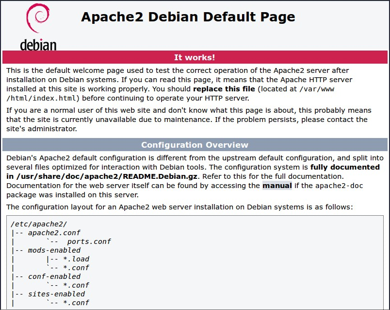

# 远程访问

## 远程访问简介

有时候您需要访问树莓派，但不使用连接显示器、键盘和鼠标。也许树莓派被嵌入在机器人中或安装在难以触及的地方。或者您可能没有多余的显示器。

### 在本地网络上的远程控制

从本地网络上的另一台设备远程控制您的树莓派，请使用以下服务之一：

* [SSH](https://www.raspberrypi.com/documentation/computers/remote-access.html#ssh)
* [VNC](https://www.raspberrypi.com/documentation/computers/remote-access.html#vnc)
* [Raspberry Pi connect](https://www.raspberrypi.com/documentation/computers/remote-access.html#raspberry-pi-connect)

SSH（Secure SHell）提供了对树莓派上终端会话的安全访问。VNC（Virtual Network Computing）提供了对树莓派桌面屏幕共享的安全访问。您只需要另一台计算机、本地网络和树莓派的本地 IP 地址。Raspberry Pi Connect 可安全地共享您的树莓派屏幕，且无需确认树莓派的 IP 地址。

### 在本地网络上在设备之间共享文件

NFS（网络文件系统）、SCP（安全复制协议）、Samba 等服务使您能够在本地网络上的设备之间共享文件，而无需直接控制远程设备。当您需要从另一台设备访问存储在一台设备上的数据时，这些服务可能会很有用。

### 通过互联网远程控制

要从连接到互联网的任何设备远程控制您的树莓派，您需要：

* 在树莓派上放开 SSH 或 VNC，可以通过互联网、内部 VPN，或使用 RealVNC 的云 VNC Viewer 等外部服务。
* 使用 Raspberry Pi Connect，这是由树莓派提供的免费屏幕共享服务。

## 查找树莓派的 IP 地址

大多数连接到树莓派的方法都需要您知道树莓派的本地 IP 地址。

分配给连接到局域网的任何设备一个 IP 地址。要使用 SSH 或 VNC 从另一台机器连接到树莓派，您需要知道树莓派的 IP 地址。如果连接了显示器，这很容易，还有许多方法可以从网络上的另一台机器远程查找它。

要查找树莓派的本地 IP 地址，请使用以下方法之一。

### 桌面

将鼠标悬停在系统托盘中的网络图标上，将显示一个工具提示。该工具提示会显示您当前连接的网络名称和 IP 地址。


### 命令行

运行以下命令将您的本地 IP 地址输出到命令行：

```
$ hostname -I
```

### 引导输出

如果您在树莓派上使用显示器，并且引导到命令行而不是桌面，则引导顺序将在登录提示符之前的最后几条输出信息中包含您的 IP 地址。

### 网络管理器

您可以使用内置的网络管理器 CLI（ nmcli ）来访问有关您的网络的详细信息。运行以下命令：

```
$ nmcli device show
```

您应该看到类似以下内容的输出：

```
GENERAL.DEVICE:                         wlan0
GENERAL.TYPE:                           wifi
GENERAL.HWADDR:                         D0:3B:FF:41:AB:8A
GENERAL.MTU:                            1500
GENERAL.STATE:                          100 (connected)
GENERAL.CONNECTION:                     exampleNetworkName
GENERAL.CON-PATH:                       /org/freedesktop/NetworkManager/ActiveConnection/2
IP4.ADDRESS[1]:                         192.168.1.42/24
IP4.GATEWAY:                            192.168.1.1
IP4.ROUTE[1]:                           dst = 192.168.1.0/24, nh = 0.0.0.0, mt = 600
IP4.ROUTE[2]:                           dst = 0.0.0.0/0, nh = 192.168.1.1, mt = 600
IP4.DNS[1]:                             192.168.1.3
IP6.ADDRESS[1]:                         ab80::11ab:b1fc:bb7e:a8a5/64
IP6.GATEWAY:                            --
IP6.ROUTE[1]:                           dst = ab80::/64, nh = ::, mt = 1024

GENERAL.DEVICE:                         lo
GENERAL.TYPE:                           loopback
GENERAL.HWADDR:                         00:00:00:00:00:00
GENERAL.MTU:                            65536
GENERAL.STATE:                          100 (connected (externally))
GENERAL.CONNECTION:                     lo
GENERAL.CON-PATH:                       /org/freedesktop/NetworkManager/ActiveConnection/1
IP4.ADDRESS[1]:                         127.0.0.1/8
IP4.GATEWAY:                            --
IP6.ADDRESS[1]:                         ::1/128
IP6.GATEWAY:                            --

GENERAL.DEVICE:                         p2p-dev-wlan0
GENERAL.TYPE:                           wifi-p2p
GENERAL.HWADDR:                         (unknown)
GENERAL.MTU:                            0
GENERAL.STATE:                          30 (disconnected)
GENERAL.CONNECTION:                     --
GENERAL.CON-PATH:                       --

GENERAL.DEVICE:                         eth0
GENERAL.TYPE:                           ethernet
GENERAL.HWADDR:                         D0:3B:FF:41:AB:89
GENERAL.MTU:                            1500
GENERAL.STATE:                          20 (unavailable)
GENERAL.CONNECTION:                     --
GENERAL.CON-PATH:                       --
WIRED-PROPERTIES.CARRIER:               off
IP4.GATEWAY:                            --
IP6.GATEWAY:                            --
```

此命令输出有关树莓派上可访问的各种网络接口的信息。检查 GENERAL.TYPE 行，以查看每个块描述的网络接口类型。例如，“ethernet”是设备上的以太网端口，“wifi”是一些设备内置的 Wi-Fi 芯片。根据设备访问互联网的方式，您将查看不同的输出块以查找您的 IP 地址：

* 如果您的设备使用 Wi-Fi 连接到互联网，请检查“wifi”块
* 如果您的设备使用以太网端口连接到互联网，请检查“ethernet”块

在确定了正确的网络接口块后，请查找名为 IP4.ADDRESS[1] 的字段以获取 IPv4 地址，或者查找名为 IP6.ADDRESS[1] 的字段以获取 IPv6 地址。您可以忽略这些字段中的斜杠和数字（例如 /24 ）。

在上面的示例中，树莓派使用 Wi-Fi 访问互联网。检查 GENERAL.TYPE 字段为“wifi”的块，以查找 IP 地址。在这种情况下，您可以使用 IP4.ADDRESS[1] 字段中的 IPv4 地址访问此设备： 192.168.1.42 。

### 使用 mDNS 解析 `raspberrypi.local` 。

Raspberry Pi OS 支持 Avahi 服务的多播 DNS。

如果您的设备支持 mDNS，您可以通过使用其主机名和 .local 后缀来访问您的树莓派。在新安装的 Raspberry Pi OS 上，默认主机名为 raspberrypi ，因此默认情况下，任何运行 Raspberry Pi OS 的树莓派都会响应：

```
$ ping raspberrypi.local
```

如果可以访问树莓派，则 ping 将显示其 IP 地址：

```
PING raspberrypi.local (192.168.1.131): 56 data bytes
64 bytes from 192.168.1.131: icmp_seq=0 ttl=255 time=2.618 ms
```

>**技巧**
>
>如果您使用 Raspberry Pi Configuration、 raspi-config 或 /etc/hostname 更改树莓派的系统主机名，Avahi 会更新 .local 的 mDNS 地址。如果您忘记了树莓派的主机名，您可以在另一台设备上安装 Avahi，然后使用 avahi-browse 浏览本地网络上的所有主机和服务。 

### 检查路由器的设备列表

在 Web 浏览器中，导航到您的路由器 IP 地址。然后，使用您的凭据登录。

>**技巧**
>
>您的路由器 IP 地址通常为 `http://192.168.1.1` ，但并非总是如此。您可能会在路由器的标签上找到路由器的地址和凭据。 

这将带您进入控制面板。浏览到连接设备列表或类似内容（所有路由器都不同），您应该能看到一些您认识的设备。一些设备被检测为 PC、平板电脑、手机、打印机等，因此您应该能识别一些并排除它们，以找出哪个是您的树莓派。

>**技巧**
>
>如果您用网线将您的树莓派连接到网络，请尝试在列表中筛选有线设备。应该会有较少的设备可供选择。 

### 查找带有 nmap 的设备

网络映射器命令 ( nmap ) 是用于网络发现的免费开源工具。可用于 Linux、macOS 和 Windows。

* 要在 Linux 上安装，请安装 nmap 软件包，例如 apt install nmap 。
* 要在 macOS 或 Windows 上安装，请参阅 nmap.org 下载页面。

要使用 nmap 扫描您的网络上的设备，您需要知道您连接到的子网。首先，找到您正在使用的计算机的本地 IP 地址：

* 在 Linux 上，将 hostname -I 输入到终端窗口中。
* 在 macOS 上，转到系统设置 > 网络，选择您的活动网络连接，然后单击“详细信息...”按钮
* 在 Windows 上，转到控制面板，然后在“网络和共享中心”下，单击“查看网络连接”，选择您的活动网络连接，然后单击“查看此连接的状态”

接下来，扫描整个子网以查找其他设备。大多数本地网络使用 IPv4，它使用四个数值为 1 到 255 之间的数字来表示每个 IP 地址。您子网上的设备都使用相同的前三个数字。例如，如果您的 IP 地址是 192.168.1.5 ，其他设备将使用类似 192.168.1.2 ， 192.168.1.6 和 192.168.1.200 的地址。要使用 nmap 扫描此子网，请传递字符串 192.168.1.0/24 ，该字符串覆盖子网范围 192.168.1.0 到 192.168.1.255 。使用 -sn 标志在整个子网范围上运行 ping 扫描：

```
$ sudo nmap -sn 192.168.1.0/24
```

>**技巧**
>
>根据您的本地网络速度，可能需要一分钟左右。 

Ping 扫描查询范围内所有 IP 地址是否有响应。对于每个响应 ping 的设备，输出显示主机名和 IP 地址如下：

```
Starting Nmap 6.40 ( http://nmap.org ) at 2014-03-10 12:46 GMT
Nmap scan report for hpprinter (192.168.1.2)
Host is up (0.00044s latency).
Nmap scan report for Gordons-MBP (192.168.1.4)
Host is up (0.0010s latency).
Nmap scan report for ubuntu (192.168.1.5)
Host is up (0.0010s latency).
Nmap scan report for raspberrypi (192.168.1.8)
Host is up (0.0030s latency).
Nmap done: 256 IP addresses (4 hosts up) scanned in 2.41 seconds
```

上面的输出显示主机名为 raspberrypi 的设备具有 IP 地址 192.168.1.8 。

### 使用智能手机应用程序查找设备

Fing 应用程序是一款免费的智能手机网络扫描器。它适用于 Android 和 iOS。

1. 将手机连接到与您的树莓派相同的网络。
2. 当您打开 Fing 应用时，请触摸屏幕右上角的刷新按钮。
3. 几秒钟后，您应该看到一个列出所有连接到您的网络的设备的列表。
4. 滚动到制造商为"Raspberry Pi"的条目。 IP 地址显示在条目左下角，MAC 地址显示在条目右下角。

## 使用 SSH 访问远程终端

您可以使用安全外壳（SSH）协议从同一网络上的另一台计算机远程访问树莓派的终端。

### 启用 SSH 服务器

默认情况下，Raspberry Pi OS 禁用了 SSH 服务器。可以通过以下一种方式启用 SSH：

#### 在桌面上

1. 从“首选项”菜单中启动树莓派配置。
2. 转到“接口”选项卡。
3. 选择“SSH”旁边的“已启用”。
4. 单击“确定”。

#### 刷新全新的操作系统映像时

在全新安装的 Raspberry Pi OS 上配置 SSH：

1. 按照 Imager 指南中的说明进行安装。
2. 在 OS 自定义步骤中，导航到服务选项卡。
3. 选中复选框以启用 SSH。
4. 选择密码身份验证以使用与在物理上使用树莓派时相同的用户名和密码登录。选择仅允许公钥身份验证以配置用于无密码登录的 SSH 密钥。

#### 从终端

1. 在终端窗口中输入 sudo raspi-config 。
2. 选择 Interfacing Options 。
3. 导航到并选择 SSH 。
4. 选择 Yes 。
5. 选择 Ok 。
6. 选择 Finish 。

#### 手动

1. 在引导分区中创建一个名为 ssh 的空文件：

    ```
    $ sudo touch /boot/firmware/ssh
    ```
2. 重新启动计算机：

    ```
    $ sudo reboot
    ```

### 连接到一个 SSH 服务器

在您的计算机上打开一个终端窗口，并输入以下命令，将 `<ip address>` 占位符替换为您要连接到的树莓派的 IP 地址，将 `<username>` 替换为您的用户名：

```
$ ssh <username>@<ip address>
```

当连接成功时，您将看到一个安全警告。输入 yes 继续。您只会在第一次连接时看到此警告。

在提示时输入您的账户密码。

您现在应该看到了树莓派的命令提示符：

```
<username>@<hostname> ~ $
```

您现在已远程连接到树莓派，并可以执行命令。

>**注意**
>
>如果收到错误消息 connection timed out，则可能输入的树莓派 IP 地址不正确。请检查树莓派的 IP 地址。 

#### 通过 SSH 转发 X11

>**注意**
>
>在树莓派 4 和 5 上，Raspberry Pi OS Bookworm 默认使用 Wayland 窗口服务器。只有在使用 X 窗口服务器时才能转发 X11。要在 X11 上启用窗口转发，请在 Raspberry Pi Configuration 中将桌面切换到 X 窗口服务器。

>**注意**
>
>在许多桌面环境中都不再默认安装 X11。可安装第三方 X 服务器，如 XQuartz，以使用 X11 转发。

X11 可以通过 SSH 启用图形应用程序。传递 -Y 参数以通过 SSH 转发 X 会话：

```
$ ssh -Y <username>@<ip address>
```

经过身份验证后，您将像往常一样看到命令行。但是，您还可以打开图形窗口，X 服务器可以为您渲染。例如，键入以下命令以启动 Geany 窗口：

```
$ geany &
```

### 配置无密码的 SSH

要远程访问您的树莓派而无需每次连接时提供密码，请使用 SSH 密钥对。

#### 使用 Raspberry Pi Imager 预配置 OS 镜像

使用 Raspberry Pi Imager 配置启动镜像时，您可以预配置 SSH 密钥。您可以生成新的 SSH 密钥对或使用现有的 SSH 密钥。

1. 按照使用 Imager 指南安装来配置您的启动镜像。
2. 在 OS 自定义步骤中，导航到服务选项卡，选中启用 SSH 复选框。
3. 选择仅允许公钥身份验证单选按钮。如果您已经在 ~/.ssh/id_rsa.pub 中存储了一个 SSH 公钥，Imager 会自动使用该公钥来预填文本框。如果 Imager 没有找到 SSH 公钥，您可以单击“运行 SSH-KEYGEN”按钮生成新的密钥对。

#### 手动配置 SSH 密钥

如果您已经安装了 Raspberry Pi OS，您可以更新现有配置以使用 SSH 密钥认证。

#### 检查现有的 SSH 公钥

要检查远程连接到树莓派的计算机上是否存在现有的 SSH 公钥，请运行以下命令：

```
$ ls ~/.ssh
```

如果您看到名为 id_ed25519.pub ， id_rsa.pub 或 id_dsa.pub 的文件，则已经拥有一个 SSH 密钥。跳过 SSH 密钥对生成，并继续将 SSH 密钥添加到您的 SSH 身份列表中。

#### 生成新的 SSH 密钥对

>**技巧**
>
>本指南提供了生成新 RSA 密钥的说明。为了增加安全性，您可以选择生成一个 Ed25519 密钥。在引用您的公钥和私钥文件名称时，将 -t ed25519 传递给 ssh-keygen ，并将 rsa 替换为 ed25519 以使用 Ed25519 密钥。 

生成新的 SSH 密钥对，请输入以下命令：

```
$ ssh-keygen
```

当询问要将密钥保存在哪里时，请按 Enter 键使用默认位置 ~/.ssh/id_rsa 。

当询问是否要使用可选密语时，请按 Enter 键不使用密语。

运行以下命令以检查 .ssh 目录的内容：

```
$ ls ~/.ssh
```

您应该看到文件 id_rsa 和 id_rsa.pub ：

```
authorized_keys  id_rsa  id_rsa.pub  known_hosts
```

id_rsa 文件包含您的私钥。请将其安全保存在用于远程连接到 树莓派的计算机上。

id_rsa.pub 文件包含您的公钥。您将与您的树莓派共享此密钥。当您远程连接到树莓派 时，它将使用此密钥来验证您的身份。

#### 将 SSH 密钥添加到您的 SSH 身份列表中

启动 SSH 代理：

```
$ eval "$(ssh-agent -s)"
```

接下来，使用以下命令将您的关键标识添加到 ssh-agent 中：

```
$ ssh-add ~/.ssh/id_rsa
```

#### 将公钥复制到您的树莓派

在您用于远程连接到树莓派的计算机上，使用以下命令将您的公钥安全地复制到树莓派：

```
$ ssh-copy-id <username>@<ip address>
```

当提示时，在树莓派上输入用户账户的密码。现在您可以连接到树莓派而无需输入密码。

#### 手动将公钥复制到您的树莓派

如果您的操作系统不支持 ssh-copy-id ，您可以使用 scp 来复制您的公钥。

首先，在您的树莓派上，创建 Linux 希望找到密钥的目录：

```
$ mkdir .ssh
```

然后，为 .ssh 目录配置适当的权限：

```
$ chmod 700 .ssh
```

在您的常用计算机上，使用 scp 将您的公钥复制到名为 .ssh/authorized_keys 的文件中，存储在您的树莓派上：

```
$ scp .ssh/id_rsa.pub <username>@<ip address>:.ssh/authorized_keys
```

>**技巧**
>
>上面的命令假定您以前从未授权任何密钥访问您的树莓派。如果您之前至少添加了一个密钥，您应该在 authorized_keys 文件的末尾添加包含公钥的新行，以保留现有的密钥。 

在提示时，在树莓派上输入您的用户账户的密码。

然后，在您的树莓派上，配置 authorized_keys 文件的权限：

```
$ chmod 644 .ssh/authorized_keys
```

您现在可以在不输入密码的情况下连接到您的树莓派。

## 使用 VNC 进行屏幕共享

有时候在物理上操作设备并不方便。虚拟网络计算（VNC）可让您通过另一台设备控制某台设备的桌面。

VNC 依赖于客户端和服务器。客户端运行在您可以直接与之交互的设备上，例如个人笔记本电脑、台式机、平板电脑或手机。服务器运行在您的树莓派上。当您使用 VNC 时，客户端将键盘和鼠标事件传输到服务器。服务器在您的树莓派上执行这些事件，并将屏幕更新返回给客户端。

VNC 客户端在窗口中显示您的树莓派的桌面。您可以像在树莓派本身上工作一样与桌面交互。

Raspberry Pi OS 包含 wayvnc。它提供了一个 VNC 服务器，您可以在设备首选项中启用。

在您的树莓派上使用 VNC 之前，您必须启用 VNC 服务器。

### 启用 VNC 服务器

Raspberry Pi OS 支持在图形界面和命令行两种方式下启用 VNC 服务器。

>**技巧**
>
>启用后，您可以在 /etc/wayvnc/ 访问您的 WayVNC 配置。 

#### 图形化启用 VNC 服务器

1. 在树莓派上启动图形桌面。
2. 单击桌面系统托盘中的树莓派图标。
3. 从菜单中选择 Preferences > Raspberry Pi Configuration。
4. 导航到 Interfaces 选项卡。
5. 单击活动位置旁边的单选按钮以 VNC。
6. 单击“确定”按钮以保存配置更改。

#### 在命令行上启用 VNC 服务器。

使用 raspi-config 命令行启用 VNC 服务器。

1. 打开 raspi-config 并输入以下内容：

    ```
    $ sudo raspi-config
    ```
2. 导航至接口选项。按 Enter 选择。
3. 选择 VNC。按 Enter 选择。
4. 在您想要启用 VNC 服务器吗? 下，突出显示 <Yes> 并按 Enter 。
5. 按 Enter 返回菜单。按 Esc 退出 raspi-config 。

### 连接到 VNC 服务器

要连接到您的树莓派，您需要以下内容：

* 您的树莓派和运行 VNC 客户端的设备连接到同一网络（例如家庭无线网络或 VPN）
* 您的树莓派的主机名或 IP 地址
* 树莓派上账户的有效用户名和密码组合

如果您不知道设备的 IP 地址，请参阅有关查找 IP 地址的说明。

1. 下载 TigerVNC。您可以从其 GitHub 存储库的 Releases 页面安装最新版本。单击最新版本中的链接，找到适用于您平台的二进制文件。Windows 用户应下载 exe ；macOS 用户应下载 dmg ；Linux 用户应安装 jar 。
2. 在您的客户端设备上启动 TigerVNC。在 macOS 和 Windows 上，您可以双击二进制文件。在 Linux 上，安装 java，然后运行 `java -jar VncViewer-<version>.jar` ，将 `<version>` 占位符替换为您下载的版本。
3. 在“VNC 服务器”字段中输入您树莓派的 IP 地址。
4. 单击“Options”按钮。导航到“Input”选项卡。选中“在没有光标时显示点”旧版，以确保您始终可以在 TigerVNC 中看到光标。
5. 单击“Connect”按钮以与服务器建立连接。
    * 如果 TigerVNC 警告“主机名与服务器证书不匹配”，请单击“是”按钮继续。
    * 如果 TigerVNC 警告您“证书由未知机构签署”，请单击“是”按钮以为您的树莓派授予异常。
6. 在提示输入用户名和密码时，请输入您的凭据。
7. 单击“确定”按钮以与 VNC 服务器进行身份验证。如果您的凭据正确，TigerVNC 应打开一个包含与树莓派上您账户对应的桌面的窗口。您应该能够移动鼠标和键盘以输入文本并与桌面交互。

## 通过 Raspberry Pi Connect 进行屏幕共享

您可以使用 Raspberry Pi Connect 从另一设备的浏览器远程访问树莓派的桌面。 Raspberry Pi Connect 会自动处理配置，因此您无需查找树莓派的本地 IP 地址或修改本地网络。

欲了解更多信息，请参阅 Connect 文档。

## 使用 SCP 共享文件

安全复制协议（ scp ）通过 SSH 发送文件。您可以使用 scp 在您的树莓派和另一台计算机之间复制文件。

要使用 scp ，请查找您树莓派的 IP 地址。

### 将文件复制到您的树莓派

要将名为 myfile.txt 的文件从您的个人计算机复制到树莓派上用户的主文件夹，请从包含 myfile.txt 的目录中运行以下命令，将 `<username>` 占位符替换为您用于登录到树莓派的用户名，将 `<pi_ip_address>` 占位符替换为您的树莓派的 IP 地址：

```
$ scp myfile.txt <username>@<pi_ip_address>:
```

要将文件复制到特定目录，请在 scp 命令中的 `:` 后附加目录路径。在运行 scp 之前创建文件夹，因为 scp 不会自动创建文件夹。例如，以下命令将名为 myfile.txt 的文件复制到用户主文件夹中的 project/ 目录中：

```
$ scp myfile.txt <username>@<pi_ip_address>:project/
```

### 从您的树莓派复制文件

要将名为 myfile.txt 的文件从树莓派上的用户主目录复制到另一台计算机的当前目录，请运行以下命令：

```
$ scp <username>@<pi_ip_address>:myfile.txt .
```

### 一次性使用一个命令复制多个文件

复制多个文件，请在单个命令中列出以空格分隔的文件名：

```
$ scp myfile.txt myfile2.txt <username>@<pi_ip_address>:
```

或者，使用通配符复制所有匹配特定筛选器的文件。以下命令复制所有以 .txt 结尾的文件：

```
$ scp *.txt <username>@<pi_ip_address>:
```

以下命令复制所有以 m 开头的文件：

```
$ scp m* <username>@<pi_ip_address>:
```

以下命令复制所有以 m 开头且以 .txt 结尾的文件：

```
$ scp m*.txt <username>@<pi_ip_address>:
```

```
$ scp "my file.txt" <username>@<pi_ip_address>:
```

### 复制文件夹

要复制文件夹及其所有内容，请传递文件夹名称和 -r （递归）参数：

```
$ scp -r project/ <username>@<pi_ip_address>:
```

## 使用 rsync 在计算机之间同步文件夹

您可以使用 rsync 在计算机之间同步文件夹。例如，您可以使用 rsync 将树莓派拍摄的新照片自动传输到个人电脑。

在配置 rsync 之前，确定以下数值的值：

* `<pi_ip_address>` ：您树莓派的本地 IP 地址：有关更多信息，请参阅查找您的树莓派的 IP 地址
* `<pi_username>` ：您用于登录到树莓派的用户名
* `<pi_folder_name>` ：您要从树莓派复制文件的文件夹名称
* `<pc_folder_name>` ：您想要在个人计算机上同步的文件夹名称

要配置 rsync 以同步文件，请在个人计算机上完成以下步骤，并使用上面确定的值替换命令中的占位符：

1. 创建您想要同步到的文件夹：

    ```
    $ mkdir <pc_folder_name>
    ```
2. 将文件同步到带有 rsync 的文件夹：

    ```
    $ rsync -avz -e ssh <pi_username>@<pi_ip_address>:<pi_folder_name>/ <pc_folder_name>/
    ```

此命令将所有文件从您的树莓派上的选定文件夹复制到个人计算机上的选定文件夹。如果多次运行该命令， rsync 会跟踪您已经下载的文件并跳过它们。如果您在树莓派上删除或修改已同步的文件， rsync 会相应地更新个人计算机上的文件。

## 网络文件系统（NFS）

网络文件系统（NFS）允许您在一个网络计算机上共享一个目录，该目录与同一网络上的其他计算机或设备共享。目录所在的计算机称为服务器，连接到该服务器的计算机或设备称为客户端。客户端通常 mount 共享目录，使其成为其自己目录结构的一部分。共享目录是共享资源或网络共享的一个示例。

NFS 是在 Linux/Unix 环境中创建简单 NAS（网络附加存储）的流行方式。

NFS 可能更适合于更为永久的网络挂载目录，例如 /home 目录或经常访问的共享资源。如果您想要一个让访客用户可以轻松连接的网络共享，Samba 更适合这项任务。在各种操作系统中，用于临时挂载和分离 Samba 共享的工具更容易获得。

在部署 NFS 之前，您应该熟悉：

* Linux 文件和目录权限
* 挂载和卸载文件系统

### 设置基本的 NFS 服务器

使用以下命令安装所需的软件包：

```
$ sudo apt install nfs-kernel-server
```

为了更容易维护，我们将所有 NFS 导出隔离在单个目录中，在该目录中，将使用 --bind 选项挂载真实目录。

假设我们想要导出用户的家目录，这些目录位于 /home/users 。首先，我们创建导出文件系统：

```
$ sudo mkdir -p /export/users
```

>**技巧**
>
>如果您计划配置 LDAP/NIS 身份验证，请跳过下面的 chmod 步骤。 

授予 /export 和 /export/users 读取、写入和执行权限（ 777 ），这样您就可以在没有 LDAP/NIS 身份验证的情况下从客户端访问 NFS 共享：

```
$ chmod -R 777 777 /export
```

接下来，使用以下命令挂载真实 users 目录：

```
$ sudo mount --bind /home/users /export/users
```

为了避免在每次重启后重新输入，我们将以下行添加到 /etc/fstab 中：

```
/home/users    /export/users   none    bind  0  0
```

有三个与 NFS 服务器相关的配置文件：

1. `/etc/default/nfs-kernel-server`
2. `/etc/default/nfs-common`
3. `/etc/exports`

目前， /etc/default/nfs-kernel-server 中唯一重要的选项是 NEED_SVCGSSD 。默认设置为 "no" ，这很好，因为这次我们不会激活 NFSv4 安全性。

为了使 ID 名称自动映射，文件 /etc/idmapd.conf 必须在客户端和服务器上都存在，并且具有相同的内容和正确的域名。此外，该文件应在 Mapping 部分中包含以下行：

```
[Mapping]

Nobody-User = nobody
Nobody-Group = nogroup
```

但是，请注意，客户端可能对 Nobody-User 和 Nobody-Group 有不同的要求。例如，在 RedHat 变体上，它们都是 nfsnobody 。如果不确定，请通过以下命令检查 nobody 和 nogroup 是否存在：

```
$ cat /etc/passwd
$ cat /etc/group
```

这样，服务器和客户端不需要用户共享相同的 UID/GUID。对于使用基于 LDAP 的身份验证的用户，在您的客户端中添加以下行：

```
[Translation]

Method = nsswitch
```

这将导致 idmapd 知道要查看 nsswitch.conf 以确定它应该查找凭据信息的位置。如果您已经使用 LDAP 身份验证， nsswitch 不需要进一步解释。

要将我们的目录导出到本地网络 192.168.1.0/24 ，请在 /etc/exports 中添加以下两行：

```
/export       192.168.1.0/24(rw,fsid=0,insecure,no_subtree_check,async)
/export/users 192.168.1.0/24(rw,nohide,insecure,no_subtree_check,async)
```

#### 端口映射锁定（可选）

您的 NFS 上的文件对网络上的任何人都是开放的。作为安全措施，您可以限制对指定客户端的访问。

将以下行添加到 /etc/hosts.deny ：

```
rpcbind mountd nfsd statd lockd rquotad : ALL
```

通过首先阻止所有客户端，只有在下面添加的 /etc/hosts.allow 中的客户端才能访问服务器。

现在将以下行添加到 /etc/hosts.allow 中：

```
rpcbind mountd nfsd statd lockd rquotad : <list of IPv4s>
```

其中 `<list of IPv4s>` 是服务器和所有客户端的 IP 地址列表。（由于 rpcbind 中的限制不喜欢主机名，这些必须是 IP 地址。）请注意，如果您设置了 NIS，您可以将这些添加到同一行中。

请确保授权 IP 地址列表包括 localhost 地址（ 127.0.0.1 ），因为 Ubuntu 的最新版本中的启动脚本使用 rpcinfo 命令来发现 NFSv3 支持，如果 localhost 无法连接，这将被禁用。

最后，要使更改生效，请重新启动服务：

```
$ sudo systemctl restart nfs-kernel-server
```

### 配置 NFS 客户端

现在您的服务器正在运行，您需要设置任何客户端以便能够访问它。首先，安装所需的软件包：

```
$ sudo apt install nfs-common
```

在客户端上，我们可以使用一个命令挂载完整的导出树：

```
$ mount -t nfs -o proto=tcp,port=2049 <nfs-server-IP>:/ /mnt
```

您还可以指定 NFS 服务器主机名，而不是其 IP 地址，但在这种情况下，您需要确保主机名可以在客户端上解析为 IP。确保这将始终解析的一种稳健方法是使用 /etc/hosts 文件。

请注意，在 NFSv4 中， `<nfs-server-IP>:/export` 不是必需的，就像在 NFSv3 中一样。根导出 `:/` 默认导出为 fsid=0 。

我们还可以挂载导出的子树：

```
$ mount -t nfs -o proto=tcp,port=2049 <nfs-server-IP>:/users /home/users
```

为了确保在每次重启时都挂载这个，请将以下行添加到 /etc/fstab ：

```
<nfs-server-IP>:/   /mnt   nfs    auto  0  0
```

如果在挂载后， /proc/mounts appears 中的条目为 `<nfs-server-IP>://` （带有两个斜杠），那么您可能需要在 /etc/fstab 中指定两个斜杠，否则 umount 可能会抱怨找不到该挂载点。

#### 端口映射锁定（可选）

将以下行添加到 /etc/hosts.deny ：

```
rpcbind : ALL
```

通过首先阻止所有客户端，只有在下面添加的 /etc/hosts.allow 中的客户端才能访问服务器。

现在将以下行添加到 /etc/hosts.allow 中：

```
rpcbind : <NFS server IP address>
```

其中 `<NFS server IP address>` 是服务器的 IP 地址。

### 配置复杂的 NFS 服务器

NFS 用户权限基于用户 ID（UID）。客户端上任何用户的 UID 必须与服务器上的 UID 匹配，以便用户能够访问。通常的做法有：

* 手动同步密码文件
* 使用 LDAP
* 使用 DNS
* 使用 NIS

请注意，在具有 root 访问权限的系统上，您必须小心：该用户可以更改系统上的 UID 以允许自己访问任何人的文件。本页面假定管理团队是唯一具有 root 访问权限的群组，并且他们都是受信任的。其他任何情况都代表更高级的配置，这里不会涉及。

#### 群组权限

用户的文件访问权限取决于他们在客户端组中的成员资格，而不是在服务器上。但是，有一个重要的限制：从客户端传递给服务器的最多有 16 个组，如果用户在客户端是超过 16 个组的成员，则某些文件或目录可能会意外地无法访问。

#### DNS（可选，仅在使用 DNS 时）

将任何客户端名称和 IP 地址添加到 /etc/hosts 中。（服务器的 IP 地址应该已经存在。）这样即使 DNS 出现问题，NFS 仍然可以正常工作。或者您可以选择依赖 DNS - 这取决于您。

#### NIS（可选，仅在使用 NIS 时）

这适用于使用 NIS 的客户端。否则，您将无法使用 netgroups，并且应在 /etc/exports 中指定单独的 IP 或主机名。阅读 man netgroup 中的 BUGS 部分以获取更多信息。

首先，编辑 /etc/netgroup 并添加一行来对您的客户端进行分类（此步骤不是必需的，但为方便起见）：

```
myclients (client1,,) (client2,,) ...
```

其中 myclients 是 netgroup 名称。

运行此命令以重建 NIS 数据库：

```
$ sudo make -C /var/yp
```

文件名 yp 指的是 Yellow Pages，即 NIS 的前身。

#### Portmap 锁定（可选）

将以下行添加到 /etc/hosts.deny ：

```
rpcbind mountd nfsd statd lockd rquotad : ALL
```

首先阻止所有客户端，只有在 /etc/hosts.allow （下面添加）中的客户端才能访问服务器。

考虑添加以下行到 /etc/hosts.allow ：

```
rpcbind mountd nfsd statd lockd rquotad : <list of IPs>
```

其中 `<list of IPs>` 是服务器和所有客户端的 IP 地址列表。由于 rpcbind 的限制，这些必须是 IP 地址。请注意，如果您设置了 NIS，可以将这些添加到同一行。

#### 软件包安装和配置

安装必要的软件包：

```
$ sudo apt install rpcbind nfs-kernel-server
```

编辑 /etc/exports 并添加共享：

```
/home @myclients(rw,sync,no_subtree_check)
/usr/local @myclients(rw,sync,no_subtree_check)
```

上面的示例共享 /home 和 /usr/local 给 myclients netgroup 中的所有客户端。

```
/home 192.168.0.10(rw,sync,no_subtree_check) 192.168.0.11(rw,sync,no_subtree_check)
/usr/local 192.168.0.10(rw,sync,no_subtree_check) 192.168.0.11(rw,sync,no_subtree_check)
```

上面的示例将 /home 和 /usr/local 共享给具有静态 IP 地址的两个客户端。如果您希望改为允许私有网络中指定 IP 地址范围内的所有客户端访问，请考虑以下内容：

```
/home 192.168.0.0/255.255.255.0(rw,sync,no_subtree_check)
/usr/local 192.168.0.0/255.255.255.0(rw,sync,no_subtree_check)
```

在这里， rw 使共享变为读/写模式，而 sync 要求服务器只在任何更改已刷新到磁盘后才回复请求。这是最安全的选项； async 更快，但危险。强烈建议您阅读 man exports ，如果您正在考虑其他选项。

设置完 /etc/exports 后，导出共享：

```
$ sudo exportfs -ra
```

每当修改 /etc/exports 时，您都需要运行此命令。

#### 重新启动服务

重新启动 rpcbind 和 NFS 以使更改生效：

```
$ sudo systemctl restart rpcbind
$ sudo systemctl restart nfs-kernel-server
```

#### 要考虑的安全事项

除了上面讨论的 UID 问题之外，还应注意到攻击者可能会冒充允许映射共享的机器，从而允许他们创建任意 UID 以访问您的文件。解决此问题的一个潜在方法是 IPSec。您可以设置所有域成员仅通过 IPSec 相互通信，这将有效地验证您的客户端是否为其所说的那个。

IPSec 通过使用服务器的公钥加密到服务器的流量，服务器用客户端的公钥发送回所有回复。流量使用各自的私钥解密。如果客户端没有应该拥有的密钥，它就无法发送或接收数据。

IPSec 的替代方案是物理上分离的网络。这需要一个单独的网络交换机和单独的以太网卡，并且需要对该网络进行物理安全保护。

### 故障排除

在加密的主目录中挂载 NFS 共享只有在成功登录并解密主目录后才能正常工作。这意味着在启动时使用/etc/fstab 挂载 NFS 共享是行不通的，因为在挂载时主目录尚未解密。有一种简单的方法可以解决这个问题，即使用符号链接：

1. 创建一个替代目录来挂载 NFS 共享：

```
$ sudo mkdir /nfs
$ sudo mkdir /nfs/music
```

1. 编辑 /etc/fstab 以将 NFS 共享挂载到该目录中：

```
nfsServer:music    /nfs/music    nfs    auto    0 0
```

1. 在您的主目录内创建一个符号链接，指向实际的挂载位置。例如，在这种情况下，首先删除已经存在的 Music 目录：

```
$ rmdir /home/user/Music
$ ln -s /nfs/music/ /home/user/Music
```

## Samba（SMB/CIFS）

Samba 是 Server Message Block（SMB）网络协议的免费软件重新实现。使用 Samba，您可以在 Windows、macOS 和 Linux 机器之间共享文件夹。

### 在您的树莓派上安装 Samba

默认情况下，Raspberry Pi OS 不包含 Samba。要在您的树莓派上安装 Samba，请运行以下命令，该命令安装您运行 Samba 服务器或客户端所需的所有依赖项：

```
$ sudo apt update
$ sudo apt install samba samba-common-bin smbclient cifs-utils
```

### 从 Windows 共享文件夹

首先，您需要在 Windows 设备上共享一个文件夹。

#### 打开共享功能

1. 单击系统托盘，从菜单中选择“网络和共享中心”。
2. 选择“更改高级共享设置”。
3. 选择“打开网络发现”。
4. 选择打开文件和打印机共享。
5. 单击保存按钮以保存更改。

#### 共享文件夹

跟随这些步骤在 Windows 上共享文件夹：

1. 右键单击要共享的文件夹，然后选择属性。
2. 选择共享选项卡。
3. 单击“高级共享”按钮。
4. 选择“共享此文件夹”；默认情况下，Windows 使用文件夹名称作为共享名称。
5. 单击“权限”按钮。
6. 配置“每个人”和“完全控制”权限。
7. 单击“确定”按钮以离开权限页面。
8. 再次单击“确定”按钮以离开高级共享页面。
9. 选择“安全”选项卡。
10. 配置“每个人”和“完全控制”权限。
11. 单击“确定”按钮。

现在应该共享文件夹了。您可以通过在权限和安全性页面上更改权限来修改共享文件夹权限。

#### Windows 10 共享向导

在 Windows 10 上有一个共享向导，可以帮助完成其中的一些步骤。

1. 从“开始”菜单中运行计算机管理应用程序。
2. 选择“共享文件夹” > “共享”。
3. 单击鼠标右键，选择“新建共享”以开始共享向导。
4. 单击“下一步”按钮。
5. 选择要共享的文件夹，然后单击“下一步”按钮。
6. 单击“下一步”以使用共享默认设置，或选择“自定义”并设置所需权限。
7. 点击“确定”按钮。
8. 点击“完成”按钮以共享文件夹。

#### 在树莓派上挂载文件夹。

在 Linux 中，挂载是将文件夹附加到位置的过程，因此我们首先需要该位置。

```
$ mkdir windowshare
```

现在，我们需要将远程文件夹挂载到该位置。远程文件夹是 Windows PC 的主机名或 IP 地址，以及在共享时使用的共享名称。我们还需要提供将用于访问远程计算机的 Windows 用户名。不要忘记用你的 Raspberry Pi OS 用户名替换 `<username>` 占位符。

```
$ sudo mount.cifs //<hostname or IP address>/<shared windows folder> /home/<username>/windowshare -o user=<name>
```

您现在应该能够在树莓派上查看 Windows 共享的内容。

```
$ ls windowshare/
```

#### "主机已关闭" 错误

当 SMB 协议版本不匹配且 Linux Samba 客户端返回误导性错误消息时会发生此错误。默认情况下，Raspberry Pi OS 使用 2.1 及以上版本，与 Windows 7 及更高版本兼容。包括一些 NAS 在内的旧版设备可能需要 1.0 版本。要解决此错误，请在您的挂载命令中添加一个版本条目（例如 ,vers=1.0 ）：

```
$ sudo mount.cifs //IP/share /mnt/point -o user=<uname>,vers=1.0
```

您可能需要尝试不同的版本以与服务器版本匹配。可能的值包括：

| 版本 | 说明                                                                |
| ------ | --------------------------------------------------------------------- |
| 1.0  | 旧版的 CIFS/SMBv1 协议                                              |
| 2.0  | SMBv2.002 协议。Windows Vista Service Pack 1 和 Windows Server 2008 |
| 2.1  | SMBv2.1 协议。Microsoft Windows 7 和 Windows Server 2008R2          |
| 3.0  | SMBv3.0 协议。Microsoft Windows 8 和 Windows Server 2012            |
| 3.02 | SMBv3.0.2 协议。Microsoft Windows 8.1 和 Windows Server 2012R2      |
| 3.11 | SMBv3.1.1 协议。Microsoft Windows 10 和 Windows Server 2016         |
| 3    | SMBv3.0 协议版本及以上                                              |

### 从您的树莓派共享文件夹

首先，创建一个要共享的文件夹。此示例在当前用户的 home 文件夹中创建一个名为 shared 的文件夹：

```
$ cd ~
$ mkdir shared
$ chmod 0740 shared
```

现在我们需要告诉 Samba 关于您的默认用户账户在访问该文件夹时。在提示时，请输入您的密码，并用您的主用户账户的用户名替换 `<username>` 占位符：

```
$ sudo smbpasswd -a <username>
```

现在我们需要告诉 Samba 共享这个文件夹，使用 Samba 配置文件。

```
sudo nano /etc/samba/smb.conf
```

在文件末尾，添加以下内容以共享文件夹，为远程用户提供读写权限。用你的树莓派上主用户账户的用户名替换 `<username>` 占位符：

```
[share]
    path = /home/<username>/shared
    read only = no
    public = yes
    writable = yes
```

在同一文件中，找到 workgroup 这一行，如有必要，将其更改为本地 Windows 网络工作组的名称。

```
workgroup = <your workgroup name here>
```

共享文件夹现在应该会出现在网络上的 Windows 或 macOS 设备上。输入您的树莓派用户名和密码以挂载文件夹。

## 设置 Apache Web 服务器

Apache 是一款流行的 Web 服务器应用程序，您可以在树莓派上安装它以允许其提供网页。

单独使用，Apache 可以通过 HTTP 提供 HTML 文件，并且通过附加模块可以使用脚本语言（如 PHP）提供动态网页。

### 安装 Apache

首先，通过在终端中输入以下命令来更新可用软件包：

```
sudo apt update
```

然后，使用此命令安装 apache2 软件包：

```
sudo apt install apache2 -y
```

### 测试 Web 服务器

默认情况下，Apache 在 Web 文件夹中放置一个测试 HTML 文件。当您在树莓派本身上浏览到 `http://localhost/` ，或者在网络中的另一台计算机上浏览到 `http://192.168.1.10` （无论树莓派的 IP 地址是什么）时，将提供此默认网页。要查找树莓派的 IP 地址，请在命令行中键入 hostname -I （或阅读有关查找 IP 地址的更多信息）。

在树莓派上或网络中的另一台计算机上浏览到默认网页，您应该看到以下内容：



这意味着 Apache 正在运行！

#### 更改默认网页

此默认网页只是文件系统上的一个 HTML 文件。它位于 /var/www/html/index.html 。

在终端窗口中导航到此目录，并查看其中的内容：

```
cd /var/www/html
ls -al
```

这将向您展示：

```
total 12
drwxr-xr-x  2 root root 4096 Jan  8 01:29 .
drwxr-xr-x 12 root root 4096 Jan  8 01:28 ..
-rw-r--r--  1 root root  177 Jan  8 01:29 index.html
```

这表明默认情况下， /var/www/html/ 中有一个名为 index.html 的文件，由 root 用户拥有（就像包含文件的文件夹一样）。要编辑该文件，您需要将其所有权更改为您自己的用户名。使用以下命令更改文件的所有者，将 `<username>` 占位符替换为您的主用户账户的用户名：

```
$ sudo chown <username>: index.html
```

您现在可以尝试编辑此文件，然后刷新浏览器以查看网页更改。如果您了解 HTML，可以将自己的 HTML 文件和其他资产放入此目录，并将它们作为网站在本地网络上提供。

### 为 Apache 安装 PHP

要允许您的 Apache 服务器处理 PHP 文件，您需要安装最新版本的 PHP 和 Apache 的 PHP 模块。键入以下命令以安装这些：

```
sudo apt install php libapache2-mod-php -y
```

现在删除 index.html 文件：

```
sudo rm index.html
```

并创建文件 index.php ：

```
sudo nano index.php
```

将一些 PHP 内容放入其中：

```
<?php echo "hello world"; ?>
```

现在保存并刷新您的浏览器。您应该看到“hello world”。这不是动态的，但仍由 PHP 提供。尝试一些动态内容：

```
<?php echo date('Y-m-d H:i:s'); ?>
```

或显示您的 PHP 信息：

```
<?php phpinfo(); ?>
```

## 在树莓派上通过网络启动

您可以设置一个 DHCP/TFTP 服务器，这将允许您从网络引导树莓派 3 或 4。

说明假定您有一个现有的家庭网络，并且您想要使用树莓派作为服务器。您还需要另一个树莓派 3 或 4 作为客户端进行引导。只需要一个 SD 卡，因为在初始客户端配置后，客户端将从服务器引导。

>**注意**
>
>由于网络设备和路由器的种类繁多，我们无法保证网络引导能在任何设备上正常工作。我们收到报告称，如果无法使网络引导正常工作，可以尝试在网络上禁用 STP 帧来帮助解决问题。 

### 配置网络启动客户端

#### 树莓派 3 Model B

>**注意**
>
>本部分仅适用于树莓派 3 Model B，因为树莓派 3 Model B+ 在出厂时已启用网络启动。 

在树莓派 3 Model B 进行网络启动之前，需要从带有配置选项的 SD 卡启动，以启用 USB 启动模式。 这将在树莓派 SoC 的 OTP（一次可编程）存储器中设置一个位，从而启用网络引导。 完成此操作后，树莓派 3B 将尝试从 USB 和网络启动，如果无法从 SD 卡启动。

以通常方式在 SD 卡上安装 Raspberry Pi OS Lite 或带桌面的 Raspberry Pi OS。 接下来，使用以下命令启用 USB 启动模式：

```
$ echo program_usb_boot_mode=1 | sudo tee -a /boot/firmware/config.txt
```

将 program_usb_boot_mode=1 添加到 /boot/firmware/config.txt 的末尾。使用 sudo reboot 重新启动树莓派。在客户端树莓派重新启动后，请检查 OTP 是否已编程为：

```
$ vcgencmd otp_dump | grep 17:
17:3020000a
```

确保输出 0x3020000a 正确。

客户端配置几乎完成。作为最后一步，禁用 USB 启动。运行以下命令：

```
$ sudo nano /boot/firmware/config.txt
```

删除包含文本 program_usb_boot_mode=1 的行。最后，使用 sudo poweroff 关闭客户端树莓派。

#### 树莓派 4 Model B

可以使用 raspi-config 工具在树莓派 4 上启用网络启动。首先，按照以下方式运行 raspi-config ：

```
$ sudo raspi-config
```

在 raspi-config 中，选择 Advanced Options ，然后选择 Boot Order ，最后选择 Network Boot 。然后必须重新启动设备，以便将引导顺序更改编程到引导加载程序 EEPROM 中。在树莓派重新启动后，请检查启动顺序是否现在为 0xf21 ：

```
$ vcgencmd bootloader_config
```

要了解如何配置树莓派 4 启动加载程序的更多详细信息，请参阅树莓派引导加载程序配置。

### 以太网 MAC 地址

在配置网络引导之前，请记下序列号和 MAC 地址，以便 TFTP/DHCP 服务器可以识别开发板。

在树莓派 4 上，MAC 地址是在制造时编程的，MAC 地址和序列号之间没有关联。MAC 地址和序列号都显示在启动加载程序的 HDMI 诊断屏幕上。

要查找以太网 MAC 地址：

```
$ ethtool -P eth0
```

查找序列号：

```
$ grep Serial /proc/cpuinfo | cut -d ' ' -f 2 | cut -c 9-16
```

### 配置网络启动服务器

将 SD 卡插入服务器的树莓派，然后启动服务器。客户端的树莓派需要一个用于启动的根文件系统：我们将使用服务器的根文件系统的副本，并将其放置在 /nfs/client1 ：

```
$ sudo mkdir -p /nfs/client1
$ sudo apt install rsync
$ sudo rsync -xa --progress --exclude /nfs / /nfs/client1
```

在客户端文件系统中通过 chroot 重新生成 SSH 主机密钥：

```
$ cd /nfs/client1
$ sudo mount --bind /dev dev
$ sudo mount --bind /sys sys
$ sudo mount --bind /proc proc
$ sudo chroot .
$ rm /etc/ssh/ssh_host_*
$ dpkg-reconfigure openssh-server
$ exit
$ sudo umount dev sys proc
```

查找本地网络的设置。您需要找到路由器（或网关）的地址，可以通过以下方式完成：

```
$ ip route | awk '/default/ {print $3}'
```

 然后运行：

```
$ ip -4 addr show dev eth0 | grep inet
```

您应该看到类似以下内容的输出：

```
inet 10.42.0.211/24 brd 10.42.0.255 scope global eth0
```

第一个地址是您的服务器树莓派在网络上的 IP 地址，斜杠后面的部分是网络大小。很可能您的是一个 /24 。还要注意网络的 brd （广播）地址。记下前一个命令的输出，其中将包含树莓派的 IP 地址和网络的广播地址。

最后，记下您的 DNS 服务器地址，这与您的网关地址相同。您可以使用以下命令找到这个地址：

```
$ cat /etc/resolv.conf
```

通过 systemd 网络配置在您的服务器树莓派上配置静态网络地址，该网络作为网络处理程序和 DHCP 服务器。

为此，您需要创建一个 10-eth0.netdev 和一个 11-eth0.network ，如下所示：

```
$ sudo nano /etc/systemd/network/10-eth0.netdev
```

添加以下行：

```
[Match]
Name=eth0

[Network]
DHCP=no
```

然后创建一个网络文件：

```
$ sudo nano /etc/systemd/network/11-eth0.network
```

添加以下内容：

```
[Match]
Name=eth0

[Network]
Address=10.42.0.211/24
DNS=10.42.0.1

[Route]
Gateway=10.42.0.1
```

此时，您将没有工作的 DNS，因此您需要将之前记录的服务器添加到 systemd/resolved.conf 。在此示例中，网关地址为 10.42.0.1。

```
$ sudo nano /etc/systemd/resolved.conf
```

取消注释 DNS 那一行，并在那里添加 DNS IP 地址。另外，如果您有备用 DNS 服务器，请也添加在那里。

```
[Resolve]
DNS=10.42.0.1
#FallbackDNS=
```

启用 systemd-networkd ，然后重新启动以使更改生效：

```
$ sudo systemctl enable systemd-networkd
$ sudo reboot
```

现在启动 tcpdump ，这样您就可以从客户端树莓派搜索 DHCP 数据包。

```
$ sudo apt install tcpdump dnsmasq
$ sudo systemctl enable dnsmasq
$ sudo tcpdump -i eth0 port bootpc
```

将客户端树莓派连接到您的网络并打开电源。检查客户端的 LED 是否在大约 10 秒后亮起，然后您应该从客户端收到一个数据包 "DHCP/BOOTP，来自..."。

```
IP 0.0.0.0.bootpc > 255.255.255.255.bootps: BOOTP/DHCP, Request from b8:27:eb...
```

现在您需要修改 dnsmasq 配置以使 DHCP 能够回复设备。按下 CTRL + C 退出 tcpdump 程序，然后输入以下内容：

```
$ echo | sudo tee /etc/dnsmasq.conf
$ sudo nano /etc/dnsmasq.conf
```

然后用以下内容替换 dnsmasq.conf 的内容：

```
# Note: comment out port if you want DNS services for systems on the network.
port=0
dhcp-range=10.42.0.255,proxy
log-dhcp
enable-tftp
tftp-root=/tftpboot
pxe-service=0,"Raspberry Pi Boot"
```

在 dhcp-range 行的第一个地址处，使用您之前记录的广播地址。

现在创建一个 /tftpboot 目录：

```
$ sudo mkdir /tftpboot
$ sudo chmod 777 /tftpboot
$ sudo systemctl enable dnsmasq.service
$ sudo systemctl restart dnsmasq.service
```

现在监视 dnsmasq 日志：

```
$ journalctl -f
```

你应该看到类似这样的内容：

```
raspberrypi dnsmasq-tftp[1903]: file /tftpboot/bootcode.bin not found
```

接下来，您需要将 boot 文件夹的内容复制到 /tftpboot 目录中。

首先，按下 CTRL + C 退出监控状态。然后输入以下内容：

```
$ cp -r /boot/firmware/* /tftpboot
```

由于 tftp 位置已更改，请重新启动 dnsmasq :

```
$ sudo systemctl restart dnsmasq
```

#### 设置 NFS root

现在，这应该允许您的树莓派客户端尝试启动，直到尝试加载根文件系统（它没有）。

在这一点上，导出之前创建的 /nfs/client1 文件系统和 TFTP 引导文件夹。

```
$ sudo apt install nfs-kernel-server
$ echo "/nfs/client1 *(rw,sync,no_subtree_check,no_root_squash)" | sudo tee -a /etc/exports
$ echo "/tftpboot *(rw,sync,no_subtree_check,no_root_squash)" | sudo tee -a /etc/exports
```

重新启动 RPC-Bind 和 NFS 服务器，以便它们检测到新文件。

```
$ sudo systemctl enable rpcbind
$ sudo systemctl restart rpcbind
$ sudo systemctl enable nfs-kernel-server
$ sudo systemctl restart nfs-kernel-server
```

编辑 /tftpboot/cmdline.txt ，并从 root= 开始，将其替换为：

```
root=/dev/nfs nfsroot=10.42.0.211:/nfs/client1,vers=3 rw ip=dhcp rootwait
```

在这里用您记录下的 IP 地址替换 IP 地址。还要删除命令行中以 init= 开头的任何部分。

最后，编辑 /nfs/client1/etc/fstab ，删除 /dev/mmcblk0p1 和 p2 行（只留下 proc ）。然后，将引导分区添加回去：

```
$ echo "10.42.0.211:/tftpboot /boot/firmware/ nfs defaults,vers=3 0 0" | sudo tee -a /nfs/client1/etc/fstab
```

如果第一次尝试无法启动，请继续尝试。树莓派启动可能需要一分钟左右，所以请耐心等待。

## 使用 IPv6 进行网络启动

通过网络启动树莓派有 4 个阶段：

1. 引导加载程序使用 DHCP 协商获取 IP 地址和 TFTP 服务器的详细信息。
2. 引导加载程序通过 TFTP 加载固件，并将引导过程交给固件，将网络详细信息传递给它。
3. 固件通过 TFTP 加载内核和命令行。
4. 内核引导系统的其余部分，通过 NFS 或其他机制加载根文件系统（rootfs）。

引导加载程序和固件（阶段 1 到 3）已经得到增强，以支持通过 IPv6 引导。

>**重要**
>
>IPv6 netboot 是一个实验性的 Alpha 功能，根据反馈意见，我们可能需要在将来更改其工作方式。这仅适用于树莓派 4 和计算模块 4。


### 工作原理

要通过 IPv6 启动，您需要一个更新的固件版本（例如 start4.elf ）和引导加载程序。使用最新版本的 Raspberry Pi OS 和最新的稳定引导加载程序应该足够了。

>**注意**
>
>常用的 dnsmasq DHCP 服务器目前不支持 IPv6 网络启动所需的网络启动参数，因此在目前，您只能使用其他 DHCP 服务器，如 ISC DHCP。 

要通过网络挂载 rootfs ，IPv4 网络引导教程建议使用 nfsroot 。这不支持 IPv6，因此需要另一种方法来通过网络挂载 rootfs 。

如果您的 ISP 和路由器不支持 IPv6，您将受到限制。

#### 网络地址

引导加载程序要做的第一件事是发送路由器请求，以获取网络的详细信息。路由器会以广告数据包回应，标识其以太网地址，如果 TFTP 服务器位于不同的网络上，引导加载程序可能会需要这些信息。

路由器通告包含一个标志，告诉它是否使用有状态（托管）或无状态（非托管）配置来获取其 IP 地址。 无状态配置意味着设备配置自己的 IP 地址。 目前，引导加载程序生成一个从其以太网 MAC 地址和路由器提供的网络前缀派生的地址。

如果路由器指示启用了有状态配置，则使用 DHCP 来获取设备的 IP 地址。 这涉及设备向 DHCP 服务器发送一个请求，服务器响应一个通告。 然后客户端请求地址，然后从服务器获得回复确认。

DHCP 服务器和客户端使用可变长度的 DUID（设备唯一 ID）来标识自己。 在树莓派上，这是从 MAC 地址（DUID_LL）派生的。

#### TFTP 地址

无论使用无状态还是有状态配置，DHCP 服务器用于获取 TFTP 服务器地址。这是在 BOOTFILE-URL 参数中编码的。我们发送客户端架构类型值 0x29 以识别设备。

请参阅 RFC 5970 和 IANA IPv6 动态主机配置协议文档。

#### 引导过程

设备现在应该有一个 IP 地址和 TFTP 详细信息。它从 TFTP 服务器下载固件二进制 start4.elf ，然后继续使用此固件运行。固件传递了 IP 地址和 TFTP 服务器详细信息，以便它可以下载内核并引导系统的其余部分。

#### 内核引导

使用 IPv4 网络启动时， nfsroot 用于在网络上挂载 rootfs 。这不支持 IPv6，因此需要另一种解决方案。可能涉及一个可以在切换到适当的 rootfs 内容之前挂载适当网络位置的小型 RAM 文件系统。

>**注意**
>
>通过 IPv6 通过 NFS 启动 Linux 内核的机制仍需演示。 
### 测试设置

如果您想尝试这个，您将需要另一个树莓派作为 TFTP 和 DHCP 服务器。

理论上，TFTP 服务器可以位于任何可路由的网络上，但 DHCP 服务器必须位于将要提供服务的设备相同的网络上。

#### TFTP 服务器

如果您有一个工作的 IPv4 网络启动设置，您可以重用 dnsmasq 中的 TFTP 服务器提供文件（它可以与 IPv4 和 IPv6 通信）。

或者您可以使用一个独立的 TFTP 服务器，比如 tftpd-hpa 。

```
$ sudo apt-get install tftpd-hpa
$ sudo systemctl start tftpd-hpa
```

#### DHCP 服务器

IPv6 中的 DHCP 发生了很大变化。我们至少需要 DHCP 告诉我们 TFTP 服务器的地址，在这种情况下是同一台机器。

```
$ sudo apt-get install isc-dhcp-server
```

修改 /etc/default/isc-dhcp-server 中的配置

```
DHCPDv6_CONF=/etc/dhcp/dhcpd6.conf
INTERFACESv6="eth0"
```

在 /etc/dhcp/dhcpd6.conf 中，您需要指定 TFTP 服务器地址并设置子网。这里 DHCP 服务器配置为提供一些虚构的唯一本地地址（ULA）。 host test-rpi4 行告诉 DHCP 为测试设备提供固定地址。

```
not authoritative;

# Check if the client looks like a Raspberry Pi
if option dhcp6.client-arch-type = 00:29 {
        option dhcp6.bootfile-url "tftp://[fd49:869:6f93::1]/";
}

subnet6 fd49:869:6f93::/64 {
        host test-rpi4 {
                host-identifier option dhcp6.client-id 00:03:00:01:e4:5f:01:20:24:0b;
                fixed-address6 fd49:869:6f93::1000;
        }
}
```

您的服务器必须在 /etc/dhcpcd.conf 中分配 IPv6 地址

```
interface eth0
static ip6_address=fd49:869:6f93::1/64
```

现在启动 DHCP 服务器。

```
$ sudo systemctl restart isc-dhcp-server.service
```

#### 引导加载程序

修改配置以通过 IPv6 尝试网络启动，而非 IPv4。

```
BOOT_ORDER=0xf21 # 2=Network boot
USE_IPV6=1 # Enable IPv6 network boot
BOOT_UART=1 # Debug
```

要恢复到 IPv4 网络启动，只需从 boot.conf 中删除 USE_IPV6 行。

#### 路由器

要使用 IPv6，您真的需要支持 IPv6 的路由器和 ISP。互联网上有一些网站可以为您检查这一点，或者运行以下命令。

```
sudo apt-get install ndisc6
rdisc6 -1 eth0
```

这会向您的路由器发送路由器请求，请求您的网络详细信息，如网络前缀、路由器以太网地址以及是否使用 DHCP 进行寻址。如果没有响应这个命令，很可能是您的网络和 ISP 只支持 IPv4。如果支持 IPv6，很可能会配置为使用无状态配置，其中客户端生成自己的地址。

```
Soliciting ff02::2 (ff02::2) on eth0...
Hop limit                 :           64 (      0x40)
Stateful address conf.    :           No
Stateful other conf.      :          Yes
Mobile home agent         :           No
Router preference         :       medium
Neighbor discovery proxy  :           No
Router lifetime           :          180 (0x000000b4) seconds
Reachable time            :  unspecified (0x00000000)
Retransmit time           :  unspecified (0x00000000)
```

您可能能够为有状态配置配置您的路由器，这意味着它将使用 DHCP 获取 IP 地址。

```
Hop limit                 :           64 (      0x40)
Stateful address conf.    :          Yes
Stateful other conf.      :          Yes
Mobile home agent         :           No
Router preference         :       medium
Neighbor discovery proxy  :           No
Router lifetime           :          180 (0x000000b4) seconds
Reachable time            :  unspecified (0x00000000)
Retransmit time           :  unspecified (0x00000000)
```

### 调试

#### 日志和跟踪

如果启用了引导 UART，则应该从串行端口看到类似以下内容。 以 RX6 开头的行表示正在使用 IPv6。

这里 `dc:a6:32:6f:73:f4` 是 TFTP 服务器的 MAC 地址，它具有一个 IPv6 地址 `fd49:869:6f93::1` 。设备本身具有一个 MAC 地址 `e4:5f:01:20:24:0b` 和一个 IPv6 地址 `fd49:869:6f93::1000`

```
Boot mode: NETWORK (02) order f
GENET: RESET_PHY
PHY ID 600d 84a2
NET_BOOT: e4:5f:01:20:24:0b wait for link TFTP6: (null)
LINK STATUS: speed: 100 full duplex
Link ready
GENET START: 64 16 32
GENET: UMAC_START 0xe45f0120 0x240b0000
RX6: 12 IP: 1 MAC: 1 ICMP: 1/1 UDP: 0/0 ICMP_CSUM_ERR: 0 UDP_CSUM_ERR: 0
NET fd49:869:6f93::1000 tftp fd49:869:6f93::1
RX6: 17 IP: 4 MAC: 4 ICMP: 2/2 UDP: 2/2 ICMP_CSUM_ERR: 0 UDP_CSUM_ERR: 0
TFTP_GET: dc:a6:32:6f:73:f4 fd49:869:6f93::1 ab5a4158/start4.elf

RX6: 17 IP: 4 MAC: 4 ICMP: 2/2 UDP: 2/2 ICMP_CSUM_ERR: 0 UDP_CSUM_ERR: 0
RX6: 18 IP: 5 MAC: 5 ICMP: 2/2 UDP: 3/3 ICMP_CSUM_ERR: 0 UDP_CSUM_ERR: 0
TFTP_GET: dc:a6:32:6f:73:f4 fd49:869:6f93::1 ab5a4158/config.txt
```

最后，引导加载程序将控制权交给应该加载内核的固件。

#### 有状态配置

您可以使用 tcpdump 检查网络活动。

```
$ sudo tcpdump -i eth0 -e ip6 -XX -l -v -vv
```

下面是一个 TCP 转储的摘录，其中路由器配置为使用有状态（DHCP）网络配置。

设备发送路由器请求。

```
12:23:35.387046 e4:5f:01:20:24:0b (oui Unknown) > 33:33:00:00:00:02 (oui Unknown), ethertype IPv6 (0x86dd), length 70: (hlim 255, next-header ICMPv6 (58) payload length: 16) fe80::e65f:1ff:fe20:240b > ip6-allrouters: [icmp6 sum ok] ICMP6, router solicitation, length 16
          source link-address option (1), length 8 (1): e4:5f:01:20:24:0b
            0x0000:  e45f 0120 240b
```

路由器发送响应，告知设备使用有状态配置。

```
12:23:35.498902 60:8d:26:a7:c1:88 (oui Unknown) > 33:33:00:00:00:01 (oui Unknown), ethertype IPv6 (0x86dd), length 110: (hlim 255, next-header ICMPv6 (58) payload length: 56) bthub.home > ip6-allnodes: [icmp6 sum ok] ICMP6, router advertisement, length 56
        hop limit 64, Flags [managed, other stateful], pref medium, router lifetime 180s, reachable time 0ms, retrans timer 0ms
          rdnss option (25), length 24 (3):  lifetime 60s, addr: bthub.home
            0x0000:  0000 0000 003c fe80 0000 0000 0000 628d
            0x0010:  26ff fea7 c188
          mtu option (5), length 8 (1):  1492
            0x0000:  0000 0000 05d4
          source link-address option (1), length 8 (1): 60:8d:26:a7:c1:88
            0x0000:  608d 26a7 c188
```

设备发送 DHCP 请求。

```
12:23:35.502517 e4:5f:01:20:24:0b (oui Unknown) > 33:33:00:01:00:02 (oui Unknown), ethertype IPv6 (0x86dd), length 114: (hlim 255, next-header UDP (17) payload length: 60) fe80::e65f:1ff:fe20:240b.dhcpv6-client > ff02::1:2.dhcpv6-server: [udp sum ok] dhcp6 solicit (xid=8cdd56 (client-ID hwaddr type 1 e45f0120240b) (IA_NA IAID:0 T1:0 T2:0) (option-request opt_59) (opt_61) (elapsed-time 0))
```

DHCP 服务器回复广告。

```
12:23:35.510478 dc:a6:32:6f:73:f4 (oui Unknown) > e4:5f:01:20:24:0b (oui Unknown), ethertype IPv6 (0x86dd), length 172: (flowlabel 0xad54d, hlim 64, next-header UDP (17) payload length: 118) fe80::537a:52c:c647:b184.dhcpv6-server > fe80::e65f:1ff:fe20:240b.dhcpv6-client: [bad udp cksum 0xd886 -> 0x6d26!] dhcp6 advertise (xid=8cdd56 (IA_NA IAID:0 T1:3600 T2:7200 (IA_ADDR fd49:869:6f93::1000 pltime:604800 vltime:2592000)) (client-ID hwaddr type 1 e45f0120240b) (server-ID hwaddr/time type 1 time 671211709 dca6326f73f4) (opt_59))
```

设备向 DHCP 服务器发送地址和 TFTP 详细信息的请求。

```
12:23:35.510763 e4:5f:01:20:24:0b (oui Unknown) > 33:33:00:01:00:02 (oui Unknown), ethertype IPv6 (0x86dd), length 132: (hlim 255, next-header UDP (17) payload length: 78) fe80::e65f:1ff:fe20:240b.dhcpv6-client > ff02::1:2.dhcpv6-server: [udp sum ok] dhcp6 request (xid=8cdd56 (client-ID hwaddr type 1 e45f0120240b) (server-ID hwaddr/time type 1 time 671211709 dca6326f73f4) (IA_NA IAID:0 T1:0 T2:0) (option-request opt_59) (opt_61) (elapsed-time 1))
```

DHCP 服务器回复， opt_59 用于传递 TFTP 服务器的地址。

```
12:23:35.512122 dc:a6:32:6f:73:f4 (oui Unknown) > e4:5f:01:20:24:0b (oui Unknown), ethertype IPv6 (0x86dd), length 172: (flowlabel 0xad54d, hlim 64, next-header UDP (17) payload length: 118) fe80::537a:52c:c647:b184.dhcpv6-server > fe80::e65f:1ff:fe20:240b.dhcpv6-client: [bad udp cksum 0xd886 -> 0x6826!] dhcp6 reply (xid=8cdd56 (IA_NA IAID:0 T1:3600 T2:7200 (IA_ADDR fd49:869:6f93::1000 pltime:604800 vltime:2592000)) (client-ID hwaddr type 1 e45f0120240b) (server-ID hwaddr/time type 1 time 671211709 dca6326f73f4) (opt_59))
```

设备向 FTP 服务器发送邻居请求，因为它需要其 MAC 地址。

```
12:23:36.510768 e4:5f:01:20:24:0b (oui Unknown) > 33:33:ff:00:00:01 (oui Unknown), ethertype IPv6 (0x86dd), length 86: (hlim 255, next-header ICMPv6 (58) payload length: 32) fe80::e65f:1ff:fe20:240b > ff02::1:ff00:1: [icmp6 sum ok] ICMP6, neighbor solicitation, length 32, who has fd49:869:6f93::1
          source link-address option (1), length 8 (1): e4:5f:01:20:24:0b
            0x0000:  e45f 0120 240b
```

FTP 服务器将以其 MAC 地址回复。

```
12:23:36.510854 dc:a6:32:6f:73:f4 (oui Unknown) > e4:5f:01:20:24:0b (oui Unknown), ethertype IPv6 (0x86dd), length 86: (hlim 255, next-header ICMPv6 (58) payload length: 32) fd49:869:6f93::1 > fe80::e65f:1ff:fe20:240b: [icmp6 sum ok] ICMP6, neighbor advertisement, length 32, tgt is fd49:869:6f93::1, Flags [solicited, override]
          destination link-address option (2), length 8 (1): dc:a6:32:6f:73:f4
            0x0000:  dca6 326f 73f4
```

TFTP 请求由应该现在通过网络引导的设备发出。

```
12:23:36.530820 e4:5f:01:20:24:0b (oui Unknown) > dc:a6:32:6f:73:f4 (oui Unknown), ethertype IPv6 (0x86dd), length 111: (hlim 255, next-header UDP (17) payload length: 57) fd49:869:6f93::1000.61785 > fd49:869:6f93::1.tftp: [udp sum ok]  49 RRQ "ab5a4158/start4.elf" octet tsize 0 blksize 1024
```

#### 无状态配置

下面是一个用于无状态（非 DHCP）网络配置的 tcp 转储的摘录。

设备发送路由器请求。

```
12:55:27.541909 e4:5f:01:20:24:0b (oui Unknown) > 33:33:00:00:00:02 (oui Unknown), ethertype IPv6 (0x86dd), length 70: (hlim 255, next-header ICMPv6 (58) payload length: 16) fe80::e65f:1ff:fe20:240b > ip6-allrouters: [icmp6 sum ok] ICMP6, router solicitation, length 16
          source link-address option (1), length 8 (1): e4:5f:01:20:24:0b
            0x0000:  e45f 0120 240b
```

路由器回复网络详细信息。

```
12:55:27.834684 60:8d:26:a7:c1:88 (oui Unknown) > 33:33:00:00:00:01 (oui Unknown), ethertype IPv6 (0x86dd), length 174: (hlim 255, next-header ICMPv6 (58) payload length: 120) bthub.home > ip6-allnodes: [icmp6 sum ok] ICMP6, router advertisement, length 120
        hop limit 64, Flags [other stateful], pref medium, router lifetime 180s, reachable time 0ms, retrans timer 0ms
          prefix info option (3), length 32 (4): 2a00:23c5:ee00:5001::/64, Flags [onlink, auto, router], valid time 300s, pref. time 120s
            0x0000:  40e0 0000 012c 0000 0078 0000 0000 2a00
            0x0010:  23c5 ee00 5001 0000 0000 0000 0000
          prefix info option (3), length 32 (4): fd4d:869:6f93::/64, Flags [onlink, auto, router], valid time 10080s, pref. time 2880s
            0x0000:  40e0 0000 2760 0000 0b40 0000 0000 fd4d
            0x0010:  0869 6f93 0000 0000 0000 0000 0000
          rdnss option (25), length 24 (3):  lifetime 60s, addr: bthub.home
            0x0000:  0000 0000 003c fe80 0000 0000 0000 628d
            0x0010:  26ff fea7 c188
          mtu option (5), length 8 (1):  1492
            0x0000:  0000 0000 05d4
          source link-address option (1), length 8 (1): 60:8d:26:a7:c1:88
            0x0000:  608d 26a7 c188
```

设备向 DHCP 组播地址发送信息请求，请求 TFTP 详细信息。

```
12:55:27.838300 e4:5f:01:20:24:0b (oui Unknown) > 33:33:00:01:00:02 (oui Unknown), ethertype IPv6 (0x86dd), length 98: (hlim 255, next-header UDP (17) payload length: 44) fe80::e65f:1ff:fe20:240b.dhcpv6-client > ff02::1:2.dhcpv6-server: [udp sum ok] dhcp6 inf-req (xid=e5e0a4 (client-ID hwaddr type 1 e45f0120240b) (option-request opt_59) (opt_61) (elapsed-time 0))
```

DHCP 服务器回复 TFTP 服务器详细信息（ opt_59 ）。

```
12:55:27.838898 dc:a6:32:6f:73:f4 (oui Unknown) > e4:5f:01:20:24:0b (oui Unknown), ethertype IPv6 (0x86dd), length 150: (flowlabel 0xd1248, hlim 64, next-header UDP (17) payload length: 96) fe80::537a:52c:c647:b184.dhcpv6-server > fe80::e65f:1ff:fe20:240b.dhcpv6-client: [bad udp cksum 0xd870 -> 0x78bb!] dhcp6 reply (xid=e5e0a4 (client-ID hwaddr type 1 e45f0120240b) (server-ID hwaddr/time type 1 time 671211709 dca6326f73f4) (opt_59))
```

设备请求 TFTP 服务器 MAC 地址，因为它可以知道它在同一网络上。

```
12:55:28.834796 e4:5f:01:20:24:0b (oui Unknown) > 33:33:ff:1d:fe:2a (oui Unknown), ethertype IPv6 (0x86dd), length 86: (hlim 255, next-header ICMPv6 (58) payload length: 32) fe80::e65f:1ff:fe20:240b > ff02::1:ff1d:fe2a: [icmp6 sum ok] ICMP6, neighbor solicitation, length 32, who has 2a00:23c5:ee00:5001:57f1:7523:2f1d:fe2a
          source link-address option (1), length 8 (1): e4:5f:01:20:24:0b
            0x0000:  e45f 0120 240b
```

FTP 服务器将以其 MAC 地址回复。

```
12:55:28.834875 dc:a6:32:6f:73:f4 (oui Unknown) > e4:5f:01:20:24:0b (oui Unknown), ethertype IPv6 (0x86dd), length 86: (hlim 255, next-header ICMPv6 (58) payload length: 32) 2a00:23c5:ee00:5001:57f1:7523:2f1d:fe2a > fe80::e65f:1ff:fe20:240b: [icmp6 sum ok] ICMP6, neighbor advertisement, length 32, tgt is 2a00:23c5:ee00:5001:57f1:7523:2f1d:fe2a, Flags [solicited, override]
          destination link-address option (2), length 8 (1): dc:a6:32:6f:73:f4
            0x0000:  dca6 326f 73f4
```

设备开始发出 TFTP 请求。

```
12:55:28.861097 e4:5f:01:20:24:0b (oui Unknown) > dc:a6:32:6f:73:f4 (oui Unknown), ethertype IPv6 (0x86dd), length 111: (hlim 255, next-header UDP (17) payload length: 57) 2a00:23c5:ee00:5001:e65f:1ff:fe20:240b.46930 > 2a00:23c5:ee00:5001:57f1:7523:2f1d:fe2a.tftp: [udp sum ok]  49 RRQ "ab5a4158/start4.elf" octet tsize 0 blksize 1024
```
